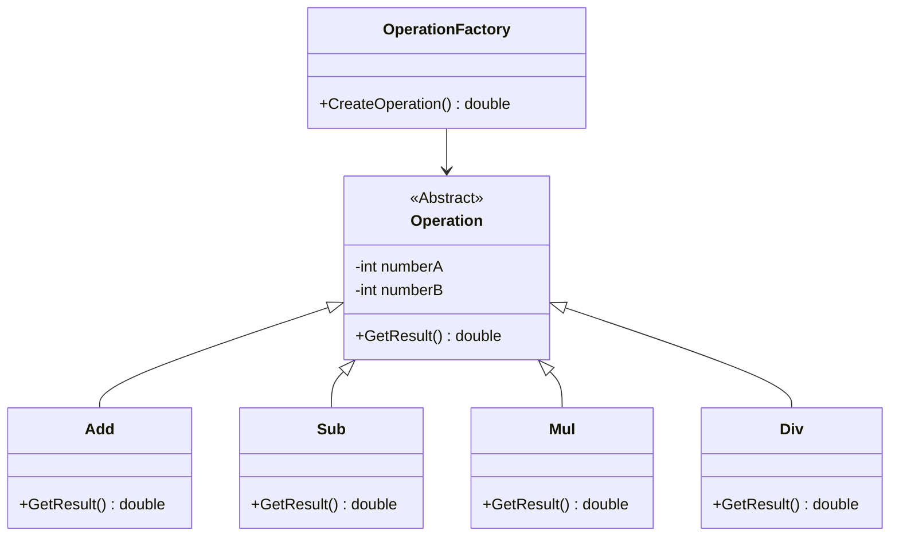

# Simple Factory Pattern

## Giới thiệu

### Ý tưởng của Simple Factory Pattern

**Simple Factory Pattern** còn được gọi là mẫu phương thức nhà máy tĩnh (Static Factory Method).

Simple Factory Pattern thường định nghĩa một lớp nhà máy, lớp này có thể **trả về các phiên bản của các lớp sản phẩm khác nhau dựa trên biến khác nhau**.

Simple Factory Pattern là một mẫu thiết kế tạo đối tượng. Tuy nhiên, Simple Factory Pattern **không thuộc** vào 23 mẫu thiết kế Gof.

### Điểm chính của Simple Factory Pattern

**Ưu điểm**: Lớp nhà máy trong Simple Factory Pattern là yếu tố quan trọng của toàn bộ mẫu thiết kế. Nó chứa các **phân đoạn logic cần thiết**, dựa trên thông tin bên ngoài, để quyết định xem nên tạo đối tượng của lớp cụ thể nào. Bằng cách sử dụng Simple Factory Pattern, người dùng không cần phải hiểu cách tạo đối tượng, chỉ cần truyền thông tin cần thiết là đủ.

**Nhược điểm**: Lớp nhà máy tập trung tất cả logic tạo đối tượng, **vi phạm nguyên tắc phân chia trách nhiệm cao**. Khi số lượng lớp sản phẩm cụ thể trong hệ thống ngày càng tăng, lớp nhà máy sẽ phải được sửa đổi liên tục, khó bảo trì và mở rộng. Đồng thời, điều này cũng **vi phạm nguyên tắc mở đóng**.

> **Nguyên tắc mở đóng (Open Close Principal)**: Một thực thể phần mềm như lớp, module và hàm nên mở cho việc mở rộng và đóng cho việc sửa đổi.

## Ví dụ

Làm thế nào để triển khai một máy tính có chức năng cộng, trừ, nhân, chia cơ bản?

Đối với bốn phép tính này, chúng ta đều cần hai toán hạng, chỉ khác nhau ở kết quả trả về.

Do đó, chúng ta có thể trừu tượng hóa sự tương đồng của chúng, rút trích ra một lớp cha. Lớp này chứa hai toán hạng và một phương thức trả về kết quả, phương thức này được mong đợi được thực hiện trong các lớp con.

Dưới đây là ví dụ cụ thể bằng code.



【Product (Operation) 】

Vai trò sản phẩm, là lớp cha của tất cả các đối tượng được tạo bởi mẫu thiết kế đơn giản, nó mô tả **giao diện chung của tất cả các phiên bản**.

```java
// Vai trò sản phẩm, giao diện chung của tất cả các phiên bản
abstract class Operation {
    public int numA;
    public int numB;
    public abstract int GetResult();
}
```

【ConcreteProduct】

Vai trò sản phẩm cụ thể, thực hiện giao diện của lớp sản phẩm.

```java
// Vai trò sản phẩm cụ thể, thực hiện giao diện của lớp sản phẩm
class Add extends Operation {
    @Override
    public int GetResult() {
        return numA + numB;
    }
}

// Vai trò sản phẩm cụ thể, thực hiện giao diện của lớp sản phẩm
class Sub extends Operation {
    @Override
    public int GetResult() {
        return numA - numB;
    }
}

// Vai trò sản phẩm cụ thể, thực hiện giao diện của lớp sản phẩm
class Mul extends Operation {
    @Override
    public int GetResult() {
        return numA * numB;
    }
}

// Vai trò sản phẩm cụ thể, thực hiện giao diện của lớp sản phẩm
class Div extends Operation {
    @Override
    public int GetResult() {
        if (numB == 0) {
            System.out.println("ERROR!");
            return -1;
        }
        return numA / numB;
    }
}
```

【Factory (OperationFactory) 】

Vai trò nhà máy, là **trọng tâm** của mẫu thiết kế đơn giản, nó chịu trách nhiệm thực hiện **logic tạo tất cả các phiên bản**. Phương thức tạo đối tượng của lớp nhà máy có thể được gọi trực tiếp từ bên ngoài để tạo đối tượng sản phẩm cần thiết.

```java
// Vai trò nhà máy, trọng tâm của mẫu thiết kế đơn giản, thực hiện logic tạo tất cả các phiên bản
class OperationFactory {
    public static Operation CreateOperation(char operate) {
        Operation oper = null;
        switch (operate) {
            case '+':
                oper = new Add();
                break;
            case '-':
                oper = new Sub();
                break;
            case '*':
                oper = new Mul();
                break;
            case '/':
                oper = new Div();
                break;
            default:
                break;
        }
        return oper;
    }
}
```

【Khách hàng】

```java
public class SimpleFactoryPattern {
    public static void main(String[] args) {
        int numA = 10;
        int numB = 3;
        int result = 0;
        Operation oper = OperationFactory.CreateOperation('+');
        oper.numA = numA;
        oper.numB = numB;
        result = oper.GetResult();
        System.out.println(numA + " + " + numB + " = " + result);
    }
}
```

【Kết quả】

```
10 + 3 = 13
```
