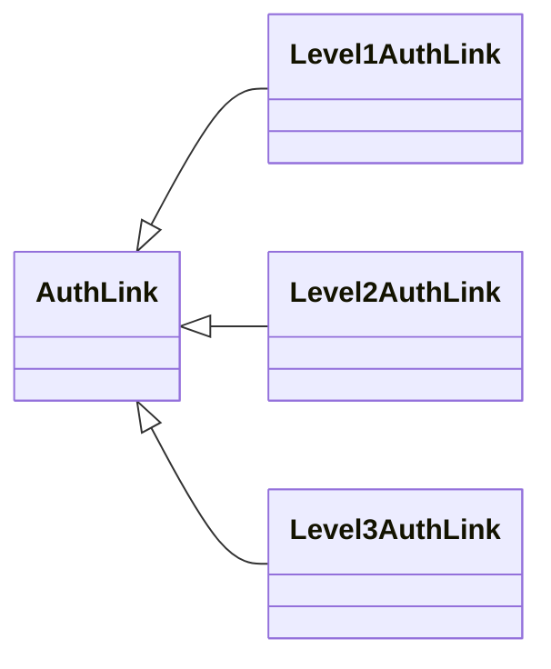
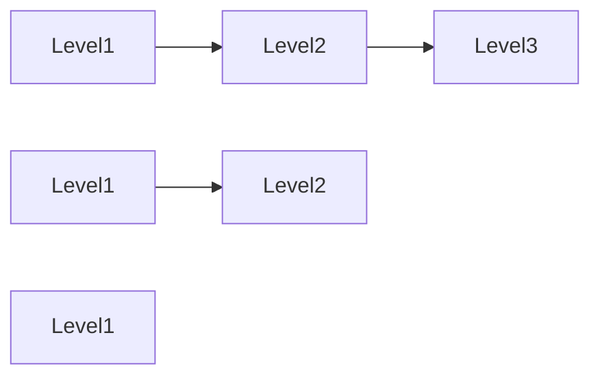

# Chain of Responsibility Pattern Practice: Mô phỏng kịch bản phê duyệt đa cấp của quá trình khởi động dự án trong đợt xúc tiến thương mại điện tử

## Giới thiệu

**Trong cuộc sống, sân chơi và bối cảnh đều rất quan trọng.**

Để bắn cung, bạn cần học tại trường bắn cung, để trượt tuyết, bạn cần trải nghiệm trên tuyết, và để lái xe, bạn cần có thể lái trên đường. Trái ngược với việc bạn có thể nghe được một số chỉ số giám sát hệ thống như `QPS`, `TPS`, `TP99`, `TP999`, `tỷ lệ sẵn sàng`, `thời gian phản hồi`, vv., và tổng số điểm đánh giá của những chỉ số này chính là sức khỏe của một hệ thống. Tuy nhiên, nếu bạn hầu như không nghe thấy các thuật ngữ kỹ thuật như vậy và không tiếp xúc với các tình huống cao cấp như vậy, thì đó giống như bạn đã đạt điểm tuyệt đối 100 điểm ở phần 1 của bằng lái xe, nhưng lại không thể lái xe. Thiếu các tình huống kỹ thuật để đào tạo, để bạn liên tục trải nghiệm bản tính và tính cách của hệ thống, thậm chí nếu bạn có nhiều ý tưởng, bạn cũng không thể thực hiện chúng. Vì vậy, nếu thực sự muốn học, bạn cần phải đi đến một bối cảnh có thực hành, thử nghiệm mới có thể học được cách bơi.

**Kích thước điểm mù của bạn là bao nhiêu?**

Cùng một cuốn sách, cùng một con đường, cùng một thành phố, bạn có thực sự nghĩ cuộc sống của mình có lựa chọn không? Đôi khi, nhiều lựa chọn chỉ là một trò đùa, bất kể bạn chọn cái nào, chúng đều giống nhau. Điều này không phải là bạn không chọn mà là phạm vi nhận thức của bạn quyết định hành động của bạn trong giây tiếp theo, và hành động khác trong giây tiếp theo lại quyết định hành động tiếp theo. Giống như việc nhìn qua ống kính, 20% diện tích trong tầm nhìn của bạn là màu đen, thậm chí bạn cũng không nhìn thấy và luôn luôn bỏ qua. Nhưng, con người có thể học hỏi, có thể phát triển, có thể thay đổi, có thể nỗ lực và trải qua mỗi lần biến đổi để nhìn thấy phần còn lại của 20%!

**Bạn có dám xây tòa nhà mà không có bản thiết kế không?**

Trong phát triển phần mềm, điều quan trọng nhất là thiết kế. Sử dụng tư duy kiến trúc, kinh nghiệm và tài năng, xây dựng hệ thống tốt nhất. Thực sự làm nhà thầu sẽ coi đoạn mã của mình như một tác phẩm nghệ thuật, bạn nói đó là công việc nhưng trong mắt những người như vậy, nó không phải là công việc, mà là tinh thần nghệ sĩ. Như có lẽ bạn cũng sẽ tự hào về thiết kế "niubility" của mình, vì khả năng đưa hệ thống có thể chịu đựng được lưu lượng truy cập 2 triệu lượt mỗi giây. Niềm tự hào như thế này là một lần lần xây tường, làm cao gót đế giày của bạn cao thêm mỗi lần, không ngừng nâng cao tầm nhìn của bạn, để bạn có thể nhìn thấy thiết kế cấp cao và cũng biết về xây dựng nền tảng. Các kiến thức này đã đượcbôn phác, giúp bạn vẽ ra một bản thiết kế kiến trúc hệ thống.

## Môi trường phát triển

1. JDK 1.8
2. Idea + Maven
3. Code: [vanhung4499/practical-java-design](https://github.com/vanhung4499/practical-java-design)  

| Dự án                     | Mô tả                                                                             |
| ------------------------- | --------------------------------------------------------------------------------- |
| demo-design-13-00 | Dự án mô phỏng; Mô phỏng một giao diện duyệt xét quá trình triển khai trực tuyến. |
| demo-design-13-01 | Sử dụng một lượng lớn mã để thực hiện yêu cầu kinh doanh.                         |
| demo-design-13-02 | Tối ưu mã thông qua các mẫu thiết kế để tạo ra sự so sánh để học tập.             |

## Giới thiệu về Chain of Responsibility Pattern


**Truyền thông qua tiếng gõ trống**. Khi nhìn vào hình ảnh, bạn có nghĩ đến một bộ phim của Châu Tinh Trì không? Mọi người ngồi xung quanh bờ biển, tạo thành một vòng tròn, đang cầm một quả bom đang cháy, truyền tải cho nhau.

Trong mô hình trách nhiệm, trọng tâm là giải quyết mối quan hệ xử lý tuần tự giữa một nhóm dịch vụ, tương tự như khi bạn hết tiền và cần phải chờ duyệt chi tiêu gia đình. Dưới 10 đô la, bạn cần duyệt qua con gái, dưới 100 đô la, trước tiên bạn cần duyệt qua con gái rồi mới là vợ. Bạn có thể hiểu nó như một quá trình chuyển việc được sắp xếp một cách minh bạch với việc ký tên của các cấp trên.

## Mô phỏng Tình huống

**Trong ví dụ này, chúng ta sẽ mô phỏng quá trình duyệt phê cho hệ thống trong thời gian 618 lễ hội mua sắm lớn.**

Như các công ty internet hàng đầu như Alibaba, JD, Pinduoduo và các công ty khác, trong thời gian 618, họ thường tổ chức các hoạt động tiếp thị và chuẩn bị sẵn sàng mở rộng hệ thống. Tương tự như việc Baidu chia sẻ các gói lì xì vào dịp Tết. Tuy nhiên, tất cả các hệ thống phát triển này đều cần được đưa ra một cách liên tục. Đôi khi, cũng cần một số điều chỉnh khẩn cấp vào thời điểm gần 618, nhưng để đảm bảo tính ổn định của hệ thống trực tuyến, việc giảm thiểu các phiên bản mới là cần thiết, và cũng tăng cường việc duyệt phê. Giống như cấp độ phản ứng cấp 1, cấp 2, vv.

Quá trình duyệt phê này sẽ có thêm các nhà quản lý cấp cao vào các thời điểm cụ thể, mỗi người giống như mỗi điểm trọng yếu trong mô hình trách nhiệm. Đối với các đồng nghiệp phát triển, họ không cần quan tâm đến các chi tiết xử lý cụ thể của quy trình duyệt phê, chỉ cần biết rằng quy trình duyệt phê này cứng rắn hơn và cấp độ của nó cao hơn, nhưng đối với các lập trình viên, việc duyệt phê vẫn là nhấp vào cùng một nút "Gửi để xem xét" và đợi để được duyệt.

Tiếp theo, chúng ta sẽ mô phỏng một tình huống yêu cầu kinh doanh như vậy và sử dụng mô hình thiết kế của Chain of Responsibility để triển khai chức năng này.

### Dự án mô phỏng kịch bản

```shell
design-demo-13-00
├── pom.xml
└── src
    └── main
        └── java
            └── com
                └── hnv99
                    └── design
                        └── AuthService.java
```

- Cấu trúc mã này khá đơn giản, chỉ có một lớp dịch vụ mô phỏng việc xác minh và truy vấn kết quả xác minh. Tương tự như bạn có thể gọi lớp này để xác minh các dự án và lấy kết quả xác minh, phần kết quả này được mô phỏng bằng cách ghi vào bộ nhớ đệm.

### Tóm tắt Tình huống

#### Dịch vụ Xác minh Mô phỏng

```java
public class AuthService {

    private static Map<String, Date> authMap = new ConcurrentHashMap<String, Date>();

    public static Date queryAuthInfo(String uId, String orderId) {
        return authMap.get(uId.concat(orderId));
    }

    public static void auth(String uId, String orderId) {
        authMap.put(uId.concat(orderId), new Date());
    }

}
```

- Lớp này cung cấp hai phương thức: một là truy vấn kết quả xác minh (`queryAuthInfo`), và hai là xử lý xác minh (`auth`).
- Phần này lưu trữ thông tin về ai đã xác minh và ID đơn hàng đã xác minh như là khóa duy nhất trong một Map.

## Triển khai code trực tiếp

**Ở đây, chúng ta sẽ sử dụng cách tiếp cận trực tiếp nhất để triển khai chức năng.**

Dựa trên yêu cầu của chúng ta về quy trình phê duyệt, thông thường việc triển khai hệ thống lên mạng chỉ cần ba cấp trách nhiệm để phê duyệt. Nhưng vào thời điểm 618 lễ hội, cần phải có sự tham gia của cấp trách nhiệm cấp hai cũng như cấp trách nhiệm cấp một vào quy trình phê duyệt việc triển khai hệ thống lên mạng. Ở đây, chúng tôi sử dụng phương pháp kiểm tra if đơn giản nhất để triển khai yêu cầu này.

### Cấu trúc Dự án

```java
itstack-demo-design-13-01
└── src
    └── main
        └── java
            └── org.itstack.demo.design
                └── AuthController.java
```

- Phần này rất đơn giản chỉ bao gồm một lớp điều khiển phê duyệt, giống như khi một số bạn bắt đầu viết code, một lớp viết tất cả các yêu cầu.

### Triển khai code

```java
  
public class AuthController {  
  
    private SimpleDateFormat f = new SimpleDateFormat("yyyy-MM-dd HH:mm:ss");// Định dạng thời gian  
  
    public AuthInfo doAuth(String uId, String orderId, Date authDate) throws ParseException {  
  
        // Phê duyệt cấp ba  
        Date date = AuthService.queryAuthInfo("1000013", orderId);  
        if (null == date) return new AuthInfo("0001", "ID đơn: ", orderId, " Trạng thái: Đợi người phê duyệt cấp ba ", "An");  
  
        // Phê duyệt cấp hai  
        if (authDate.after(f.parse("2020-06-01 00:00:00")) && authDate.before(f.parse("2020-06-25 23:59:59"))) {  
            date = AuthService.queryAuthInfo("1000012", orderId);  
            if (null == date) return new AuthInfo("0001", "ID đơn: ", orderId, " Trạng thái: Đợi người phê duyệt cấp hai ", "Binh");  
        }  
        // Phê duyệt cấp một  
        if (authDate.after(f.parse("2020-06-11 00:00:00")) && authDate.before(f.parse("2020-06-20 23:59:59"))) {  
            date = AuthService.queryAuthInfo("1000011", orderId);  
            if (null == date) return new AuthInfo("0001", "ID đơn: ", orderId, " Trạng thái: Đợi người phê duyệt cấp một ", "Thinh");  
        }  
        return new AuthInfo("0001", "ID đơn: ", orderId, " Trạng thái: Phê duyệt hoàn tất");  
    }  
}
```

- Ở đây, từ trên xuống dưới, chúng ta lần lượt kiểm tra và phê duyệt bởi các cá nhân khác nhau trong khoảng thời gian nhất định, giống như trong thời gian lễ hội 618 cần ba người phê duyệt mới có thể cho phép hệ thống lên mạng.
- Có vẻ như các chức năng như thế này rất đơn giản, nhưng thực tế trong doanh nghiệp sẽ có nhiều phòng ban, nhưng nếu triển khai theo cách này sẽ rất khó mở rộng, và việc thay đổi và mở rộng cũng rất phức tạp.

### Kiểm thử

#### Lớp kiểm tra viết

```java
    
public class ApiTest {  
  
    private Logger logger = LoggerFactory.getLogger(ApiTest.class);  
  
    @Test  
    public void testAuthController() throws ParseException {  
        AuthController authController = new AuthController();  
  
        // Mô phỏng việc phê duyệt của người phụ trách cấp ba  
        logger.info("Kết quả kiểm tra: {}", JSON.toJSONString(authController.doAuth("Hung", "1000998004813441", new Date())));  
        logger.info("Kết quả kiểm tra: {}", "Mô phỏng việc phê duyệt của người phụ trách cấp ba, An");  
        AuthService.auth("1000013", "1000998004813441");  
  
        // Mô phỏng việc phê duyệt của người phụ trách cấp hai  
        logger.info("Kết quả kiểm tra: {}", JSON.toJSONString(authController.doAuth("Hung", "1000998004813441", new Date())));  
        logger.info("Kết quả kiểm tra: {}", "Mô phỏng việc phê duyệt của người phụ trách cấp hai, Binh");  
        AuthService.auth("1000012", "1000998004813441");  
  
        // Mô phỏng việc phê duyệt của người phụ trách cấp một  
        logger.info("Kết quả kiểm tra: {}", JSON.toJSONString(authController.doAuth("Hung", "1000998004813441", new Date())));  
        logger.info("Kết quả kiểm tra: {}", "Mô phỏng việc phê duyệt của người phụ trách cấp một, Thinh");  
        AuthService.auth("1000011", "1000998004813441");  
  
        logger.info("Kết quả kiểm tra: {}", "Phê duyệt hoàn thành");  
    }  
}
```

- Ở đây, chúng ta giả mô từng bước để kiểm tra xem liệu phê duyệt đã hoàn tất hay chưa, và tiếp tục được phê duyệt bởi người quản lý khác nhau ở các nút phê duyệt khác nhau.
- `authController.doAuth` là phương thức kiểm tra quá trình phê duyệt, `AuthService.auth` là phương thức phê duyệt được sử dụng để thực hiện trạng thái quá trình.

#### Kết quả

```shell
2024-03-30 18:29:32.604	INFO	main		(ApiTest.java:20)	|	Kết quả kiểm tra: {"code":"0001","info":"ID đơn: 1000998004813441 Trạng thái: Đợi người phê duyệt cấp ba An"}
2024-03-30 18:29:32.609	INFO	main		(ApiTest.java:21)	|	Kết quả kiểm tra: Mô phỏng việc phê duyệt của người phụ trách cấp ba, An
2024-03-30 18:29:32.610	INFO	main		(ApiTest.java:25)	|	Kết quả kiểm tra: {"code":"0001","info":"ID đơn: 1000998004813441 Trạng thái: Phê duyệt hoàn tất"}
2024-03-30 18:29:32.610	INFO	main		(ApiTest.java:26)	|	Kết quả kiểm tra: Mô phỏng việc phê duyệt của người phụ trách cấp hai, Binh
2024-03-30 18:29:32.611	INFO	main		(ApiTest.java:30)	|	Kết quả kiểm tra: {"code":"0001","info":"ID đơn: 1000998004813441 Trạng thái: Phê duyệt hoàn tất"}
2024-03-30 18:29:32.611	INFO	main		(ApiTest.java:31)	|	Kết quả kiểm tra: Mô phỏng việc phê duyệt của người phụ trách cấp một, Thinh
2024-03-30 18:29:32.612	INFO	main		(ApiTest.java:34)	|	Kết quả kiểm tra: Phê duyệt hoàn thành

```

- Từ kết quả kiểm thử, chúng ta có thể thấy rằng từng bước được phê duyệt bởi các người tham gia khác nhau, và sau khi phê duyệt xong, tiếp tục được phê duyệt bởi người tiếp theo. Điều này thỏa mãn nhu cầu của chúng ta, nhưng rất khó mở rộng và điều chỉnh quy trình, tương tự như việc code được viết cứng nhắc.

## Tái cấu trúc bằng Chain of Responsibility Pattern

`Tiếp theo, chúng ta sẽ sử dụng mô hình Chain of Responsibility để tối ưu code, cũng có thể xem là một quy trình tái cấu trúc nhỏ.`

Chain of Responsibility Pattern cho phép các module dịch vụ trở nên rõ ràng hơn, và mỗi module có thể được truy cập thông qua cách thức `next`. Mỗi `next` là một phần của lớp trừu tượng chung được kế thừa. Cuối cùng, trách nhiệm của tất cả các lớp có thể được sắp xếp và sử dụng một cách linh hoạt, và quá trình sắp xếp có thể được thực hiện theo cách có thể cấu hình.

### Cấu trúc dự án

```shell
design-demo-13-02
├── pom.xml
└── src
    ├── main
    │   └── java
    │       └── com
    │           └── hnv99
    │               └── design
    │                   ├── AuthInfo.java
    │                   ├── AuthLink.java
    │                   └── cuisine
    │                       └── impl
    │                           ├── Level1AuthLink.java
    │                           ├── Level2AuthLink.java
    │                           └── Level3AuthLink.java
    └── test
        └── java
            └── com
                └── hnv99
                    └── design
                        └── ApiTest.java

```

**Biểu đồ lớp Chain of Responsibility**


**Cấu trúc Chain of Responsibility Pattern**





- Trong mô hình này, phần lõi của cấu trúc Chain of Responsibility trong mô hình kinh doanh được thể hiện qua ba lớp `Level1AuthLink`, `Level2AuthLink`, và `Level3AuthLink`, mỗi lớp này triển khai một quy tắc khác nhau nhưng đều kế thừa từ lớp trừu tượng chung `AuthLink`. Chúng được sắp xếp để tạo ra một Chain of Responsibility trong kinh doanh.
- Thông thường, khi sử dụng Chain of Responsibility, nếu tình huống là cố định, có thể khởi tạo trực tiếp trong mã nguồn. Nhưng nếu tình huống kinh doanh thay đổi thường xuyên, có thể triển khai dưới dạng cấu hình XML để xử lý, hoặc triển khai vào thư viện để khởi tạo.

### Triển khai mã

#### Định nghĩa đối tượng trả về trong chuỗi trách nhiệm

```java
@Getter  
@Setter  
public class AuthInfo {  
  
    private String code;  
    private String info = "";  
  
    public AuthInfo(String code, String ...infos) {  
        this.code = code;  
        for (String str:infos){  
            this.info = this.info.concat(str);  
        }
    }
}
```

- Lớp này đóng gói thông tin kết quả trả về trong quá trình xử lý chuỗi trách nhiệm, thuận tiện cho việc xử lý thông tin trả về từ mỗi chuỗi trách nhiệm.

#### Định nghĩa lớp trừu tượng của chuỗi

```java
public abstract class AuthLink {

    protected Logger logger = LoggerFactory.getLogger(AuthLink.class);

    protected SimpleDateFormat f = new SimpleDateFormat("yyyy-MM-dd HH:mm:ss");// Định dạng thời gian
    protected String levelUserId;                           // ID của người dùng cấp độ
    protected String levelUserName;                         // Tên của người dùng cấp độ
    private AuthLink next;                                  // Chuỗi trách nhiệm kế tiếp

    public AuthLink(String levelUserId, String levelUserName) {
        this.levelUserId = levelUserId;
        this.levelUserName = levelUserName;
    }

    public AuthLink next() {
        return next;
    }

    public AuthLink appendNext(AuthLink next) {
        this.next = next;
        return this;
    }

    public abstract AuthInfo doAuth(String uId, String orderId, Date authDate);

}
```

- Phần này là phần trung tâm của chuỗi trách nhiệm, được **kết nối lại**. `AuthLink next`, điểm quan trọng là có thể truy cập vào nút tiếp theo cần xử lý trong chuỗi bằng cách sử dụng `next`.
- `levelUserId`, `levelUserName`, là thông tin công cộng trong chuỗi trách nhiệm, đánh dấu thông tin nhân viên của mỗi nút duyệt.
- Lớp trừu tượng định nghĩa một phương thức trừu tượng, `abstract AuthInfo doAuth`, mà mỗi đối tượng triển khai phải thực hiện, xử lý các nhiệm vụ khác nhau tùy thuộc vào cấp độ duyệt.

#### Ba lớp triển khai duyệt

**Level1AuthLink**

```java
public class Level1AuthLink extends AuthLink {  
  
    public Level1AuthLink(String levelUserId, String levelUserName) {  
        super(levelUserId, levelUserName);  
    }  
    
    public AuthInfo doAuth(String uId, String orderId, Date authDate) {  
        Date date = AuthService.queryAuthInfo(levelUserId, orderId);  
        if (null == date) {  
            return new AuthInfo("0001", "Mã đơn hàng:", orderId, " Trạng thái: Chờ người phê duyệt cấp một", levelUserName);  
        }        AuthLink next = super.next();  
        if (null == next) {  
            return new AuthInfo("0000", "Mã đơn hàng:", orderId, " Trạng thái: Hoàn thành phê duyệt cấp một", " Thời gian:", f.format(date), " Người phê duyệt:", levelUserName);  
        }  
        return next.doAuth(uId, orderId, authDate);  
    }  
}
```

**Level2AuthLink**

```java
public class Level2AuthLink extends AuthLink {  
  
    private Date beginDate = f.parse("2020-06-11 00:00:00");  
    private Date endDate = f.parse("2020-06-20 23:59:59");  
  
    public Level2AuthLink(String levelUserId, String levelUserName) throws ParseException {  
        super(levelUserId, levelUserName);  
    }  
    public AuthInfo doAuth(String uId, String orderId, Date authDate) {  
        Date date = AuthService.queryAuthInfo(levelUserId, orderId);  
        if (null == date) {  
            return new AuthInfo("0001", "Mã đơn hàng:", orderId, " Trạng thái: Chờ người phê duyệt cấp hai ", levelUserName);  
        }        AuthLink next = super.next();  
        if (null == next) {  
            return new AuthInfo("0000", "Mã đơn hàng:", orderId, " Trạng thái: Hoàn thành phê duyệt cấp hai", " Thời gian:", f.format(date), " Người phê duyệt:", levelUserName);  
        }  
        if (authDate.before(beginDate) || authDate.after(endDate)) {  
            return new AuthInfo("0000", "Mã đơn hàng:", orderId, " Trạng thái: Hoàn thành phê duyệt cấp hai", " Thời gian:", f.format(date), " Người phê duyệt:", levelUserName);  
        }  
        return next.doAuth(uId, orderId, authDate);  
    }  
}
```

**Level3AuthLink**

```java
public class Level3AuthLink extends AuthLink {  
  
    private Date beginDate = f.parse("2020-06-01 00:00:00");  
    private Date endDate = f.parse("2020-06-25 23:59:59");  
  
    public Level3AuthLink(String levelUserId, String levelUserName) throws ParseException {  
        super(levelUserId, levelUserName);  
    }  
    public AuthInfo doAuth(String uId, String orderId, Date authDate) {  
        Date date = AuthService.queryAuthInfo(levelUserId, orderId);  
        if (null == date) {  
            return new AuthInfo("0001", "Mã đơn hàng:", orderId, " Trạng thái: Chờ người phê duyệt cấp ba ", levelUserName);  
        }        AuthLink next = super.next();  
        if (null == next) {  
            return new AuthInfo("0000", "Mã đơn hàng:", orderId, " Trạng thái: Hoàn thành phê duyệt cấp ba", " Thời gian:", f.format(date), " Người phê duyệt:", levelUserName);  
        }  
        if (authDate.before(beginDate) || authDate.after(endDate)) {  
            return new AuthInfo("0000", "Mã đơn hàng:", orderId, " Trạng thái: Hoàn thành phê duyệt cấp ba", " Thời gian:", f.format(date), " Người phê duyệt:", levelUserName);  
        }  
        return next.doAuth(uId, orderId, authDate);  
    }  
}
```

- Các lớp `Level1AuthLink`, `Level2AuthLink`, và `Level3AuthLink` triển khai các logic đơn giản của các cấp độ duyệt khác nhau.
- Ví dụ, trong lớp duyệt đầu tiên, nó sẽ đầu tiên kiểm tra xem liệu việc duyệt đã được thực hiện chưa. Nếu không, nó sẽ trả về kết quả cho người gọi, yêu cầu tiến hành duyệt. *(Ở đây đơn giản mô phỏng rằng sau khi duyệt có thông tin thời gian không rỗng, được sử dụng làm điều kiện kiểm tra)*
- Sau khi kiểm tra xong, nó sẽ lấy nút duyệt tiếp theo; `super.next();`. Nếu không có nút tiếp theo, nó sẽ trả về kết quả trực tiếp.
- Tiếp theo là kiểm tra xem có cần thiết phải duyệt cấp 2 và cấp 3 dựa trên khoảng thời gian kinh doanh khác nhau.
- Cuối cùng, nó sẽ trả về kết quả của nút duyệt tiếp theo; `next.doAuth(uId, orderId, authDate);`, có một chút giống như gọi đệ quy.

### Kiểm thử

#### Viết lớp kiểm tra

```java
  
public class ApiTest {  
  
    private Logger logger = LoggerFactory.getLogger(ApiTest.class);  
  
    @Test  
    public void testAuthLink() throws ParseException {  
        AuthLink authLink = new Level3AuthLink("1000013", "An")  
                .appendNext(new Level2AuthLink("1000012", "Binh")  
                        .appendNext(new Level1AuthLink("1000011", "Thinh")));  
  
        logger.info("Kết quả kiểm tra: {}", JSON.toJSONString(authLink.doAuth("Hung", "1000998004813441", new Date())));  
  
        // Mô phỏng việc phê duyệt của người phụ trách cấp ba  
        AuthService.auth("1000013", "1000998004813441");  
        logger.info("Kết quả kiểm tra: {}", "Mô phỏng việc phê duyệt của người phụ trách cấp ba, An");  
        logger.info("Kết quả kiểm tra: {}", JSON.toJSONString(authLink.doAuth("Hung", "1000998004813441", new Date())));  
  
        // Mô phỏng việc phê duyệt của người phụ trách cấp hai  
        AuthService.auth("1000012", "1000998004813441");  
        logger.info("Kết quả kiểm tra: {}", "Mô phỏng việc phê duyệt của người phụ trách cấp hai, Binh");  
        logger.info("Kết quả kiểm tra: {}", JSON.toJSONString(authLink.doAuth("Hung", "1000998004813441", new Date())));  
  
        // Mô phỏng việc phê duyệt của người phụ trách cấp một  
        AuthService.auth("1000011", "1000998004813441");  
        logger.info("Kết quả kiểm tra: {}", "Mô phỏng việc phê duyệt của người phụ trách cấp một, Thinh");  
        logger.info("Kết quả kiểm tra: {}", JSON.toJSONString(authLink.doAuth("Hung", "1000998004813441", new Date())));  
  
    }  
}
```

- Phần này bao gồm việc tạo chuỗi trách nhiệm, điều quan trọng nhất của việc tạo chuỗi trách nhiệm là sắp xếp các nút trách nhiệm khác nhau lại với nhau để tạo ra một chuỗi trách nhiệm hoàn chỉnh cho một nhiệm vụ kinh doanh cụ thể.
- Tiếp theo là thực hiện kiểm tra liên tục `authLink.doAuth(…)`, thông qua kết quả trả về để duyệt từ cấp 3, 2, 1 cho đến khi tất cả các nhiệm vụ duyệt hoàn thành.

#### Kết quả

```shell
2024-03-30 19:45:24.686	INFO	main		(ApiTest.java:24)	|	Kết quả kiểm tra: {"code":"0001","info":"Mã đơn hàng:1000998004813441 Trạng thái: Chờ người phê duyệt cấp ba An"}
2024-03-30 19:45:24.690	INFO	main		(ApiTest.java:28)	|	Kết quả kiểm tra: Mô phỏng việc phê duyệt của người phụ trách cấp ba, An
2024-03-30 19:45:24.691	INFO	main		(ApiTest.java:29)	|	Kết quả kiểm tra: {"code":"0000","info":"Mã đơn hàng:1000998004813441 Trạng thái: Hoàn thành phê duyệt cấp ba Thời gian:2024-03-30 19:45:24 Người phê duyệt:An"}
2024-03-30 19:45:24.691	INFO	main		(ApiTest.java:33)	|	Kết quả kiểm tra: Mô phỏng việc phê duyệt của người phụ trách cấp hai, Binh
2024-03-30 19:45:24.691	INFO	main		(ApiTest.java:34)	|	Kết quả kiểm tra: {"code":"0000","info":"Mã đơn hàng:1000998004813441 Trạng thái: Hoàn thành phê duyệt cấp ba Thời gian:2024-03-30 19:45:24 Người phê duyệt:An"}
2024-03-30 19:45:24.691	INFO	main		(ApiTest.java:38)	|	Kết quả kiểm tra: Mô phỏng việc phê duyệt của người phụ trách cấp một, Thinh
2024-03-30 19:45:24.691	INFO	main		(ApiTest.java:39)	|	Kết quả kiểm tra: {"code":"0000","info":"Mã đơn hàng:1000998004813441 Trạng thái: Hoàn thành phê duyệt cấp ba Thời gian:2024-03-30 19:45:24 Người phê duyệt:An"}

```

- Từ kết quả kiểm tra trên, chúng ta có thể thấy rằng chuỗi trách nhiệm của chúng ta đã hoạt động như mong đợi, duyệt từng cấp một theo cấu trúc chuỗi trách nhiệm cho đến khi cuối cùng xuất ra kết quả hoàn thành duyệt ở cấp 1.
- Cách thiết kế chuỗi trách nhiệm như vậy làm cho việc mở rộng và bảo trì trở nên dễ dàng hơn, đồng thời loại bỏ được các câu lệnh điều kiện if.

## Tổng kết

- Từ việc tái cấu trúc mã từ câu lệnh if sang việc phát triển bằng mô hình chuỗi trách nhiệm, chúng ta có thể thấy cấu trúc mã của chúng ta trở nên rõ ràng và sạch sẽ hơn, và giải quyết được lượng lớn các câu lệnh if. Tuy nhiên, không phải là câu lệnh if không tốt, nhưng câu lệnh if không phù hợp để thiết kế luồng hệ thống, nhưng vẫn rất phù hợp để sử dụng trong việc xác định và xử lý logic hành vi.
- Trong các mô hình cấu trúc đã học trước đó như mô hình kết hợp, nó giống như một cây kết hợp, chúng ta đã xây dựng một cây quyết định quy trình. Trong thực tế, mô hình như vậy cũng có thể được kết hợp và mở rộng với mô hình chuỗi trách nhiệm, và điểm quan trọng ở đây là làm thế nào để liên kết **liên kết của chuỗi**, và việc thực thi cuối cùng diễn ra trong chuỗi liên kết.
- Mô hình chuỗi trách nhiệm rất tốt trong việc xử lý nguyên tắc đơn giản và nguyên tắc mở rộng, giảm thiểu sự phụ thuộc và làm rõ mối quan hệ giữa các đối tượng, đồng thời người gọi bên ngoài không cần quan tâm chuỗi trách nhiệm đang được xử lý như thế nào *(trong mã chương trình trên, có thể bọc việc kết hợp chuỗi trách nhiệm và cung cấp cho bên ngoài sử dụng)*. Tuy nhiên, ngoài các ưu điểm này, mô hình này cũng cần phải được sử dụng trong các tình huống phù hợp, tránh gây ra vấn đề về hiệu suất và sự rối loạn, kiểm tra và đánh lừa.
