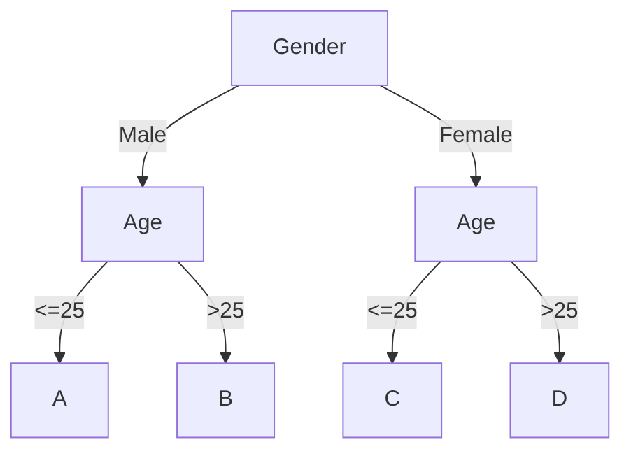

# Composite Pattern Practice: Phân loại khán giả khác nhau để phát phiếu quà tặng, xây dựng decision tree

## Giới thiệu

A-->|text|B

**Nhỏ mới phải lựa chọn, lớn thì chọn tất**

Vài năm trước, mỗi khi trên các diễn đàn, ai đó nên học ngôn ngữ lập trình nào, ngôn ngữ nào tốt nhất. Các thread này luôn sôi nổi, có người ủng hộ PHP, có người thích Java, cũng có C++ và C#. Nhưng trong vài năm gần đây, dường như mọi người không thực sự tranh luận "chém gió" nữa, hầu hết thời gian đều là đùa cợt. Trong khi đó, trong phát triển Internet nói chung, nhiều khi là một số ngôn ngữ lập trình được sử dụng chung, cùng xây dựng một hệ sinh thái toàn diện. Cách mà mọi người chọn cũng nghiêng về việc chọn kiến trúc phù hợp cho từng lĩnh vực, thay vì mù quáng theo đuổi một ngôn ngữ nào đó. Điều này có thể đưa ra một số gợi ý cho những người mới học lập trình, không nên tự ái rằng một ngôn ngữ nào đó tốt hơn, một ngôn ngữ nào đó không tốt hơn, chỉ cần chọn ngôn ngữ phù hợp với từng tình huống. Và bạn có thể quyết định ngôn ngữ nào để học dựa trên nhu cầu tuyển dụng và mức lương trên các trang web tuyển dụng.

**Lập trình không phải là việc thể hiện kỹ năng**

Luôn có một số người thích sử dụng một số tính năng mới trong dự án phát triển tổng thể, thử nghiệm kiến thức mới của họ. Không thể nói rằng điều này là không tốt, thậm chí có thể nói đây là một phần của những người rất đam mê học hỏi, thích sáng tạo, thích thực hành. Nhưng ngoài việc sử dụng các tính năng mới, việc cân nhắc về mặt toàn bộ sự mở rộng, dễ đọc, tính bảo trì, dễ mở rộng và các khía cạnh khác cũng cần được xem xét. Giống như việc bạn thuê một nhóm thợ trang trí, có một công nhân thợ nhỏ thích thực hiện các hoạt động trang trí nghệ thuật, lắp đặt một chiếc bồn cầu 🚿 dưới vòi sen 🚽 trong nhà của bạn.

**Ngay cả khi viết CRUD cũng nên có mẫu thiết kế**

Thường thì nhu cầu lớn nhất được xây dựng thông qua việc thêm, sửa, xóa và truy vấn, hôm nay thêm một yêu cầu `if`, ngày mai thêm một nội dung `else` để mở rộng. Dần dần, nhu cầu ngày càng lớn, chi phí mở rộng và bảo trì cũng tăng lên. Thường thì đa số phát triển không có tư duy sản phẩm và không hướng đến nhu cầu kinh doanh tổng thể, luôn nghĩ rằng viết code tốt là hoàn thành chức năng. Nhưng việc triển khai không cân nhắc về tính mở rộng của việc này, rất khó để làm cho các yêu cầu sau này có thể được phát triển nhanh chóng, dần dần rơi vào vòng lặp tiêu cực, mỗi ngày đều có bug cần phải sửa.

## Môi trường phát triển

1. JDK 1.8
2. Idea + Maven
3. Code: [vanhung4499/practical-java-design](https://github.com/vanhung4499/practical-java-design)  

| Dự án            | Mô tả                                                                                 |
| ---------------- | ------------------------------------------------------------------------------------- |
| demo-design-8-01 | T Triển khai yêu cầu nghiệp vụ một cách trực tiếp                                     |
| demo-design-8-02 | Tối ưu hóa và tái cấu trúc code thông qua thiết kế mẫu, tạo ra một so sánh để học hỏi |

## Giới thiệu về Composite Pattern


Từ hình trên, bạn có thể thấy đây giống như một loại đinh vít 🔩 và ốc vít, tổ chức thành một cây cấu trúc thông qua một chuỗi liên kết. Và cách thiết kế này, bằng cách tổ hợp các đối tượng tương tự (_cũng có thể gọi là phương thức_) thành một nhóm đối tượng cây cấu trúc có thể được gọi là Composite Pattern.

Cách thiết kế này cho phép bạn tự do kết hợp các nút dịch vụ của mình để cung cấp dịch vụ bên ngoài, ví dụ bạn có ba chức năng kiểm tra nguyên tử (`A: CMND`, `B: Thẻ ngân hàng`, `C: Số điện thoại`) và cung cấp cho bên ngoài. Một số bên gọi có thể sử dụng kết hợp AB, một số có thể sử dụng kết hợp CBA, và có thể có một số chỉ sử dụng một trong ba. Lúc này, bạn có thể sử dụng Composite Pattern để xây dựng dịch vụ, cấu trúc cây tổ chức khác nhau cho các bên gọi khác nhau, và bạn có thể cấu hình cây này vào cơ sở dữ liệu hoặc điều khiển nó thông qua interface đồ họa.

Vì vậy, việc sử dụng các mẫu thiết kế khác nhau trong các tình huống phù hợp có thể làm cho logic code rất rõ ràng và dễ mở rộng, đồng thời cũng có thể giảm thiểu chi phí học của nhóm đối với những người mới.

## Mô phỏng kịch bản



Trên đây là một phiên bản rất đơn giản của `decision tree (Decision Tree)` tiếp thị, dựa trên `giới tính` và `tuổi` để phát các loại phiếu giảm giá khác nhau, nhằm kích thích tiêu dùng và tạo ra mục tiêu chính xác để kích hoạt người dùng.  

Mặc dù một số bạn có thể chưa từng phát triển các tình huống tiếp thị, nhưng bạn có thể bị tiếp thị bất cứ lúc nào. Ví dụ, nếu bạn thường xuyên duyệt các sản phẩm mà nam giới thích như bàn phím cơ, laptop, trang trí ô tô và nhiều hơn nữa, bạn sẽ nhận được các phiếu giảm giá tương tự để kích thích tiêu dùng. Và nếu bạn không mua sắm nhiều hoặc không có tiền mặt trong tay, bạn có bao giờ bị đưa giá xe? Có một thời gian, bạn thường nghe người khác kêu gọi, tại sao cùng một khoảng cách, họ lại 10 đồng, tôi lại 15 đồng? Thực tế là đây là các trường hợp được tiếp thị, thường xuyên tiến hành các biện pháp kích thích mạnh mẽ hơn đối với những người dùng ít sử dụng phần mềm, nhằm tăng tính gắn kết của người dùng.

Vậy nên, ở đây chúng tôi sẽ mô phỏng một tình huống tương tự, thể hiện sự quan trọng của Composite Pattern trong đó. Ngoài ra, Composite Pattern không chỉ có thể áp dụng cho decision tree quy tắc, mà còn có thể sử dụng để đóng gói dịch vụ bằng cách kết hợp các interface khác nhau, cung cấp khả năng dịch vụ cho bên ngoài và giảm chi phí phát triển.

## Triển khai code hàng loạt

Ở đây chúng ta sẽ trình bày một ví dụ về việc "phát sinh" câu chuyện về mối quan hệ giữa cô gái và lập trình viên 👨‍💻.

|        Ngày        | Yêu cầu                                                                                                                                                                                                                                                    | Mức độ khẩn cấp                       | Lập trình viên (tiếng nói bên ngoài)                       |                                         |
| :----------------: | :--------------------------------------------------------------------------------------------------------------------------------------------------------------------------------------------------------------------------------------------------------- | :------------------------------------ | :--------------------------------------------------------- | --------------------------------------- |
| Thứ Hai, Buổi sáng | Anh lập trình viên, sếp nói muốn làm một chút tiếp thị, gửi các loại phiếu giảm giá khác nhau cho nam và nữ để kích thích tiêu dùng.                                                                                                                       | Rất cấp bách, cuối ngày mai phải xong | Được, cũng không khó lắm, thêm một số điều kiện if là được |                                         |
| Thứ Ba, Buổi chiều | Anh chàng, sau khi chúng ta đã triển khai, mọi thứ đều tốt. Hãy thêm điều kiện theo độ tuổi, dễ dàng kích thích tiêu dùng chính xác hơn dựa trên các nhóm tuổi.                                                                                            | Cấp bách, ngày mai phải xong          | Cũng không khó, thêm điều kiện thôi                        |                                         |
|  Thứ Tư, Buổi tối  | Ôi, anh! Anh đã đi ngủ chưa? Sếp nói rằng hoạt động của chúng ta rất thành công, liệu anh có thể thêm các điều kiện cho độc thân, đã kết hôn và có con. Điều này sẽ kích thích người dùng mua sắm hơn.                                                     | Rất cấp bách, hãy triển khai ngay     | Tôi nhận ra rằng có quá nhiều điều kiện if else rồi        |                                         |
| Thứ Năm, Sáng sớm  | Wow! Anh thật tuyệt vời, triển khai rất nhanh chóng. Hehe! Có một yêu cầu nhỏ, cần điều chỉnh các nhóm tuổi, vì hiện nay sinh viên bắt đầu có bạn gái sớm hơn, những người đã có bạn gái dễ mua nhất định sản phẩm hơn. Bạn hãy thay đổi giá trị một chút! | Sếp đang đợi đấy!                     | Phải sửa đổi nhiều giá trị, ôi! Có quá nhiều if else rồi   |                                         |
|  Thứ Sáu, Nửa đêm  | Trời ơi! Giờ này còn thức à! Ôi, đã hỏng rồi, tại sao việc gửi phiếu giảm giá không chính xác, đã có phản ánh từ khách hàng, nhiều cô gái đã đến phản đối. Bạn hãy xem xem. Ôi, sếp ơi…                                                                    |                                       | (Một trán đầy mồ hôi), Ôi, giá trị dính sai vị trí!        | Cuối cùng, lại một mình gánh hết tất cả |

### Cấu trúc dự án

```java
design-demo-8-01/
├── pom.xml
└── src
    └── main
        └── java
            └── com
                └── hnv99
                    └── design
                        └── EngineController.java
```

- Nếu trong công ty có những lập trình viên như vậy chắc chắn sẽ tiết kiệm được rất nhiều chi phí, không cần xây dựng microservice gì cả, một dự án có thể xử lý hết công việc!

### Triển khai code

```java
  
public class EngineController {  
  
    private Logger logger = LoggerFactory.getLogger(EngineController.class);  
  
    public String process(final String userId, final String userSex, final int userAge) {  
  
        logger.info("Sử dụng cách thực hiện if-else để xác định kết quả người dùng. userId：{} userSex：{} userAge：{}", userId, userSex, userAge);  
  
        if ("man".equals(userSex)) {  
            if (userAge < 25) {  
                return "Kết quả A";  
            }  
            if (userAge >= 25) {  
                return "Kết quả B";  
            }        }  
        if ("woman".equals(userSex)) {  
            if (userAge < 25) {  
                return "Kết quả C";  
            }  
            if (userAge >= 25) {  
                return "Kết quả D";  
            }        }  
        return null;  
  
    }  
}
```

- Ngoài việc mở rộng và bảo trì mỗi lần, cách triển khai này cũng là nhanh nhất. Và về hình thức, nó cũng rất dễ hiểu cho người mới.
- Nhưng `Tôi khuyên bạn không nên viết như vậy`, viết code như thế này sẽ bị mất điểm hoặc bị sa thải (senior sẽ thường xuyên review code trước khi thực hiện merge request).

### Kiểm thử

#### Viết lớp kiểm tra

```java
public class ApiTest {  
  
    private Logger logger = LoggerFactory.getLogger(ApiTest.class);  
  
    @Test  
    public void testEngineController() {  
        EngineController engineController = new EngineController();  
        String process = engineController.process("Oli09pLkdjh", "man", 29);  
        logger.info("Kết quả kiểm thử: {}", process);  
    }  
}
```

- Ở đây chúng ta mô phỏng một ID người dùng, và truyền giới tính: `man`, và tuổi: `29`, kết quả dự kiến của chúng ta là: `Kết quả B`. Trong thực tế, điều này tương đương với việc `gửi một phiếu giảm giá lựa chọn cho người dùng`.

#### Kết quả kiểm tra

```shell
2024-03-28 14:12:46.816	INFO	main		(EngineController.java:12)	|	Sử dụng cách thực hiện if-else để xác định kết quả người dùng. userId：Oli09pLkdjh userSex：man userAge：29
2024-03-28 14:12:46.822	INFO	main		(ApiTest.java:15)	|	Kết quả kiểm thử: Kết quả B
```

- Từ kết quả kiểm tra, chương trình của chúng ta hoạt động bình thường và khớp với kết quả dự kiến, chỉ có điều cách triển khai không phải là một phương pháp được khuyến khích. Tiếp theo, chúng ta sẽ sử dụng `Composite Pattern` để tối ưu hóa phần code này.

## Tái cấu trúc theo Composite Pattern

**Trong phần này, chúng ta sẽ sử dụng Composite Pattern để tối ưu code, đây cũng là một quá trình tái cấu trúc nhỏ.**

Việc tái cấu trúc này có thể gây ra một lượng thay đổi code lớn hơn so với trước đó, bởi vì chúng ta cần tổ chức các nút quyết định khác nhau và kết hợp chúng thành một decision tree có thể chạy được, cần phải thực hiện thiết kế điều chỉnh và gọi các phương thức của nhà máy, đặc biệt là việc xác định interface và abstract class, và khởi tạo cấu hình nút quyết định (giới tính, tuổi). Tôi khuyên bạn nên đọc kỹ một vài lần phần code này và thực hành nhiều hơn.

> [!note] Tree  
> Bạn cần phải hiểu cấu trúc dữ liệu cây để có thể tiếp tục đọc.  
> Việc học cấu trúc dữ liệu và giải thuật cũng rất quan trọng. Bạn có thể đọc thêm ở đây [[DSA MOC]].

### Cấu trúc dự án

```shell
design-demo-8-02
├── pom.xml
└── src
    ├── main
    │   └── java
    │       └── com
    │           └── hnv99
    │               └── design
    │                   └── domain
    │                       ├── model
    │                       │   ├── aggregate
    │                       │   │   └── TreeRich.java
    │                       │   └── vo
    │                       │       ├── EngineResult.java
    │                       │       ├── TreeNode.java
    │                       │       ├── TreeNodeLink.java
    │                       │       └── TreeRoot.java
    │                       └── service
    │                           ├── engine
    │                           │   ├── EngineBase.java
    │                           │   ├── EngineConfig.java
    │                           │   ├── IEngine.java
    │                           │   └── impl
    │                           │       └── TreeEngineHandle.java
    │                           └── logic
    │                               ├── BaseLogic.java
    │                               ├── LogicFilter.java
    │                               └── impl
    │                                   ├── UserAgeFilter.java
    │                                   └── UserGenderFilter.java
    └── test
        └── java
            └── com
                └── hnv99
                    └── design
                        └── ApiTest.java

```

**Cấu trúc mô hình của Composite Pattern**


- Đầu tiên, bạn có thể nhìn vào cấu trúc cây hướng dẫn mô phỏng trong khung màu đen: `1`, `11`, `12`, `111`, `112`, `121`, `122`, đây là một nhóm ID nút cây được kết hợp thành một cây.
    
- Tiếp theo là phần sơ đồ lớp, phía bên trái là từ `LogicFilter` bắt đầu định nghĩa bộ lọc, `BaseLogic` là triển khai interface, cung cấp các phương thức cơ bản nhất. `UserAgeFilter`, `UserGenerFilter` là hai lớp sử dụng để xác định `tuổi` và `giới tính`.
    
- Cuối cùng là tổ tổ chức công cụ thực thi decision tree. Cũng xác định engine interface và cấu hình cơ bản, trong cấu hình, các nút quyết định mẫu cần được thiết lập.

```java
static {
     logicFilterMap = new ConcurrentHashMap<>();
     logicFilterMap.put("userAge", new UserAgeFilter());
     logicFilterMap.put("userGender", new UserGenderFilter());
}

```

- Tiếp theo tôi sẽ giải thích chi tiết các lớp.

### Triển khai code

#### Các lớp cơ bản

| Đường dẫn gói    | Lớp          | Mô tả                                  |
| ---------------- | ------------ | -------------------------------------- |
| model.aggregates | TreeRich     | Đối tượng tổng hợp, chứa thông tin cây |
| model.vo         | EngineResult | Đối tượng trả về quyết định            |
| model.vo         | TreeNode     | Đối tượng nút cây: nút lá, nút quả     |
| model.vo         | TreeNodeLink | Liên kết nút cây                       |
| model.vo         | TreeRoot     | Thông tin gốc của cây                  |

#### Interface bộ lọc logic của nút cây

```java
public interface LogicFilter {

    /**
     * Bộ lọc quyết định logic
     *
     * @param matterValue          Giá trị quyết định
     * @param treeNodeLineInfoList Danh sách nút decision tree
     * @return ID của nút tiếp theo
     */
    Long filter(String matterValue, List<TreeNodeLink> treeNodeLineInfoList);

    /**
     * Lấy giá trị quyết định
     *
     * @param treeId          ID của cây
     * @param userId          ID của người dùng
     * @param decisionMatter  Thông tin quyết định
     * @return Giá trị quyết định
     */
    String matterValue(Long treeId, String userId, Map<String, String> decisionMatter);

}
```

- Phần này định nghĩa interface chung cho việc tương thích, bộ lọc logic và lấy giá trị quyết định, đảm bảo mỗi nút cung cấp khả năng quyết định đều phải triển khai interface này để đảm bảo tính nhất quán.

#### Lớp trừu tượng BaseLogic cung cấp quyết định logic

```java
public abstract class BaseLogic implements LogicFilter {

    @Override
    public Long filter(String matterValue, List<TreeNodeLink> treeNodeLinkList) {
        for (TreeNodeLink nodeLine : treeNodeLinkList) {
            if (decisionLogic(matterValue, nodeLine)) return nodeLine.getNodeIdTo();
        }
        return 0L;
    }

    @Override
    public abstract String matterValue(Long treeId, String userId, Map<String, String> decisionMatter);

    private boolean decisionLogic(String matterValue, TreeNodeLink nodeLink) {
        switch (nodeLink.getRuleLimitType()) {
            case 1:
                return matterValue.equals(nodeLink.getRuleLimitValue());
            case 2:
                return Double.parseDouble(matterValue) > Double.parseDouble(nodeLink.getRuleLimitValue());
            case 3:
                return Double.parseDouble(matterValue) < Double.parseDouble(nodeLink.getRuleLimitValue());
            case 4:
                return Double.parseDouble(matterValue) <= Double.parseDouble(nodeLink.getRuleLimitValue());
            case 5:
                return Double.parseDouble(matterValue) >= Double.parseDouble(nodeLink.getRuleLimitValue());
            default:
                return false;
        }
    }

}
```

- Trong phương thức trừu tượng, ta triển khai các phương thức interface và đồng thời định nghĩa phương thức quyết định cơ bản: `1, 2, 3, 4, 5`, logic so sánh `bằng, nhỏ hơn, lớn hơn, nhỏ hơn hoặc bằng, lớn hơn hoặc bằng`.
- Đồng thời định nghĩa phương thức trừu tượng, mà mỗi lớp triển khai interface phải cung cấp giá trị quyết định theo quy tắc được chỉ định.

#### Các lớp triển khai logic của nút cây

**Nút tuổi**

```java
public class UserAgeFilter extends BaseLogic {

    @Override
    public String matterValue(Long treeId, String userId, Map<String, String> decisionMatter) {
        return decisionMatter.get("age");
    }

}
```

**Nút giới tính**

```java
public class UserGenderFilter extends BaseLogic {

    @Override
    public String matterValue(Long treeId, String userId, Map<String, String> decisionMatter) {
        return decisionMatter.get("gender");
    }

}
```

- Cách lấy giá trị của hai nút quyết định trên rất đơn giản, chỉ cần lấy đầu vào của người dùng là đủ. Trong thực tế, có thể lấy giá trị từ cơ sở dữ liệu, RPC, cache và nhiều cách khác.

#### Định nghĩa decision engine interface

```java
public interface IEngine {

    EngineResult process(final Long treeId, final String userId, TreeRich treeRich, final Map<String, String> decisionMatter);

}
```

- Đối với bên sử dụng cũng cần định nghĩa một interface thống nhất để thao tác, điều này rất tiện lợi cho việc mở rộng ra các loại engine quyết định khác nhau, có thể xây dựng các nhà decision engine khác nhau.

#### Cấu hình nút quyết định

```java
public class EngineConfig {

    static Map<String, LogicFilter> logicFilterMap;

    static {
        logicFilterMap = new ConcurrentHashMap<>();
        logicFilterMap.put("userAge", new UserAgeFilter());
        logicFilterMap.put("userGender", new UserGenderFilter());
    }

    public Map<String, LogicFilter> getLogicFilterMap() {
        return logicFilterMap;
    }

    public void setLogicFilterMap(Map<String, LogicFilter> logicFilterMap) {
        this.logicFilterMap = logicFilterMap;
    }

}
```

- Ở đây, cấu hình các nút quyết định có thể cung cấp được đặt vào cấu trúc `map`, với cấu trúc `map` như vậy có thể trích xuất ra cơ sở dữ liệu, từ đó quản lý rất dễ dàng.

#### Chức năng cơ bản của decision engine

```java
public abstract class EngineBase extends EngineConfig implements IEngine {  
  
    private Logger logger = LoggerFactory.getLogger(EngineBase.class);  
  
    @Override  
    public abstract EngineResult process(Long treeId, String userId, TreeRich treeRich, Map<String, String> decisionMatter);  
  
    protected TreeNode engineDecisionMaker(TreeRich treeRich, Long treeId, String userId, Map<String, String> decisionMatter) {  
        TreeRoot treeRoot = treeRich.getTreeRoot();  
        Map<Long, TreeNode> treeNodeMap = treeRich.getTreeNodeMap();  
        // ID của nút gốc của cây quyết định  
        Long rootNodeId = treeRoot.getTreeRootNodeId();  
        TreeNode treeNodeInfo = treeNodeMap.get(rootNodeId);  
        // Loại nút [NodeType]；1: nút lá, 2: nút quả  
        while (treeNodeInfo.getNodeType().equals(1)) {  
            String ruleKey = treeNodeInfo.getRuleKey();  
            LogicFilter logicFilter = logicFilterMap.get(ruleKey);  
            String matterValue = logicFilter.matterValue(treeId, userId, decisionMatter);  
            Long nextNode = logicFilter.filter(matterValue, treeNodeInfo.getTreeNodeLinkList());  
            treeNodeInfo = treeNodeMap.get(nextNode);  
            logger.info("Bộ máy cây quyết định=>{} userId：{} treeId：{} treeNode：{} ruleKey：{} matterValue：{}", treeRoot.getTreeName(), userId, treeId, treeNodeInfo.getTreeNodeId(), ruleKey, matterValue);  
        }        return treeNodeInfo;  
    }  
}
```

- Ở đây cung cấp chức năng xử lý quy trình decision tree chính, tương tự như việc tìm kiếm nút trái cây trong cây nhị phân thông qua mối quan hệ dây chuyền (`giới tính`, `tuổi`).
- Đồng thời cung cấp một phương thức trừu tượng, phương thức thực thi quy trình quyết định để bên ngoài triển khai cụ thể.

#### Triển khai của decision engine

```java
public class TreeEngineHandle extends EngineBase {

    @Override
    public EngineResult process(Long treeId, String userId, TreeRich treeRich, Map<String, String> decisionMatter) {
        // Quy trình quyết định
        TreeNode treeNode = engineDecisionMaker(treeRich, treeId, userId, decisionMatter);
        // Kết quả quyết định
        return new EngineResult(userId, treeId, treeNode.getTreeNodeId(), treeNode.getNodeValue());
    }

}
```

- Ở đây, việc triển khai của máy quyết định rất đơn giản, chỉ cần sử dụng thông tin bắt buộc được truyền vào: thông tin decision tree, giá trị decision matter, để thực thi quyết định cụ thể của cấu trúc cây.

### Kiểm thử

#### Xây dựng cây

```java
  
public class ApiTest {  
  
    private final Logger logger = LoggerFactory.getLogger(ApiTest.class);  
  
    private TreeRich treeRich;  
  
    @Before  
    public void init() {  
  
        // Node: 1  
        TreeNode treeNode_01 = new TreeNode();  
        treeNode_01.setTreeId(10001L);  
        treeNode_01.setTreeNodeId(1L);  
        treeNode_01.setNodeType(1);  
        treeNode_01.setNodeValue(null);  
        treeNode_01.setRuleKey("userGender");  
        treeNode_01.setRuleDesc("Giới tính người dùng [Nam / Nữ]");  
  
        // Link: 1->11  
        TreeNodeLink treeNodeLink_11 = new TreeNodeLink();  
        treeNodeLink_11.setNodeIdFrom(1L);  
        treeNodeLink_11.setNodeIdTo(11L);  
        treeNodeLink_11.setRuleLimitType(1);  
        treeNodeLink_11.setRuleLimitValue("man");  
  
        // Link: 1->12  
        TreeNodeLink treeNodeLink_12 = new TreeNodeLink();  
        treeNodeLink_12.setNodeIdFrom(1L);  
        treeNodeLink_12.setNodeIdTo(12L);  
        treeNodeLink_12.setRuleLimitType(1);  
        treeNodeLink_12.setRuleLimitValue("woman");  
  
        List<TreeNodeLink> treeNodeLinkList_1 = new ArrayList<>();  
        treeNodeLinkList_1.add(treeNodeLink_11);  
        treeNodeLinkList_1.add(treeNodeLink_12);  
  
        treeNode_01.setTreeNodeLinkList(treeNodeLinkList_1);  
  
        // Node: 11  
        TreeNode treeNode_11 = new TreeNode();  
        treeNode_11.setTreeId(10001L);  
        treeNode_11.setTreeNodeId(11L);  
        treeNode_11.setNodeType(1);  
        treeNode_11.setNodeValue(null);  
        treeNode_11.setRuleKey("userAge");  
        treeNode_11.setRuleDesc("Tuổi của người dùng");  
  
        // Link: 11->111  
        TreeNodeLink treeNodeLink_111 = new TreeNodeLink();  
        treeNodeLink_111.setNodeIdFrom(11L);  
        treeNodeLink_111.setNodeIdTo(111L);  
        treeNodeLink_111.setRuleLimitType(3);  
        treeNodeLink_111.setRuleLimitValue("25");  
  
        // Link: 11->112  
        TreeNodeLink treeNodeLink_112 = new TreeNodeLink();  
        treeNodeLink_112.setNodeIdFrom(11L);  
        treeNodeLink_112.setNodeIdTo(112L);  
        treeNodeLink_112.setRuleLimitType(4);  
        treeNodeLink_112.setRuleLimitValue("25");  
  
        List<TreeNodeLink> treeNodeLinkList_11 = new ArrayList<>();  
        treeNodeLinkList_11.add(treeNodeLink_111);  
        treeNodeLinkList_11.add(treeNodeLink_112);  
  
        treeNode_11.setTreeNodeLinkList(treeNodeLinkList_11);  
  
        // Node: 12  
        TreeNode treeNode_12 = new TreeNode();  
        treeNode_12.setTreeId(10001L);  
        treeNode_12.setTreeNodeId(12L);  
        treeNode_12.setNodeType(1);  
        treeNode_12.setNodeValue(null);  
        treeNode_12.setRuleKey("userAge");  
        treeNode_12.setRuleDesc("Tuổi của người dùng");  
  
        // Link: 12->121  
        TreeNodeLink treeNodeLink_121 = new TreeNodeLink();  
        treeNodeLink_121.setNodeIdFrom(12L);  
        treeNodeLink_121.setNodeIdTo(121L);  
        treeNodeLink_121.setRuleLimitType(3);  
        treeNodeLink_121.setRuleLimitValue("25");  
  
        // Link: 12->122  
        TreeNodeLink treeNodeLink_122 = new TreeNodeLink();  
        treeNodeLink_122.setNodeIdFrom(12L);  
        treeNodeLink_122.setNodeIdTo(122L);  
        treeNodeLink_122.setRuleLimitType(4);  
        treeNodeLink_122.setRuleLimitValue("25");  
  
        List<TreeNodeLink> treeNodeLinkList_12 = new ArrayList<>();  
        treeNodeLinkList_12.add(treeNodeLink_121);  
        treeNodeLinkList_12.add(treeNodeLink_122);  
  
        treeNode_12.setTreeNodeLinkList(treeNodeLinkList_12);  
  
        // Node: 111  
        TreeNode treeNode_111 = new TreeNode();  
        treeNode_111.setTreeId(10001L);  
        treeNode_111.setTreeNodeId(111L);  
        treeNode_111.setNodeType(2);  
        treeNode_111.setNodeValue("Kết quả A");  
  
        // Node: 112  
        TreeNode treeNode_112 = new TreeNode();  
        treeNode_112.setTreeId(10001L);  
        treeNode_112.setTreeNodeId(112L);  
        treeNode_112.setNodeType(2);  
        treeNode_112.setNodeValue("Kết quả B");  
  
        TreeNode treeNode_121 = new TreeNode();  
        treeNode_121.setTreeId(10001L);  
        treeNode_121.setTreeNodeId(121L);  
        treeNode_121.setNodeType(2);  
        treeNode_121.setNodeValue("Kết quả C");  
  
        // Node: 122  
        TreeNode treeNode_122 = new TreeNode();  
        treeNode_122.setTreeId(10001L);  
        treeNode_122.setTreeNodeId(122L);  
        treeNode_122.setNodeType(2);  
        treeNode_122.setNodeValue("Kết quả D");  
  
        // Tree root  
        TreeRoot treeRoot = new TreeRoot();  
        treeRoot.setTreeId(10001L);  
        treeRoot.setTreeRootNodeId(1L);  
        treeRoot.setTreeName("Cây quyết định");  
  
        Map<Long, TreeNode> treeNodeMap = new HashMap<>();  
        treeNodeMap.put(1L, treeNode_01);  
        treeNodeMap.put(11L, treeNode_11);  
        treeNodeMap.put(12L, treeNode_12);  
        treeNodeMap.put(111L, treeNode_111);  
        treeNodeMap.put(112L, treeNode_112);  
        treeNodeMap.put(121L, treeNode_121);  
        treeNodeMap.put(122L, treeNode_122);  
  
        treeRich = new TreeRich(treeRoot, treeNodeMap);  
  
    }  

```

- **Quan trọng**, phần này là việc sử dụng Composite Pattern rất quan trọng, dưới cấu trúc cây quyết định mà chúng ta đã xây dựng, có thể tạo ra các nút cây khác nhau và sử dụng các liên kết giữa các nút để kết nối chúng.
- Ngay cả sau này nếu bạn cần mở rộng kinh doanh của mình, bạn cũng có thể thêm các nút tương ứng vào đây và thực hiện cấu hình động.
- Phần này về cách tổ chức thủ công có thể được trích xuất vào cơ sở dữ liệu, từ đó bạn cũng có thể mở rộng hoạt động cấu hình thông qua giao diện đồ họa.

#### Viết lớp kiểm thử

```java
    
    @Test  
    public void testTree() {  
        logger.info("Thông tin kết cấu tổ hợp của cây quyết định:\r\n" + JSON.toJSONString(treeRich));  
  
        IEngine treeEngineHandle = new TreeEngineHandle();  
  
        Map<String, String> decisionMatter = new HashMap<>();  
        decisionMatter.put("gender", "man");  
        decisionMatter.put("age", "29");  
  
        EngineResult result = treeEngineHandle.process(10001L, "Oli09pLkdjh", treeRich, decisionMatter);  
        logger.info("Kết quả thử nghiệm: {}", JSON.toJSONString(result));  
  
    }
}
```

- Ở đây đã cung cấp một cuộc gọi thông qua cây quyết định được tạo ra thông qua Composite Pattern, khi gọi, ID của cây quyết định được truyền vào, vì vậy trong phát triển kinh doanh, quan hệ liên kết giữa cây quyết định và kinh doanh có thể được tách biệt dễ dàng, chỉ cần truyền ID của cây quyết định theo nhu cầu.
- Ngoài ra, đối số đầu vào còn cung cấp thông tin cần xử lý: `nam` (man), `tuổi` (29 tuổi).

#### Kết quả

```java
2024-03-28 18:18:54.701	INFO	main		(ApiTest.java:165)	|	Thông tin kết cấu tổ hợp của cây quyết định:
{"treeNodeMap":{112:{"nodeType":2,"nodeValue":"Kết quả B","treeId":10001,"treeNodeId":112},1:{"nodeType":1,"ruleDesc":"Giới tính người dùng [Nam / Nữ]","ruleKey":"userGender","treeId":10001,"treeNodeId":1,"treeNodeLinkList":[{"nodeIdFrom":1,"nodeIdTo":11,"ruleLimitType":1,"ruleLimitValue":"man"},{"nodeIdFrom":1,"nodeIdTo":12,"ruleLimitType":1,"ruleLimitValue":"woman"}]},121:{"nodeType":2,"nodeValue":"Kết quả C","treeId":10001,"treeNodeId":121},122:{"nodeType":2,"nodeValue":"Kết quả D","treeId":10001,"treeNodeId":122},11:{"nodeType":1,"ruleDesc":"Tuổi của người dùng","ruleKey":"userAge","treeId":10001,"treeNodeId":11,"treeNodeLinkList":[{"nodeIdFrom":11,"nodeIdTo":111,"ruleLimitType":3,"ruleLimitValue":"25"},{"nodeIdFrom":11,"nodeIdTo":112,"ruleLimitType":4,"ruleLimitValue":"25"}]},12:{"nodeType":1,"ruleDesc":"Tuổi của người dùng","ruleKey":"userAge","treeId":10001,"treeNodeId":12,"treeNodeLinkList":[{"nodeIdFrom":12,"nodeIdTo":121,"ruleLimitType":3,"ruleLimitValue":"25"},{"nodeIdFrom":12,"nodeIdTo":122,"ruleLimitType":4,"ruleLimitValue":"25"}]},111:{"nodeType":2,"nodeValue":"Kết quả A","treeId":10001,"treeNodeId":111}},"treeRoot":{"treeId":10001,"treeName":"Cây quyết định","treeRootNodeId":1}}
2024-03-28 18:18:54.708	INFO	main		(EngineBase.java:33)	|	Bộ máy cây quyết định=>Cây quyết định userId：Oli09pLkdjh treeId：10001 treeNode：11 ruleKey：userGender matterValue：man
2024-03-28 18:18:54.708	INFO	main		(EngineBase.java:33)	|	Bộ máy cây quyết định=>Cây quyết định userId：Oli09pLkdjh treeId：10001 treeNode：112 ruleKey：userAge matterValue：29
2024-03-28 18:18:54.712	INFO	main		(ApiTest.java:174)	|	Kết quả thử nghiệm: {"nodeId":112,"nodeValue":"Kết quả B","success":true,"treeId":10001,"userId":"Oli09pLkdjh"}

```

- Từ kết quả kiểm tra, có vẻ giống như việc sử dụng `ifelse`, nhưng dưới thiết kế của Composite Pattern hiện tại, việc mở rộng và chỉnh sửa sau này sẽ rất thuận tiện.
- Tổ chức cấu trúc và việc gọi quy trình quyết định đã được thiết lập, nếu bạn không hiểu hoàn toàn ở đây, bạn có thể tải code và quan sát cấu trúc và chạy gỡ lỗi.

## Tổng kết

- Dựa trên kịch bản cây quyết định trên, Composite Pattern chủ yếu giải quyết việc sử dụng một chuỗi các nút logic đơn giản hoặc mở rộng của các nút logic phức tạp trong các cấu trúc khác nhau và vẫn có thể rất dễ dàng để gọi từ bên ngoài.
- Mô hình thiết kế này đảm bảo nguyên tắc mở đóng, bạn có thể cung cấp các nút logic mới và kết hợp chúng để tạo ra cây quyết định mới mà không cần thay đổi cấu trúc mô hình. Tuy nhiên, nếu gói một số interface có sự khác biệt lớn trong chức năng, việc xử lý sẽ trở nên khó khăn hơn, nhưng vẫn có thể xử lý tốt, chỉ cần thực hiện một số điều chỉnh và phát triển cụ thể.
- Đôi khi, bởi vì sự hoàn hảo và tinh thần thợ thủ công hơi cứng nhắc của bạn, ngay cả khi đối mặt với cùng một yêu cầu, bạn có thể tạo ra cấu trúc code tốt nhất và kiến ​​trúc công nghệ dễ mở rộng nhất. `Đừng để ảnh hưởng của người không thể cung cấp cho bạn sự cải thiện về khả năng làm việc của bạn!`
