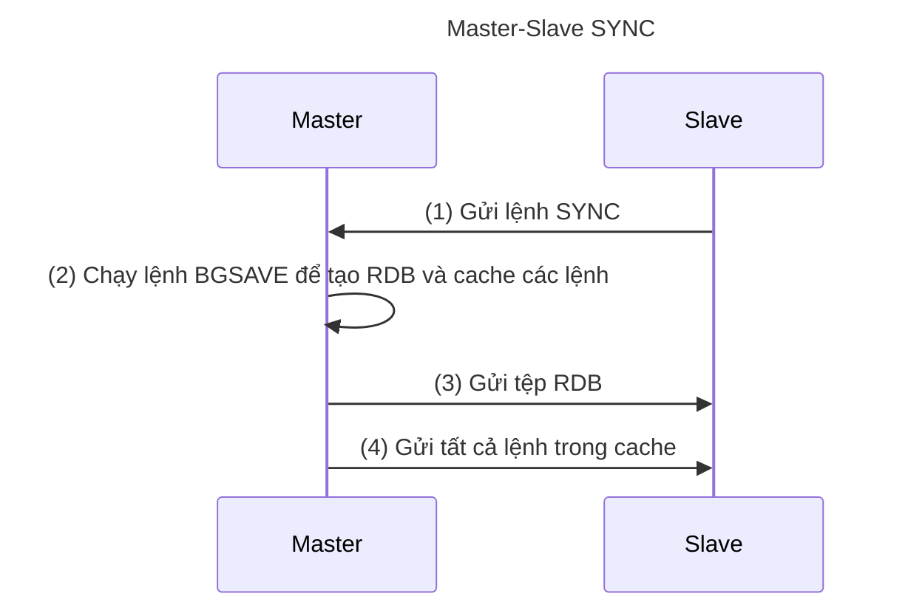
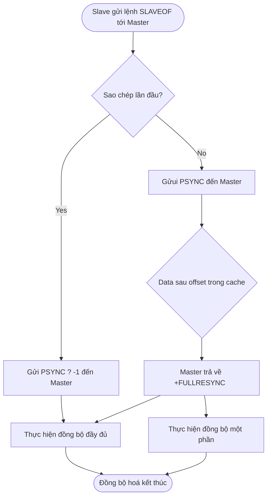

# Redis Replication

> Trong Redis, **có thể sử dụng lệnh `SLAVEOF` hoặc cài đặt tùy chọn `slaveof` để sao chép (replicate) một máy chủ từ một máy chủ khác**, trong đó máy chủ sau được gọi là máy chủ chính (master) và máy chủ trước được gọi là máy chủ phụ (slave).
>
> Sao chép Redis trước phiên bản 2.8 không xử lý hiệu quả việc sao chép lại sau khi mất kết nối, và một số cập nhật sau đó của Redis đã giải quyết vấn đề này.

## 1. Giới thiệu về sao chép

Redis sử dụng lệnh `slaveof host port` để biến một máy chủ thành máy chủ phụ (slave) của một máy chủ khác (master).

**Một máy chủ chính (master) có thể có nhiều máy chủ phụ (slave)**. Không chỉ máy chủ chính có thể có máy chủ phụ, mà máy chủ phụ cũng có thể có máy chủ phụ riêng của mình, và nhiều máy chủ phụ có thể tạo thành một chuỗi chính-phụ.

**Một máy chủ chỉ có thể có một máy chủ chính và không hỗ trợ sao chép giữa các máy chủ chính.**.

Có thể sử dụng chức năng sao chép để giúp máy chủ chính không cần thực hiện hoạt động bền vững: Chỉ cần tắt chức năng bền vững trên máy chủ chính, sau đó cho phép máy chủ phụ thực hiện hoạt động bền vững.

Trong cài đặt sử dụng chức năng sao chép của Redis, rất khuyến nghị bật tính bền vững trên cả master và slave. Khi không bật tính năng này, ví dụ như gặp vấn đề trễ do hiệu suất ổ cứng rất chậm, **bạn nên cấu hình các phiên bản để tránh tự động khởi động lại sau khi thiết lập lại**.

Kể từ phiên bản Redis 2.6, máy chủ phụ hỗ trợ chế độ chỉ đọc và chế độ này là chế độ mặc định của máy chủ phụ.

- Chế độ chỉ đọc được điều khiển bằng tùy chọn `slave-read-only` trong tệp `redis.conf`, và cũng có thể được bật hoặc tắt chế độ này bằng lệnh [CONFIG SET parameter value](http://redisdoc.com/configure/config_set.html#config-set).
- Máy chủ phụ chỉ đọc sẽ từ chối thực hiện bất kỳ lệnh ghi nào, do đó không có trường hợp dữ liệu được ghi vào máy chủ phụ vì lỗi thao tác.

## 2. Sao chép phiên bản cũ

> Cách triển khai sao chép trước phiên bản Redis 2.8: Lệnh `SYNC`

Chức năng sao chép Redis được chia thành hai hoạt động: đồng bộ hóa (sync) và truyền lệnh (command propagate):

- **`Đồng bộ hóa (sync)`** - Được sử dụng để cập nhật trạng thái cơ sở dữ liệu của máy chủ phụ với trạng thái cơ sở dữ liệu hiện tại của máy chủ chính.
- **`Truyền lệnh (command propagate)`** - Khi trạng thái cơ sở dữ liệu của máy chủ chính được sửa đổi, dẫn đến trạng thái không nhất quán giữa cơ sở dữ liệu chính và phụ, cho phép cơ sở dữ liệu chính và phụ trở lại trạng thái nhất quán.

### Đồng bộ hóa

Các bước thực hiện lệnh `SYNC`:

1. Máy chủ phụ gửi lệnh `SYNC` đến máy chủ chính.
2. Máy chủ chính nhận lệnh `SYNC` và thực hiện lệnh `BGSAVE` để tạo tệp RDB trong nền và sử dụng một bộ đệm để ghi lại tất cả các lệnh ghi được thực hiện từ thời điểm này trở đi.
3. Sau khi máy chủ chính hoàn thành lệnh `BGSAVE`, máy chủ chính sẽ gửi tệp RDB đã tạo cho máy chủ phụ. Máy chủ phụ nhận và tải tệp RDB, cập nhật trạng thái cơ sở dữ liệu của mình.
4. Máy chủ chính gửi tất cả các lệnh ghi được ghi lại trong bộ đệm cho máy chủ phụ. Máy chủ phụ thực hiện các lệnh ghi này, cập nhật trạng thái cơ sở dữ liệu của mình.



### Truyền lệnh

Sau khi hoàn thành hoạt động đồng bộ hóa, trạng thái cơ sở dữ liệu của máy chủ chính và phụ sẽ trở nên nhất quán. Mỗi khi máy chủ chính thực hiện một lệnh ghi được gửi từ khách hàng, trạng thái cơ sở dữ liệu của máy chủ chính và phụ không còn nhất quán. Cần gửi các lệnh ghi cho máy chủ phụ để thực hiện, đảm bảo trạng thái cơ sở dữ liệu của cả hai trở lại nhất quán.

### Nhược điểm của sao chép phiên bản cũ

Có hai trường hợp khi sao chép từ máy chủ chính sang máy chủ phụ:

- **Sao chép lần đầu** - Máy chủ phụ chưa từng sao chép máy chủ chính trước đó.
- **Sao chép sau khi mất kết nối** - Máy chủ phụ và máy chủ chính trong quá trình truyền lệnh bị mất kết nối do vấn đề mạng, sau khi máy chủ phụ kết nối lại với máy chủ chính, tiếp tục sao chép từ máy chủ chính.

Đối với sao chép lần đầu, chức năng sao chép phiên bản cũ hoạt động tốt; tuy nhiên, **đối với sao chép sau khi mất kết nối, hiệu suất rất thấp do việc tạo và truyền RDB mỗi lần**.

> 🔔 Lưu ý: **Lệnh SYNC là một hoạt động tốn nhiều tài nguyên**.
>
> - Máy chủ chính thực hiện lệnh `BGSAVE` để tạo tệp RDB, hoạt động này tốn nhiều tài nguyên CPU, bộ nhớ và I/O đĩa của máy chủ chính.
> - Máy chủ chính truyền tệp RDB cho máy chủ phụ, hoạt động này tốn nhiều tài nguyên mạng của cả máy chủ chính và phụ và ảnh hưởng đến thời gian phản hồi của máy chủ chính.
> - Trong quá trình máy chủ phụ tải tệp RDB, các lệnh yêu cầu khác bị chặn.

## 3. Sao chép phiên bản mới

> Cách triển khai mới sau phiên bản Redis 2.8: Sử dụng lệnh `PSYNC` thay thế lệnh `SYNC`.

Lệnh `PSYNC` có hai chế độ: đồng bộ hoàn toàn (full resynchronization) và đồng bộ một phần (partial resynchronization):

- **`Đồng bộ hoàn toàn (full resynchronization)`** - Được sử dụng cho sao chép lần đầu. Các bước thực hiện tương tự như lệnh `SYNC`.
- **`Đồng bộ một phần (partial resynchronization)`** - Được sử dụng cho sao chép sau khi mất kết nối. **Nếu điều kiện cho phép, máy chủ chính có thể gửi các lệnh ghi được thực hiện trong quá trình ngắt kết nối cho máy chủ phụ**, máy chủ phụ chỉ cần nhận và thực hiện các lệnh ghi này để duy trì trạng thái cơ sở dữ liệu của máy chủ chính và phụ nhất quán.

### Đồng bộ một phần

Chức năng đồng bộ một phần bao gồm ba phần:

- **Offset sao chép** của máy chủ chính và máy chủ phụ.
- **Bộ đệm chờ sao chép** của máy chủ chính.
- **ID chạy của máy chủ**.

#### Offset sao chép

Máy chủ chính và máy chủ phụ sẽ duy trì một offset sao chép riêng biệt.

- Nếu offset sao chép của máy chủ chính và máy chủ phụ giống nhau, điều đó có nghĩa là trạng thái cơ sở dữ liệu của hai máy chủ là nhất quán;
- Ngược lại, nếu offset sao chép không giống nhau, điều đó có nghĩa là trạng thái cơ sở dữ liệu của hai máy chủ không nhất quán.

#### Bộ đệm chờ sao chép

**Bộ đệm chờ sao chép là một hàng đợi FIFO có độ dài cố định được duy trì bởi máy chủ chính**, kích thước mặc định là `1MB`.

Bộ đệm chờ sao chép sẽ lưu trữ một phần lệnh ghi gần đây đã truyền và bộ đệm chờ sao chép sẽ ghi lại offset sao chép tương ứng cho mỗi byte trong hàng đợi.

Khi máy chủ phụ kết nối lại với máy chủ chính sau khi mất kết nối, máy chủ phụ sẽ gửi lệnh `PSYNC` với offset sao chép của chính nó cho máy chủ chính, máy chủ chính sẽ dựa trên offset này để quyết định thực hiện hoạt động đồng bộ nào với máy chủ phụ.

- Nếu dữ liệu sau offset vẫn còn trong bộ đệm chờ sao chép, máy chủ chính sẽ thực hiện đồng bộ một phần với máy chủ phụ.
- Ngược lại, máy chủ chính sẽ thực hiện đồng bộ hoàn toàn với máy chủ phụ.

> 🔔 Lưu ý: **Điều chỉnh kích thước bộ đệm chờ sao chép một cách hợp lý**
>
> - Kích thước mặc định của bộ đệm chờ sao chép Redis là `1MB`.
>
> - Kích thước tối thiểu của bộ đệm chờ sao chép có thể được ước tính bằng công thức `second * write_size_per_second`.
>

#### ID chạy của máy chủ

- Mỗi máy chủ Redis có một ID chạy để xác định duy nhất.
- ID chạy được tạo tự động khi máy chủ khởi động, bao gồm 40 ký tự thập lục phân ngẫu nhiên. Ví dụ: 132e358005e29741f8d7b0a42d666aace286edda

Khi máy chủ phụ sao chép lần đầu từ máy chủ chính, máy chủ chính sẽ gửi ID chạy của chính nó cho máy chủ phụ và máy chủ phụ sẽ lưu trữ ID chạy này.

Khi máy chủ phụ kết nối lại với máy chủ chính, máy chủ phụ sẽ gửi ID chạy đã lưu trữ trước đó:

- Nếu ID chạy đã lưu trữ và ID chạy hiện tại của máy chủ chính giống nhau, điều đó có nghĩa là máy chủ phụ đã kết nối với máy chủ chính trước đó, máy chủ chính sẽ tiếp tục thử nghiệm đồng bộ một phần;
- Ngược lại, nếu ID chạy không khớp, điều đó có nghĩa là máy chủ phụ không kết nối với máy chủ chính trước đó, máy chủ chính sẽ thực hiện đồng bộ hoàn toàn với máy chủ phụ.

### Lệnh PSYNC

Sau khi hiểu cách triển khai đồng bộ một phần, việc hiểu cách thực hiện lệnh PSYNC sẽ dễ dàng hơn, nguyên tắc hoạt động cơ bản của nó như sau:

Khi máy chủ phụ nhận được lệnh `SLAVEOF`, trước tiên kiểm tra xem máy chủ phụ đã sao chép từ máy chủ trước đó hay chưa.

- Nếu máy chủ phụ chưa sao chép từ bất kỳ máy chủ chính nào trước đó, nó sẽ gửi lệnh `PSYNC ? -1` đến máy chủ chính, yêu cầu đồng bộ hoàn toàn.
- Ngược lại, nó sẽ gửi lệnh `PSYNC <runid> <offset>` đến máy chủ chính.
    - `runid` là ID chạy của máy chủ chính trong lần sao chép trước đó.
    - `offset` là offset sao chép.

Máy chủ chính nhận được lệnh `PSYNC <runid> <offset>` sẽ thực hiện phân tích:

- Nếu **ID chạy của máy chủ chính và máy chủ phụ giống nhau và offset được chỉ định vẫn còn hiệu lực trong bộ đệm chờ sao chép**, điều đó có nghĩa là máy chủ chính sẽ tiếp tục thực hiện đồng bộ một phần với máy chủ phụ.
- Nếu không thỏa mãn một trong hai điều kiện trên, máy chủ chính sẽ thực hiện đồng bộ toàn bộ với máy chủ phụ.



## 4. Kiểm tra nhịp tim

Trong giai đoạn **truyền lệnh**, máy chủ từ xa mặc định sẽ gửi lệnh đến máy chủ chính một lần mỗi giây:

```
REPLCONF ACK <replication_offset>
```

Trong đó, `replication_offset` là vị trí sao chép hiện tại của máy chủ từ xa.

Gửi lệnh `REPLCONF ACK` có ba tác dụng đối với máy chủ chính và máy chủ phụ:

- Kiểm tra trạng thái kết nối mạng giữa máy chủ chính và máy chủ phụ.
- Hỗ trợ thực hiện tùy chọn min-slaves.
- Kiểm tra việc mất lệnh.

### Kiểm tra trạng thái kết nối giữa máy chủ chính và máy chủ phụ

**Có thể kiểm tra xem kết nối mạng giữa máy chủ chính và máy chủ phụ có bình thường hay không** bằng cách gửi và nhận lệnh `REPLCONF ACK`: Nếu máy chủ chính không nhận được lệnh `REPLCONF ACK` từ máy chủ phụ trong hơn một giây, máy chủ chính sẽ biết rằng có vấn đề về kết nối giữa máy chủ chính và máy chủ phụ.

Có thể sử dụng lệnh `INFO replication` để gửi đến máy chủ chính và xem trong cột lag của danh sách máy chủ phụ, thời gian đã trôi qua kể từ khi máy chủ phụ gửi lệnh `REPLCONF ACK` đến máy chủ chính.

### Hỗ trợ thực hiện tùy chọn min-slaves

Tùy chọn `min-slaves-to-write` và `min-slaves-max-lag` trong Redis giúp ngăn máy chủ chính thực hiện lệnh ghi trong trường hợp không an toàn.

【Ví dụ】Cấu hình min-slaves

```
min-slaves-to-write 3
min-slaves-max-lag 10
```

Cấu hình trên đại diện cho: Nếu số lượng máy chủ phụ nhỏ hơn 3 hoặc độ trễ của ba máy chủ phụ lớn hơn hoặc bằng 10 giây, máy chủ chính sẽ từ chối thực hiện lệnh ghi.

### Kiểm tra việc mất lệnh

Nếu do sự cố mạng, các lệnh ghi mà máy chủ chính truyền cho máy chủ phụ bị mất, khi máy chủ phụ gửi lệnh `REPLCONF ACK` định kỳ đến máy chủ chính, máy chủ chính sẽ nhận ra rằng vị trí sao chép của máy chủ phụ ít hơn của chính nó. Sau đó, máy chủ chính sẽ tìm các dữ liệu mà máy chủ phụ thiếu trong bộ đệm sao chép và gửi lại cho máy chủ phụ dựa trên vị trí sao chép mà máy chủ phụ đã gửi.

## 5. Quy trình sao chép

Bằng cách gửi lệnh SLAVEOF như sau đến máy chủ phụ, bạn có thể sao chép máy chủ chính.

```
SLAVEOF <master_ip> <master_port>
```

### Bước 1. Cấu hình máy chủ chính và máy chủ phụ

Cấu hình máy chủ phụ rất đơn giản, chỉ cần thêm dòng sau vào tệp cấu hình:

```
slaveof 127.0.0.1 6379
```

Tất nhiên, bạn cần thay thế `127.0.0.1` và `6379` trong mã bằng IP và cổng của máy chủ chính của bạn.

Một cách khác là sử dụng lệnh [SLAVEOF host port](https://redis.io/commands/slaveof/), nhập IP và cổng của máy chủ chính, sau đó đồng bộ hóa sẽ bắt đầu:

```
127.0.0.1:6379> SLAVEOF 127.0.0.1 10086
OK
```

### Bước 2. Thiết lập kết nối TCP giữa máy chủ chính và máy chủ phụ.

### Bước 3. Gửi PING để kiểm tra trạng thái giao tiếp.

### Bước 4. Xác thực.

Nếu máy chủ chính không thiết lập `requirepass`, máy chủ phụ không thiết lập `masterauth`, thì không cần xác thực; ngược lại, cần xác thực. Nếu xác thực không thành công, quá trình sao chép sẽ bị hủy bỏ.

Nếu máy chủ chính đã đặt mật khẩu thông qua tùy chọn `requirepass`, để đảm bảo quá trình đồng bộ hóa máy chủ phụ diễn ra suôn sẻ, chúng ta cũng phải thiết lập xác thực tương ứng cho máy chủ phụ.

Đối với một máy chủ đang chạy, bạn có thể sử dụng lệnh sau đây trên khách hàng:

```
config set masterauth <password>
```

Để thiết lập mật khẩu này vĩnh viễn, bạn có thể thêm nó vào tệp cấu hình:

```
masterauth <password>
```

Ngoài ra, còn một số tùy chọn khác liên quan đến bộ đệm luồng sao chép được sử dụng khi máy chủ chính thực hiện đồng bộ hóa một phần, chi tiết có thể tham khảo tệp `redis.conf` đi kèm với mã nguồn Redis.

### Bước 5. Gửi thông tin cổng.

máy chủ phụ thực hiện `REPLCONF listening-port <port-number>`, gửi số cổng lắng nghe của máy chủ phụ đến máy chủ chính.

### Bước 6. Đồng bộ hóa.

Đã được giới thiệu trước đó, không lặp lại ở đây.

### Bước 7. Truyền lệnh.

Trong giai đoạn truyền lệnh, máy chủ phụ mặc định sẽ gửi lệnh đến máy chủ chính mỗi giây một lần:

```
REPLCONF ACK <replication_coffset>
```

Các lệnh có tác dụng:

- Kiểm tra trạng thái kết nối mạng giữa máy chủ chính và máy chủ phụ.
- Hỗ trợ thực hiện tùy chọn min-slave.
- Kiểm tra việc mất lệnh.

## 6. Các tùy chọn cấu hình sao chép

Từ Redis 2.8 trở đi, để đảm bảo tính an toàn của dữ liệu, bạn có thể cấu hình để máy chủ chính chỉ thực hiện lệnh ghi khi có ít nhất N máy chủ con đang kết nối.

Tuy nhiên, vì Redis sử dụng sao chép bất đồng bộ, nên dữ liệu ghi mà máy chủ chính gửi không nhất thiết sẽ được máy chủ con nhận được, do đó, khả năng mất dữ liệu vẫn tồn tại.

Dưới đây là cách hoạt động của tính năng này:

- Máy chủ con gửi lệnh PING đến máy chủ chính mỗi giây một lần và báo cáo tình trạng xử lý luồng sao chép.
- Máy chủ chính ghi lại thời gian máy chủ con cuối cùng gửi lệnh PING đến nó.
- Người dùng có thể cấu hình giá trị tối đa của độ trễ mạng `min-slaves-max-lag` và số lượng tối thiểu máy chủ con cần để thực hiện lệnh ghi `min-slaves-to-write`.

Nếu có ít nhất `min-slaves-to-write` máy chủ con và tất cả các máy chủ con này có độ trễ nhỏ hơn `min-slaves-max-lag` giây, máy chủ chính sẽ thực hiện lệnh ghi được yêu cầu từ khách hàng.

Bạn có thể coi tính năng này như một phiên bản nới lỏng điều kiện C trong lý thuyết CAP: Mặc dù không đảm bảo tính bền vững của lệnh ghi, nhưng ít nhất cửa sổ mất dữ liệu sẽ được giới hạn chặt chẽ trong số giây được chỉ định.

Mặt khác, nếu không đáp ứng được các điều kiện được chỉ định bởi `min-slaves-to-write` và `min-slaves-max-lag`, lệnh ghi sẽ không được thực hiện và máy chủ chính sẽ trả về một lỗi cho khách hàng yêu cầu thực hiện lệnh ghi.

Dưới đây là hai tùy chọn của tính năng này và các tham số cần thiết cho chúng:

- `min-slaves-to-write <số lượng máy chủ con>`
- `min-slaves-max-lag <số giây>`

Thông tin chi tiết có thể được tham khảo trong tệp `redis.conf` đi kèm với mã nguồn Redis.
