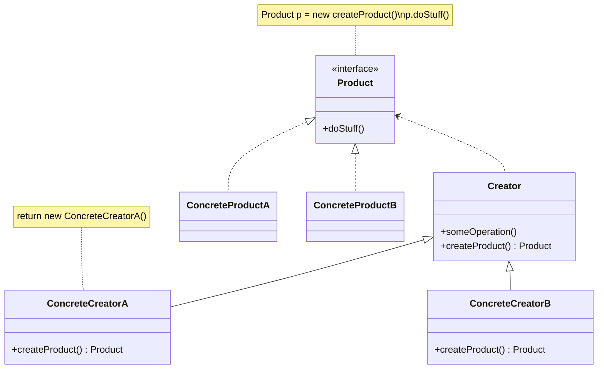

## Ý tưởng

Factory Method Pattern là một mẫu thiết kế tạo đối tượng, trong đó lớp cha cung cấp một phương thức để tạo đối tượng, nhưng để các lớp con quyết định loại đối tượng cụ thể được tạo.

- Trong mẫu thiết kế Factory, mỗi lớp con có thể triển khai phương thức tạo đối tượng theo cách riêng của nó.
- Mẫu thiết kế Factory tuân thủ nguyên tắc **Open - Close**: Các lớp con có thể mở rộng phương thức tạo đối tượng mà không cần sửa đổi lớp cha.

## Ứng dụng

- Khi viết mã, nếu không thể dự đoán chính xác loại đối tượng và các mối quan hệ phụ thuộc của nó, có thể sử dụng Factory Method Pattern.
- Nếu bạn muốn người dùng có thể mở rộng các thành phần nội bộ của thư viện hoặc framework của bạn, có thể sử dụng Factory Method Pattern.
- Nếu bạn muốn tái sử dụng các đối tượng hiện có để tiết kiệm tài nguyên hệ thống thay vì tạo đối tượng mới mỗi lần, có thể sử dụng Factory Method Pattern.

## Cấu trúc




### Mô tả cấu trúc

1. **Sản phẩm** (Product) sẽ khai báo một giao diện. Đối với tất cả các đối tượng được xây dựng bởi Creator và các lớp con của nó, giao diện này là chung.
2. **Sản phẩm cụ thể** (Concrete Products) là các triển khai của giao diện sản phẩm.
3. **Nhà sản xuất** (Creator) khai báo Factory Method trả về đối tượng sản phẩm. Loại đối tượng trả về của phương thức này phải phù hợp với giao diện sản phẩm.

- Bạn có thể khai báo Factory Method là một phương thức trừu tượng, buộc các lớp con triển khai phương thức này theo cách riêng của chúng. Hoặc bạn cũng có thể trả về loại sản phẩm mặc định trong Factory Method cơ bản.
- Lưu ý rằng, mặc dù nó được gọi là nhà sản xuất, nhưng trách nhiệm chính của nó không phải là tạo ra sản phẩm. Thông thường, lớp nhà sản xuất chứa một số logic kinh doanh cốt lõi liên quan đến sản phẩm. Factory Method tách biệt logic này khỏi lớp sản phẩm cụ thể. Ví dụ, một công ty phát triển phần mềm lớn có một bộ phận đào tạo lập trình viên. Tuy nhiên, công việc chính của công ty đó là viết mã, không phải là tạo ra lập trình viên.

4. **Nhà sản xuất cụ thể** (Concrete Creators) sẽ ghi đè Factory Method cơ bản để trả về một loại sản phẩm khác.

### Mẫu code cấu trúc

【Product】

Định nghĩa đối tượng sản phẩm.

```java
abstract class Product {
    public abstract void use();
}
```

【ConcreteProduct】

Triển khai giao diện của `Product`.

```java
class ConcreteProduct extends Product {
    public ConcreteProduct() {
        System.out.println("Tạo đối tượng sản phẩm ConcreteProduct");
    }

    @Override
    public void use() {
        System.out.println("Sử dụng đối tượng sản phẩm ConcreteProduct");
    }
}
```

【Creator】

Khai báo Factory Method, nó sẽ **trả về một đối tượng sản phẩm**. Nhà sản xuất cũng có thể triển khai một Factory Method mặc định để trả về một loại sản phẩm mặc định.

```java
interface Creator {
    public Product factoryMethod();
}
```

【ConcreteCreator】

**Ghi đè** Factory Method cơ bản để trả về một loại sản phẩm khác.

```java
class ConcreteCreator implements Creator {
    @Override
    public Product factoryMethod() {
        return new ConcreteProduct();
    }
}
```

【Khách hàng】

```java
public class FactoryMethodPattern {
    public static void main(String[] args) {
        Creator factory = new ConcreteCreator();
        Product product = factory.factoryMethod();
        product.use();
    }
}
```

【Kết quả】

```
Tạo đối tượng sản phẩm ConcreteProduct
Sử dụng đối tượng sản phẩm ConcreteProduct
```

## Pseudocode

Dưới đây là một ví dụ minh họa về cách sử dụng **Factory Method Pattern** để phát triển các thành phần giao diện người dùng (UI) đa nền tảng mà không gắn kết mã khách hàng với các lớp UI cụ thể.


Lớp cơ sở `Dialog` sử dụng các thành phần giao diện người dùng (UI) khác nhau để vẽ cửa sổ. Trong các hệ điều hành khác nhau, giao diện của các thành phần này có thể khác nhau một chút, nhưng chức năng của chúng vẫn giữ nguyên. Ví dụ, nút trong hệ điều hành Windows vẫn là một nút trong hệ điều hành Linux.

Nếu sử dụng phương pháp Factory Method, chúng ta không cần phải viết lại logic của `Dialog` cho mỗi hệ điều hành. Nếu chúng ta khai báo một Factory Method trong lớp cơ sở `Dialog` để tạo ra nút, chúng ta có thể tạo một lớp con của `Dialog` và sử dụng Factory Method để trả về một nút theo kiểu Windows. Lớp con sẽ kế thừa phần lớn mã của lớp cơ sở `Dialog` và vẽ nút theo kiểu Windows trên màn hình.

Để Mẫu thiết kế này hoạt động, lớp cơ sở `Dialog` phải sử dụng một nút trừu tượng (ví dụ: lớp cơ sở hoặc giao diện) để mở rộng thành nút cụ thể. Điều này cho phép mã của `Dialog` hoạt động đúng cho bất kỳ loại nút nào được sử dụng trong `Dialog`.

Bạn có thể sử dụng phương pháp này để phát triển các thành phần giao diện người dùng khác. Tuy nhiên, mỗi khi bạn thêm một Factory Method mới vào `Dialog`, bạn sẽ tiến gần hơn đến Mẫu thiết kế [[Abstract Factory Pattern|Abstract Factory]]. Chúng ta sẽ nói về Mẫu thiết kế này sau.

```java
// Lớp tạo ra khai báo Factory Method phải trả về một đối tượng lớp sản phẩm. 
// Các lớp con của lớp tạo ra thường cung cấp triển khai của phương thức này.
class Dialog is
    // Lớp tạo ra cũng có thể cung cấp một số triển khai mặc định cho Factory Method.
    abstract method createButton():Button

    // Lưu ý rằng trách nhiệm chính của lớp tạo ra không phải là tạo ra sản phẩm. 
    // Thông thường, lớp tạo ra chứa một số logic kinh doanh cốt lõi liên quan đến sản phẩm. 
    // Factory Method tách biệt logic này khỏi lớp sản phẩm cụ thể. 
    // Ví dụ, một công ty phát triển phần mềm lớn có một bộ phận đào tạo lập trình viên. 
    // Tuy nhiên, công việc chính của công ty đó là viết mã, không phải là tạo ra lập trình viên.
    method render() is
        // Gọi Factory Method để tạo ra một đối tượng sản phẩm.
        Button okButton = createButton()
        // Sử dụng sản phẩm.
        okButton.onClick(closeDialog)
        okButton.render()


// Lớp sản phẩm cụ thể ghi đè Factory Method để thay đổi kiểu sản phẩm mà nó trả về
class WindowsDialog extends Dialog is
    method createButton():Button is
        return new WindowsButton()

class WebDialog extends Dialog is
    method createButton():Button is
        return new HTMLButton()


// Lớp sản phẩm khai báo tất cả các hoạt động mà tất cả các sản phẩm cụ thể phải triển khai.
interface Button is
    method render()
    method onClick(f)

// Lớp sản phẩm cụ thể cung cấp các triển khai của giao diện sản phẩm.
class WindowsButton implements Button is
    method render(a, b) is
        // Vẽ nút theo giao diện Windows.
    method onClick(f) is
        // Gắn sự kiện nhấp chuột của hệ điều hành Windows.

class HTMLButton implements Button is
    method render(a, b) is
        // Trả về biểu diễn HTML của một nút.
    method onClick(f) is
        // Gắn sự kiện nhấp chuột của trình duyệt web.


class Application is
    field dialog: Dialog

    // Chương trình chọn loại tạo ra dựa trên cấu hình hoặc môi trường hệ thống.
    method initialize() is
        config = readApplicationConfigFile()

        if (config.OS == "Windows") then
            dialog = new WindowsDialog()
        else if (config.OS == "Web") then
            dialog = new WebDialog()
        else
            throw new Exception("Lỗi! Hệ điều hành không xác định.")

    // Mã khách hàng hiện tại tương tác với một phiên bản cụ thể của lớp tạo ra, 
    // nhưng chỉ thông qua giao diện cơ sở nó. 
    // Chỉ cần khách hàng tương tác với lớp tạo ra thông qua giao diện cơ bản, 
     // bạn có thể chuyển bất kỳ lớp con Creator nào cho khách hàng.
    method main() is
        this.initialize()
        dialog.render()
```

## Áp dụng

**Áp dụng sử dụng:** Factory Method Pattern đã được sử dụng rộng rãi trong mã Java. Nó rất hữu ích khi bạn cần cung cấp tính linh hoạt ở mức cao trong mã của bạn.

Có một số ứng dụng của Mẫu thiết kế này trong thư viện chính của Java:

- [`java.util.Calendar#getInstance()`](http://docs.oracle.com/javase/8/docs/api/java/util/Calendar.html#getInstance--)
- [`java.util.ResourceBundle#getBundle()`](http://docs.oracle.com/javase/8/docs/api/java/util/ResourceBundle.html#getBundle-java.lang.String-)
- [`java.text.NumberFormat#getInstance()`](http://docs.oracle.com/javase/8/docs/api/java/text/NumberFormat.html#getInstance--)
- [`java.nio.charset.Charset#forName()`](http://docs.oracle.com/javase/8/docs/api/java/nio/charset/Charset.html#forName-java.lang.String-)
- [`java.net.URLStreamHandlerFactory#createURLStreamHandler(String)`](http://docs.oracle.com/javase/8/docs/api/java/net/URLStreamHandlerFactory.html) (trả về các đối tượng duy nhất khác nhau dựa trên giao thức)
- [`java.util.EnumSet#of()`](<https://docs.oracle.com/javase/8/docs/api/java/util/EnumSet.html#of(E)>)
- [`javax.xml.bind.JAXBContext#createMarshaller()`](https://docs.oracle.com/javase/8/docs/api/javax/xml/bind/JAXBContext.html#createMarshaller--) và các phương thức tương tự khác.

**Cách nhận biết:** Factory Method có thể được nhận biết thông qua việc xây dựng phương thức, nó tạo ra các đối tượng của lớp cụ thể, nhưng trả về dưới dạng kiểu trừu tượng hoặc giao diện.

Chúng ta sẽ tiếp tục sử dụng ví dụ trong [[Simple Factory Pattern]] để giải thích.

Làm thế nào để triển khai một máy tính có các chức năng cộng, trừ, nhân và chia cơ bản?

Không có sự khác biệt trong mã của vai trò `Product` và `ConcreteProduct` giữa hai Mẫu thiết kế, nên chúng tôi sẽ không nhắc lại ở đây.

Sự khác biệt nằm ở phần vai trò của `Factory` và `Client`, hãy cảm nhận trong mã.

【Vai trò Creator】

```java
// Vai trò Creator, định nghĩa phương thức Factory chung để trả về một phiên bản của sản phẩm
interface OperationFactory {
    public Operation factoryMethod();
}
```

【Vai trò ConcreteCreator】

So với Simple Factory Pattern, mỗi loại sản phẩm sẽ có một lớp Factory cụ thể để tạo ra phiên bản.

```java
// Vai trò ConcreteCreator, triển khai cụ thể phương thức Factory trong Creator
class AddFactory implements OperationFactory {
    @Override
    public Operation factoryMethod() {
        return new Add();
    }
}

// Vai trò ConcreteCreator, triển khai cụ thể phương thức Factory trong Creator
class SubFactory implements OperationFactory {
    @Override
    public Operation factoryMethod() {
        return new Sub();
    }
}

// Vai trò ConcreteCreator, triển khai cụ thể phương thức Factory trong Creator
class MulFactory implements OperationFactory {
    @Override
    public Operation factoryMethod() {
        return new Mul();
    }
}

// Vai trò ConcreteCreator, triển khai cụ thể phương thức Factory trong Creator
class DivFactory implements OperationFactory {
    @Override
    public Operation factoryMethod() {
        return new Div();
    }
}
```

【Vai trò Client】

So với Simple Factory Pattern, trong Factory Method Pattern, chúng ta cần chỉ định Factory cụ thể để tạo ra sản phẩm tương ứng.

```java
// Vai trò Client, cần chỉ định Factory cụ thể để tạo ra sản phẩm cụ thể
public class factoryMethodPattern {
    public static void main(String[] args) {
        OperationFactory factory = new SubFactory();
        Operation oper = factory.factoryMethod();
        oper.numA = 3;
        oper.numB = 2;
        double result = oper.getResult();
        System.out.println("result = " + result);
    }
}
```

## Mối quan hệ với các mẫu thiết kế khác

- Trong giai đoạn thiết kế ban đầu của nhiều công việc thiết kế, [[Factory Method Pattern]] được sử dụng (đơn giản hơn và dễ dàng tùy chỉnh hơn thông qua lớp con), sau đó tiến triển thành [[Abstract Factory Pattern]], [[Prototype Pattern]] hoặc [[Builder Pattern]] (linh hoạt hơn nhưng phức tạp hơn).
- [[Abstract Factory Pattern]] thường dựa trên một tập hợp các [[Factory Method Pattern]], nhưng bạn cũng có thể sử dụng [[Prototype Pattern]] để tạo ra các phương thức này.
- Bạn có thể sử dụng cả [[Factory Method Pattern]] và [[Iterator Pattern]] để cho phép tập hợp con trả về các loại trình lặp khác nhau và khớp với tập hợp.
- [[Prototype Pattern]] không dựa trên kế thừa, do đó không có nhược điểm của kế thừa. Mặt khác, *Prototype* yêu cầu khởi tạo phức tạp cho đối tượng được sao chép. [[Factory Method Pattern]] dựa trên kế thừa, nhưng không yêu cầu bước khởi tạo.
- [[Factory Method Pattern]] là một dạng đặc biệt của [[Template Method Pattern]]. Đồng thời, *Factory Method* có thể là một bước trong một *Template Method* lớn hơn.
