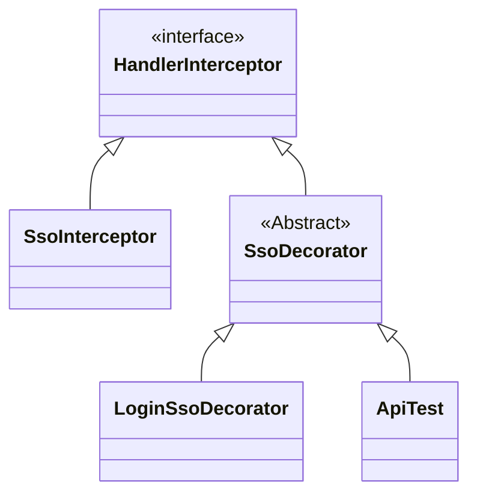

# Decorator Pattern Practice: Mở rộng chức năng đăng nhập một lần SSO, tăng phạm vi các kịch bản truy cập của người dùng bị chặn

## Giới thiệu

`Bạn có còn cảm giác lập trình với code không?`

Rất nhiều người viết code thường không có cảm giác lập trình, nghĩa là ngoài việc có thể viết ra code theo quy trình cố định để triển khai các chức năng một cách cơ bản, họ khó có thể suy nghĩ về tính mở rộng và khả năng bảo trì của toàn bộ dịch vụ chức năng. Đặc biệt là trong việc xây dựng các chức năng lớn hơn, họ thiếu khả năng lái xe, dẫn đến code cuối cùng không thể hoàn thiện và tinh tế như mong muốn.

`Ăn cướp và Ăn trộm`

Hai từ có ý nghĩa giống nhau, chỉ vì một chữ khác nhau mà một cái được coi là "đỉnh" và một cái được coi là "hài hước". Thường khi chúng ta viết code để triển khai các yêu cầu kinh doanh, chúng ta thường sử dụng các phương pháp không thích hợp, nhưng lại không nhận ra điều đó. Một phần là do thiếu kinh nghiệm viết code và thiếu các dự án lớn hơn để thực hành, phần khác là vì không luôn luôn nỗ lực để hoàn thiện và làm tốt hơn.

`Sách không chỉ để đọc mà còn để sử dụng`

Trong thời đại hiện nay, khi tài liệu học tập gần như là phổ biến, thậm chí bạn có thể dễ dàng truy cập vào hàng tạp hóa các video có dung lượng cao, chỉ cần một cú nhấp chuột nhỏ là bạn có thể lưu trữ một đống bài viết, nhưng rất ít khi bạn đọc. Quá trình học không chỉ là việc đọc một lần mà là việc sử dụng một cuốn sách. Với các sách kỹ thuật thực hành, nếu thực sự muốn học kiến thức, thì chắc chắn bạn phải sử dụng cuốn sách đó thay vì chỉ đọc nó.

## Môi trường phát triển

1. JDK 1.8
2. Idea + Maven
3. Code: [vanhung4499/practical-java-design](https://github.com/vanhung4499/practical-java-design)  

| Dự án            | Mô tả                                                        |
| ---------------- | ------------------------------------------------------------ |
| demo-design-9-00 | Dự án mô phỏng: mô phỏng lớp đăng nhập một lần               |
| demo-design-9-01 | Triển khai nghiệp vụ bằng code đơn giản                      |
| demo-design-9-02 | Tái cấu trúc qua mẫu thiết kế , tạo ra sự so sánh và học hỏi |

## Giới thiệu về Decorator Pattern


Khi nhìn vào hình ảnh trên, có vẻ như Decorator Pattern giống như búp bê Nga, hoặc một chiếc taxi 🚕 nào đó. Nhưng điểm quan trọng của Decorator chính là việc thêm chức năng cho một lớp mà không thay đổi lớp ban đầu. **Không thay đổi lớp ban đầu**, có lẽ một số bạn sẽ nghĩ đến kế thừa, AOP, tất nhiên những phương pháp này đều có thể thực hiện được, nhưng việc sử dụng Decorator Pattern sẽ là một cách suy nghĩ khác linh hoạt hơn, có thể tránh được việc có quá nhiều lớp con do kế thừa gây ra, cũng như tránh được sự phức tạp do AOP gây ra.

**Có nhiều tình huống quen thuộc bạn đã gặp sử dụng Decorator Pattern**

`new BufferedReader(new FileReader(""));`, bạn có quen với đoạn code này không, tôi tin rằng khi học về phát triển java và đọc về dòng byte, dòng ký tự, dòng tập tin, bạn đã gặp đoạn code như thế này, một lớp bao lớp, chuyển dòng byte sang dòng ký tự và còn nhiều thứ khác nữa, và cách sử dụng như thế này chính là một trong những cách thức thể hiện của Decorator Pattern.

## Mô phỏng tình huống


**Trong trường hợp mô phỏng này, chúng tôi mô phỏng một tình huống mở rộng chức năng đăng nhập một lần (Single Sign-On - SSO)**

Thường trong giai đoạn ban đầu của phát triển kinh doanh, thường chỉ cần xác minh tài khoản nội bộ là đủ, sau khi xác minh thành công, bạn có thể truy cập vào tất cả các tài nguyên của ERP. Nhưng theo sự phát triển của doanh nghiệp, nhóm của bạn bắt đầu có các nhân viên vận hành, nhân viên tiếp thị, nhân viên dữ liệu đặc biệt, mỗi nhân viên có nhu cầu sử dụng ERP khác nhau, một số cần tạo sự kiện, một số chỉ cần xem dữ liệu. Đồng thời, để đảm bảo an toàn dữ liệu, không ai được phép có quyền cao nhất.

Lúc này, việc sử dụng `SSO` như là một module dịch vụ không thể thêm chức năng xác thực truy cập người dùng cần thiết. Lúc này, chúng ta có thể sử dụng Decorator Pattern để mở rộng dịch vụ đăng nhập một lần hiện tại. Tuy nhiên, đồng thời cũng đảm bảo chức năng hiện có không bị phá vỡ và vẫn có thể tiếp tục sử dụng.

### Dự án mô phỏng kịch bản

```shell
design-demo-9-00
├── pom.xml
└── src
    ├── main
    │   └── java
    │       └── com
    │           └── hnv99
    │               └── design
    │                   ├── HandlerInterceptor.java
    │                   └── SsoInterceptor.java
    └── test
        └── java
            └── com
                └── hnv99
                    └── design
                        └── ApiTest.java

```

- Ở đây, chúng tôi mô phỏng lớp `HandlerInterceptor` trong Spring, triển khai chức năng interface `SsoInterceptor` để mô phỏng dịch vụ chặn đăng nhập một lần.
- Để tránh việc giới thiệu quá nhiều nội dung của Spring và ảnh hưởng đến việc đọc mẫu thiết kế, chúng tôi sử dụng các lớp và phương thức cùng tên, giảm thiểu sự phụ thuộc bên ngoài càng nhiều càng tốt.

### Mô tả ngắn gọn

#### Mô phỏng HandlerInterceptor của Spring

```java
public interface HandlerInterceptor {

    boolean preHandle(String request, String response, Object handler);

}
```

- Trong thực tế, việc phát triển đăng nhập một lần dựa trên việc triển khai `org.springframework.web.servlet.HandlerInterceptor`.

#### Mô phỏng chức năng đăng nhập một lần

```java
public class SsoInterceptor implements HandlerInterceptor{

    public boolean preHandle(String request, String response, Object handler) {
        // Mô phỏng lấy cookie
        String ticket = request.substring(1, 8);
        // Mô phỏng kiểm tra
        return ticket.equals("success");
    }

}
```

- Triển khai mô phỏng ở đây rất đơn giản chỉ là cắt chuỗi, trong thực tế cần lấy thông tin cookie từ đối tượng `HttpServletRequest request`, phân tích giá trị `ticket` để kiểm tra.
- Trong phần trả về, nếu nhận được `success` thì được phép đăng nhập.

## Triển khai code trực tiếp

`Trong hầu hết các trường hợp, cách triển khai cho hoàn cảnh này thường sẽ sử dụng việc kế thừa lớp.`

Cách triển khai bằng cách kế thừa lớp cũng là một cách tiếp cận khá phổ biến, thông qua việc kế thừa và ghi đè phương thức, ta có thể ghi đè logic của riêng mình vào trong đó. Nếu là một số trường hợp đơn giản và không cần phải bảo trì và mở rộng liên tục, cách triển khai này sẽ không gây ra vấn đề gì, cũng không dẫn đến quá nhiều lớp con.

### Cấu trúc dự án

```java
design-demo-9-01
├── pom.xml
└── src
    ├── main
    │   └── java
    │       └── com
    │           └── hnv99
    │               └── design
    │                   └── LoginSsoDecorator.java
    └── test
        └── java
            └── com
                └── hnv99
                    └── design
                        └── ApiTest.java

```

- Cấu trúc dự án trên rất đơn giản, chỉ cần kế thừa `SsoInterceptor`, ghi đè các phương thức.

### Triển khai code

```java
public class LoginSsoDecorator extends SsoInterceptor {

    private static Map<String, String> authMap = new ConcurrentHashMap<String, String>();

    static {
        authMap.put("huahua", "queryUserInfo");
        authMap.put("doudou", "queryUserInfo");
    }

    @Override
    public boolean preHandle(String request, String response, Object handler) {
        // Giả lập lấy cookie
        String ticket = request.substring(1, 8);
        // Giả lập kiểm tra
        boolean success = ticket.equals("success");

        if (!success) return false;

        String userId = request.substring(9);
        String method = authMap.get(userId);

        // Giả lập kiểm tra phương thức
        return "queryUserInfo".equals(method);
    }

}

```

- Phần trên đã sử dụng kế thừa và ghi đè phương thức để thêm chức năng xác định quyền truy cập của người dùng vào phương thức.
- Dường như code trông khá rõ ràng, nhưng nếu code phức tạp hơn, nó có thể trở nên lộn xộn.

### Kiểm thử

#### Viết lớp kiểm thử

```java
@Test
public void test_LoginSsoDecorator() {
    LoginSsoDecorator ssoDecorator = new LoginSsoDecorator();
    String request = "1successhuahua";
    boolean success = ssoDecorator.preHandle(request, "ewcdqwt40liuiu", "t");
    System.out.println("Kiểm tra đăng nhập: " + request + (success ? " Cho phép" : " Chặn"));
}
```

- Ở đây, chúng ta mô phỏng quá trình đăng nhập, kiểm tra xem người dùng có thể đăng nhập và truy cập phương thức không.

#### Kết quả kiểm tra

```java
Kiểm tra đăng nhập: 1successhuahua Bị chặn

```

- Từ kết quả kiểm tra, ta thấy rằng nó đáp ứng kỳ vọng của chúng ta và đã bị chặn. Nếu bạn đang học, bạn có thể thử mô phỏng đăng nhập một lần và mở rộng chức năng bằng cách kế thừa.

## Tái cấu trúc với Decorator Pattern

`Tiếp theo, chúng ta sẽ sử dụng Decorator Pattern để tối ưu lại code, đây cũng là một cách nhỏ để tái cấu trúc.`

Decorator chủ yếu giải quyết vấn đề của việc mở rộng ngang liên tục do kế thừa trực tiếp dẫn đến việc phình to các lớp con. Sử dụng Decorator Pattern sẽ trở nên linh hoạt hơn và không cần phải quan tâm đến việc bảo trì các lớp con.

Trong Decorator Pattern, có bốn điểm quan trọng đã được trích ra:

1. Vai trò Component trừu tượng (Component) - `Định nghĩa interface trừu tượng`
2. Vai trò ConcreteComponent cụ thể (ConcreteComponent) - `Thực thi interface trừu tượng, có thể là một nhóm`
3. Vai trò Decorator (Decorator) - `Định nghĩa lớp trừu tượng và kế thừa các phương thức trong giao diện để đảm bảo tính nhất quán`
4. Vai trò Decorator cụ thể (ConcreteDecorator) - `Mở rộng logic cụ thể của Decorator`

Thông qua bốn điểm này để triển khai Decorator Pattern, nội dung chính sẽ được triển khai trong việc định nghĩa và triển khai lớp trừu tượng.

### Cấu trúc dự án

```shell
design-demo-9-02
├── pom.xml
└── src
    ├── main
    │   └── java
    │       └── com
    │           └── hnv99
    │               └── design
    │                   ├── LoginSsoDecorator.java
    │                   └── SsoDecorator.java
    └── test
        └── java
            └── com
                └── hnv99
                    └── design

12 directories, 3 files

    ~/Desktop/Projects/JAVA/practical-java-design   main +23 !24 ?44                                                              17.0.8.1  23:46:52 
❯ tree design-demo-9-02
design-demo-9-02
├── pom.xml
└── src
    ├── main
    │   └── java
    │       └── com
    │           └── hnv99
    │               └── design
    │                   ├── LoginSsoDecorator.java
    │                   └── SsoDecorator.java
    └── test
        └── java
            └── com
                └── hnv99
                    └── design
                        └── ApiTest.java

```

**Cấu trúc mô hình Decorator**



- Trên đây là một sơ đồ lớp của mô hình Decorator. Lớp chính là `SsoDecorator`, lớp này là một lớp trừu tượng chủ yếu thực hiện việc kế thừa từ giao diện `HandlerInterceptor`.
- Khi lớp Decorator kế thừa từ một giao diện, nó sẽ cung cấp một constructor, đầu vào sẽ là một lớp cụ thể triển khai giao diện đó. Điều này giúp việc mở rộng các thành phần chức năng khác nhau trở nên rất thuận tiện.

### Triển khai code

#### Lớp Decorator trừu tượng

```java
public abstract class SsoDecorator implements HandlerInterceptor {

    private HandlerInterceptor handlerInterceptor;

    private SsoDecorator(){}

    public SsoDecorator(HandlerInterceptor handlerInterceptor) {
        this.handlerInterceptor = handlerInterceptor;
    }

    public boolean preHandle(String request, String response, Object handler) {
        return handlerInterceptor.preHandle(request, response, handler);
    }

}
```

- Trong lớp Decorator, có hai điểm chính cần lưu ý; 1) Kế thừa từ giao diện xử lý, 2) Cung cấp constructor, 3) Ghi đè phương thức `preHandle`.
- Ba điểm trên là phần lõi của mô hình Decorator, giúp loại bỏ cách triển khai logic mở rộng chức năng thông qua việc kế thừa từ lớp con.

#### Triển khai logic cho Decorator

```java
public class LoginSsoDecorator extends SsoDecorator {

    private Logger logger = LoggerFactory.getLogger(LoginSsoDecorator.class);

    private static Map<String, String> authMap = new ConcurrentHashMap<String, String>();

    static {
        authMap.put("huahua", "queryUserInfo");
        authMap.put("doudou", "queryUserInfo");
    }

    public LoginSsoDecorator(HandlerInterceptor handlerInterceptor) {
        super(handlerInterceptor);
    }

    @Override
    public boolean preHandle(String request, String response, Object handler) {
        boolean success = super.preHandle(request, response, handler);
        if (!success) return false;
        String userId = request.substring(8);
        String method = authMap.get(userId);
		logger.info("Mô phỏng việc kiểm tra truy cập phương thức đăng nhập một lần: {} {}", userId, method);
		// Mô phỏng phương thức kiểm tra
        return "queryUserInfo".equals(method);
    }
}
```

- Trong lớp Decorator cụ thể, kế thừa từ lớp Decorator `SsoDecorator`, vì vậy hiện tại có thể mở rộng phương thức `preHandle`.
- Trong việc triển khai của `preHandle`, bạn có thể thấy chỉ quan tâm đến phần mở rộng của chức năng, đồng thời không ảnh hưởng đến dịch vụ cốt lõi của lớp gốc, cũng không làm tăng số lượng lớp con dư thừa do việc sử dụng kế thừa, điều này đã tăng tính linh hoạt cho toàn bộ hệ thống.

### Kiểm thử

#### Viết lớp kiểm thử

```java
public class ApiTest {  
    @Test  
    public void testLoginSsoDecorator() {  
        LoginSsoDecorator ssoDecorator = new LoginSsoDecorator(new SsoInterceptor());  
        String request = "1successhuahua";  
        boolean success = ssoDecorator.preHandle(request, "ewcdqwt40liuiu", "t");  
        System.out.println("Kiểm tra đăng nhập：" + request + (success ? " Được phép" : " Bị chặn"));  
    }}
```

- Ở đây, chúng tôi đã thử nghiệm việc sử dụng Decorator Pattern, bằng cách truyền lớp đơn điểm đăng nhập gốc `new SsoInterceptor()` vào bên trong Decorator, để Decorator có thể thực hiện các chức năng mở rộng.
- Đồng thời, người truyền và Decorator cũng có thể là nhiều cặp, trong một số trường hợp thực tế của phát triển kinh doanh, thường là do quá nhiều loại lớp con mà không dễ bảo trì, do đó sử dụng Decorator Pattern để thay thế.

#### Kết quả kiểm thử

```java
23:50:50.796 [main] INFO  o.i.demo.design.LoginSsoDecorator - Mô phỏng kiểm tra phương thức truy cập đăng nhập đơn điểm: huahua queryUserInfo
Kiểm tra đăng nhập：1successhuahua Được phép

```

- Kết quả đúng như dự kiến, mở rộng chức năng kiểm tra phương thức được thực hiện.
- Nếu bạn đã từng sử dụng đăng nhập một điểm, bạn có thể thử nghiệm và học hỏi cách sử dụng Decorator Pattern.
- Ngoài ra, một tình huống khác cũng có thể sử dụng Decorator. Ví dụ; bạn trước đây sử dụng một triển khai của một giao diện để nhận một thông điệp duy nhất, nhưng do bên ngoài nâng cấp trở thành gửi danh sách thông điệp, nhưng bạn không muốn tất cả các lớp code đều phải sửa đổi phần logic này. Vì vậy, bạn có thể sử dụng Decorator Pattern để phù hợp với danh sách, nhưng vẫn giữ cho người sử dụng là một thông điệp duy nhất sau vòng lặp.

## Tổng kết

- Việc sử dụng Decorator Pattern đáp ứng nguyên tắc trách nhiệm đơn lẻ, bạn có thể hoàn thành việc mở rộng chức năng trong lớp trang trí của riêng bạn mà không ảnh hưởng đến lớp chính, đồng thời có thể thêm và xóa chức năng này tùy ý vào thời điểm chạy. Ngoài ra, Decorator Pattern và việc mở rộng phương thức trong việc kế thừa lớp cha, đôi khi cần phải lựa chọn theo nhu cầu cụ thể, không nhất thiết phải chọn một trong số chúng.
- Điểm chính của việc triển khai Decorator là việc sử dụng cách thức kế thừa giao diện, đồng thời thiết lập giao diện được kế thừa có thể được chuyển giao vào bên trong bằng cách sử dụng hàm tạo, từ đó tăng tính mở rộng và ghi đè các chức năng được thực hiện bởi lớp cha trong phương thức.
- Như việc mặc quần ngắn vào mùa hè, mặc quần bông vào mùa đông, hoặc mặc áo mưa khi trời mưa, bản thân bạn không thay đổi, nhưng nhu cầu của bạn lại được thực hiện bởi các lớp trang trí khác nhau. Cuộc sống thường xuyên có thiết kế, khi bạn có thể tích hợp các ví dụ linh hoạt và sống động như vậy vào code của mình, thường sẽ tạo ra cách thực hiện tinh tế hơn.
