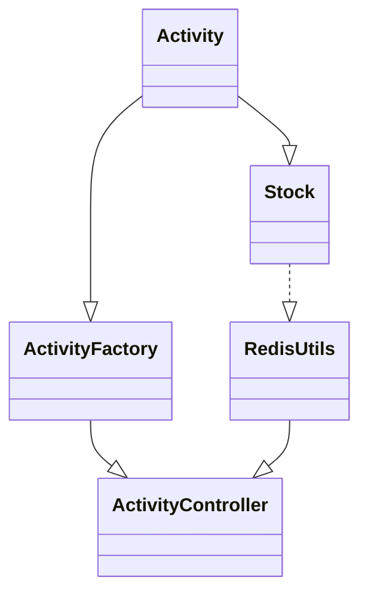

# Flyweight Pattern Practice: "Dựa trên doanh số flash sale của Redis, cung cấp các kịch bản truy vấn thông tin về hoạt động và hàng tồn kho"

## Giới thiệu

**Ngữ cảnh của một lập trình viên là gì?**

Rất nhiều lập trình viên chỉ quan tâm đến việc triển khai chức năng, chỉ cần hoàn thành yêu cầu là được, giống như việc nộp bài tập. Vấn đề này một phần là do nhiều người mới vẫn chưa hiểu rõ về sự phát triển nghề nghiệp của một lập trình viên, và một phần là vì lập trình chỉ là công việc chứ không phải là sở thích của họ. Tuy nhiên, đối với sự phát triển của một lập trình viên, nếu không thể xử lý tốt cả "văn bản trên" (sản phẩm) và "văn bản dưới" (kiểm thử), việc không hiểu rõ về doanh nghiệp và phát triển sản phẩm cũng như không thể viết code có cấu trúc hợp lý. Nếu không thể làm được điều này, trong suốt thời gian dài, từ 1 đến 3 năm, từ 3 đến 5 năm, sẽ rất khó để vượt qua các bậc thang phát triển kỹ thuật.

**Có khả năng chấp nhận và học hỏi kiến thức mới**

Bạn có cảm nhận rằng khi còn nhỏ, khả năng chấp nhận kiến thức mới rất mạnh mẽ, nhưng khi chúng ta bắt đầu trưởng thành, khả năng học, cách làm việc và tính cách dường như được cố định. Một phần là do tạo hình đặc điểm cá nhân của chúng ta, một phần là do các môi trường đã cố định. Nhưng cũng chính vì những thói quen này, chúng ta hiếm khi muốn lắng nghe ý kiến của người khác, giống như việc bất kể bạn nhìn thấy một bức tranh đầy đủ, nếu nó nằm ngoài tầm nhìn của bạn, bạn sẽ bỏ qua 80% nó. Do đó, khả năng không còn phát triển lớn.

**Làm thế nào để kỹ năng lập trình có thể phát triển nhanh nhất?**

Nhiều công việc giống như việc vặn ốc trong một nhà máy, phần lớn nội dung là lặp lại, bạn có thể tưởng tượng trong năm qua bạn đã đổi mới và học được bao nhiêu kỹ năng mới. Và lúc này, thường là để học nhiều hơn, bạn sẽ mua một số sách kỹ thuật, nhưng! Sách kỹ thuật khác với sách khác, chỉ cần đọc chúng mà không sử dụng sẽ không hiểu được, rất khó chấp nhận và hiểu. Giống như mẫu thiết kế, bạn có thể đã đọc vài lần, nhưng trong việc viết code thực tế, bạn vẫn ít sử dụng, và lý do chính là bạn không thực sự thực hành cùng với nó. Thực hành bản thân mới là cách tốt nhất để học lập trình.

## Môi trường phát triển

1. JDK 1.8
2. Idea + Maven
3. Code: [vanhung4499/practical-java-design](https://github.com/vanhung4499/practical-java-design)  

| Dự án             | Mô tả                                                                                            |
| ----------------- | ------------------------------------------------------------------------------------------------ |
| demo-design-11-01 | Triển khai yêu cầu kinh doanh một cách trực tiếp                                                 |
| demo-design-11-02 | Tái cấu trúc code bằng cách sử dụng mẫu thiết kế để giảm việc sử dụng bộ nhớ và thời gian truy vấn |

## Giới thiệu về Flyweight Pattern


Flyweight Pattern chủ yếu là để chia sẻ các đối tượng chung, giảm việc sử dụng bộ nhớ và tăng hiệu suất truy cập hệ thống. Các đối tượng chia sẻ này thường tiêu tốn nhiều bộ nhớ hoặc cần truy vấn một lượng lớn các giao diện hoặc tài nguyên cơ sở dữ liệu, do đó được rút gọn lại và sử dụng làm đối tượng chia sẻ.

Ngoài ra, Flyweight Pattern có thể phân chia thành hai loại: trên máy chủ và trên máy khách. Thông thường, trong các tình huống H5 và Web của Internet, hầu hết dữ liệu cần được xử lý bởi máy chủ, chẳng hạn như việc sử dụng database connection pool , việc sử dụng thread pool đa luồng, ngoài những chức năng này, còn có một số công việc cần được máy chủ bao bọc và xử lý trước khi gửi xuống máy khách, vì máy chủ cần thực hiện xử lý Flyweight. Tuy nhiên, trong một số tình huống trò chơi, nhiều thứ đều được máy khách cần phải vẽ, chẳng hạn như cây cối, hoa cỏ, cá và côn trùng, thông qua việc cài đặt các phần mô tả yếu tố khác nhau để sử dụng làm đối tượng chia sẻ, giảm bộ nhớ sử dụng, giúp trò chơi trên máy khách mượt mà hơn.

Trong việc triển khai mô hình Flyweight, cần sử dụng Flyweight Factory để quản lý các đối tượng độc lập này và các đối tượng chia sẻ, tránh việc phát sinh vấn đề an toàn đa luồng.

## Triển khai cơ bản

**Logic rất đơn giản, chỉ sợ bạn viết lộn. Các khối thông tin cố định và kết hợp với thông tin biến đổi, mọi nơi đều là CV!**

Thực tế, phần logic này của việc truy vấn trong hầu hết các trường hợp, nhiều lập trình viên thường trước tiên truy vấn thông tin cố định, sau đó sử dụng cách lọc hoặc thêm câu lệnh if để bổ sung thông tin biến đổi, tức là hàng tồn kho. Viết như vậy từ đầu không hề có vẻ gì là có vấn đề, nhưng với sự phát triển của phương pháp logic, sau này sẽ càng có nhiều code lặp lại.

### Cấu trúc Dự án

```shell
design-demo-11-01
├── pom.xml
└── src
    ├── main
    │   └── java
    │       └── com
    │           └── hnv99
    │               └── design
    │                   └── ActivityController.java
    └── test
        └── java
            └── com
                └── hnv99
                    └── design
                        └── ApiTest.java

```

- Cấu trúc dự án trên là khá đơn giản, chỉ có một lớp điều khiển để truy vấn thông tin hoạt động.

### Triển khai code

```java
public class ActivityController {

    public Activity queryActivityInfo(Long id) {
        // Giả lập việc lấy thông tin hoạt động từ giao diện ứng dụng doanh nghiệp thực tế
        Activity activity = new Activity();
        activity.setId(10001L);
        activity.setName("Đại tiệc Sách");
        activity.setDesc("Chương trình ưu đãi phiếu giảm giá sách tháng 2");
        activity.setStartTime(new Date());
        activity.setStopTime(new Date());
        activity.setStock(new Stock(1000, 1));
        return activity;
    }

}
```

- Ở đây, chúng ta mô phỏng việc truy vấn thông tin hoạt động từ giao diện ứng dụng doanh nghiệp thực tế. Cơ bản là lấy tất cả thông tin sản phẩm và hàng tồn kho từ cơ sở dữ liệu. Điều này hơi giống như hệ thống bán hàng sản phẩm ban đầu mà chúng ta đã viết, cơ sở dữ liệu có thể chịu được lượng mua hàng.
- Khi sau này cần mở rộng code để giao việc quản lý hàng tồn kho cho Redis do phát triển kinh doanh, thì chúng ta sẽ cần lấy thông tin tồn kho hoạt động từ Redis thay vì từ cơ sở dữ liệu, nếu không sẽ gây ra vấn đề không thống nhất dữ liệu.

## Tái cấu trúc theo Flyweight Pattern

"Tiếp theo, chúng ta sẽ sử dụng Flyweight Pattern để tối ưu code, cũng có thể coi đây là một lần tái cấu trúc nhỏ."

Flyweight Pattern thường không được sử dụng nhiều trong phát triển hàng ngày, ngoại trừ một số trường hợp như bể luồng, pool kết nối cơ sở dữ liệu, cũng như trong trò chơi khi cần render cảnh. Ý tưởng của mẫu thiết kế này là giảm việc sử dụng bộ nhớ và tăng hiệu suất, tương tự như mẫu Prototype mà chúng ta đã sử dụng trước đó, thực hiện việc tạo ra các đối tượng phức tạp bằng cách sao chép, giảm số lần gọi rpc, cũng là một ý tưởng tương tự.

### Cấu trúc dự án

```java
design-demo-11-02
├── pom.xml
└── src
    ├── main
    │   └── java
    │       └── com
    │           └── hnv99
    │               └── design
    │                   ├── Activity.java
    │                   ├── ActivityController.java
    │                   ├── ActivityFactory.java
    │                   ├── Stock.java
    │                   └── util
    │                       └── RedisUtils.java
    └── test
        └── java
            └── com
                └── hnv99
                    └── design
                        └── ApiTest.java
```

**Cấu trúc mô hình Flyweight**



- Bên trái là Flyweight Factory mà chúng tôi xây dựng để cung cấp dữ liệu hoạt động cố định, bên phải là kho dữ liệu tồn trên Redis.
- Cuối cùng, lớp điều khiển xử lý các thao tác truy vấn và cung cấp tất cả thông tin hoạt động và tồn kho. Vì tồn kho thay đổi, nên chúng tôi đã thiết lập một nhiệm vụ định kỳ trong RedisUtils để sử dụng tồn kho.

### Triển khai code

#### Thông tin hoạt động

```java
@Getter  
@Setter  
public class Activity {  
  
    private Long id;        // ID hoạt động  
    private String name;    // Tên hoạt động  
    private String desc;    // Mô tả hoạt động  
    private Date startTime; // Thời gian bắt đầu  
    private Date stopTime;  // Thời gian kết thúc  
    private Stock stock;    // Tồn kho hoạt động  
}
```

- Đối tượng ở đây khá đơn giản, chỉ là thông tin cơ bản của một hoạt động; id, tên, mô tả, thời gian và tồn kho.

#### Thông tin tồn kho

```java
@Getter  
@Setter  
@AllArgsConstructor  
public class Stock {  
  
    private int total; // Tổng số tồn kho  
    private int used;  // Số tồn kho đã sử dụng  
  
}
```

- Ở đây, chúng tôi cung cấp một lớp riêng để lưu trữ dữ liệu tồn kho.

#### Flyweight Factory

```java
public class ActivityFactory {

    static Map<Long, Activity> activityMap = new HashMap<Long, Activity>();

    public static Activity getActivity(Long id) {
        Activity activity = activityMap.get(id);
        if (null == activity) {
            // Giả lập việc lấy thông tin hoạt động từ ứng dụng kinh doanh thực tế từ giao diện API
            activity = new Activity();
            activity.setId(10001L);
            activity.setName("Sự kiện Sách vui vẻ");
            activity.setDesc("Chia sẻ code giảm giá sách để khuyến khích chia sẻ sự kiện giảm giá sách lần thứ hai");
            activity.setStartTime(new Date());
            activity.setStopTime(new Date());
            activityMap.put(id, activity);
        }
        return activity;
    }

}
```

- Ở đây cung cấp một Flyweight Factory, sử dụng cấu trúc dữ liệu `map` để lưu trữ các dữ liệu đã truy vấn từ cơ sở dữ liệu hoặc giao diện API, lưu vào bộ nhớ để có thể truy xuất trực tiếp trong lần tiếp theo.
- Cấu trúc như vậy thường khá phổ biến trong phát triển phần mềm, tuy nhiên, đôi khi để lấy dữ liệu phân tán, dữ liệu có thể được lưu trữ trong Redis, bạn có thể lựa chọn theo nhu cầu cụ thể.

#### 2.4 Lớp mô phỏng Redis

```java
public class RedisUtils {

    private ScheduledExecutorService scheduledExecutorService = Executors.newScheduledThreadPool(1);

    private AtomicInteger stock = new AtomicInteger(0);

    public RedisUtils() {
        scheduledExecutorService.scheduleAtFixedRate(() -> {
            // Giả lập việc tiêu thụ tồn kho
            stock.addAndGet(1);
        }, 0, 100000, TimeUnit.MICROSECONDS);

    }

    public int getStockUsed() {
        return stock.get();
    }

}
```

- Ở đây, ngoài lớp công cụ mô phỏng các hoạt động của `redis`, chúng tôi cũng cung cấp một nhiệm vụ định kỳ để mô phỏng việc sử dụng tồn kho. Điều này giúp chúng ta quan sát sự thay đổi trong tồn kho khi thực hiện kiểm thử.

#### 2.4 Lớp điều khiển hoạt động

```java
public class ActivityController {

    private RedisUtils redisUtils = new RedisUtils();

    public Activity queryActivityInfo(Long id) {
        Activity activity = ActivityFactory.getActivity(id);
        // Giả lập việc lấy thông tin biến đổi tồn kho từ Redis
        Stock stock = new Stock(1000, redisUtils.getStockUsed());
        activity.setStock(stock);
        return activity;
    }

}
```

- Trong lớp điều khiển hoạt động, chúng tôi sử dụng nhà máy Flyweight để lấy thông tin hoạt động và sau đó bổ sung thông tin tồn kho. Vì thông tin tồn kho thay đổi, trong khi thông tin hoạt động là cố định.
- Cuối cùng, thông tin hoạt động đã được đóng gói hoàn chỉnh sẽ được trả về cho bên gọi thông qua một lớp điều khiển thống nhất.

### Kiểm thử

#### Viết lớp kiểm tra

```java
public class ApiTest {  
  
    private Logger logger = LoggerFactory.getLogger(ApiTest.class);  
  
    private ActivityController activityController = new ActivityController();  
  
    @Test  
    public void testQueryActivityInfo() throws InterruptedException {  
        for (int idx = 0; idx < 10; idx++) {  
            Long req = 10001L;  
            Activity activity = activityController.queryActivityInfo(req);  
            logger.info("Kết quả kiểm tra: {} {}", req, JSON.toJSONString(activity));  
            Thread.sleep(1200);  
        }    
    }  
}
```

- Ở đây, chúng tôi sử dụng lớp điều khiển hoạt động để truy vấn thông tin hoạt động trong một vòng lặp `for`, thực hiện truy vấn hoạt động mười lần. Đồng thời, để đảm bảo sự thay đổi của nhiệm vụ định kỳ về tồn kho, chúng tôi thêm một thời gian ngủ, trong thực tế không có việc này.

#### Kết quả

```shell
2024-03-30 14:35:35.169	INFO	main		(ApiTest.java:19)	|	Kết quả kiểm tra: 10001 {"desc":"Chia sẻ mã giảm giá sách để khuyến khích chia sẻ sự kiện giảm giá sách lần thứ hai","id":10001,"name":"Sự kiện Sách vui vẻ","startTime":1711784135110,"stock":{"total":1000,"used":1},"stopTime":1711784135110}
2024-03-30 14:35:36.377	INFO	main		(ApiTest.java:19)	|	Kết quả kiểm tra: 10001 {"desc":"Chia sẻ mã giảm giá sách để khuyến khích chia sẻ sự kiện giảm giá sách lần thứ hai","id":10001,"name":"Sự kiện Sách vui vẻ","startTime":1711784135110,"stock":{"total":1000,"used":13},"stopTime":1711784135110}
2024-03-30 14:35:37.579	INFO	main		(ApiTest.java:19)	|	Kết quả kiểm tra: 10001 {"desc":"Chia sẻ mã giảm giá sách để khuyến khích chia sẻ sự kiện giảm giá sách lần thứ hai","id":10001,"name":"Sự kiện Sách vui vẻ","startTime":1711784135110,"stock":{"total":1000,"used":25},"stopTime":1711784135110}
2024-03-30 14:35:38.784	INFO	main		(ApiTest.java:19)	|	Kết quả kiểm tra: 10001 {"desc":"Chia sẻ mã giảm giá sách để khuyến khích chia sẻ sự kiện giảm giá sách lần thứ hai","id":10001,"name":"Sự kiện Sách vui vẻ","startTime":1711784135110,"stock":{"total":1000,"used":37},"stopTime":1711784135110}
2024-03-30 14:35:39.989	INFO	main		(ApiTest.java:19)	|	Kết quả kiểm tra: 10001 {"desc":"Chia sẻ mã giảm giá sách để khuyến khích chia sẻ sự kiện giảm giá sách lần thứ hai","id":10001,"name":"Sự kiện Sách vui vẻ","startTime":1711784135110,"stock":{"total":1000,"used":49},"stopTime":1711784135110}
2024-03-30 14:35:41.194	INFO	main		(ApiTest.java:19)	|	Kết quả kiểm tra: 10001 {"desc":"Chia sẻ mã giảm giá sách để khuyến khích chia sẻ sự kiện giảm giá sách lần thứ hai","id":10001,"name":"Sự kiện Sách vui vẻ","startTime":1711784135110,"stock":{"total":1000,"used":61},"stopTime":1711784135110}
2024-03-30 14:35:42.397	INFO	main		(ApiTest.java:19)	|	Kết quả kiểm tra: 10001 {"desc":"Chia sẻ mã giảm giá sách để khuyến khích chia sẻ sự kiện giảm giá sách lần thứ hai","id":10001,"name":"Sự kiện Sách vui vẻ","startTime":1711784135110,"stock":{"total":1000,"used":73},"stopTime":1711784135110}
2024-03-30 14:35:43.601	INFO	main		(ApiTest.java:19)	|	Kết quả kiểm tra: 10001 {"desc":"Chia sẻ mã giảm giá sách để khuyến khích chia sẻ sự kiện giảm giá sách lần thứ hai","id":10001,"name":"Sự kiện Sách vui vẻ","startTime":1711784135110,"stock":{"total":1000,"used":85},"stopTime":1711784135110}
2024-03-30 14:35:44.802	INFO	main		(ApiTest.java:19)	|	Kết quả kiểm tra: 10001 {"desc":"Chia sẻ mã giảm giá sách để khuyến khích chia sẻ sự kiện giảm giá sách lần thứ hai","id":10001,"name":"Sự kiện Sách vui vẻ","startTime":1711784135110,"stock":{"total":1000,"used":97},"stopTime":1711784135110}
2024-03-30 14:35:46.003	INFO	main		(ApiTest.java:19)	|	Kết quả kiểm tra: 10001 {"desc":"Chia sẻ mã giảm giá sách để khuyến khích chia sẻ sự kiện giảm giá sách lần thứ hai","id":10001,"name":"Sự kiện Sách vui vẻ","startTime":1711784135110,"stock":{"total":1000,"used":109},"stopTime":1711784135110}

```

- Các bạn có thể xem kỹ hơn phần stock của `stock`, phần này luôn thay đổi, các phần còn lại là thông tin hoạt động và cố định nên chúng ta sử dụng chế độ flyweight để phân chia cấu trúc như vậy.

## Tổng kết

- Khi thiết kế mẫu Flyweight, ta nên tập trung vào thiết kế nhà máy Flyweight. Trong các tình huống có nhiều đối tượng trùng lặp có thể tái sử dụng, việc sử dụng mẫu này giúp giảm thiểu việc gọi API từ máy chủ và giảm bộ nhớ sử dụng trên máy khách. Điều này là ứng dụng chính của mẫu thiết kế này.
- Ngoài ra, thông qua việc sử dụng cấu trúc `map`, chúng ta cũng thấy rằng việc sử dụng một ID cố định để lưu trữ và truy xuất đối tượng là rất quan trọng. Không chỉ sử dụng trong mẫu Flyweight, mà trong một số mẫu khác như Factory Pattern, Adapter Pattern, Composite Pattern, việc sử dụng cấu trúc `map` để lưu trữ dịch vụ để bên ngoài truy cập giúp giảm thiểu sự phụ thuộc vào các câu lệnh if-else.
- Tuy nhiên, ngoài các ưu điểm giảm sử dụng bộ nhớ, cũng có nhược điểm của mẫu này. Trong các tình huống xử lý kinh doanh phức tạp, không dễ dàng phân biệt giữa trạng thái nội và ngoại. Điều này giống như phần thông tin về hoạt động và phần thay đổi tồn kho. Nếu không thể phân chia một cách rõ ràng, việc thiết kế nhà máy Flyweight có thể trở nên rất lộn xộn và khó bảo trì.
