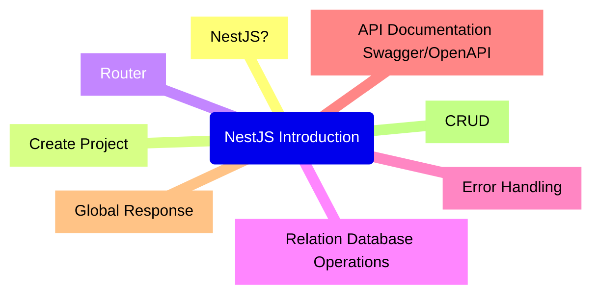

  

# NestJS thực chiến 1 - Khởi động

## Lời mở đầu

Gần đây tôi khá bận, và công việc hiện tại cũng không phù hợp để viết bài, nên lâu rồi không cập nhật bài viết...

Gần đây tôi nhận một yêu cầu nhỏ, cần thực hiện cả phần frontend và backend, tôi đã nghĩ đến dùng full TS cho cả FE và BE. Tôi đã sử dụng NestJS vài năm trước, nhưng những năm này thì tôi chủ yếu sử dụng Spring Boot là chính, nên tôi muốn nhớ lại và học thêm những cải tiến mới của `Nest.js`.

Tôi sẽ ghi lại quá trình thực hiện dự án nhỏ này và chia sẻ kinh nghiệm cho những bạn muốn học thêm. Các bài viết sẽ được trình bày theo tiến trình từ cơ bản đến nâng cao, không đi sâu ngay vào các điểm khó của `Nest.js`, nhưng mỗi chương sẽ có một số lưu ý phát triển và suy nghĩ của bản thân. Rất mong các cao nhân góp ý thêm.

> NestJS sử dụng TypeScript nên đương nhiên là bạn phải hiểu TS cơ bản trước. Bạn có thể tham khảo về các bài viết về TS trong wiki của tôi hoặc các nguồn khác.

## Tại sao chọn Nest.js?

Như đã đề cập, tôi đã từng dùng NestJS, mọi người đều nói rằng nó rất tuyệt, trước đây tôi cũng thấy thế. Nhưng mà tôi đã làm việc với Spring Boot rất nhiều! Quá quen và muốn đổi gió, biết càng nhiều càng tốt, biết đâu lại có thể áp dụng được vào các dự án khác yêu cầu dùng JS/TS.

Nói nhiều rồi, giờ bắt đầu thôi! Bài viết sẽ bao gồm các nội dung sau:



## Bắt đầu làm quen với Nest.js

Giới thiệu từ trang chủ Nest.js:

> Nest (NestJS) is a framework for building efficient, scalable [Node.js](https://nodejs.org/) server-side applications. It uses progressive JavaScript, is built with and fully supports [TypeScript](http://www.typescriptlang.org/) (yet still enables developers to code in pure JavaScript) and combines elements of OOP (Object Oriented Programming), FP (Functional Programming), and FRP (Functional Reactive Programming).
> 
> Under the hood, Nest makes use of robust HTTP Server frameworks like [Express](https://expressjs.com/) (the default) and optionally can be configured to use [Fastify](https://github.com/fastify/fastify) as well!
> 
> Nest provides a level of abstraction above these common Node.js frameworks (Express/Fastify), but also exposes their APIs directly to the developer. This gives developers the freedom to use the myriad of third-party modules which are available for the underlying platform.

Đoạn giới thiệu trên có thể ban đầu khó hiểu hết, nhưng chúng ta có thể rút ra vài điểm đặc trưng của Nest.js:

- Hỗ trợ TypeScript.
    
- Có thể dựa trên `Express` hoặc `Fastify`. Nếu bạn quen với `Express`, có thể sử dụng API của nó mà không gặp vấn đề gì.
    

Với những phần chưa hiểu, có thể tạm gác lại, vì không ảnh hưởng đến việc làm quen ban đầu. Sau này khi học sâu hơn, chúng ta sẽ phân tích thêm.
## Tạo dự án

Trước tiên, đảm bảo rằng bạn đã cài đặt `Node.js`, khi cài đặt `Node.js` sẽ đi kèm với `npx` và một chương trình chạy gói `npm`. Để tạo ứng dụng `Nest.js` mới, hãy chạy lệnh sau trên terminal:

```sh
npm i -g @nestjs/cli // Cài đặt Nest.js CLI
nest new project-name // Tạo dự án
```

Sau khi tạo dự án, hệ thống sẽ khởi tạo các tệp sau và hỏi bạn muốn dùng phương pháp nào để quản lý các gói phụ thuộc:

Nếu bạn đã cài `yarn` hoặc `pnpm`, có thể chọn `yarn`, `pnpm` để cài nhanh hơn. Ở đây tôi sử dụng `npm`, tuy nhiên đã bỏ qua phần chờ đợi lâu dài và cuối cùng cũng thành công (sau đó tôi đã xóa đi và dùng yarn, tốc độ thực sự nhanh hơn nhiều).

Tiếp theo, làm theo hướng dẫn để chạy dự án:

```sh
npm run start
```

Dưới đây là môi trường tôi đang sử dụng, các phiên bản API có thể có khác biệt theo phiên bản của Nest.js:

| Package    | Version  |
| ---------- | -------- |
| Node.js    | v20.13.1 |
| npm        | 10.5.2   |
| nest.js    | 10.4.5   |
| typescript | 5.6.3    |

> **Lưu ý:** `Nest.js` yêu cầu `Node.js` (>= 10.13.0, trừ v13), nếu phiên bản `Node.js` của bạn không đáp ứng yêu cầu, có thể dùng công cụ quản lý gói `nvm` để cài đặt phiên bản `Node.js` phù hợp.

### Cấu trúc dự án

Khi vào dự án, cấu trúc thư mục sẽ trông như sau:


Giải thích đơn giản về các tệp cốt lõi:

```sh
src
├── app.controller.spec.ts
├── app.controller.ts
├── app.module.ts
├── app.service.ts
├── main.ts
```

| Tệp                      | Chức năng                                                                                    |
| ------------------------ | -------------------------------------------------------------------------------------------- |
| `app.controller.ts`      | Controller cơ bản cho một route.                                                             |
| `app.controller.spec.ts` | Unit test cho controller.                                                                    |
| `app.module.ts`          | Module gốc của ứng dụng.                                                                     |
| `app.service.ts`         | Service cơ bản có một phương thức duy nhất.                                                  |
| `main.ts`                | Entry của ứng dụng, dùng hàm cốt lõi `NestFactory` để tạo một instance của Nest Application. |
### Tạo API đầu tiên

Trước đó, chúng ta đã khởi động dịch vụ. Vậy làm thế nào để kiểm tra? Đầu tiên là tìm tệp đầu vào `main.ts`

```ts
import { NestFactory } from '@nestjs/core';
import { AppModule } from './app.module';

async function bootstrap() {
  const app = await NestFactory.create(AppModule);
  await app.listen(3000);
}
bootstrap();
```

Nội dung khá đơn giản: sử dụng hàm `NestFactory` của `Nest.js` để tạo một phiên bản `AppModule`, khởi động bộ lắng nghe HTTP, để lắng nghe các yêu cầu tại cổng được xác định trong `main.ts`.

> Cổng lắng nghe có thể được tùy chỉnh. Nếu cổng 3000 bị sử dụng bởi một dự án khác, bạn có thể đổi thành một cổng khác. Vì cổng 3000 của tôi đã được dùng cho dự án khác, tôi đổi thành cổng 9080 và khởi động lại dự án.

Chúng ta mở trình duyệt và truy cập địa chỉ `http://localhost:9080`:


Ở đây, dòng `Hello World` là nội dung trả về từ địa chỉ `http://localhost:9080`. Để chắc chắn, chúng ta cũng có thể dùng Postman kiểm tra:


Vậy là `Nest.js` đã mặc định tạo ra một ví dụ API, chúng ta sẽ sử dụng ví dụ này để hiểu cách triển khai một API.

Ở phần trước, `main.ts` không có tệp nào được nhập vào ngoài `AppModule`. Mở `src/app.module.ts`:

```ts
import { Module } from '@nestjs/common';
import { AppController } from './app.controller';
import { AppService } from './app.service';

@Module({
  imports: [],
  controllers: [AppController],
  providers: [AppService],
})
export class AppModule {}
```

`AppModule` là module gốc của ứng dụng, cung cấp cơ chế khởi động cho ứng dụng và có thể bao gồm nhiều module chức năng.

Tệp `.module` cần sử dụng một lớp với decorator `@Module()`. Decorator có thể hiểu là một hàm được đóng gói sẵn. `@Module()` có bốn thuộc tính: `providers`, `controllers`, `imports`, và `exports`.

* providers: Các nhà cung cấp dịch vụ, xử lý logic nghiệp vụ và có thể được chia sẻ giữa các module.
* controllers: Xử lý các yêu cầu HTTP, bao gồm điều khiển định tuyến, trả về phản hồi cho client và ủy thác logic nghiệp vụ cho providers xử lý.
* imports: Danh sách các module được nhập vào.
* exports: Danh sách các dịch vụ được xuất ra, cho phép các module khác sử dụng.

Nếu bạn quen với Vue hoặc React, ban đầu `Nest.js` có thể hơi lạ. Trên thực tế, NestJS ban đầu thực sự hơi khó hiểu. Nhưng nếu bạn từng dùng qua `Angular`, bạn sẽ thấy quen thuộc. Còn nếu bạn quen với Java, Spring thì có thể bạn sẽ suy nghĩ NestJS là bản sao của Spring Boot phải không?

Thật vậy, `Angular`, `Spring` và `NestJS` đều được thiết kế dựa trên nguyên tắc `Inversion of Control` (đảo ngược điều khiển) và sử dụng `dependency injection` để giải quyết vấn đề kết nối. Nếu bạn cảm thấy bối rối, đừng lo lắng, những câu hỏi này sẽ được giải thích từng vấn đề một trong bài viết sau này. Ở đây chúng ta vẫn làm theo ví dụ tương tự và tìm hiểu cách sử dụng Nest.

Trong `app.module.ts`, bạn sẽ thấy `app.controller.ts` và `app.service.ts` được nhập vào, chúng ta sẽ kiểm tra từng tệp này:

```ts
// app.controller.ts
import { Controller, Get } from '@nestjs/common';
import { AppService } from './app.service';

@Controller()
export class AppController {
  constructor(private readonly appService: AppService) {}

  @Get()
  getHello(): string {
    return this.appService.getHello();
  }
}
```

Sử dụng decorator `@Controller` để định nghĩa controller, và decorator `@Get` để chỉ định rằng phương thức `getHello` sẽ được gọi khi có yêu cầu GET.

```ts
// app.service.ts
import { Injectable } from '@nestjs/common';

@Injectable()
export class AppService {
   getHello(): string {
    return 'Hello World!';
  }
}
```

Như trên, `AppService` được sửa dụng với decorator `@Injectable`, sau khi đăng ký trong `AppModule`, chúng ta không cần dùng `new AppService()` để khởi tạo, mà có thể sử dụng trực tiếp. Đây là dependency ijection.

Vậy là chúng ta đã hiểu logic phía sau API `http://localhost:9080/` trả về `Hello World`. Trên cơ sở này, chúng ta sẽ tìm hiểu chi tiết cách sử dụng định tuyến trong `Nest.js`.
## Route Decorator

Trong `Nest.js`, không có nơi riêng để cấu hình bộ định tuyến, thay vào đó sử dụng các decorator. `Nest.js` định nghĩa một số decorator để xử lý định tuyến.

### @Controller

Mỗi lớp muốn trở thành controller đều cần được trang bị decorator `@Controller`. Decorator này có thể nhận một tham số đường dẫn, làm đường dẫn chính để truy cập vào controller đó.

Chỉnh sửa tệp `app.controller.ts`:

```typescript
// Đường dẫn chính là app
@Controller("app")
export class AppController {
  constructor(private readonly appService: AppService) {}
  
  @Get()
  getHello(): string {
    return this.appService.getHello();
  }
}
```

Sau đó, **khởi động lại dịch vụ**, lúc này truy cập vào `http://localhost:9080/` sẽ thấy 404.

Đó là vì đường dẫn của controller đã được thay đổi thành `app` thông qua `@Controller("app")`. Giờ đây có thể truy cập qua `http://localhost:9080/app`.

### Decorator xử lý phương thức HTTP

Các decorator như `@Get`, `@Post`, `@Put` được sử dụng để xử lý các phương thức HTTP tương ứng, có thể phản hồi lại các yêu cầu HTTP. Các decorator này cũng có thể nhận một chuỗi hoặc một mảng chuỗi làm tham số, trong đó chuỗi có thể là đường dẫn cố định hoặc ký tự đại diện.

Tiếp tục chỉnh sửa `app.controller.ts`, ví dụ:

```typescript
// Đường dẫn chính là app
@Controller("app")
export class AppController {
  constructor(private readonly appService: AppService) {}

  // 1. Đường dẫn cố định
  // Khớp với yêu cầu GET, http://localhost:9080/app/list
  @Get("list")
  getHello(): string {...}

  // Khớp với yêu cầu POST, http://localhost:9080/app/list
  @Post("list")
  create(): string {...}

  // 2. Đường dẫn có ký tự đại diện
  // Khớp với yêu cầu GET, http://localhost:9080/app/user_xxx
  @Get("user_*")
  getUser() { return "getUser"; }

  // 3. Đường dẫn có tham số
  // Khớp với yêu cầu PUT, http://localhost:9080/app/list/xxxx
  @Put("list/:id")
  update() { return "update"; }
}
```

Vì đã chỉnh sửa file, cần khởi động lại để thấy các tuyến. Để tránh phải khởi động lại mỗi lần chỉnh sửa, `Nest.js` đã có sẵn cấu hình tự động khởi động lại bằng cách chạy:

```sh
npm run start:dev
```

Lúc này, mỗi khi chỉnh sửa và lưu lại, dịch vụ sẽ tự động khởi động lại.

Một lưu ý quan trọng về thứ tự khi khớp các tuyến: nếu có một yêu cầu PUT, đường dẫn là `/app/list/user`, khi thêm phương thức mới trong `app.controller.ts` như sau:

```typescript
@Put("list/user")
updateUser() { return { userId: 1 }; }
```

Bạn có nghĩ rằng tuyến đường này sẽ được kết hợp? Hãy kiểm tra nó:


Thử kiểm tra sẽ thấy `/app/list/user` không khớp với `updateUser` mà lại khớp với `update`. Vì vậy, `@Put("list/user")` nên được viết trước `@Put("list/:id")` để đảm bảo thứ tự khớp chính xác.

### Tiền tố đường dẫn toàn cục

Ngoài các decorator có thể thiết lập tuyến, chúng ta có thể đặt tiền tố đường dẫn toàn cục. Ví dụ: thêm tiền tố `/api` cho tất cả các tuyến. Thay đổi tệp `main.ts`:

```typescript
async function bootstrap() {
  const app = await NestFactory.create(AppModule);
  app.setGlobalPrefix('api'); // Thiết lập tiền tố toàn cục
  await app.listen(9080);
}
bootstrap();
```

Lúc này, các tuyến cũ cần thay đổi thành:

```
http://localhost/api/xxxx
```

## Viết mã

Trước khi viết mã, chúng ta hãy giới thiệu một số lệnh hữu ích mà `nest-cli` cung cấp:


```sh
//Cú pháp
nest g [loại tập tin] [tên tập tin] [thư mục tập tin]
```

*   Tạo module
    

> nest g mo posts Tạo một module `posts`. Nếu không chỉ định thư mục, mặc định sẽ tạo một thư mục `posts` có cùng tên với tập tin và tạo ra tập tin `posts.module.ts` trong thư mục này.


```typescript
// src/posts/posts.module.ts
import { Module } from '@nestjs/common';
@Module({})
export class PostsModule {}
```

Sau khi thực hiện lệnh, chúng ta có thể thấy module `PostsModule` này cũng đã được thêm vào trong module gốc `app.module.ts` và được thêm vào phần `imports` trong decorator `@Module`.

```typescript
import { Module } from '@nestjs/common';
import { AppController } from './app.controller';
import { AppService } from './app.service';
import { PostsModule } from './posts/posts.module';

@Module({
  controllers: [AppController],
  providers: [AppService],
  imports: [PostsModule],
})
export class AppModule {}
```

*   Tạo controller
    

> nest g co posts

Lệnh này sẽ tạo một controller `posts`, đặt tên là `posts.controller.ts` và kèm theo một tập tin kiểm thử đơn vị cho controller này.

```typescript
// src/posts/posts.controller.ts
import { Controller } from '@nestjs/common';

@Controller('posts')
export class PostsController {}
```

Sau khi thực hiện lệnh, tập tin `posts.module.ts` sẽ tự động nhập `PostsController` và nó được tiêm vào phần `controllers` trong decorator `@Module`.

*   Tạo lớp dịch vụ
    

> nest g service posts

```typescript
// src/posts/posts.service.ts
import { Injectable } from '@nestjs/common';

@Injectable()
export class PostsService {}
```

Tạo tập tin `app.service.ts`, và trong tập tin `app.module.ts`, lớp này sẽ được tiêm vào phần `providers` trong decorator `@Module`.

Thực tế, `nest-cli` cung cấp rất nhiều lệnh tạo khác nhau, ví dụ như tạo bộ lọc (filter), bộ đánh chặn (interceptor), và middleware. Tuy nhiên, hiện tại chúng ta chưa cần sử dụng đến, do đó sẽ được giới thiệu thêm ở các chương sau khi cần thiết.

> **Chú ý thứ tự tạo**: Nên tạo `Module` trước, sau đó tạo `Controller` và `Service`, như vậy các tập tin được tạo ra sẽ được tự động đăng ký trong `Module`. Nếu tạo `Module` sau cùng, `Controller` và `Service` sẽ được đăng ký trong `app.module.ts` bên ngoài. Bạn cũng có thể sử dụng lệnh `nest g resource posts` để nhanh chóng tạo `Controller`, `Service`, `Module` và `DTO`.

Xem qua cấu trúc thư mục hiện tại:


## Kết nối với MySQL

Khi các route đã hoạt động, để dự án hoàn thiện thì cần phải có cơ sở dữ liệu. Nếu không có thì dự án backend này sẽ không khác gì một trang tĩnh tự làm và không có tính năng.

Cơ sở dữ liệu được sử dụng ở đây là MySQL, vì hầu hết các dự án thực tế vẫn chọn MySQL. Vì đây là hướng dẫn từ đầu nên phần này sẽ bao gồm các bước cài đặt, kết nối và sử dụng cơ sở dữ liệu, cũng như giải quyết những lỗi có thể gặp phải trong quá trình này. Nếu bạn đã có kinh nghiệm thì có thể bỏ qua phần này.

### Cài đặt Cơ Sở Dữ Liệu

Nếu máy tính của bạn chưa cài đặt MySQL, và bạn cũng không có cơ sở dữ liệu trên đám mây, bạn có 2 phương án: MySQL local hoặc Docker Container. 

> Nội dung tiếp dưới đây yêu cầu bạn cần có Docker và Docker Compose, hãy cài đặt chúng trước! 
> 
> Vì bài viết này không phải nói về docker nên mình chỉ lướt qua cơ bản làm sao tạo ra database để sử dụng, không bàn về docker quá nhiều! Nhưng chắc chắn bạn nên và phải biết docker và docker compose nếu là backend developer!

Ở thời điểm này thì gần như sử dụng được Docker sẽ là bắt buộc đối với backend developer, nên tôi sẽ áp dụng nó ở đây. Nếu bạn chưa biết cũng không sao, hãy xem qua nó rất dễ hiểu và tiện lợi so với việc cài đặt cấu hình thủ công.

```sh
// Pull mysql image from docker hub
docker pull mysql:8.0

// Run a container
docker run --name mysql -e MYSQL_ROOT_PASSWORD=secret -e MYSQL_DATABASE=blog -p 3306:3306 -d mysql:8.0
```

- Lệnh đầu để pull image trước từ docker hub
- Lệnh sau là tạo một container mysql từ image đã pull trước đó, trong đó có các tham số:
	- `--name mysql` : tên container
	- `-e MYSQL_ROOT_PASSWORD=secret`: root password cho mysql
	- `-p 3306:3306`: port giao tiếp với mysql trong docker
	- `mysql:8.0`: image được sử dụng để tạo container

Chạy xong lệnh trên, chúng ta sẽ có ngay một mysql instance sử dụng như bình thường mà không cần phải đi cài mysql local. Nhưng mà lệnh trên vẫn hơi khó nhớ và khó nhìn, hãy tiếp tục với docker-compose như sau:

```sh
// Crate a docker compose file
touch docker-compose.yml
```

Sửa nội dung file docker compose như sau:

```yml
services:  
  mysql:  
    image: mysql:8.0  
    container_name: mysql  
    environment:  
      MYSQL_ROOT_PASSWORD: secret
      MYSQL_DATABASE: blog  
    ports:  
      - "3306:3306"
```

```sh
// Run all container
docker compose up
```

Ok, nó trông dễ viết dễ nhìn hơn rồi đấy. Các tham số thì giống như phía trên đã mô tả. Nó khác với việc chạy từng lệnh Docker để tạo từng container, với một file docker-compose chứa thông tin cho tất cả các container, docker-compose sẽ tự động tìm và khởi tạo tất cả cho bạn, tất nhanh và tiện.

Tiếp theo, sử dụng một công cụ quản lý cơ sở dữ liệu trực quan, bạn có thể chọn `dbeaver` hoặc `Navicat Premium`, ... Tùy theo thói quen của các bạn, dùng cái nào cũng được còn tôi sử dụng `Navicat`. Tạo một Connection với kiểu MySQL:
- Name tuỳ chọn
- Host để nguyên `localhost` hoặc `127.0.0.1` (vì đang local mà)
- Port `3306` (theo port đã cấu hình trên docker)
- Username `root` (nãy chỉ đặt root password)
- Password `secret` (nãy đặt thế nào dùng thế ấy)

Sau kết nối, cơ sở dữ liệu `blog` đã hiện sẵn nhưng vẫn chưa có gì bên trong. Chúng ta có thể tạo bảng thủ công tại đây hoặc sử dụng mã để tạo bảng sau.

### Kết nối cơ sở dữ liệu với TypeORM

#### Kiến thức nền tảng

Đầu tiên, hãy nói sơ lược về ORM là gì?

Nếu chúng ta sử dụng trực tiếp `Node.js` để làm việc với api `mysql` cung cấp, mã chúng ta viết sẽ ở mức khá thấp. Ví dụ, một đoạn mã chèn dữ liệu sẽ như sau:

```javascript
// Chèn dữ liệu vào cơ sở dữ liệu 
connection.query(`INSERT INTO posts (title, content) VALUES ('${title}', '${content}')`, 
  (err, data) => { 
    if (err) { 
      console.error(err) 
    } else { 
      console.log(data) 
    } 
  }
);
```

Xét rằng bảng dữ liệu là một bảng hai chiều, bao gồm nhiều hàng và nhiều cột, ví dụ bảng `posts`:

```sql
mysql> select * from posts;
+----+-------------+-----------------+
| id | title       | content         |
+----+-------------+-----------------+
| 1  | Nest.js Intro | Introduction to NestJS    |
+----+-------------+-----------------+
```

Mỗi hàng trong bảng có thể được biểu diễn như một đối tượng JavaScript. Ví dụ, hàng đầu tiên có thể viết như sau:

```javascript
{ 
  id: 1, 
  title: "Nest.js Intro", 
  content: "Introduction to NestJS" 
}
```

Đây chính là công nghệ ORM (Object-Relational Mapping), biến cấu trúc bảng dữ liệu quan hệ thành các đối tượng.

Do đó, các framework ORM như `Sequelize`, `typeORM`, và `Prisma` ra đời để thực hiện việc chuyển đổi này. (PS: `Prisma` hiện rất được ưa chuộng; nếu thích khám phá, bạn có thể thử dùng). Trong bài này, chúng ta chọn `typeORM` để làm việc với cơ sở dữ liệu. Nhờ vậy, việc đọc/ghi dữ liệu chỉ cần làm việc với các đối tượng JavaScript. Ví dụ, câu lệnh chèn phía trên có thể viết lại như sau:

```javascript
await connection.getRepository(Posts).save({ title: "Nest.js Intro", content: "Introduction to NestJS" });
```

Tiếp theo, chúng ta sẽ chính thức sử dụng typeORM để thao tác với cơ sở dữ liệu. Đầu tiên, cài đặt các gói cần thiết:

```bash
npm install --save @nestjs/typeorm typeorm mysql2
```

NestJS cung cấp hai cách để kết nối cơ sở dữ liệu. Dưới đây là từng cách cụ thể:

**Cách 1**

Đầu tiên, tạo hai tập tin `.env` và `.env.prod` ở thư mục gốc của dự án, lần lượt chứa biến môi trường cho môi trường dev và prod:

```env
# Database  
DB_HOST=localhost  
DB_PORT=3306  
DB_USER=root  
DB_PASSWD=root  
DB_DATABASE=blog
```

Trong `.env.prod`, chứa thông tin cơ sở dữ liệu dùng khi triển khai lên server. Để đảm bảo an toàn, nên thêm tệp này vào `.gitignore` khi quản lý dự án trên git.

Tiếp theo, tạo một thư mục `config` ở cấp thư mục gốc (ngang hàng với `src`), và một tệp `env.ts` để đọc cấu hình phù hợp với môi trường hiện tại.

```typescript
import * as fs from 'fs';
import * as path from 'path';
const isProd = process.env.NODE_ENV === 'production';

function parseEnv() {
  const localEnv = path.resolve('.env');
  const prodEnv = path.resolve('.env.prod');
  if (!fs.existsSync(localEnv) && !fs.existsSync(prodEnv)) {
    throw new Error('Thiếu tập tin cấu hình môi trường');
  }
  const filePath = isProd && fs.existsSync(prodEnv) ? prodEnv : localEnv;
  return { path: filePath };
}

export default parseEnv();
```

Cần cài đặt thêm config module ở đây để tương tác với env.

```bash
npm i --save @nestjs/config
```

Sau đó, trong `app.module.ts` kết nối với cơ sở dữ liệu:

```typescript
import { TypeOrmModule } from '@nestjs/typeorm';
import { ConfigService, ConfigModule } from '@nestjs/config';
import envConfig from '../config/env';

@Module({
  imports: [
    ConfigModule.forRoot({
      isGlobal: true,  // thiết lập là global
      envFilePath: [envConfig.path]
    }),
    TypeOrmModule.forRootAsync({
      imports: [ConfigModule],
      inject: [ConfigService],
      useFactory: async (configService: ConfigService) => ({
        type: 'mysql', // loại cơ sở dữ liệu
        entities: [],  // thực thể dữ liệu
        host: configService.get('DB_HOST', 'localhost'), // máy chủ, mặc định là localhost
        port: configService.get<number>('DB_PORT', 3306), // cổng
        username: configService.get('DB_USER', 'root'),   // tên người dùng
        password: configService.get('DB_PASSWORD', 'root'), // mật khẩu
        database: configService.get('DB_DATABASE', 'blog'), // tên cơ sở dữ liệu
        timezone: '+08:00', // múi giờ máy chủ
        synchronize: true, // tự động tạo bảng từ thực thể, nên tắt trong môi trường prod
      }),
    }),
    PostsModule,
  ],
  ...
})
export class AppModule {}
```

Để làm việc với biến môi trường, nên dùng `@nestjs/config` của NestJS vì cấu hình sẵn sàng. Một số lưu ý:

- `@nestjs/config` phụ thuộc vào dotenv, cho phép sử dụng biến môi trường theo dạng key=value. NestJS sẽ tự động tải `.env` ở thư mục gốc.
- Chỉ cần thêm `ConfigModule.forRoot()` trong `app.module.ts` và dùng `ConfigService` để đọc biến cấu hình.

`TypeORM` còn hỗ trợ nhiều cách kết nối khác, dưới đây là một ví dụ sử dụng `ormconfig.json`:

**Cách 2**

Tạo tập tin `ormconfig.json` (cùng cấp với `src`) chứa cấu hình cơ sở dữ liệu thay vì truyền vào `forRoot()`.

```json
{
  "type": "mysql",
  "host": "localhost",
  "port": 3306,
  "username": "root",
  "password": "root",
  "database": "blog",
  "entities": ["dist/**/*.entity{.ts,.js}"],
  "synchronize": true
}
```

Sau đó trong `app.module.ts`, gọi `forRoot()` mà không cần bất kỳ tùy chọn nào:

```typescript
import { Module } from '@nestjs/common';
import { TypeOrmModule } from '@nestjs/typeorm';

@Module({
  imports: [TypeOrmModule.forRoot()],
})
export class AppModule {}
```

Xong! Nếu kết nối thất bại, sẽ xuất hiện thông báo lỗi như sau:


Kiểm tra lại cấu hình cơ sở dữ liệu của bạn.
### CRUD

Tiếp theo là thao tác dữ liệu. Như đã đề cập, chúng ta sẽ tạo bảng thông qua mã. `TypeORM` sẽ ánh xạ các thực thể vào bảng trong cơ sở dữ liệu, vì vậy chúng ta sẽ tạo một thực thể bài viết `PostsEntity`. Trong thư mục `posts`, tạo tệp `posts.entity.ts` như sau:

```typescript
//    posts/posts.entity.ts
import { Column, Entity, PrimaryGeneratedColumn } from "typeorm";

@Entity("posts")
export class PostsEntity {
    @PrimaryGeneratedColumn()
    id: number; // Đánh dấu là primary key, giá trị tự động sinh

    @Column({ length: 50 })
    title: string;

    @Column({ length: 20 })
    author: string;

    @Column("text")
    content: string;

    @Column({ default: '' })
    thumb_url: string;

    @Column('tinyint')
    type: number;

    @Column({ type: 'timestamp', default: () => "CURRENT_TIMESTAMP" })
    create_time: Date;

    @Column({ type: 'timestamp', default: () => "CURRENT_TIMESTAMP" })
    update_time: Date;
}
```

Sau đó, thực hiện các thao tác `CRUD` trong tệp `posts.service.ts`. Bảng này không phải là bảng bài viết cuối cùng mà chỉ nhằm để thực hiện các thao tác thêm, sửa, xóa, tìm kiếm đơn giản. Sau này sẽ thêm các liên kết phức tạp giữa nhiều bảng.

```typescript
import { HttpException, Injectable } from '@nestjs/common';
import { InjectRepository } from '@nestjs/typeorm';
import { getRepository, Repository } from 'typeorm';
import { PostsEntity } from './posts.entity';

export interface PostsRo {
  list: PostsEntity[];
  count: number;
}

@Injectable()
export class PostsService {
  constructor(
    @InjectRepository(PostsEntity)
    private readonly postsRepository: Repository<PostsEntity>,
  ) {}

  // Tạo bài viết
  async create(post: Partial<PostsEntity>): Promise<PostsEntity> {
    const { title } = post;
    if (!title) {
      throw new HttpException('Thiếu tiêu đề bài viết', 401);
    }
    const doc = await this.postsRepository.findOne({ where: { title } });
    if (doc) {
      throw new HttpException('Bài viết đã tồn tại', 401);
    }
    return await this.postsRepository.save(post);
  }

  // Lấy danh sách bài viết
  async findAll(query): Promise<PostsRo> {
    const qb = await getRepository(PostsEntity).createQueryBuilder('post');
    qb.where('1 = 1');
    qb.orderBy('post.create_time', 'DESC');
    const count = await qb.getCount();
    const { pageNum = 1, pageSize = 10, ...params } = query;
    qb.limit(pageSize);
    qb.offset(pageSize * (pageNum - 1));
    const posts = await qb.getMany();
    return { list: posts, count: count };
  }

  // Tìm bài viết theo ID
  async findById(id): Promise<PostsEntity> {
    return await this.postsRepository.findOne(id);
  }

  // Cập nhật bài viết
  async updateById(id, post): Promise<PostsEntity> {
    const existPost = await this.postsRepository.findOne(id);
    if (!existPost) {
      throw new HttpException(`Bài viết với ID ${id} không tồn tại`, 401);
    }
    const updatePost = this.postsRepository.merge(existPost, post);
    return this.postsRepository.save(updatePost);
  }

  // Xóa bài viết
  async remove(id) {
    const existPost = await this.postsRepository.findOne(id);
    if (!existPost) {
      throw new HttpException(`Bài viết với ID ${id} không tồn tại`, 401);
    }
    return await this.postsRepository.remove(existPost);
  }
}
```

Sau khi lưu tệp, có thể gặp lỗi báo `PostsEntity` chưa được nhập:


Trong `posts.module.ts`, nhập `PostsEntity` như sau:

```typescript
import { TypeOrmModule } from '@nestjs/typeorm';

@Module({
  imports: [TypeOrmModule.forFeature([PostsEntity])],
  ...
})
```

Nếu đang kết nối cơ sở dữ liệu bằng cách đầu tiên, có thể gặp lỗi "Không tìm thấy thực thể PostsEntity":

> No repository for "PostsEntity" was found. Looks like this entity is not registered in current "default" connection!
 
Do khi kết nối cơ sở dữ liệu chưa đăng ký thực thể này, cần thêm nó vào `app.module.ts`:


Cuối cùng, để thiết lập các tuyến đường REST cho các thao tác CRUD, thực hiện cấu hình trong `posts.controller.ts`:

```typescript
import { PostsService, PostsRo } from './posts.service';
import { Body, Controller, Delete, Get, Param, Post, Put, Query } from '@nestjs/common';

@Controller('post')
export class PostsController {
    constructor(private readonly postsService: PostsService) {}

    /** Tạo bài viết */
    @Post()
    async create(@Body() post) {
        return await this.postsService.create(post);
    }

    /** Lấy tất cả bài viết */
    @Get()
    async findAll(@Query() query): Promise<PostsRo> {
        return await this.postsService.findAll(query);
    }

    /** Lấy bài viết theo ID */
    @Get(':id')
    async findById(@Param('id') id) {
        return await this.postsService.findById(id);
    }

    /** Cập nhật bài viết */
    @Put(":id")
    async update(@Param("id") id, @Body() post) {
        return await this.postsService.updateById(id, post);
    }

    /** Xóa bài viết */
    @Delete("id")
    async remove(@Param("id") id) {
        return await this.postsService.remove(id);
    }
}
```
### Những vấn đề gặp phải khi thao tác với cơ sở dữ liệu

1. **Thay thế mạnh thực thể, tự dưng xóa bảng, xóa dữ liệu**

   Ví dụ với thực thể mà chúng ta đã thiết lập ở trên:

   ```typescript
   export class PostsEntity { 
       @PrimaryGeneratedColumn() 
       id: number; 
       @Column() 
       title: string;
   }
   ```

   Ban đầu, khi tôi thiết kế bảng và trường `title`, tôi đặt loại dữ liệu là `string`, tương ứng với `varchar(255)` trong cơ sở dữ liệu. Sau đó, tôi thấy không hợp lý nên giới hạn độ dài thành `varchar(50)`, bằng cách thay đổi đoạn mã như sau:

   ```typescript
   @Column({length: 50}) 
   title: string;
   ```

   Sau khi lưu lại mã, kết quả là tất cả các `title` trong cơ sở dữ liệu của tôi đều bị xóa trống. Đây là một lỗi mà ai gặp phải mới biết mức độ rủi ro của nó.

2. **Ba cách thiết lập `entities`**

   Vấn đề này chúng ta đã gặp ở phần trước, đó là mỗi khi tạo một thực thể mới, bạn phải nhập lại trong phần kết nối cơ sở dữ liệu, rất dễ bị sót. `TypeORM` cung cấp ba cách cấu hình, mỗi cách đều có ưu và nhược điểm riêng:

   **Cách 1: Định nghĩa từng cái một**

   ```typescript
   TypeOrmModule.forRoot({
     //...
     entities: [PostsEntity, UserEntity],
   }),
   ```

   Cách này bạn cần nhập từng thực thể, nếu có nhiều thực thể thì sẽ rất phiền phức và dễ quên.

   **Cách 2: Tự động tải**

   ```typescript
   TypeOrmModule.forRoot({
     //...
     autoLoadEntities: true,
   }),
   ```

   Tự động tải các thực thể, mỗi thực thể đã đăng ký bằng `forFeature()` sẽ được tự động thêm vào mảng `entities` trong cấu hình. Đây là cách tôi khuyến nghị và thường sử dụng trong phát triển thực tế.

   **Cách 3: Cấu hình tự động nạp từ đường dẫn**

   ```typescript
   TypeOrmModule.forRoot({
     //...
     entities: ['dist/**/*.entity{.ts,.js}'],
   }),
   ```

   Thêm các thực thể từ đường dẫn cấu hình. Tuy nhiên, cách này không được khuyến nghị vì có thể dẫn đến lỗi khó kiểm soát. Dưới đây là vấn đề tôi đã gặp phải:

   1. Tôi viết một thực thể `Category`, sau đó muốn thêm thực thể `Tag`.
   2. Tôi sao chép `category.entity.ts` vào thư mục `tag` và đổi tên thành `tag.entity.ts`.
   3. Tôi đã thay đổi các thuộc tính bên trong nhưng lại quên đổi tên lớp.
   4. Kết quả là bảng `category` bị xóa sạch dữ liệu.

   Vì vậy, nếu bạn làm việc với một cơ sở dữ liệu trống, bạn có thể thoải mái thử nghiệm. Nhưng nếu cơ sở dữ liệu của bạn đã có dữ liệu, hãy cẩn thận. Khi kết nối cơ sở dữ liệu, hãy đảm bảo đặt `synchronize: false` để tránh mất dữ liệu.

Đến đây, chúng ta đã hoàn thành các thao tác CRUD cơ bản với cơ sở dữ liệu. Đơn giản phải không? Hãy thử dùng Postman để kiểm tra các endpoint.

Với tư cách là một lập trình viên front-end, nếu bạn gặp API thế này, bạn sẽ vui chứ? Có lẽ trong lòng sẽ ngán ngẩm bộ phận back-end không ít lần! (vd: trạng thái mã yêu cầu không chuẩn, định dạng dữ liệu trả về không hợp lý...). Vì vậy, hãy cải thiện ngay để tránh gây phiền phức cho người khác.
## Định dạng Global Response

> Trong phát triển thông thường, không nên dựa vào mã trạng thái `HTTP` để xác định yêu cầu thành công hay thất bại mà sẽ dựa vào dữ liệu trả về, thêm trường `code` vào trong dữ liệu trả về.

Đầu tiên, định nghĩa định dạng JSON trả về:

```json
{    
    "code": 0,    
    "message": "OK",    
    "data": {}  
}
```

Khi yêu cầu thất bại sẽ trả về:

```json
{    
    "code": -1,    
    "message": "error reason",    
    "data": {}  
}
```

### Chặn các yêu cầu lỗi

Trước tiên, sử dụng lệnh để tạo một bộ lọc:

```
nest g filter core/filter/http-exception
```

Triển khai mã bộ lọc:

```typescript
import { ArgumentsHost, Catch, ExceptionFilter, HttpException } from '@nestjs/common';

@Catch(HttpException)
export class HttpExceptionFilter implements ExceptionFilter {
  catch(exception: HttpException, host: ArgumentsHost) {
    const ctx = host.switchToHttp();
    const response = ctx.getResponse();
    const status = exception.getStatus();

    const message = exception.message
      ? exception.message
      : `${status >= 500 ? 'Service Error' : 'Client Error'}`;
    const errorResponse = {
      data: {},
      message: message,
      code: -1,
    };

    response.status(status);
    response.header('Content-Type', 'application/json; charset=utf-8');
    response.send(errorResponse);
  }
}
```

Cuối cùng, cần đăng ký toàn cục trong `main.ts`

```typescript
... 
import { HttpExceptionFilter } from './core/filter/http-exception.filter';

async function bootstrap() {
  const app = await NestFactory.create<NestExpressApplication>(AppModule);
  ...
  app.useGlobalFilters(new HttpExceptionFilter());
  await app.listen(9080);
}
bootstrap();
```

Với cách này, các yêu cầu lỗi sẽ được trả về thống nhất. Để trả về lỗi, chỉ cần ném ra ngoại lệ, ví dụ như trước đây:

```typescript
throw new HttpException('Article existed!', 401);
```

Tiếp theo, để xử lý thống nhất định dạng cho các yêu cầu thành công, chúng ta có thể sử dụng Interceptor của `Nest.js`.

### Chặn dữ liệu trả về thành công

Đầu tiên, sử dụng lệnh để tạo một interceptor:

```sh
nest g interceptor core/interceptor/transform
```

Triển khai mã interceptor:

```typescript
import { CallHandler, ExecutionContext, Injectable, NestInterceptor } from '@nestjs/common';
import { map, Observable } from 'rxjs';

@Injectable()
export class TransformInterceptor implements NestInterceptor {
  intercept(context: ExecutionContext, next: CallHandler): Observable<any> {
    return next.handle().pipe(
      map((data) => {
        return {
          data,
          code: 0,
          msg: 'Yêu cầu thành công',
        };
      }),
    );
  }
}
```

Cuối cùng, đăng ký toàn cục trong `main.ts`:

```typescript
... 
import { TransformInterceptor } from './core/interceptor/transform.interceptor';

async function bootstrap() {
  const app = await NestFactory.create<NestExpressApplication>(AppModule);
  ...
  app.useGlobalFilters(new HttpExceptionFilter());
  await app.listen(9080);
}
bootstrap();
```

Quy trình triển khai bộ lọc và interceptor gồm ba bước: `Tạo > Triển khai > Đăng ký`, rất đơn giản.

Giờ chúng ta thử lại api và xem dữ liệu trả về đã đúng định dạng chưa?

Là một lập trình viên frontend, khi bạn đưa cho tôi một địa chỉ api như thế này và bảo: "Đây là địa chỉ API xxx, chạy thử trên Postman để xem kết quả trả về", thì giống như một sự thách thức vậy. Ai mà biết được mỗi trường có ý nghĩa gì, mỗi api cần truyền tham số nào, tham số nào là bắt buộc, tham số nào là tùy chọn...

Nếu là tôi, chắc chắn tôi sẽ chỉ trích khi nhận được một api như thế này.

## Cấu hình tài liệu API với Swagger

Tiếp theo, chúng ta sẽ thảo luận về cách viết tài liệu API sao cho vừa hiệu quả vừa thực tế. Ở đây tôi sử dụng `swagger` vì `Nest.js` có cung cấp một module chuyên dụng để sử dụng nó. Ngoài ra, Swagger có thể hiển thị rõ ràng ý nghĩa của từng trường dữ liệu, chỉ cần các chú thích được viết đầy đủ!

> Thú thực thì trải nghiệm sử dụng khá bình thường, chỉ là đủ dùng. Vơi Spring Boot thì có knife4j ổn hơn!

Trước tiên, cài đặt:

```bash
npm install --save @nestjs/swagger
```

Tiếp theo, cần cài đặt thông tin tài liệu `Swagger` trong `main.ts`:

```typescript
import { SwaggerModule, DocumentBuilder } from '@nestjs/swagger';

async function bootstrap() {
  const app = await NestFactory.create<NestExpressApplication>(AppModule);
  ...
  // Cấu hình tài liệu swagger
  const config = new DocumentBuilder()
    .setTitle('System managemnet')
    .setDescription('API Document')
    .setVersion('1.0')
    .addBearerAuth()
    .build();
    
  const document = SwaggerModule.createDocument(app, config);
  SwaggerModule.setup('docs', app, document);
  
  await app.listen(9080);
}
bootstrap();
```

Sau khi cấu hình, chúng ta có thể truy cập vào: `http://localhost:9080/docs` và sẽ thấy tài liệu được tạo bởi `Swagger`:

Các tuyến API chúng ta viết đều đã hiển thị, nhưng nếu chỉ xem như vậy thì việc tìm kiếm giao diện cần thiết sẽ rất khó, và các API này vẫn chưa có chú thích, vì thế rất khó hiểu!
### Gắn thẻ cho API

Chúng ta có thể phân loại API theo `Controller`. Chỉ cần thêm `@ApiTags` là đủ.

```typescript
import { ApiTags } from '@nestjs/swagger';
import { Body, Controller, Delete, Get, Param, Post, Put, Query } from '@nestjs/common';

@ApiTags("Post")
@Controller('post')
export class PostsController {
  ...
}
```

Thêm nhãn phân loại cho cả `posts.controller.ts` và `app.controller.ts`, rồi làm mới tài liệu `Swagger`. Kết quả sẽ như sau:


### Giải thích API

Để tối ưu hóa thêm, hãy thêm giải thích cho mỗi API để người dùng dễ dàng hiểu được mục đích của từng API mà không phải đoán. Trong `Controller`, thêm chú thích `@ApiOperation` trước mỗi route:

```typescript
// posts.controller.ts
import { ApiTags, ApiOperation } from '@nestjs/swagger';

export class PostsController {
  @ApiOperation({ summary: 'Tạo bài viết' })
  @Post()
  async create(@Body() post) {
    ...
  }

  @ApiOperation({ summary: 'Lấy danh sách bài viết' })
  @Get()
  async findAll(@Query() query): Promise<PostsRo> {
    ...
  }
}
```

Sau khi thêm giải thích cho từng API, tài liệu sẽ hiển thị như sau: 

### Giải thích tham số truyền vào API

Cuối cùng, để hoàn thiện tài liệu API, ta cần giải thích các tham số truyền vào. Một lợi thế của `Swagger` là chỉ cần chú thích đầy đủ, mọi trường sẽ được hiển thị chính xác. Để giải thích điều này, hãy xem khái niệm `DTO` (Data Transfer Object):

> Đối tượng Truyền dữ liệu (DTO) là một mẫu thiết kế dùng để truyền dữ liệu giữa các hệ thống phần mềm. DTO chủ yếu là dữ liệu không có bất kỳ hành vi nào ngoài việc lưu trữ và truy xuất dữ liệu.

Chúng ta có thể hiểu `DTO` là một hướng dẫn giúp chúng ta biết loại dữ liệu mong muốn trong các yêu cầu và phản hồi. Trong thư mục `posts`, tạo thư mục `dto`, và tạo tệp `create-post.dto.ts`:

```typescript
// dto/create-post.dto.ts
export class CreatePostDto {
  readonly title: string;
  readonly author: string;
  readonly content: string;
  readonly cover_url: string;
  readonly type: number;
}
```

Sau đó, trong `Controller`, mô tả loại tham số cho chức năng tạo bài viết:

```typescript
// posts.controller.ts
import { CreatePostDto } from './dto/create-post.dto';

@ApiOperation({ summary: 'Tạo bài viết' })
@Post()
async create(@Body() post: CreatePostDto) {
  ...
}
```

> Có hai câu hỏi đặt ra:
>
> 1. Tại sao không sử dụng `interface` mà phải dùng `class` để khai báo `CreatePostDto`?
> 2. Tại sao không dùng loại thực thể đã định nghĩa trước đó là `PostsEntity` mà lại phải định nghĩa thêm `CreatePostDto`?

**Với câu hỏi đầu tiên**, `Typescript` loại bỏ các interface trong quá trình biên dịch, trong khi ta cần chú thích cho tham số. Sử dụng `class` cho phép dùng các decorator của `Swagger`, ví dụ:

```typescript
import { ApiProperty, ApiPropertyOptional } from '@nestjs/swagger';

export class CreatePostDto {
  @ApiProperty({ description: 'Tiêu đề bài viết' })
  readonly title: string;

  @ApiProperty({ description: 'Tác giả' })
  readonly author: string;

  @ApiPropertyOptional({ description: 'Nội dung' })
  readonly content: string;

  @ApiPropertyOptional({ description: 'Ảnh bìa bài viết' })
  readonly cover_url: string;

  @ApiProperty({ description: 'Loại bài viết' })
  readonly type: number;
}
```

Đối với câu hỏi thứ hai, lý do là các tham số truyền vào và dữ liệu trả về có thể khác với dữ liệu lưu trong cơ sở dữ liệu.

## Xác thực dữ liệu

Làm thế nào để thực hiện việc này? Đầu tiên có thể nghĩ tới việc viết một loạt các câu lệnh `if-else` trong logic xử lý để kiểm tra tham số truyền vào của người dùng. Nhưng khi nghĩ đến một loạt các câu lệnh kiểm tra, đây rõ ràng không phải là lựa chọn khôn ngoan. Vì vậy, tôi đã tìm hiểu về xác thực dữ liệu trong `Nest.js` và phát hiện ra rằng **pipeline** của `Nest.js` được thiết kế đặc biệt để thực hiện chuyển đổi dữ liệu. Hãy cùng xem định nghĩa của nó:

> Pipeline là một lớp có decorator `@Injectable()`. Pipeline phải triển khai interface `PipeTransform`.
> 
> Pipeline có hai loại:
> 
> *   **Chuyển đổi**: Pipeline chuyển đổi dữ liệu đầu vào thành đầu ra mong muốn.
> *   **Xác thực**: Kiểm tra tính hợp lệ của dữ liệu đầu vào, nếu hợp lệ thì tiếp tục truyền đi; nếu không hợp lệ, sẽ ném ra ngoại lệ.

> Pipeline hoạt động trong phạm vi ngoại lệ. Điều này có nghĩa là khi ngoại lệ xảy ra, chúng sẽ được xử lý bởi bộ xử lý ngoại lệ lõi và bộ lọc ngoại lệ áp dụng cho ngữ cảnh hiện tại. Khi xảy ra ngoại lệ trong Pipe, controller sẽ không tiếp tục thực thi bất kỳ phương thức nào.

Điều này có nghĩa là gì? Đơn giản là, đây là một thao tác tiền xử lý để xác thực và chuyển đổi các tham số đầu vào của API. Nếu hợp lệ, dữ liệu sẽ được chuyển đến phương thức tương ứng trong route; nếu không, ngoại lệ sẽ được đưa vào bộ lọc ngoại lệ.

`Nest.js` cung cấp sẵn ba pipeline sẵn dùng ngay: `ValidationPipe`, `ParseIntPipe` và `ParseUUIDPipe`, trong đó `ValidationPipe` kết hợp với `class-validator` có thể thực hiện hoàn hảo yêu cầu của chúng ta (kiểm tra kiểu dữ liệu của tham số, nếu không hợp lệ thì ném ra ngoại lệ).

Việc xác thực bằng pipeline thường được sử dụng trong các file tầng truyền tải `dto`, phục vụ cho quá trình xác thực. Đầu tiên, chúng ta cài đặt hai gói phụ thuộc cần thiết: `class-transformer` và `class-validator`:

```ts
npm install class-validator class-transformer -S
```

Sau đó, trong file `create-post.dto.ts`, thêm các xác thực và cải thiện thông báo lỗi:

```ts
import { IsNotEmpty, IsNumber, IsString } from 'class-validator';
export class CreatePostDto {
  @ApiProperty({ description: 'Tiêu đề bài viết' })
  @IsNotEmpty({ message: 'Tiêu đề bài viết là bắt buộc' })
  readonly title: string;

  @IsNotEmpty({ message: 'Thiếu thông tin tác giả' })
  @ApiProperty({ description: 'Tác giả' })
  readonly author: string;

  @ApiPropertyOptional({ description: 'Nội dung' })
  readonly content: string;

  @ApiPropertyOptional({ description: 'Ảnh đại diện của bài viết' })
  readonly cover_url: string;

  @IsNumber()
  @ApiProperty({ description: 'Loại bài viết' })
  readonly type: number;
}
```

Ở giai đoạn cơ bản, chúng ta sử dụng dữ liệu đơn giản và chỉ viết một số xác thực thông dụng. `class-validator` cũng cung cấp nhiều phương thức xác thực khác; các bạn có thể tìm hiểu thêm trong tài liệu chính thức nếu quan tâm.

Cuối cùng, chúng ta còn một bước quan trọng là đăng ký toàn cục pipeline `ValidationPipe` trong `main.ts`:

```ts
app.useGlobalPipes(new ValidationPipe());
```

Lúc này, khi gửi một yêu cầu tạo bài viết mà không có tham số `author`, dữ liệu trả về sẽ rõ ràng hơn:

> Thông qua việc học ở trên, chúng ta có thể thấy rằng `DTO` bản thân không có bất kỳ chức năng xác thực nào, nhưng chúng ta có thể sử dụng `class-validator` để cho phép `DTO` xác thực dữ liệu.

## Kết luận

Đến đây, phần giới thiệu nhanh về `Nest.js` đã hoàn thành. Bài viết đi từ cách xây dựng dự án, thực hiện các thao tác `CRUD` đơn giản, đến việc chuẩn hóa giao diện API, hoàn thành xác thực tham số và cung cấp một tài liệu API rõ ràng cho người dùng. Tiếp theo, chúng ta sẽ triển khai module người dùng, sau đó tiếp tục hoàn thiện module bài viết, bao gồm đăng nhập và đăng ký người dùng, xử lý quan hệ nhiều bảng và kiểm tra đơn vị cho API. Hãy theo dõi để không bỏ lỡ!