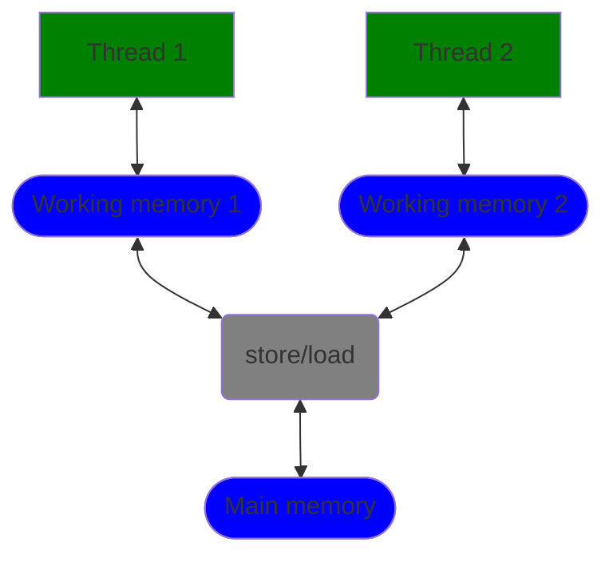
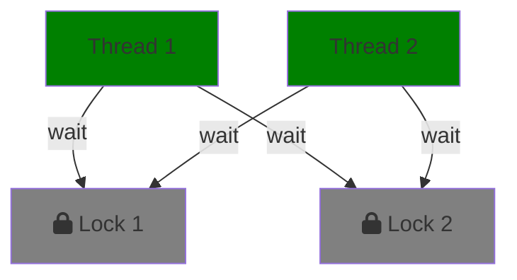
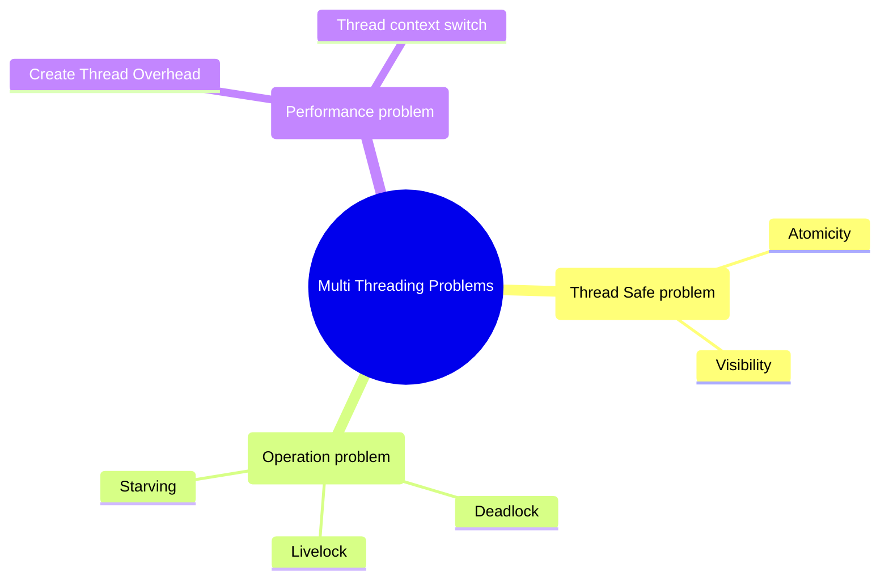

# Vấn đề an toàn của luồng

Trước đây chúng ta đã biết rằng, công nghệ đa luồng mang lại nhiều lợi ích, ví dụ như có thể tận dụng tối đa khả năng tính toán của CPU đa lõi. Nhưng liệu đa luồng có nhược điểm nào không?

Có.

Đa luồng rất khó nắm vững, chỉ cần sơ suất một chút có thể khiến chương trình bị sập. Hãy lấy ví dụ về việc lái xe trên đường:

Trên một con đường một chiều, mỗi chiếc xe đều tuân thủ luật giao thông, lúc này quá trình di chuyển là bình thường. "Đường một chiều" có nghĩa là "một luồng", "nhiều xe" có nghĩa là "nhiều công việc (job)".


Nếu cần tăng hiệu suất di chuyển của các xe, cách thông thường là mở rộng làn đường, tương ứng với chương trình là "thêm thread pool", tăng số lượng luồng. Như vậy trong cùng một thời điểm, số lượng xe di chuyển sẽ lớn hơn rất nhiều so với một làn đường.


Tuy nhiên, khi có nhiều làn đường, tình huống "chen lấn" sẽ xuất hiện nhiều hơn, nếu xảy ra va chạm sẽ ảnh hưởng đến toàn bộ hiệu suất của con đường. So sánh như vậy, "nhiều làn đường" có thể còn chậm hơn "một làn đường".


Để ngăn chặn các xe liên tục đổi làn và chen lấn, chúng ta có thể đặt "lan can" giữa các làn đường. Vậy trong thế giới của chương trình, chúng ta làm thế nào?

Các vấn đề mà đa luồng gặp phải có thể tóm gọn thành ba loại: `vấn đề an toàn luồng`, `vấn đề hoạt động` và `vấn đề hiệu suất`.

## Vấn đề an toàn luồng

Đôi khi chúng ta phát hiện ra rằng mã chạy ổn trong môi trường đơn luồng nhưng lại gặp kết quả bất ngờ trong môi trường đa luồng, đây chính là cái mà mọi người gọi là "không an toàn luồng". Vậy thế nào là không an toàn luồng?

### Tính nguyên tử

Lấy ví dụ về việc chuyển tiền ngân hàng. Giả sử từ tài khoản A chuyển sang tài khoản B 1000 đồng, thì chắc chắn phải bao gồm 2 thao tác: trừ 1000 đồng từ tài khoản A và thêm 1000 đồng vào tài khoản B. Cả hai thao tác này đều thành công mới có nghĩa là giao dịch thành công.


Hãy tưởng tượng nếu hai thao tác này không có tính nguyên tử, trừ 1000 đồng từ tài khoản A xong thì thao tác bị dừng lại, và tài khoản B không nhận được 1000 đồng, vấn đề lớn sẽ xảy ra.


Chuyển tiền ngân hàng có hai bước, nếu xảy ra sự cố dẫn đến giao dịch thất bại thì điều này chứng tỏ không có tính nguyên tử.

> - **Tính nguyên tử**: Một hoặc nhiều thao tác phải được thực hiện hoàn toàn và quá trình thực hiện sẽ không bị gián đoạn bởi bất kỳ yếu tố nào, hoặc không thực hiện.
> - **Tác vụ nguyên tử**: Là các thao tác không thể bị gián đoạn bởi cơ chế lập lịch của luồng, không có chuyển đổi ngữ cảnh.

Trong lập trình đồng thời, nhiều tác vụ không phải là tác vụ nguyên tử. Một câu hỏi nhỏ:

```java
int i = 0; // Thao tác 1
i++;   // Thao tác 2
int j = i; // Thao tác 3
i = i + 1; // Thao tác 4
```

Trong bốn thao tác trên, thao tác nào là nguyên tử, thao tác nào không?

Một số bạn có thể nghĩ rằng tất cả đều là tác vụ nguyên tử, nhưng thực ra chỉ có thao tác 1 là nguyên tử.

- **Thao tác 1**: Đây là tác vụ nguyên tử vì nó là một bước đơn lẻ, không thể chia nhỏ.
- **Thao tác 2**: Đây không phải là nguyên tử. Nó thực sự là một thao tác "đọc-sửa-ghi", bao gồm việc đọc giá trị của i, tăng giá trị của i rồi ghi lại giá trị i.
- **Thao tác 3**: Đây là tác vụ nguyên tử vì nó là một bước đơn lẻ, không thể chia nhỏ.
- **Thao tác 4**: Đây không phải là nguyên tử. Giống như i++, đây cũng là một thao tác "đọc-sửa-ghi".

Trong môi trường đơn luồng, bốn thao tác trên sẽ không gây ra vấn đề, nhưng trong môi trường đa luồng, nếu không khóa, có thể sẽ nhận được giá trị không mong muốn. Hãy thử kiểm tra và xem kết quả đầu ra:

```java
public class YuanziDeo {
    private static int i = 0;

    public static void main(String[] args) throws InterruptedException {
        int numThreads = 2;
        int numIncrementsPerThread = 100000;

        Thread[] threads = new Thread[numThreads];

        for (int j = 0; j < numThreads; j++) {
            threads[j] = new Thread(() -> {
                for (int k = 0; k < numIncrementsPerThread; k++) {
                    i++;
                }
            });
            threads[j].start();
        }

        for (Thread thread : threads) {
            thread.join();
        }

        System.out.println("Final value of i = " + i);
        System.out.println("Expected value = " + (numThreads * numIncrementsPerThread));
    }
}
```

Đầu ra như sau:

```
Final value of i = 102249
Expected value = 200000
```

Giá trị mong đợi của i là 200000, nhưng thực tế chỉ là 102249, điều này chứng tỏ i++ không phải là một tác vụ nguyên tử, đúng không?

### Tính khả kiến

talk is cheap，show me code，hãy xem đoạn mã sau:

```java
class Test {
  int i = 50;
  int j = 0;

  public void update() {
    // Luồng 1 thực thi
    i = 100;
  }

  public int get() {
    // Luồng 2 thực thi
    j = i;
    return j;
  }
}
```

Giả sử có hai luồng, luồng 1 thực thi phương thức `update` và gán giá trị của `i` thành 100. Thông thường, luồng 1 sẽ thực hiện việc gán giá trị trong bộ nhớ làm việc của mình, nhưng không ngay lập tức cập nhật giá trị mới vào bộ nhớ chính.

Khi đó, luồng 2 thực thi phương thức `get`, trước hết nó sẽ đọc giá trị của `i` từ bộ nhớ chính rồi nạp vào bộ nhớ làm việc của mình. Lúc này, giá trị của `i` mà luồng 2 đọc được vẫn là 50. Sau đó, luồng 2 gán giá trị 50 cho `j` và cuối cùng trả về giá trị `j`, kết quả là 50. Dù mong đợi giá trị trả về là 100, kết quả thực tế lại là 50, đây chính là vấn đề về tính khả kiến: luồng 1 đã thay đổi giá trị của biến `i`, nhưng luồng 2 không ngay lập tức nhìn thấy giá trị mới của `i`.

> Tính khả kiến: Khi nhiều luồng truy cập cùng một biến, một luồng thay đổi giá trị của biến đó và các luồng khác có thể thấy ngay giá trị đã được thay đổi.




Như hình trên, mỗi luồng có bộ nhớ làm việc riêng, và việc tương tác giữa bộ nhớ làm việc với bộ nhớ chính cần thông qua các thao tác lưu trữ (store) và tải (load).

Để giải quyết vấn đề khả kiến trong lập trình đa luồng, Java cung cấp từ khóa `volatile`. Khi một biến dùng chung được khai báo là `volatile`, nó đảm bảo rằng giá trị đã thay đổi sẽ ngay lập tức được cập nhật vào bộ nhớ chính. Do đó, khi một luồng khác cần đọc giá trị này, nó sẽ lấy giá trị mới từ bộ nhớ chính. Các biến dùng chung không có từ khóa `volatile` không đảm bảo tính khả kiến, vì thời điểm biến được cập nhật vào bộ nhớ chính là không xác định, dẫn đến việc các luồng khác có thể đọc giá trị cũ.

Tất nhiên, cơ chế khóa của Java như `synchronized` và `lock` cũng có thể đảm bảo tính khả kiến.

## Vấn đề về tính hoạt động

Để giải quyết vấn đề về `tính khả kiến`, chúng ta có thể sử dụng khóa, nhưng nếu không sử dụng đúng cách, việc khóa có thể dẫn đến các vấn đề khác như "deadlock" (khoá chết).

Trước khi nói về "deadlock", ta cần hiểu khái niệm khác: `vấn đề về tính hoạt động`.

> Tính hoạt động có nghĩa là một việc đúng đắn cuối cùng sẽ xảy ra, nhưng nếu một thao tác không thể tiếp tục, thì sẽ xuất hiện vấn đề về tính hoạt động.

Khái niệm này có thể khó hiểu, nhưng các vấn đề về tính hoạt động thường bao gồm: `deadlock` (khoá chết), `livelock` (khoá sống) và `vấn đề đói tài nguyên`.

#### Deadlock

Deadlock là hiện tượng khi nhiều luồng chờ nhau để giải phóng khóa, dẫn đến tất cả bị chặn vĩnh viễn.


#### Livelock

Deadlock là khi hai luồng đều chờ nhau để giải phóng khóa, còn `livelock` là khi các luồng không bị chặn, nhưng vẫn không thể hoàn thành công việc của mình. Điều này xảy ra khi nhiều luồng chạy và thay đổi trạng thái của chúng, nhưng các luồng khác lại phụ thuộc vào trạng thái đó, dẫn đến các luồng chỉ lặp lại cùng một hành động mà không thể tiếp tục thực hiện nhiệm vụ của mình.


Một ví dụ trong cuộc sống: khi bạn và một người khác đang đi trên đường và cả hai đều nhường nhau, nhưng lại di chuyển cùng một hướng, kết quả là cả hai sẽ tiếp tục nhường mà không thể tiến về phía trước — đây chính là một ví dụ về livelock.

#### Đói tài nguyên

Nếu một luồng không gặp bất kỳ lỗi nào nhưng vẫn không thể tiếp tục chạy, thì nó đang rơi vào trạng thái đói tài nguyên.

Các trường hợp thường gặp:

- Các luồng có mức ưu tiên cao liên tục chạy và tiêu thụ CPU, khiến các luồng có mức ưu tiên thấp không thể chạy.
- Một số luồng bị chặn mãi mãi trong trạng thái chờ để vào khối đồng bộ, trong khi các luồng khác luôn truy cập vào khối đồng bộ trước.

Một ví dụ kinh điển về vấn đề đói tài nguyên là "Vấn đề bữa ăn của các triết gia". Như hình dưới, có 5 triết gia đang ăn và mỗi người cần có 2 cái dĩa để ăn. Nếu triết gia 1 và triết gia 3 đều đang ăn, triết gia 2, 4 và 5 sẽ phải nhịn đói và chờ đợi.


## Vấn đề về hiệu suất

Như đã đề cập, các vấn đề về an toàn luồng, deadlock và livelock nếu không xảy ra, liệu đa luồng có luôn nhanh hơn việc thực thi đơn luồng không? Câu trả lời là không chắc chắn, vì việc sử dụng nhiều luồng có chi phí như `tạo luồng` và `chuyển ngữ cảnh giữa các luồng`.

Tạo luồng là việc yêu cầu tài nguyên từ hệ thống, và với hệ điều hành, việc tạo luồng là rất tốn kém vì nó yêu cầu phân bổ bộ nhớ, đưa vào danh sách lập lịch,...

Sau khi luồng được tạo, còn có vấn đề `chuyển ngữ cảnh luồng (context switch)`.


CPU là tài nguyên quý giá và rất nhanh, để đảm bảo công bằng, CPU thường phân chia `thời gian` cho các luồng khác nhau. Khi CPU chuyển từ thực thi một luồng sang thực thi luồng khác, nó cần lưu trữ dữ liệu cục bộ, con trỏ chương trình, và trạng thái của luồng hiện tại, sau đó nạp dữ liệu cục bộ, con trỏ chương trình, và trạng thái của luồng tiếp theo — quá trình này gọi là "chuyển ngữ cảnh".

Các cách giảm chuyển ngữ cảnh:

- Lập trình không khóa: Dựa trên ý tưởng phân đoạn khóa của ConcurrentHashMap, các luồng khác nhau xử lý các phần dữ liệu khác nhau để giảm chuyển ngữ cảnh trong điều kiện cạnh tranh nhiều luồng.
- Thuật toán CAS: Sử dụng [Atomic](./atomic) + [CAS](./cas) để cập nhật dữ liệu bằng cách khóa lạc quan, giúp giảm cạnh tranh không cần thiết gây ra chuyển ngữ cảnh.
- Sử dụng ít luồng hơn: Tránh tạo các luồng không cần thiết. Nếu có ít nhiệm vụ mà lại tạo ra nhiều luồng, điều này có thể dẫn đến nhiều luồng rơi vào trạng thái chờ.
- Coroutine: Thực hiện điều phối nhiều tác vụ trong một luồng đơn và duy trì sự chuyển đổi giữa các tác vụ trong luồng đơn đó.

## Tóm tắt

Sử dụng đa luồng tốt có thể giúp tăng hiệu suất chương trình lên nhiều lần, nhưng nếu không sử dụng

đúng cách, có thể làm cho chương trình chạy chậm hơn so với việc sử dụng đơn luồng.

Dưới đây là sơ đồ tóm tắt những vấn đề đã đề cập:



Khi lập trình đa luồng, chúng ta cần cân nhắc các vấn đề như tính khả kiến, deadlock, livelock, vấn đề đói tài nguyên và cả chi phí tạo và chuyển ngữ cảnh luồng. Những công cụ như từ khóa `volatile`, `synchronized`, hay các kỹ thuật như lập trình không khóa và tối ưu hóa số lượng luồng có thể giúp giải quyết nhiều vấn đề về hiệu suất và đảm bảo an toàn trong lập trình đa luồng.