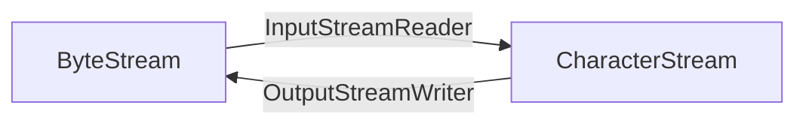

# Conversion Stream

Conversion stream có thể đóng gói một byte stream thành một character stream, hoặc đóng gói một character stream thành byte stream. Chuyển đổi này thường được sử dụng để xử lý dữ liệu văn bản, như đọc tệp văn bản hoặc truyền dữ liệu từ mạng đến ứng dụng.

conversion stream chủ yếu có hai loại: InputStreamReader và OutputStreamWriter.

InputStreamReader chuyển đổi một luồng đầu vào byte thành một luồng đầu vào ký tự, trong khi OutputStreamWriter chuyển đổi một luồng đầu ra byte thành một luồng đầu ra ký tự. Chúng sử dụng bộ ký tự được chỉ định để chuyển đổi giữa byte stream và character stream. Các bộ ký tự thông dụng bao gồm UTF-8, GBK, ISO-8859-1, v.v.



### 01. Mã hóa và Giải mã

Trong máy tính, dữ liệu thường được lưu trữ và truyền dưới dạng nhị phân.

- Mã hóa là việc chuyển đổi dữ liệu gốc (ví dụ như văn bản, hình ảnh, video, âm thanh, v.v.) thành dạng nhị phân.
- Giải mã là việc chuyển đổi dữ liệu nhị phân thành dữ liệu gốc, là một quá trình ngược lại.

Có nhiều phương thức mã hóa và giải mã phổ biến, dưới đây là một số ví dụ:

- Mã hóa và giải mã ASCII: Trong máy tính, thường sử dụng mã ASCII để biểu diễn các ký tự, như các chữ cái, số và ký hiệu trên bàn phím. Ví dụ, chữ A tương ứng với mã ASCII 65, ký tự + tương ứng với mã ASCII 43.
- Mã hóa và giải mã Unicode: Unicode là một bộ ký tự hỗ trợ nhiều ngôn ngữ và bộ ký tự. Trong máy tính, Unicode có thể sử dụng các phương thức mã hóa như UTF-8, UTF-16 để chuyển đổi ký tự thành dữ liệu nhị phân để lưu trữ và truyền tải.
- Mã hóa và giải mã Base64: Base64 là một phương thức mã hóa chuyển đổi dữ liệu nhị phân thành mã ASCII. Nó chuyển đổi 3 byte dữ liệu nhị phân thành 4 ký tự ASCII để sử dụng trong truyền tải mạng. Ví dụ, khi mã hóa chuỗi "Hello, world!" bằng Base64, kết quả sẽ là "SGVsbG8sIHdvcmxkIQ==".
- Mã hóa và giải mã hình ảnh: Trong xử lý hình ảnh, thường sử dụng các phương thức mã hóa như JPEG, PNG, GIF để chuyển đổi hình ảnh thành dữ liệu nhị phân để lưu trữ và truyền tải. Khi giải mã, dữ liệu nhị phân có thể được chuyển đổi thành hình ảnh để hiển thị hoặc xử lý.
- Mã hóa và giải mã video: Trong xử lý video, thường sử dụng các phương thức mã hóa như H.264, AVC, MPEG-4 để chuyển đổi video thành dữ liệu nhị phân để lưu trữ và truyền tải. Khi giải mã, dữ liệu nhị phân có thể được chuyển đổi thành video để phát hoặc xử lý.

Nói một cách đơn giản:

- Mã hóa: ký tự (có thể đọc được) --> byte (không thể đọc được)
- Giải mã: byte (không thể đọc được) --> ký tự (có thể đọc được)

Tôi sẽ dùng mã nguồn để minh họa:

```java
String str = "沉默王二";
String charsetName = "UTF-8";

// Mã hóa
byte[] bytes = str.getBytes(Charset.forName(charsetName));
System.out.println("Mã hóa: " + bytes);

// Giải mã
String decodedStr = new String(bytes, Charset.forName(charsetName));
System.out.println("Giải mã: " + decodedStr);
```

Trong ví dụ này, đầu tiên định nghĩa một biến chuỗi str và một tên bộ ký tự charsetName. Sau đó, sử dụng phương thức `Charset.forName()` để lấy đối tượng Charset của bộ ký tự chỉ định. Tiếp theo, sử dụng phương thức getBytes() của chuỗi để mã hóa chuỗi thành mảng byte của bộ ký tự chỉ định. Cuối cùng, sử dụng phương thức `new String()` để giải mã mảng byte thành chuỗi.

Cần lưu ý rằng trong quá trình mã hóa và giải mã, cần đảm bảo sử dụng cùng một bộ ký tự để chuyển đổi dữ liệu chính xác.

### 02. Bộ ký tự

Charset: Bộ ký tự, là một tập hợp các ký tự, mỗi ký tự có một giá trị mã duy nhất, còn được gọi là điểm mã.

Các bộ ký tự thông dụng bao gồm ASCII và Unicode, trong đó bộ ký tự Unicode bao gồm nhiều phương thức mã hóa như UTF-8, UTF-16.

#### **Bộ ký tự ASCII**

Bộ ký tự ASCII (American Standard Code for Information Interchange, Mã tiêu chuẩn Mỹ cho trao đổi thông tin) là một trong những bộ ký tự đầu tiên, bao gồm 128 ký tự, trong đó có các ký tự điều khiển, số, chữ cái tiếng Anh và một số ký hiệu. Mỗi ký tự trong bộ ký tự ASCII có một mã nhị phân 7 bit duy nhất (gồm 0 và 1), có thể được biểu diễn dưới dạng số thập phân hoặc số thập lục phân.

Phương thức mã hóa ASCII là một phương thức mã hóa có độ dài cố định, mỗi ký tự sử dụng mã nhị phân 7 bit để biểu diễn. Mã hóa ASCII chỉ có thể biểu diễn chữ cái tiếng Anh, số và một số ít ký hiệu, không thể biểu diễn các ký tự và ký hiệu của ngôn ngữ khác, do đó ứng dụng toàn cầu bị hạn chế rất nhiều.

#### Bộ ký tự Unicode

Unicode bao gồm hầu hết tất cả các ký tự trên thế giới, được sử dụng để biểu diễn các ngôn ngữ, ký hiệu và biểu tượng của con người. Mỗi ký tự trong bộ ký tự Unicode có một điểm mã duy nhất (code point), được sử dụng để biểu diễn vị trí của ký tự trong bộ ký tự, có thể được biểu diễn dưới dạng số thập lục phân.

Để lưu trữ và truyền tải các ký tự trong bộ ký tự Unicode trên máy tính, cần sử dụng một phương thức mã hóa. UTF-8, UTF-16 và UTF-32 đều là các phương thức mã hóa của bộ ký tự Unicode, được sử dụng để chuyển đổi các ký tự trong bộ ký tự Unicode thành chuỗi byte, để lưu trữ và truyền tải. Sự khác biệt giữa chúng nằm ở độ dài byte sử dụng.

- UTF-8 là một phương thức mã hóa có độ dài biến đổi, đối với các ký tự ASCII (phạm vi mã `0x00~0x7F`), sử dụng một byte để biểu diễn, đối với các ký tự Unicode khác, sử dụng hai, ba hoặc bốn byte để biểu diễn. Phương thức mã hóa UTF-8 được sử dụng rộng rãi trong lĩnh vực Internet và máy tính vì nó có thể nén dữ liệu hiệu quả, phù hợp cho truyền tải và lưu trữ mạng.
- UTF-16 là một phương thức mã hóa có độ dài cố định, đối với các ký tự trong mặt phẳng đa ngôn ngữ cơ bản (Basic Multilingual Plane, một phạm vi mã của bộ ký tự Unicode, bao gồm hầu hết các ký tự thông dụng trên thế giới, tổng cộng hơn 65,000 mã), sử dụng hai byte để biểu diễn, đối với các ký tự Unicode khác, sử dụng bốn byte để biểu diễn.
- UTF-32 là một phương thức mã hóa có độ dài cố định, đối với tất cả các ký tự Unicode, sử dụng bốn byte để biểu diễn.

### 03. Lỗi mã hóa

Khi sử dụng các phương thức mã hóa khác nhau để đọc hoặc ghi tệp, sẽ xuất hiện vấn đề lỗi mã hóa, hãy xem ví dụ.

```java
String s = "沉默王二！";

try {
    // Lưu chuỗi dưới dạng mã hóa GBK vào tệp
    OutputStreamWriter out = new OutputStreamWriter(
            new FileOutputStream("logs/test_utf8.txt"), "GBK");
    out.write(s);
    out.close();

    FileReader fileReader = new FileReader("logs/test_utf8.txt");
    int read;
    while ((read = fileReader.read()) != -1) {
        System.out.print((char)read);
    }
    fileReader.close();
} catch (IOException e) {
    e.printStackTrace();
}
```

Trong mã ví dụ trên, đầu tiên định nghĩa một chuỗi chứa các ký tự Trung Quốc, sau đó lưu chuỗi này dưới dạng mã hóa GBK vào tệp, tiếp theo đọc tệp bằng phương thức mã hóa mặc định (UTF-8) và hiển thị nội dung. Lúc này sẽ xuất hiện vấn đề lỗi mã hóa, hiển thị là “��Ĭ������”.

Đó là vì các ký tự mã hóa GBK trong tệp không thể được giải mã đúng cách bằng phương thức mã hóa UTF-8, dẫn đến xuất hiện lỗi mã hóa.

Vậy làm thế nào để giải quyết vấn đề lỗi mã hóa?

Điều này dẫn chúng ta đến chủ đề chính của hôm nay - conversion stream.

### 04. InputStreamReader

`java.io.InputStreamReader` là một lớp con của lớp Reader. Chức năng của nó là chuyển đổi byte stream (InputStream) thành character stream (Reader), đồng thời hỗ trợ phương thức mã hóa bộ ký tự được chỉ định, từ đó thực hiện chuyển đổi giữa character stream và byte stream.

#### 1）Phương thức khởi tạo

- `InputStreamReader(InputStream in)`: Tạo một character stream sử dụng bộ ký tự mặc định.
- `InputStreamReader(InputStream in, String charsetName)`: Tạo một character stream sử dụng bộ ký tự được chỉ định.

Ví dụ mã:

```java
InputStreamReader isr = new InputStreamReader(new FileInputStream("in.txt"));
InputStreamReader isr2 = new InputStreamReader(new FileInputStream("in.txt"), "GBK");
```

#### 2）Giải quyết vấn đề mã hóa

Dưới đây là một ví dụ mã sử dụng InputStreamReader để giải quyết vấn đề lỗi mã hóa:

```java
String s = "沉默王二！";

try {
    // Lưu chuỗi dưới dạng mã hóa GBK vào tệp
    OutputStreamWriter outUtf8 = new OutputStreamWriter(
            new FileOutputStream("logs/test_utf8.txt"), "GBK");
    outUtf8.write(s);
    outUtf8.close();

    // Chuyển đổi byte stream thành character stream, sử dụng mã hóa GBK
    InputStreamReader isr = new InputStreamReader(new FileInputStream("logs/test_utf8.txt"), "GBK");
    // Đọc character stream
    int c;
    while ((c = isr.read()) != -1) {
        System.out.print((char) c);
    }
    isr.close();
} catch (IOException e) {
    e.printStackTrace();
}
```

Vì sử dụng InputStreamReader để chuyển đổi mã hóa byte stream, nên khi đọc character stream, có thể giải mã chính xác các ký tự Trung Quốc, tránh được vấn đề lỗi mã hóa.

### 05. OutputStreamWriter

`java.io.OutputStreamWriter` là một lớp con của Writer, tên gọi dễ gây nhầm lẫn rằng nó chuyển đổi thành character stream, nhưng thực ra là chuyển đổi character stream thành byte stream, là cầu nối giữa character stream và byte stream.

- `OutputStreamWriter(OutputStream in)`: Tạo một character stream sử dụng bộ ký tự mặc định.
- `OutputStreamWriter(OutputStream in, String charsetName)`: Tạo một character stream sử dụng bộ ký tự được chỉ định.

Ví dụ mã:

```java
OutputStreamWriter osw = new OutputStreamWriter(new FileOutputStream("a.txt"));
OutputStreamWriter osw2 = new OutputStreamWriter(new FileOutputStream("b.txt"), "GBK");
```

Thông thường để nâng cao hiệu suất đọc ghi, chúng ta sẽ thêm một lớp buffered stream trên conversion stream, hãy xem ví dụ mã dưới đây:

```java
try {
    // Đọc byte stream từ tệp, sử dụng mã hóa UTF-8
    FileInputStream fis = new FileInputStream("test.txt");
    // Chuyển đổi byte stream thành character stream, sử dụng mã hóa UTF-8
    InputStreamReader isr = new InputStreamReader(fis, "UTF-8");
    // Sử dụng buffered stream để bọc character stream, nâng cao hiệu suất đọc
    BufferedReader br = new BufferedReader(isr);
    // Tạo output stream, sử dụng mã hóa UTF-8
    FileOutputStream fos = new FileOutputStream("output.txt");
    // Chuyển đổi output stream thành character stream, sử dụng mã hóa UTF-8
    OutputStreamWriter osw = new OutputStreamWriter(fos, "UTF-8");
    // Sử dụng buffered stream để bọc conversion stream, nâng cao hiệu suất ghi
    BufferedWriter bw = new BufferedWriter(osw);

    // Đọc từng dòng của tệp đầu vào, ghi vào tệp đầu ra
    String line;
    while ((line = br.readLine()) != null) {
        bw.write(line);
        bw.newLine(); // Viết ký tự xuống dòng sau mỗi dòng
    }

    // Đóng các stream
    br.close();
    bw.close();
} catch (IOException e) {
    e.printStackTrace();
}
```

Trong đoạn mã ví dụ trên, đầu tiên sử dụng FileInputStream để đọc byte stream từ tệp, sử dụng mã hóa UTF-8 để đọc. Sau đó, sử dụng InputStreamReader để chuyển đổi byte stream thành character stream, sử dụng mã hóa UTF-8 để chuyển đổi. Tiếp theo, sử dụng BufferedReader để bọc character stream, nâng cao hiệu suất đọc. Tiếp theo, tạo FileOutputStream để xuất ra tệp, sử dụng mã hóa UTF-8 để tạo. Sau đó, sử dụng OutputStreamWriter để chuyển đổi output stream thành character stream, sử dụng mã hóa UTF-8 để chuyển đổi. Cuối cùng, sử dụng BufferedWriter để bọc conversion stream, nâng cao hiệu suất ghi.

### 06. Tổng kết

InputStreamReader và OutputStreamWriter là các lớp chuyển đổi dòng byte thành dòng ký tự hoặc dòng ký tự thành dòng byte. Chúng thường được sử dụng để giải quyết vấn đề chuyển đổi giữa dòng byte và dòng ký tự, cho phép chuyển đổi dòng byte sang dòng ký tự theo một bộ ký tự được chỉ định, hoặc chuyển đổi dòng ký tự sang dòng byte theo một bộ ký tự được chỉ định.

Các phương thức thường dùng của lớp InputStreamReader bao gồm:

- `read()`: Đọc một ký tự từ dòng đầu vào.
- `read(char[] cbuf, int off, int len)`: Đọc len ký tự từ dòng đầu vào và lưu vào mảng ký tự cbuf bắt đầu từ vị trí off.
- `ready()`: Kiểm tra xem dòng này đã sẵn sàng để đọc chưa.
- `close()`: Đóng dòng đầu vào.

Các phương thức thường dùng của lớp OutputStreamWriter bao gồm:

- `write(int c)`: Ghi một ký tự vào dòng đầu ra.
- `write(char[] cbuf, int off, int len)`: Ghi len ký tự từ mảng ký tự cbuf vào dòng đầu ra bắt đầu từ vị trí off.
- `flush()`: Đẩy dữ liệu từ bộ đệm ra dòng đầu ra.
- `close()`: Đóng dòng đầu ra.

Khi sử dụng các dòng chuyển đổi, cần chỉ định đúng bộ ký tự mã hóa, nếu không có thể dẫn đến việc đọc hoặc ghi dữ liệu bị lỗi hiển thị.