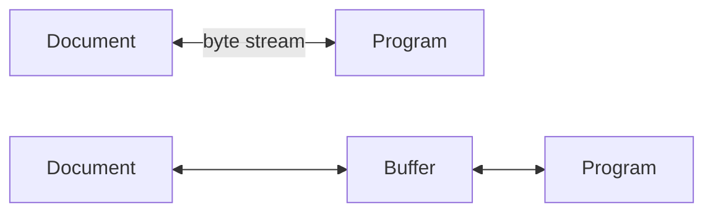

# Phân loại IO

Nhìn này, tôi chỉ phân loại IO theo cách truyền dẫn đơn giản mà đã ra đủ thứ đây!


Học IO trong Java lúc đầu cũng thấy đầu đau, đầy là các lớp, có lẽ là nhiều lớp nhất trong tất cả các gói Java, một lúc là Input, một lúc là Output, một lúc là Reader, một lúc là Writer, thực sự không biết các nhà thiết kế Java nghĩ gì.

Chủ yếu là do các nhà thiết kế Java đã xem xét rất nhiều, vì vậy IO mang đến cho người ta cảm giác lộn xộn, tôi sẽ sắp xếp lại cho bạn.

### 00. Giới thiệu sơ lược về Java IO

IO, tức là Input (nhập) và Output (xuất), đề cập đến việc truyền dữ liệu giữa ứng dụng và các thiết bị ngoại vi, các thiết bị ngoại vi phổ biến bao gồm tệp, đường ống và kết nối mạng.

Trong Java, IO được xử lý thông qua stream. Vậy stream là gì?

Stream là một khái niệm trừu tượng, là một chuỗi dữ liệu (kí tự hoặc byte) được truyền thông tin theo cách vào trước ra trước (FIFO - First In First Out).

Khi chương trình cần đọc dữ liệu, nó sẽ mở một stream đến nguồn dữ liệu. Nguồn dữ liệu này có thể là tệp, bộ nhớ hoặc kết nối mạng. Tương tự, khi chương trình cần ghi dữ liệu, nó sẽ mở một stream đến đích. Bạn có thể tưởng tượng dữ liệu giống như "dòng chảy" trong stream đó.

Thông thường, các đặc điểm của stream bao gồm:

- **Vào trước ra trước (FIFO)**: Dữ liệu được ghi vào stream đầu tiên sẽ được đọc ra từ stream đầu tiên.
- **Truy cập tuần tự**: Có thể ghi một chuỗi byte vào stream, khi đọc ra cũng sẽ đọc theo thứ tự đã ghi, không thể truy cập ngẫu nhiên vào dữ liệu ở giữa. (Ngoại trừ RandomAccessFile)
- **Chỉ đọc hoặc chỉ ghi**: Mỗi stream chỉ có thể là stream đầu vào hoặc đầu ra, không thể có cả hai chức năng cùng một lúc. stream đầu vào chỉ có thể thực hiện thao tác đọc, còn stream đầu ra chỉ có thể thực hiện thao tác ghi. Trong một kênh truyền dữ liệu, nếu cần cả ghi và đọc dữ liệu, thì cần phải cung cấp hai stream riêng biệt.

### 01. Phân loại theo phương thức truyền tải

Hãy bắt đầu từ sơ đồ ở đầu bài.

Có hai phương thức truyền tải: byte và ký tự. Đầu tiên, cần hiểu rõ sự khác biệt giữa byte và ký tự, đúng không?

Byte là đơn vị đo lường dung lượng lưu trữ trong máy tính, thường thì một byte có 8 bit.

Ký tự có thể là chữ cái, số hoặc ký hiệu mà máy tính sử dụng, ví dụ như A, 1, $.

Thông thường, một chữ cái hoặc một ký tự chiếm một byte, một ký tự Việt chiếm hai byte.


Cụ thể, còn phụ thuộc vào mã hóa ký tự, ví dụ như trong mã hóa UTF-8, một chữ cái tiếng Anh (không phân biệt chữ hoa và chữ thường) chiếm một byte, một ký tự Việt chiếm hai byte. Trong mã hóa Unicode, một chữ cái tiếng Anh chiếm một byte, một ký tự Trung Quốc chiếm hai byte.

Hiểu sự khác biệt giữa byte và ký tự, sau đó xem xét Byte Stream và character stream sẽ dễ dàng hơn nhiều.

Byte Stream dùng để xử lý các tệp nhị phân, chẳng hạn như hình ảnh, MP3, video.

character stream dùng để xử lý các tệp văn bản. Tệp văn bản có thể được coi là một loại tệp nhị phân đặc biệt, nhưng đã được mã hóa để dễ đọc hơn.

Nói cách khác, Byte Stream có thể xử lý mọi tệp, trong khi character stream chỉ có thể xử lý văn bản.

Mặc dù có rất nhiều lớp IO, nhưng cốt lõi là 4 lớp trừu tượng: `InputStream`, `OutputStream`, `Reader`, `Writer`.

**(Một điểm tuyệt vời của trừu tượng hóa)**

Mặc dù có rất nhiều phương thức IO, nhưng cốt lõi chỉ có 2: `read` và `write`.

**Lớp `InputStream`**

- `int read()`: Đọc dữ liệu
- `int read(byte b[], int off, int len)`: Đọc từ vị trí `off`, đọc `len` byte và đặt vào mảng `b`
- `long skip(long n)`: Bỏ qua số byte chỉ định
- `int available()`: Trả về số byte có thể đọc
- `void close()`: Đóng stream, giải phóng tài nguyên

**Lớp `OutputStream`**

- `void write(int b)`: Ghi một byte, mặc dù tham số là loại `int`, chỉ có 8 bit thấp sẽ được ghi, 24 bit cao sẽ bị bỏ qua (điều này sẽ được giải thích sau)
- `void write(byte b[], int off, int len)`: Ghi các byte từ mảng `b` từ vị trí `off`, dài `len`
- `void flush()`: Bắt buộc làm trống, ghi dữ liệu từ bộ đệm ra
- `void close()`: Đóng stream

**Lớp `Reader`**

- `int read()`: Đọc một ký tự
- `int read(char cbuf[], int off, int len)`: Đọc từ vị trí `off`, đọc `len` ký tự và đặt vào mảng `b`
- `long skip(long n)`: Bỏ qua số ký tự chỉ định
- `int ready()`: Kiểm tra xem có thể đọc không
- `void close()`: Đóng stream

**Lớp `Writer`**

- `void write(int c)`: Ghi một ký tự
- `void write(char cbuf[], int off, int len)`: Ghi các ký tự từ mảng `cbuf` từ vị trí `off`, dài `len`
- `void flush()`: Bắt buộc làm trống, ghi dữ liệu từ bộ đệm ra
- `void close()`: Đóng stream

Hiểu các phương thức trên, bạn đã nắm được linh hồn của IO.

Sự khác biệt giữa Byte Stream và character stream:

- Byte Stream thường dùng để xử lý các tệp hình ảnh, video, âm thanh, PPT, Word. character stream thường dùng để xử lý các tệp văn bản thuần túy, như tệp TXT, nhưng không thể xử lý các tệp hình ảnh, video. Nói một câu đơn giản: Byte Stream có thể xử lý mọi tệp, còn character stream chỉ có thể xử lý văn bản thuần túy.
- Byte Stream bản thân không có bộ đệm, Buffered Byte Stream có bộ đệm cải thiện hiệu suất rất nhiều. Trong khi đó, character stream bản thân đã có bộ đệm, nên Bufferd character stream cải thiện hiệu suất không đáng kể.

Ví dụ viết tệp, chúng ta sẽ xem xét mã nguồn của character stream, phát hiện thấy có sử dụng bộ đệm:

```java
// Khai báo một mảng kiểu char, để ghi vào stream xuất
private char[] writeBuffer;

// Định nghĩa kích thước của mảng writeBuffer, phải >= 1
private static final int WRITE_BUFFER_SIZE = 1024;

// Ghi một phần của chuỗi đã cho vào stream xuất
public void write(String str, int off, int len) throws IOException {
    // Sử dụng từ khóa synchronized để đồng bộ hóa đoạn mã, đảm bảo an toàn stream
    synchronized (lock) {
        char cbuf[];
        // Nếu len <= WRITE_BUFFER_SIZE, thì sử dụng mảng writeBuffer để ghi
        if (len <= WRITE_BUFFER_SIZE) {
            // Nếu writeBuffer là null, thì tạo một mảng char mới có kích thước WRITE_BUFFER_SIZE
            if (writeBuffer == null) {
                writeBuffer = new char[WRITE_BUFFER_SIZE];
            }
            cbuf = writeBuffer;
        } else {    // Nếu len > WRITE_BUFFER_SIZE, thì không phân bổ bộ đệm lớn vĩnh viễn
            // Tạo một mảng char mới có kích thước len
            cbuf = new char[len];
        }
        // Sao chép một phần của str (từ off, dài len) vào mảng cbuf
        str.getChars(off, (off + len), cbuf, 0);
        // Ghi dữ liệu từ mảng cbuf vào stream xuất
        write(cbuf, 0, len);
    }
}
```

Đoạn mã này là phương thức `write` của lớp `OutputStreamWriter` trong thư viện IO của Java, có thể thấy kích thước của bộ đệm là 1024 ký tự.

Chúng ta hãy so sánh mã của character stream và Byte Stream khi viết tệp, sự khác biệt rất nhỏ.

```java
// Byte Stream
try (FileInputStream fis = new FileInputStream("input.txt");
     FileOutputStream fos = new FileOutputStream("output.txt")) {
    byte[] buffer = new byte[1024];
    int len;
    while ((len = fis.read(buffer)) != -1) {
        fos.write(buffer, 0, len);
    }
} catch (IOException e) {
    e.printStackTrace();
}

// character stream
try (FileReader fr = new FileReader("input.txt");
     FileWriter fw = new FileWriter("output.txt")) {
    char[] buffer = new char[1024];
    int len;
    while ((len = fr.read(buffer)) != -1) {
        fw.write(buffer, 0, len);
    }
} catch (IOException e) {
    e.printStackTrace();
}
```

### 02. Phân loại theo đối tượng thao tác

Hãy suy nghĩ kỹ, IO không phải là viết tắt của Input (Nhập) và Output (Xuất) sao:

- Input: Đọc dữ liệu từ bên ngoài vào bộ nhớ, ví dụ như đọc tệp từ ổ cứng vào bộ nhớ, đọc dữ liệu từ mạng vào bộ nhớ, v.v.
- Output: Ghi dữ liệu từ bộ nhớ ra bên ngoài, ví dụ như ghi dữ liệu từ bộ nhớ vào tệp, xuất dữ liệu từ bộ nhớ ra mạng, v.v.

Tất cả các chương trình, khi thực thi, đều hoạt động trên bộ nhớ. Một khi tắt máy, dữ liệu trong bộ nhớ sẽ mất đi. Nếu muốn lưu trữ lâu dài, cần phải xuất dữ liệu từ bộ nhớ ra bên ngoài, ví dụ như tệp.

Thao tác tệp là thao tác điển hình nhất và cũng là thao tác thường xuyên nhất trong IO. Bạn có thể suy nghĩ theo một góc độ khác, ví dụ như phân loại IO theo đối tượng thao tác, IO có thể được phân loại thành: file, array, pipe, basic data types, buffered, print, bject serialization/deserialization, và conversion, v.v.


#### **1) File**

File Stream là stream thao tác trực tiếp trên tệp, có thể chia thành Byte Stream (FileInputStream và FileOutputStream) và character stream (FileReader và FileWriter).

Ví dụ về FileInputStream:

```java
// Khai báo một biến kiểu int b, dùng để lưu trữ byte được đọc vào
int b;
// Tạo một đối tượng FileInputStream, dùng để đọc dữ liệu từ tệp fis.txt
FileInputStream fis1 = new FileInputStream("fis.txt");

// Đọc tuần tự dữ liệu từ tệp
while ((b = fis1.read()) != -1) {
    // Chuyển byte đọc được thành ký tự ASCII tương ứng và in ra màn hình
    System.out.println((char)b);
}

// Đóng đối tượng FileInputStream, giải phóng tài nguyên
fis1.close();
```

Ví dụ về FileOutputStream:

```java
// Tạo một đối tượng FileOutputStream, dùng để ghi dữ liệu vào tệp fos.txt
FileOutputStream fos = new FileOutputStream("fos.txt");

// Ghi dữ liệu vào tệp, ở đây ghi mảng byte tương ứng với chuỗi "Tom"
fos.write("Tom".getBytes());

// Đóng đối tượng FileOutputStream, giải phóng tài nguyên
fos.close();
```

Ví dụ về FileReader:

```java
// Khai báo một biến kiểu int b, dùng để lưu trữ ký tự được đọc vào
int b = 0;

// Tạo một đối tượng FileReader, dùng để đọc dữ liệu từ tệp read.txt
FileReader fileReader = new FileReader("read.txt");

// Đọc tuần tự dữ liệu từ tệp
while ((b = fileReader.read()) != -1) {
    // Chuyển ký tự đọc được thành kiểu char và in ra màn hình
    System.out.println((char)b);
}

// Đóng đối tượng FileReader, giải phóng tài nguyên
fileReader.close();
```

Ví dụ về FileWriter:

```java
// Tạo một đối tượng FileWriter, dùng để ghi dữ liệu vào tệp fw.txt
FileWriter fileWriter = new FileWriter("fw.txt");

// Chuyển chuỗi "Tom" thành mảng ký tự
char[] chars = "Tom".toCharArray();

// Ghi dữ liệu vào tệp, ở đây ghi tất cả các ký tự trong mảng chars
fileWriter.write(chars, 0, chars.length);

// Đóng đối tượng FileWriter, giải phóng tài nguyên
fileWriter.close();
```

File Stream cũng có thể được sử dụng để tạo, xóa, đổi tên tệp, v.v. Tham số thứ hai của hàm tạo FileOutputStream và FileWriter có thể chỉ định việc thêm dữ liệu vào cuối tệp.

Ví dụ mã:

```java
// Tạo tệp
File file = new File("test.txt");
if (file.createNewFile()) {
    System.out.println("Tạo tệp thành công");
} else {
    System.out.println("Tệp đã tồn tại");
}

// Xóa tệp
if (file.delete()) {
    System.out.println("Xóa tệp thành công");
} else {
    System.out.println("Xóa tệp thất bại");
}

// Đổi tên tệp
File oldFile = new File("old.txt");
File newFile = new File("new.txt");
if (oldFile.renameTo(newFile)) {
    System.out.println("Đổi tên tệp thành công");
} else {
    System.out.println("Đổi tên tệp thất bại");
}
```

Khi bạn đã nắm vững việc nhập và xuất tệp, các thao tác khác cũng sẽ trở nên dễ dàng hơn, vì chúng không có sự khác biệt quá lớn.

#### **2) Array (Bộ nhớ)**

Thông thường, đối với các thao tác đọc và ghi tệp, việc sử dụng file stream kết hợp với buffered stream là đủ. Tuy nhiên, để nâng cao hiệu quả, việc đọc và ghi tệp thường xuyên không phải là ý tưởng tốt. Vì vậy, array stream (còn gọi là stream bộ nhớ) ra đời.

Ví dụ về ByteArrayInputStream:

```java
// Tạo một đối tượng ByteArrayInputStream, dùng để đọc dữ liệu từ mảng byte
InputStream is = new BufferedInputStream(
        new ByteArrayInputStream(
                "Tom".getBytes(StandardCharsets.UTF_8)));

// Định nghĩa một mảng byte để lưu trữ dữ liệu được đọc vào
byte[] flush = new byte[1024];

// Định nghĩa một biến để lưu trữ số byte được đọc vào mỗi lần
int len = 0;

// Đọc tuần tự dữ liệu từ mảng byte và in ra màn hình
while (-1 != (len = is.read(flush))) {
    // Chuyển đổi byte đọc được thành chuỗi tương ứng và in ra màn hình
    System.out.println(new String(flush, 0, len));
}

// Đóng stream đầu vào, giải phóng tài nguyên
is.close();
```

Ví dụ về ByteArrayOutputStream:

```java
// Tạo một đối tượng ByteArrayOutputStream, dùng để ghi dữ liệu vào bộ nhớ đệm
ByteArrayOutputStream bos = new ByteArrayOutputStream();

// Định nghĩa một mảng byte để lưu trữ dữ liệu cần ghi vào bộ nhớ đệm
byte[] info = "Tom".getBytes();

// Ghi dữ liệu vào bộ nhớ đệm, ở đây ghi tất cả byte trong mảng info
bos.write(info, 0, info.length);

// Chuyển đổi dữ liệu trong bộ nhớ đệm thành mảng byte
byte[] dest = bos.toByteArray();

// Đóng đối tượng ByteArrayOutputStream, giải phóng tài nguyên
bos.close();
```

Array stream có thể được sử dụng để đọc và ghi dữ liệu trong bộ nhớ, ví dụ như lưu trữ dữ liệu trong mảng byte để nén, mã hóa, hoặc tuần tự hóa. Ưu điểm của nó là không cần tạo tệp tạm thời, có thể nâng cao hiệu suất của chương trình. Tuy nhiên, array stream cũng có nhược điểm là chỉ có thể lưu trữ một lượng dữ liệu giới hạn, nếu dữ liệu quá lớn sẽ dẫn đến tràn bộ nhớ.

#### **3) Pipe**

Piped trong Java khác với pipe trong Unix/Linux. Trong Unix/Linux, các tiến trình khác nhau có thể giao tiếp với nhau qua pipe, nhưng trong Java, các bên giao tiếp phải nằm trong cùng một tiến trình, tức là trong cùng một JVM. Pipe cung cấp khả năng giao tiếp giữa các luồng trong cùng một tiến trình.

Một luồng có thể ghi dữ liệu vào `PipedOutputStream` và luồng khác có thể đọc dữ liệu từ `PipedInputStream` liên kết với nó.

Ví dụ về `PipedOutputStream` và `PipedInputStream`:

```java
// Tạo một đối tượng PipedOutputStream và một đối tượng PipedInputStream
final PipedOutputStream pipedOutputStream = new PipedOutputStream();
final PipedInputStream pipedInputStream = new PipedInputStream(pipedOutputStream);

// Tạo một luồng, ghi dữ liệu vào PipedOutputStream
Thread thread1 = new Thread(new Runnable() {
    @Override
    public void run() {
        try {
            // Chuyển đổi chuỗi "Tom" thành mảng byte và ghi vào PipedOutputStream
            pipedOutputStream.write("Tom".getBytes(StandardCharsets.UTF_8));
            // Đóng PipedOutputStream, giải phóng tài nguyên
            pipedOutputStream.close();
        } catch (IOException e) {
            e.printStackTrace();
        }
    }
});

// Tạo một luồng, đọc dữ liệu từ PipedInputStream và in ra màn hình
Thread thread2 = new Thread(new Runnable() {
    @Override
    public void run() {
        try {
            // Định nghĩa một mảng byte để lưu trữ dữ liệu được đọc vào
            byte[] flush = new byte[1024];
            // Định nghĩa một biến để lưu trữ số byte được đọc vào mỗi lần
            int len = 0;
            // Đọc tuần tự dữ liệu từ mảng byte và in ra màn hình
            while (-1 != (len = pipedInputStream.read(flush))) {
                // Chuyển đổi byte đọc được thành chuỗi tương ứng và in ra màn hình
                System.out.println(new String(flush, 0, len));
            }
            // Đóng PipedInputStream, giải phóng tài nguyên
            pipedInputStream.close();
        } catch (IOException e) {
            e.printStackTrace();
        }
    }
});

// Khởi động thread1 và thread2
thread1.start();
thread2.start();
```

Sử dụng pipe có thể thực hiện việc truyền dữ liệu giữa các luồng khác nhau, có thể được sử dụng để giao tiếp giữa các luồng, truyền dữ liệu, v.v. Tuy nhiên, pipe cũng có một số hạn chế, chẳng hạn như chỉ có thể sử dụng giữa các luồng trong cùng một JVM và không thể vượt qua các tiến trình JVM khác nhau.

#### **4) Kiểu dữ liệu cơ bản**

Stream nhập xuất kiểu dữ liệu cơ bản là một byte stream, stream này không chỉ có thể đọc và ghi byte và ký tự, mà còn có thể đọc và ghi các kiểu dữ liệu cơ bản.

`DataInputStream` cung cấp một loạt các phương thức để đọc các kiểu dữ liệu cơ bản:

```java
// Tạo một đối tượng DataInputStream, dùng để đọc dữ liệu từ tệp tin
DataInputStream dis = new DataInputStream(new FileInputStream("das.txt"));

// Đọc một byte và chuyển đổi nó thành kiểu byte
byte b = dis.readByte();

// Đọc hai byte và chuyển đổi chúng thành kiểu short
short s = dis.readShort();

// Đọc bốn byte và chuyển đổi chúng thành kiểu int
int i = dis.readInt();

// Đọc tám byte và chuyển đổi chúng thành kiểu long
long l = dis.readLong();

// Đọc bốn byte và chuyển đổi chúng thành kiểu float
float f = dis.readFloat();

// Đọc tám byte và chuyển đổi chúng thành kiểu double
double d = dis.readDouble();

// Đọc một byte và chuyển đổi nó thành kiểu boolean
boolean bb = dis.readBoolean();

// Đọc hai byte và chuyển đổi chúng thành kiểu char
char ch = dis.readChar();

// Đóng DataInputStream, giải phóng tài nguyên
dis.close();
```

`DataOutputStream` cung cấp một loạt các phương thức để ghi các kiểu dữ liệu cơ bản:

```java
// Tạo một đối tượng DataOutputStream, dùng để ghi dữ liệu vào tệp tin
DataOutputStream das = new DataOutputStream(new FileOutputStream("das.txt"));

// Ghi một dữ liệu kiểu byte vào tệp tin
das.writeByte(10);

// Ghi một dữ liệu kiểu short vào tệp tin
das.writeShort(100);

// Ghi một dữ liệu kiểu int vào tệp tin
das.writeInt(1000);

// Ghi một dữ liệu kiểu long vào tệp tin
das.writeLong(10000L);

// Ghi một dữ liệu kiểu float vào tệp tin
das.writeFloat(12.34F);

// Ghi một dữ liệu kiểu double vào tệp tin
das.writeDouble(12.56);

// Ghi một dữ liệu kiểu boolean vào tệp tin
das.writeBoolean(true);

// Ghi một dữ liệu kiểu char vào tệp tin
das.writeChar('A');

// Đóng DataOutputStream, giải phóng tài nguyên
das.close();
```

Ngoài `DataInputStream` và `DataOutputStream`, Java IO còn cung cấp một số lớp luồng khác để đọc và ghi các kiểu dữ liệu cơ bản và chuỗi, bao gồm `ObjectInputStream` và `ObjectOutputStream` (dùng để đọc và ghi đối tượng).

Ví dụ mã:

```java
public static void main(String[] args) {
    try (ObjectOutputStream oos = new ObjectOutputStream(new FileOutputStream("person.dat"))) {
        Person p = new Person("Tom", 20);
        oos.writeObject(p);
    } catch (IOException e) {
        e.printStackTrace();
    }

    try (ObjectInputStream ois = new ObjectInputStream(new FileInputStream("person.dat"))) {
        Person p = (Person) ois.readObject();
        System.out.println(p);
    } catch (IOException | ClassNotFoundException e) {
        e.printStackTrace();
    }
}
```

Mã trên tạo ra một đối tượng `Person`, ghi nó vào tệp tin, sau đó đọc đối tượng từ tệp tin và in ra màn hình console.

#### **5) Buffer**

CPU rất nhanh, nó nhanh hơn bộ nhớ 100 lần, nhanh hơn đĩa cứng hàng triệu lần. Điều đó có nghĩa là, tương tác giữa chương trình và bộ nhớ sẽ rất nhanh, trong khi tương tác với đĩa cứng sẽ tương đối chậm, điều này sẽ dẫn đến vấn đề về hiệu suất.

Để giảm tương tác giữa chương trình và đĩa cứng, nâng cao hiệu suất chương trình, buffered stream đã được giới thiệu, bao gồm các lớp có tiền tố "Buffer" như BufferedInputStream, BufferedOutputStream, BufferedReader, BufferedWriter.



Buffered stream thiết lập một vùng đệm trong bộ nhớ, chỉ khi vùng đệm lưu trữ đủ dữ liệu cần thao tác thì mới tương tác với bộ nhớ hoặc đĩa cứng. Nói đơn giản, đọc/ghi nhiều hơn một chút mỗi lần, giảm số lần đọc/ghi, nhờ đó nâng cao hiệu suất chương trình.
Dưới đây là một ví dụ sử dụng `BufferedInputStream` để đọc tệp tin:

```java
// Tạo một đối tượng BufferedInputStream, dùng để đọc dữ liệu từ tệp tin
BufferedInputStream bis = new BufferedInputStream(new FileInputStream("data.txt"));

// Tạo một mảng byte làm vùng đệm
byte[] buffer = new byte[1024];

// Đọc dữ liệu từ tệp tin và lưu trữ vào vùng đệm
int bytesRead;
while ((bytesRead = bis.read(buffer)) != -1) {
    // Xử lý dữ liệu trong vùng đệm
    // Ở đây chỉ đơn giản là chuyển đổi mảng byte đã đọc thành chuỗi và in ra
    System.out.println(new String(buffer, 0, bytesRead));
}

// Đóng BufferedInputStream, giải phóng tài nguyên
bis.close();
```

Trong đoạn mã trên, trước tiên tạo một đối tượng `BufferedInputStream` để đọc dữ liệu từ tệp tin. Sau đó tạo một mảng byte làm vùng đệm, mỗi lần đọc dữ liệu sẽ lưu trữ dữ liệu vào vùng đệm. Quá trình đọc dữ liệu được thực hiện thông qua vòng lặp `while`, mỗi lần đọc dữ liệu xong sẽ xử lý dữ liệu trong vùng đệm. Cuối cùng đóng `BufferedInputStream`, giải phóng tài nguyên.

Dưới đây là một ví dụ sử dụng `BufferedOutputStream` để ghi vào tệp tin:

```java
// Tạo một đối tượng BufferedOutputStream, dùng để ghi dữ liệu vào tệp tin
BufferedOutputStream bos = new BufferedOutputStream(new FileOutputStream("data.txt"));

// Tạo một mảng byte làm vùng đệm
byte[] buffer = new byte[1024];

// Ghi dữ liệu vào tệp tin
String data = "hello world!";
buffer = data.getBytes();
bos.write(buffer);

// Làm mới vùng đệm, ghi dữ liệu từ vùng đệm vào tệp tin
bos.flush();

// Đóng BufferedOutputStream, giải phóng tài nguyên
bos.close();
```

Trong đoạn mã trên, đầu tiên tạo một đối tượng `BufferedOutputStream` để ghi dữ liệu vào tệp tin. Sau đó tạo một mảng byte làm vùng đệm và ghi dữ liệu vào vùng đệm. Quá trình ghi dữ liệu được thực hiện thông qua phương thức `write()`, truyền mảng byte làm tham số cho phương thức `write()`. Cuối cùng, thông qua phương thức `flush()` ghi dữ liệu từ vùng đệm vào tệp tin, và thông qua phương thức `close()` đóng `BufferedOutputStream`, giải phóng tài nguyên.

Dưới đây là một ví dụ sử dụng `BufferedReader` để đọc tệp tin:

```java
// Tạo một đối tượng BufferedReader, dùng để đọc dữ liệu từ tệp tin
BufferedReader br = new BufferedReader(new FileReader("data.txt"));

// Đọc dữ liệu từ tệp tin và lưu trữ vào chuỗi
String line;
while ((line = br.readLine()) != null) {
    // Xử lý dữ liệu đã đọc
    // Ở đây chỉ đơn giản là in ra từng dòng chuỗi đã đọc
    System.out.println(line);
}

// Đóng BufferedReader, giải phóng tài nguyên
br.close();
```

Trong đoạn mã trên, trước tiên tạo một đối tượng `BufferedReader` để đọc dữ liệu từ tệp tin. Sau đó sử dụng phương thức `readLine()` để đọc dữ liệu từ tệp tin, mỗi lần đọc một dòng dữ liệu và lưu trữ vào một chuỗi. Quá trình đọc dữ liệu được thực hiện thông qua vòng lặp `while`.

Dưới đây là một ví dụ sử dụng `BufferedWriter` để ghi vào tệp tin:

```java
// Tạo một đối tượng BufferedWriter, dùng để ghi dữ liệu vào tệp tin
BufferedWriter bw = new BufferedWriter(new FileWriter("data.txt"));

// Ghi dữ liệu vào tệp tin
String data = "abcdef";
bw.write(data);

// Làm mới vùng đệm, ghi dữ liệu từ vùng đệm vào tệp tin
bw.flush();

// Đóng BufferedWriter, giải phóng tài nguyên
bw.close();
```

Trong đoạn mã trên, trước tiên tạo một đối tượng `BufferedWriter` để ghi dữ liệu vào tệp tin. Sau đó sử dụng phương thức `write()` để ghi dữ liệu vào vùng đệm. Quá trình ghi dữ liệu tương tự như sử dụng lớp `FileWriter`. Lưu ý rằng khi sử dụng `BufferedWriter` để ghi dữ liệu, dữ liệu sẽ được ghi vào vùng đệm trước, chỉ khi vùng đệm đầy hoặc gọi phương thức `flush()` thì dữ liệu trong vùng đệm mới được ghi vào tệp tin.

Cuối cùng, thông qua phương thức `flush()` ghi dữ liệu từ vùng đệm vào tệp tin, và thông qua phương thức `close()` đóng `BufferedWriter`, giải phóng tài nguyên.

Sử dụng buffered stream có thể nâng cao hiệu suất đọc ghi, giảm số lần đọc ghi đĩa hoặc mạng một cách thường xuyên, từ đó nâng cao hiệu suất chương trình. Tuy nhiên, khi sử dụng buffered stream cần chú ý kích thước của vùng đệm và thời điểm làm mới vùng đệm để tránh mất dữ liệu hoặc dữ liệu không đầy đủ.

#### **6) Print**

Print stream của Java là một tập hợp các lớp dùng để in dữ liệu ra ngoài, bao gồm hai lớp `PrintStream` và `PrintWriter`.

Có lẽ print stream là thứ mà lập trình viên Java sử dụng nhiều nhất trong suốt sự nghiệp của họ: `System.out` thực ra trả về một đối tượng `PrintStream`, có thể dùng để in ra các loại đối tượng khác nhau.

```java
System.out.println("hello world！");
```

`PrintStream` cuối cùng sẽ xuất ra dữ liệu dạng byte, trong khi `PrintWriter` thì mở rộng từ giao diện `Writer`, vì vậy các phương thức `print()/println()` của nó cuối cùng sẽ xuất ra dữ liệu dạng ký tự. Việc sử dụng `PrintWriter` gần như tương tự với `PrintStream`.

```java
StringWriter buffer = new StringWriter();
try (PrintWriter pw = new PrintWriter(buffer)) {
    pw.println("abcd");
}
System.out.println(buffer.toString());
```

Trong ví dụ trên, đầu tiên tạo một `StringWriter` để lưu trữ dữ liệu dạng chuỗi. Sau đó, sử dụng `PrintWriter` để viết dữ liệu vào `StringWriter`. Cuối cùng, dữ liệu được in ra màn hình bằng cách chuyển đổi `StringWriter` thành chuỗi và in ra bằng `System.out.println()`.

#### **7) Object Serialize/Deserialize**

Tuần tự hóa bản chất là chuyển một đối tượng Java thành mảng byte, sau đó có thể lưu trữ nó vào file hoặc truyền qua mạng đến máy từ xa.

```java
// Tạo một đối tượng ByteArrayOutputStream buffer, dùng để lưu trữ dữ liệu
ByteArrayOutputStream buffer = new ByteArrayOutputStream();

// Sử dụng câu lệnh try-with-resources để tạo một đối tượng ObjectOutputStream output, và liên kết nó với buffer
try (ObjectOutputStream output = new ObjectOutputStream(buffer)) {
    
    // Sử dụng phương thức writeUTF() để ghi chuỗi "abcdef" vào bộ đệm
    output.writeUTF("abcdef");
}

// Sử dụng phương thức toByteArray() để chuyển đổi dữ liệu trong bộ đệm thành mảng byte và xuất ra màn hình điều khiển
System.out.println(Arrays.toString(buffer.toByteArray()));
```

Đối ứng với tuần tự hóa, có phản tuần tự hóa, tức là quá trình chuyển đổi mảng byte thành đối tượng Java.

```java
try (ObjectInputStream input = new ObjectInputStream(new FileInputStream(
        new File("Person.txt")))) {
    String s = input.readUTF();
}
```

Đoạn mã này chủ yếu sử dụng các lớp `ByteArrayOutputStream` và `ObjectOutputStream` của Java để ghi chuỗi "abcdef" vào một bộ đệm mảng byte và chuyển đổi dữ liệu trong bộ đệm thành mảng byte và xuất ra màn hình điều khiển.

Quá trình thực thi cụ thể như sau:

- Tạo một đối tượng `ByteArrayOutputStream` buffer để lưu trữ dữ liệu.
- Sử dụng câu lệnh try-with-resources để tạo một đối tượng `ObjectOutputStream` output và liên kết nó với buffer.
- Sử dụng phương thức `writeUTF()` để ghi chuỗi "abcdef" vào bộ đệm.
- Khi câu lệnh try-with-resources hoàn thành, nó sẽ tự động gọi phương thức `close()` của output để đóng luồng xuất và giải phóng tài nguyên.
- Sử dụng phương thức `toByteArray()` để chuyển đổi dữ liệu trong bộ đệm thành mảng byte.
- Sử dụng phương thức `Arrays.toString()` để chuyển đổi mảng byte thành chuỗi và xuất ra màn hình điều khiển.

#### **8) Conversion**

InputStreamReader là một cầu nối từ byte stream sang character stream, nó sử dụng bộ mã ký tự chỉ định để đọc các byte và giải mã chúng thành các ký tự.

```java
// Tạo một đối tượng InputStreamReader isr, sử dụng đối tượng FileInputStream để đọc nội dung của tệp demo.txt và chuyển đổi nó thành character stream
InputStreamReader isr = new InputStreamReader(new FileInputStream("demo.txt"));

// Tạo một mảng ký tự cha để lưu trữ dữ liệu ký tự được đọc, với độ dài của mảng là 1024
char[] cha = new char[1024];

// Sử dụng phương thức read() để đọc dữ liệu từ isr và lưu trữ dữ liệu ký tự đã đọc vào mảng cha, trả về giá trị len là số lượng ký tự đã đọc được
int len = isr.read(cha);

// Chuyển đổi mảng cha từ vị trí 0 đến len thành chuỗi và xuất ra màn hình console
System.out.println(new String(cha, 0, len));

// Đóng InputStreamReader isr để giải phóng tài nguyên
isr.close();
```

Đoạn mã này sử dụng lớp InputStreamReader và FileInputStream của Java để đọc dữ liệu từ tệp demo.txt và chuyển đổi chúng thành character stream. Sau đó, nó lưu trữ dữ liệu ký tự đã đọc vào một mảng và xuất chuỗi kết quả ra màn hình console.

OutputStreamWriter chuyển đổi một đối tượng xuất character stream thành một đối tượng xuất byte stream, là cầu nối từ character stream đến byte stream.

```java
// Tạo một đối tượng File f, đại diện cho tệp test.txt
File f = new File("test.txt");

// Tạo một đối tượng OutputStreamWriter out, sử dụng đối tượng FileOutputStream để ghi dữ liệu vào tệp f và chuyển đổi byte stream thành character stream
Writer out = new OutputStreamWriter(new FileOutputStream(f));

// Sử dụng phương thức write() để ghi chuỗi "hello world!!" vào tệp f
out.write("hello world!!");

// Đóng đối tượng Writer out để giải phóng tài nguyên
out.close();
```

Việc sử dụng conversion stream giúp dễ dàng chuyển đổi giữa byte stream và character stream. Trong việc đọc và ghi tệp văn bản, thường sử dụng character stream, trong khi khi truyền dữ liệu qua mạng hoặc giao tiếp với thiết bị, thường sử dụng byte stream.

Ngoài ra, khi sử dụng conversion stream, cần chú ý đến vấn đề mã hóa ký tự. Nếu không chỉ định mã hóa ký tự, sẽ sử dụng mã hóa mặc định, có thể gây ra vấn đề về ký tự lạ. Do đó, khuyến khích luôn chỉ định mã hóa ký tự chính xác khi sử dụng conversion stream, để tránh các vấn đề liên quan đến ký tự lạ.

Bạn hãy xem, sau khi tôi tổng hợp, cảm giác như không còn nhiều vấn đề về IO nữa đúng không! Đối với các tình huống và nghiệp vụ khác nhau, chọn IO Stream tương ứng, cách sử dụng chỉ là đọc và ghi.