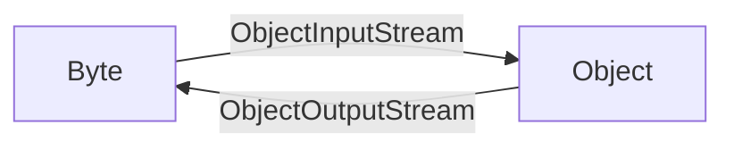

# Serialize/Deserialize Stream

Serialize/Deserialize Stream trong Java (ObjectInputStream và ObjectOutputStream) là một loại stream có thể serialize và deserialize các đối tượng Java.

serialize là quá trình chuyển đổi một đối tượng thành một chuỗi byte (bao gồm `dữ liệu của đối tượng`, `loại đối tượng` và `các thuộc tính lưu trữ trong đối tượng`, v.v.) để truyền qua mạng hoặc lưu vào tệp, hoặc truyền giữa các chương trình. Trong Java, serialize được thực hiện bằng cách triển khai interface java.io.Serializable, chỉ có các đối tượng triển khai [interface Serializable](serializbale) mới có thể được serialize.

Deserialize là quá trình chuyển đổi một chuỗi byte thành một đối tượng để sử dụng trong chương trình.




### 01. ObjectOutputStream

`java.io.ObjectOutputStream` kế thừa từ lớp OutputStream, do đó có thể ghi chuỗi byte đã serialize vào các output stream như tệp, mạng, v.v.

Xem phương thức khởi tạo của ObjectOutputStream:
`ObjectOutputStream(OutputStream out)`

Phương thức khởi tạo này nhận một đối tượng OutputStream làm tham số, dùng để ghi chuỗi byte đã serialize vào output stream được chỉ định. Ví dụ:

```java
FileOutputStream fos = new FileOutputStream("file.txt");
ObjectOutputStream oos = new ObjectOutputStream(fos);
```

Một đối tượng muốn serialize phải đáp ứng hai điều kiện:

- Lớp đó phải triển khai [interface `java.io.Serializable`](https://javabetter.cn/io/Serializbale.html), nếu không sẽ ném ra ngoại lệ `NotSerializableException`.
- Tất cả các trường của lớp đó phải có khả năng serialize. Nếu một trường không cần serialize, thì cần sử dụng từ khóa [`transient`](https://javabetter.cn/io/transient.html) để đánh dấu.

Ví dụ sử dụng như sau:

```java
public class Employee implements Serializable {
    public String name;
    public String address;
    public transient int age; // Từ khóa transient đánh dấu thành viên này không bị serialize
}
```

Tiếp theo, chúng ta sẽ nói về phương thức `writeObject (Object obj)`, phương thức này trong lớp ObjectOutputStream được sử dụng để serialize một đối tượng thành chuỗi byte và ghi vào output stream. Nó có thể xử lý các mối quan hệ tham chiếu giữa các đối tượng, quan hệ kế thừa, các trường tĩnh và các trường transient.

```java
public class ObjectOutputStreamDemo {
    public static void main(String[] args) {
        Person person = new Person("Tom", 20);
        try {
            FileOutputStream fos = new FileOutputStream("logs/person.dat");
            ObjectOutputStream oos = new ObjectOutputStream(fos);
            oos.writeObject(person);
            oos.close();
        } catch (IOException e) {
            e.printStackTrace();
        }
    }
}
class Person implements Serializable {
    private String name;
    private int age;

    public Person(String name, int age) {
        this.name = name;
        this.age = age;
    }

    public String getName() {
        return name;
    }

    public int getAge() {
        return age;
    }
}
```

Trong đoạn mã trên, đầu tiên chúng ta tạo một đối tượng Person, sau đó sử dụng FileOutputStream và ObjectOutputStream để serialize đối tượng Person và ghi vào tệp person.dat. Trong lớp Person, chúng ta đã triển khai interface Serializable, cho phép lớp này có thể serialize đối tượng.

### 02. ObjectInputStream

ObjectInputStream có thể đọc byte stream do ObjectOutputStream ghi lại và deserialize nó thành các đối tượng tương ứng (bao gồm `dữ liệu của đối tượng`, `loại đối tượng` và `các thuộc tính lưu trữ trong đối tượng`, v.v.).

Nói đơn giản, trước khi serialize đối tượng như thế nào thì sau khi deserialize đối tượng sẽ như thế.

Hãy xem phương thức khởi tạo: `ObjectInputStream(InputStream in)`: Tạo một ObjectInputStream từ InputStream được chỉ định.

Phương thức readObject của ObjectInputStream dùng để đọc đối tượng từ tệp được chỉ định, ví dụ như sau:

```java
String filename = "logs/person.dat"; // Tên tệp cần deserialize
try (FileInputStream fileIn = new FileInputStream(filename);
     ObjectInputStream in = new ObjectInputStream(fileIn)) {
     // Đọc đối tượng từ input stream được chỉ định và deserialize
     Object obj = in.readObject();
     // Ép kiểu đối tượng sau khi deserialize về kiểu chỉ định
     Person p = (Person) obj;
     // In thông tin đối tượng sau khi deserialize
     System.out.println("Deserialized Object: " + p);
} catch (IOException | ClassNotFoundException e) {
     e.printStackTrace();
}
```

Chúng ta đầu tiên chỉ định tên tệp cần deserialize (đã được serialize bằng ObjectOutputStream trước đó), sau đó tạo một đối tượng FileInputStream và một đối tượng ObjectInputStream. Tiếp theo, chúng ta gọi phương thức readObject của ObjectInputStream để đọc đối tượng từ tệp được chỉ định và ép kiểu đối tượng đó về kiểu Person. Cuối cùng, chúng ta in thông tin đối tượng sau khi deserialize.

### 03. Kryo

Trong thực tế phát triển, rất hiếm khi sử dụng cơ chế serialize và deserialize tích hợp sẵn của JDK, bởi vì:

- Khả năng di chuyển kém: Chỉ dành riêng cho Java, không thể serialize và deserialize giữa các ngôn ngữ khác nhau.
- Hiệu suất kém: Kích thước byte sau serialize lớn, tăng chi phí truyền tải/lưu trữ.
- Vấn đề an ninh: Kẻ tấn công có thể tạo ra dữ liệu độc hại để thực thi mã từ xa, gây ra mối đe dọa nghiêm trọng cho hệ thống. Đọc thêm: [Lỗ hổng Java deserialize](https://cryin.github.io/blog/secure-development-java-deserialization-vulnerability/).

Kryo là một thư viện serialize và deserialize Java tuyệt vời, có hiệu suất cao, hiệu quả và dễ sử dụng cũng như mở rộng, giải quyết hiệu quả những hạn chế của cơ chế serialize tích hợp sẵn của JDK.

> Địa chỉ GitHub: [https://github.com/EsotericSoftware/kryo](https://github.com/EsotericSoftware/kryo)

Ví dụ sử dụng:

Bước đầu tiên, thêm phụ thuộc vào tệp pom.xml.

```xml
<!-- Thêm công cụ serialize Kryo -->
<dependency>
     <groupId>com.esotericsoftware</groupId>
     <artifactId>kryo</artifactId>
     <version>5.4.0</version>
</dependency>
```

Bước thứ hai, tạo một đối tượng Kryo, và sử dụng phương thức `register()` để đăng ký đối tượng. Sau đó, sử dụng phương thức `writeObject()` để serialize đối tượng Java thành binary stream, và sử dụng phương thức `readObject()` để deserialize binary stream thành đối tượng Java. Cuối cùng, xuất đối tượng Java sau khi deserialize.

```java
public class KryoDemo {
    public static void main(String[] args) throws FileNotFoundException {
        Kryo kryo = new Kryo();
        kryo.register(KryoParam.class);

        KryoParam object = new KryoParam("Tom", 123);

        Output output = new Output(new FileOutputStream("logs/kryo.bin"));
        kryo.writeObject(output, object);
        output.close();

        Input input = new Input(new FileInputStream("logs/kryo.bin"));
        KryoParam object2 = kryo.readObject(input, KryoParam.class);
        System.out.println(object2);
        input.close();
    }
}

class KryoParam {
    private String name;
    private int age;

    public KryoParam() {
    }

    public KryoParam(String name, int age) {
        this.name = name;
        this.age = age;
    }

    public String getName() {
        return name;
    }

    public void setName(String name) {
        this.name = name;
    }

    public int getAge() {
        return age;
    }

    public void setAge(int age) {
        this.age = age;
    }

    @Override
    public String toString() {
        return "KryoParam{" +
                "name='" + name + '\'' +
                ", age=" + age +
                '}';
    }
}
```

### 04. Tổng kết

Trong phần này, chúng ta đã giới thiệu cơ chế serialize của Java và đề xuất một thư viện Java hiệu suất cao Kryo để thay thế cơ chế serialize tích hợp sẵn của JDK, hiện đã được sử dụng rộng rãi trong Twitter, Groupon, Yahoo và nhiều dự án mã nguồn mở nổi tiếng khác (như Hive, Storm).

Hy vọng rằng những thông tin trên sẽ hữu ích cho các bạn.