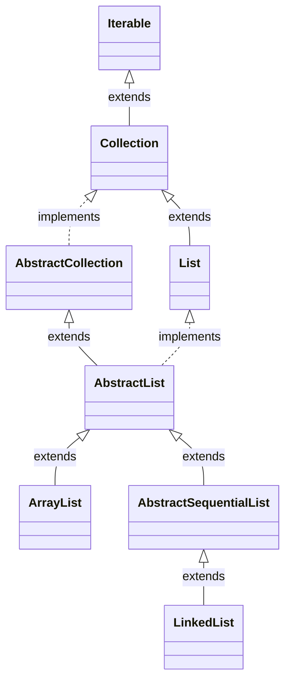

# Iterator vs Iterable

Trong Java, khi ta duyệt qua một List, chúng ta có ba cách chính như sau:

Cách thứ nhất: Sử dụng vòng lặp for.

```java
for (int i = 0; i < list.size(); i++) {
    System.out.print(list.get(i) + "，");
}
```

Cách thứ hai: Sử dụng Iterator.

```java
Iterator it = list.iterator();
while (it.hasNext()) {
    System.out.print(it.next() + "，");
}
```

Cách thứ ba: Sử dụng vòng lặp for-each.

```java
for (String str : list) {
    System.out.print(str + "，");
}
```

Cách thứ nhất chúng ta đã bỏ qua, cách thứ hai sử dụng Iterator, còn cách thứ ba trông giống như là for-each, nhưng thực chất phía sau cũng là sử dụng Iterator, như thể hiện trong mã nguồn sau khi dịch ngược (như dưới đây).

```java
Iterator var3 = list.iterator();

while(var3.hasNext()) {
    String str = (String)var3.next();
    System.out.print(str + "，");
}
```

for-each chỉ là một cú pháp ngọt ngào, giúp các nhà phát triển viết ít mã hơn và dễ hiểu hơn khi duyệt qua List.

Iterator là một interface, đã có từ JDK 1.2, được sử dụng để cải tiến từ Enumeration interface:

- Cho phép xóa phần tử (thêm phương thức remove)
- Tối ưu hóa tên phương thức (Enumeration có hasMoreElements và nextElement, không đơn giản)

Hãy xem mã nguồn của Iterator:

```java
public interface Iterator<E> {
    // Kiểm tra xem trong tập hợp còn phần tử kế tiếp hay không
    boolean hasNext();
    // Trả về phần tử kế tiếp trong tập hợp và di chuyển con trỏ đến phần tử đó
    E next();
    // Xóa phần tử mà phương thức next() đã trả về từ tập hợp
    default void remove() {
        throw new UnsupportedOperationException("remove");
    }
}
```

Trong JDK 1.8, Interface Iterable đã được bổ sung phương thức forEach. Phương thức này nhận vào một đối tượng Consumer làm tham số, dùng để triển khai một hành động cụ thể trên mỗi phần tử trong tập hợp. Cách triển khai của phương thức này là sử dụng vòng lặp for-each để duyệt qua từng phần tử trong tập hợp và gọi phương thức accept của đối tượng Consumer để triển khai hành động cụ thể.

```java
default void forEach(Consumer<? super T> action) {
    Objects.requireNonNull(action);
    for (T t : this) {
        action.accept(t);
    }
}
```

Phương thức này đầu tiên kiểm tra action để đảm bảo không null, nếu null sẽ ném ra ngoại lệ NullPointerException. Sau đó sử dụng vòng lặp for-each để duyệt qua từng phần tử trong tập hợp và gọi action.accept(t) để triển khai hành động cụ thể. Vì Interface Iterable là interface cơ bản của tất cả các loại tập hợp trong Java Collection Framework, nên phương thức này có thể được sử dụng bởi tất cả các loại tập hợp implement Interface Iterable.

Phương thức forEach triển khai một hành động cụ thể trên mỗi phần tử của Iterable, và hành động này cần được chỉ định thông qua một đối tượng Consumer mà bạn tự viết thông qua phương thức accept.

```java
List<Integer> list = new ArrayList<>(Arrays.asList(1, 2, 3));
list.forEach(integer -> System.out.println(integer));
```

Để viết một cách đơn giản và dễ hiểu hơn:

```java
List<Integer> list = new ArrayList<>(Arrays.asList(1, 2, 3));
list.forEach(new Consumer<Integer>() {
    @Override
    public void accept(Integer integer) {
        System.out.println(integer);
    }
});
```

Nếu chúng ta xem xét kỹ hơn trong "hộ chiếu" của ArrayList hoặc LinkedList, chúng ta sẽ không thấy trực tiếp Iterator.



Thay vào đó, chúng ta thấy Interface Iterable!

```java
public interface Iterable<T> {
    Iterator<T> iterator();
}
```

Điều này có nghĩa là trong biểu đồ quan hệ của List không có sử dụng trực tiếp Iterator, mà thay vào đó sử dụng Interface Iterable như một bước trung gian.

Nếu quay lại nhìn vào cách thứ hai để duyệt qua List.

```java
Iterator it = list.iterator();
while (it.hasNext()) {
}
```

Chúng ta thấy sự tương ứng chính xác. Với ArrayList ví dụ, nó ghi đè phương thức iterator của Interface Iterable:

```java
public Iterator<E> iterator() {
    return new Itr();
}
```

Đối tượng trả về Itr là một lớp nội bộ, implement Interface Iterator và ghi đè các phương thức như hasNext, next, remove theo cách của riêng nó.

```java
/**
 * Triển khai Iterator của ArrayList là một lớp nội bộ.
 */
private class Itr implements Iterator<E> {

    /**
     * Vị trí con trỏ, tức là chỉ số của phần tử tiếp theo.
     */
    int cursor;

    /**
     * Chỉ số của phần tử cuối cùng được trả về.
     */
    int lastRet = -1;

    /**
     * Số lần sửa đổi kết cấu dự kiến.
     */
    int expectedModCount = modCount;

    /**
     * Kiểm tra xem có phần tử tiếp theo hay không.
     *
     * @return true nếu có phần tử tiếp theo, ngược lại false.
     */
    public boolean hasNext() {
        return cursor != size;
    }

    /**
     * Lấy phần tử tiếp theo.
     *
     * @return phần tử tiếp theo trong danh sách.
     * @throws NoSuchElementException nếu không có phần tử tiếp theo.
     */
    @SuppressWarnings("unchecked")
    public E next() {
        // Lấy mảng nội bộ của đối tượng ArrayList
        Object[] elementData = ArrayList.this.elementData;
        // Ghi nhận vị trí hiện tại của iterator
        int i = cursor;
        if (i >= size) {
            throw new NoSuchElementException();
        }
        // Di chuyển con trỏ sang phía trước để chuẩn bị cho lần lặp kế tiếp
        cursor = i + 1;
        // Ghi nhận chỉ số của phần tử cuối cùng được trả về
        return (E) elementData[lastRet = i];
    }

    /**
     * Xóa phần tử được trả về cuối cùng.
     * Iterator chỉ có thể xóa phần tử được trả về bởi lần gọi next cuối cùng.
     *
     * @throws ConcurrentModificationException nếu cấu trúc danh sách bị sửa đổi sau lần gọi next cuối cùng.
     * @throws IllegalStateException         nếu phương thức remove được gọi trước next, hoặc nếu remove được gọi nhiều lần trong cùng một lần lặp.
     */
    public void remove() {
        // Kiểm tra xem cấu trúc có bị sửa đổi sau lần gọi next cuối cùng không
        if (expectedModCount != modCount) {
            throw new ConcurrentModificationException();
        }
        // Ném ra IllegalStateException nếu phương thức remove được gọi trước next
        if (lastRet < 0) {
            throw new IllegalStateException();
        }
        try {
            // Gọi phương thức remove(int index) của ArrayList để xóa phần tử được trả về cuối cùng
            ArrayList.this.remove(lastRet);
            // Đặt lại vị trí con trỏ về chỉ số của phần tử cuối cùng
            cursor = lastRet;
            // Đặt lastRet về -1 để chỉ là không có phần tử cuối cùng
            lastRet = -1;
            // Cập nhật số lần sửa đổi kết cấu dự kiến
            expectedModCount = modCount;
        } catch (IndexOutOfBoundsException ex) {
            throw new ConcurrentModificationException();
        }
    }
}
```

Sẽ có thể có bạn sẽ hỏi: tại sao không đơn giản đặt các phương thức cốt lõi hasNext và next của Iterator vào Interface Iterable luôn? Như dưới đây, dùng như này có phải là dễ dàng hơn không?

```java
Iterable it = list.iterator();
while (it.hasNext()) {
}
```

Nếu nhìn vào cú pháp hậu tố của từ tiếng Anh, (Iterable) able cho thấy danh sách này hỗ trợ việc lặp lại, trong khi (Iterator) tor cho thấy danh sách này được lặp lại như thế nào.

Hỗ trợ việc lặp lại và cách thức lặp lại rõ ràng không thể được kết hợp với nhau, nếu không sẽ rối tung. Vẫn tốt hơn là mỗi thứ làm nhiệm vụ riêng của nó.

Hãy nghĩ xem, nếu kết hợp Iterator và Iterable lại, liệu cách duyệt danh sách như for-each có còn hiệu quả không?

Về nguyên tắc, chỉ cần một danh sách triển khai interface Iterable, thì nó có thể sử dụng cách duyệt for-each, nhưng cách triển khai cụ thể của nó phụ thuộc vào cách nó triển khai interface Iterator.

Map không thể sử dụng trực tiếp for-each, vì Map không triển khai interface Iterable, chỉ có thể sử dụng các phương thức như `map.entrySet()`, `map.keySet()`, `map.values()` để sử dụng for-each.

Nếu chúng ta nghiên cứu chi tiết mã nguồn của LinkedList, chúng ta sẽ thấy rằng LinkedList không trực tiếp ghi đè phương thức iterator của interface Iterable, mà thay vào đó, nó được triển khai bởi lớp cha AbstractSequentialList.

```java
public Iterator<E> iterator() {
    return listIterator();
}
```

LinkedList ghi đè phương thức listIterator như sau:

```java
public ListIterator<E> listIterator(int index) {
    checkPositionIndex(index);
    return new ListItr(index);
}
```

Ở đây chúng ta đã phát hiện ra một ListIterator mới, nó kế thừa từ interface Iterator, có thể duyệt danh sách từ bất kỳ chỉ số nào và hỗ trợ duyệt hai chiều.

```java
public interface ListIterator<E> extends Iterator<E> {
    boolean hasNext();
    E next();
    boolean hasPrevious();
    E previous();
}
```

Chúng ta biết, Collection không chỉ có List, mà còn có Set, Iterator không chỉ hỗ trợ List mà còn hỗ trợ Set, nhưng ListIterator chỉ hỗ trợ List.

Sau đó có một số bạn sẽ hỏi: tại sao không cho List triển khai trực tiếp interface Iterator mà lại sử dụng lớp nội bộ để triển khai?

Điều này là vì một số List có thể có nhiều cách thức duyệt khác nhau, ví dụ như LinkedList, ngoài việc hỗ trợ cách thức duyệt theo thứ tự bình thường, nó còn hỗ trợ cách thức duyệt ngược — DescendingIterator:

```java
/**
 * ArrayList Triển khai Iterator ngược, lớp nội bộ.
 */
private class DescendingIterator implements Iterator<E> {

    /**
     * Sử dụng đối tượng ListItr để duyệt ngược.
     */
    private final ListItr itr = new ListItr(size());

    /**
     * Kiểm tra xem còn phần tử tiếp theo hay không.
     *
     * @return Nếu còn phần tử tiếp theo, trả về true, ngược lại trả về false.
     */
    public boolean hasNext() {
        return itr.hasPrevious();
    }

    /**
     * Lấy phần tử tiếp theo.
     *
     * @return Phần tử tiếp theo trong danh sách.
     * @throws NoSuchElementException Nếu không có phần tử tiếp theo, ngoại lệ sẽ được ném.
     */
    public E next() {
        return itr.previous();
    }

    /**
     * Xóa phần tử đã trả về cuối cùng.
     * Iterator chỉ có thể xóa phần tử được trả về lần cuối cùng bởi phương thức next.
     *
     * @throws UnsupportedOperationException Nếu danh sách không hỗ trợ thao tác xóa, ngoại lệ sẽ được ném.
     * @throws IllegalStateException         Nếu trước khi gọi next không gọi remove hoặc nếu gọi remove nhiều lần trong cùng một lần lặp, ngoại lệ sẽ được ném.
     */
    public void remove() {
        itr.remove();
    }
}
```

Như bạn có thể thấy, DescendingIterator sử dụng chính cách duyệt từ ListIterator. Bạn có thể sử dụng nó như sau:

```java
Iterator it = list.descendingIterator();
while (it.hasNext()) {
}
```

Vậy là chúng ta đã nói đủ về Iterator và Iterable. Hãy tổng kết hai điểm chính:

- Hãy học cách suy nghĩ sâu sắc, từng bước một khai phá và suy luận, nhiều vấn đề không phức tạp như chúng ta tưởng.
- Đừng từ bỏ khi gặp khó khăn, đây là cơ hội tốt nhất để cải thiện bản thân, khi giải quyết một vấn đề khó, bạn sẽ khám phá ra rất nhiều điều liên quan.