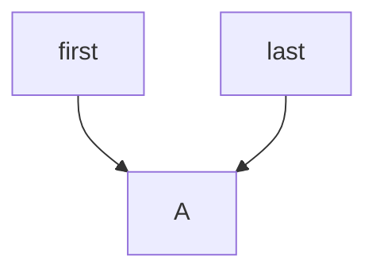

# 6.4 Giải thích chi tiết về LinkedList (Kèm mã nguồn)

Tôi là LinkedList, là đồng môn đệ tử với ArrayList, nhưng chúng tôi lại luyện công nghệ phụ thuộc hoàn toàn khác nhau. Đồng môn luyện công là mảng động, còn tôi luyện công là danh sách liên kết.

Các bạn có biết tại sao tôi lại luyện công nghệ danh sách liên kết này không?

Hãy cùng nhau lấy ví dụ nhé. Giả sử bạn phải quản lý một đống hóa đơn, có thể chỉ có một tờ, cũng có thể có tới một tỷ tờ.

Vậy làm sao đây?

Có phải phải xin một mảng lớn 10G và đợi đấy không? Nhưng nếu chỉ có 100 tờ hóa đơn thì sao?

Hoặc phải xin một mảng mặc định và sau đó mở rộng khi dữ liệu tăng lên? Nhưng mở rộng mảng yêu cầu sao chép lại toàn bộ mảng, tốn rất nhiều thời gian.

Vấn đề chính là mảng có một điểm yếu, nếu có 5 triệu hóa đơn và bạn muốn xóa một hóa đơn ở giữa, bạn phải di chuyển 2,5 triệu hóa đơn sang trái một vị trí.

Khi gặp phải tình huống như thế, đồng môn của tôi gần như đã sụp đổ tinh thần, cảm thấy rất khổ sở. Thầy không chịu được việc nhìn thấy đồng môn thế này, vì thế vào ngày tôi gia nhập môn phái, thầy ép tôi luyện công nghệ danh sách liên kết này. Ban đầu tôi không hiểu, sợ thầy thiên vị, không dạy cho tôi công nghệ mạnh nhất của môn phái.

Cho đến một ngày, tôi chứng kiến đồng môn gần như bị phát điên vì phải di chuyển dữ liệu, tôi mới hiểu được lòng tốt của thầy. Từ đó, tôi cố gắng luyện tập công nghệ danh sách liên kết này và đạt được tiến bộ đáng kể, thầy và đồng môn đều khen tôi có tài năng.

Công nghệ danh sách liên kết có ba cấp độ chính:

- Cấp độ một gọi là "danh sách liên kết đơn", tôi chỉ có một con trỏ sau, chỉ vào dữ liệu kế tiếp;
- Cấp độ hai gọi là "danh sách liên kết hai chiều", tôi có hai con trỏ, con trỏ sau chỉ vào dữ liệu tiếp theo, con trỏ trước chỉ vào dữ liệu trước đó.
- Cấp độ ba gọi là "cây nhị phân", xóa bỏ con trỏ sau, thay thế bằng con trỏ trái và phải.

Nhưng công lực hiện tại của tôi vẫn chưa đạt tới cấp độ ba, nhưng thầy nói rằng tôi có tiềm năng, sớm muộn cũng sẽ luyện thành công nghệ siêu phẩm này.

### 01、Bí quyết nội công của LinkedList

Được rồi, sau khi đã chia sẻ những suy nghĩ của mình như vậy, các bạn đã không còn xa lạ gì với tôi nữa. Bây giờ, hãy để tôi giới thiệu về bí quyết nội công của mình.

Bí quyết nội công chính của tôi là một lớp nội tĩnh riêng tư, được gọi là Node, nghĩa là nút.

```java
/**
 * Lớp nút trong danh sách liên kết.
 */
private static class Node<E> {
    E item; // Phần tử được lưu trữ trong nút
    Node<E> next; // Con trỏ trỏ đến nút kế tiếp
    Node<E> prev; // Con trỏ trỏ đến nút trước đó

    /**
     * Khởi tạo một nút mới.
     *
     * @param prev    Nút trước đó
     * @param element Phần tử cần lưu trữ trong nút
     * @param next    Nút kế tiếp
     */
    Node(Node<E> prev, E element, Node<E> next) {
        this.item = element; // Lưu trữ phần tử
        this.next = next; // Thiết lập nút kế tiếp
        this.prev = prev; // Thiết lập nút trước đó
    }
}
```

Nó bao gồm ba phần chính:

- Phần tử trong nút
- Nút kế tiếp
- Nút trước đó

Hãy xem qua hình tôi vẽ để hiển thị nó cho các bạn.


- Đối với nút đầu tiên, prev là null.
- Đối với nút cuối cùng, next là null.
- Các nút khác có prev trỏ tới nút trước đó và next trỏ tới nút kế tiếp.

Bí quyết nội công của tôi rất đơn giản như vậy, thực ra tôi đã ghi nhớ nó lâu rồi. Nhưng thầy bảo tôi rằng, mỗi sáng thức dậy và mỗi tối lúc đi ngủ, tôi phải thuộc lòng nó một lần. Mặc dù tôi cảm thấy một chút chán nản, nhưng tôi luôn vâng lời thầy về mọi điều dạy bảo.

### 02. Các chiêu thức của LinkedList

Giống như bạn đồng môn ArrayList, các chiêu thức của tôi cũng không thể nào thiếu đi những "thêm, xóa, sửa, tìm kiếm". Trước khi bắt đầu, chúng ta phải khởi tạo danh sách.

```java
LinkedList<String> list = new LinkedList();
```

Trong khi bạn đồng môn có thể chỉ định kích thước trong quá trình khởi tạo hoặc không chỉ định và mở rộng khi thêm phần tử đầu tiên, thì tôi không có kích thước cụ thể. Chỉ cần có đủ bộ nhớ, tôi có thể lớn tới vô tận.

#### 1) Chiêu thứ nhất: Thêm

Bạn có thể gọi phương thức `add` để thêm phần tử:

```java
list.add("A");
list.add("B");
list.add("C");
```

Phương thức `add` thực tế gọi đến phương thức `linkLast`:

```java
/**
 * Thêm một phần tử được chỉ định vào cuối danh sách.
 *
 * @param e phần tử cần thêm vào danh sách
 * @return luôn luôn trả về true (theo quy tắc Java Collection Framework)
 */
public boolean add(E e) {
    linkLast(e); // Thêm phần tử vào cuối danh sách
    return true; // Thêm phần tử thành công, trả về true
}
```

`linkLast`, như tên gọi, là phương thức để thêm phần tử vào cuối danh sách liên kết:

```java
/**
 * Thêm một phần tử vào cuối danh sách.
 *
 * @param e phần tử cần thêm vào danh sách
 */
void linkLast(E e) {
    final Node<E> l = last; // Lấy đối tượng Node cuối cùng của danh sách
    final Node<E> newNode = new Node<>(l, e, null); // Tạo một Node mới và đặt nó làm Node cuối cùng của danh sách
    last = newNode; // Đặt Node mới làm Node cuối cùng của danh sách
    if (l == null) // Nếu danh sách rỗng, đặt Node mới làm Node đầu tiên
        first = newNode;
    else
        l.next = newNode; // Nếu không, liên kết Node mới vào cuối danh sách
    size++; // Tăng kích thước của danh sách
}
```

- Khi thêm phần tử đầu tiên, cả `first` và `last` đều là null.
- Sau đó, tạo một Node mới `newNode`, trong đó `prev` và `next` đều là null.
- Tiếp theo, gán `last` và `first` đều là `newNode`.

Lúc này danh sách vẫn chưa thể được gọi là "liên kết" vì các Node trước và sau vẫn chưa được kết nối với nhau.



- Khi thêm phần tử thứ hai, `first` và `last` đều trỏ đến Node đầu tiên.
- Sau đó, tạo một Node mới `newNode`, trong đó `prev` trỏ đến Node đầu tiên, `next` là null.
- Tiếp theo, gán `next` của Node đầu tiên là `newNode`.

Lúc này danh sách vẫn chưa hoàn chỉnh.

```mermaid
flowchart TD

X[first]
Y[last]
X --> A
X --> B
B --> X
Y --> B
`````

- Khi thêm phần tử thứ ba, `first` trỏ đến Node đầu tiên, `last` trỏ đến Node cuối cùng.
- Sau đó, tạo một Node mới `newNode`, trong đó `prev` trỏ đến Node thứ hai, `next` là null.
- Tiếp theo, gán `next` của Node thứ hai là `newNode`.

Lúc này danh sách đã hoàn chỉnh.

```mermaid
flowchart LR

X[first]
Y[last]

A --> B
B --> C
C --> B
B --> A
Y --> C
X --> A
```

Chiêu thức thêm này của tôi còn có thể biến hóa thành hai phiên bản khác:

- Phương thức `addFirst()` sẽ thêm phần tử vào vị trí đầu tiên;
- Phương thức `addLast()` sẽ thêm phần tử vào cuối danh sách.

Phương thức `addFirst` thực chất gọi đến phương thức `linkFirst`:

```java
/**
 * Thêm phần tử vào đầu danh sách.
 *
 * @param e phần tử cần thêm vào danh sách
 */
public void addFirst(E e) {
    linkFirst(e); // Thêm phần tử vào đầu danh sách
}
```

`linkFirst` thực hiện nhiệm vụ đặt newNode làm `first`, và cập nhật `next` của `newNode` thành `first` trước đó.

```java
/**
 * Thêm phần tử vào đầu danh sách.
 *
 * @param e phần tử cần thêm vào danh sách
 */
private void linkFirst(E e) {
    final Node<E> f = first; // Lấy Node đầu tiên của danh sách
    final Node<E> newNode = new Node<>(null, e, f); // Tạo một Node mới và đặt nó làm Node đầu tiên của danh sách
    first = newNode; // Đặt Node mới làm Node đầu tiên của danh sách
    if (f == null) // Nếu danh sách rỗng, đặt Node mới làm Node cuối cùng
        last = newNode;
    else
        f.prev = newNode; // Nếu không, liên kết Node mới vào đầu danh sách
    size++; // Tăng kích thước của danh sách
}
```

Phương thức `addLast` thực chất không khác gì so với `addFirst`, bên trong gọi `linkLast` đã phân tích ở trước đó.

```java
/**
 * Thêm phần tử vào cuối danh sách.
 *
 * @param e phần tử cần thêm vào danh sách
 * @return luôn luôn trả về true (theo quy tắc Java Collection Framework)
 */
public boolean addLast(E e) {
    linkLast(e); // Thêm phần tử vào cuối danh sách
    return true; // Thêm phần tử thành công, trả về true
}
```

#### 02) Chiêu thứ hai: Xóa

Trong danh sách các chiêu thức của tôi, chiêu xóa là một phần quan trọng với nhiều biến thể khác nhau:

- `remove()` : Xóa nút đầu tiên
- `remove(int)` : Xóa nút tại vị trí chỉ định
- `remove(Object)` : Xóa nút chứa phần tử chỉ định
- `removeFirst()` : Xóa nút đầu tiên
- `removeLast()` : Xóa nút cuối cùng

Phương thức `remove()` thực tế gọi phương thức `removeFirst()`, do đó cả hai có chức năng tương tự.

Phương thức `remove(int)` thực tế gọi phương thức `unlink`:

```java
/**
 * Xóa phần tử tại vị trí chỉ định.
 *
 * @param index chỉ số của phần tử cần xóa
 * @return phần tử bị xóa từ danh sách
 * @throws IndexOutOfBoundsException nếu chỉ số vượt quá giới hạn (index < 0 || index >= size())
 */
public E remove(int index) {
    checkElementIndex(index); // Kiểm tra xem chỉ số có hợp lệ không
    return unlink(node(index)); // Xóa nút tại vị trí chỉ định và trả về phần tử của nút
}
```

Phương thức `unlink` đơn giản là cập nhật `next` và `prev` của nút hiện tại, và đặt phần tử của nút thành `null`:

```java
/**
 * Xóa nút được chỉ định khỏi danh sách liên kết.
 *
 * @param x nút cần xóa
 * @return phần tử của nút đã xóa khỏi danh sách
 */
E unlink(Node<E> x) {
    final E element = x.item; // Lấy phần tử của nút cần xóa
    final Node<E> next = x.next; // Lấy nút tiếp theo của nút cần xóa
    final Node<E> prev = x.prev; // Lấy nút trước đó của nút cần xóa

    if (prev == null) { // Nếu nút cần xóa là nút đầu tiên
        first = next; // Đặt nút đầu tiên của danh sách là nút kế tiếp của nút cần xóa
    } else {
        prev.next = next; // Đặt nút kế tiếp của nút trước đó là nút kế tiếp của nút cần xóa
        x.prev = null; // Đặt nút trước đó của nút cần xóa thành null
    }

    if (next == null) { // Nếu nút cần xóa là nút cuối cùng
        last = prev; // Đặt nút cuối cùng của danh sách là nút trước đó của nút cần xóa
    } else {
        next.prev = prev; // Đặt nút trước đó của nút kế tiếp là nút trước đó của nút cần xóa
        x.next = null; // Đặt nút kế tiếp của nút cần xóa thành null
    }

    x.item = null; // Đặt phần tử của nút cần xóa thành null
    size--; // Giảm số lượng phần tử của danh sách
    return element; // Trả về phần tử của nút đã xóa
}
```

Phương thức `remove(Object)` cũng gọi `unlink` sau khi tìm thấy nút chứa phần tử cần xóa.

Phương thức `removeFirst()` gọi phương thức `unlinkFirst`:

```java
/**
 * Xóa nút đầu tiên trong danh sách và trả về phần tử của nó.
 * Nếu danh sách rỗng, ném ngoại lệ NoSuchElementException.
 *
 * @return phần tử của nút đầu tiên đã xóa
 * @throws NoSuchElementException nếu danh sách rỗng
 */
public E removeFirst() {
    final Node<E> f = first; // Lấy nút đầu tiên của danh sách
    if (f == null) // Nếu danh sách rỗng
        throw new NoSuchElementException(); // Ném ngoại lệ NoSuchElementException
    return unlinkFirst(f); // Gọi unlinkFirst để xóa nút đầu tiên và trả về phần tử của nó
}
```

Phương thức `unlinkFirst` đảm nhận việc xóa nút đầu tiên và đặt `prev` của nút tiếp theo thành null:

```java
/**
 * Xóa nút đầu tiên trong danh sách và trả về phần tử của nó.
 *
 * @param f nút đầu tiên cần xóa
 * @return phần tử của nút đầu tiên đã xóa
 */
private E unlinkFirst(Node<E> f) {
    final E element = f.item; // Lấy phần tử của nút đầu tiên cần xóa
    final Node<E> next = f.next; // Lấy nút kế tiếp của nút đầu tiên cần xóa
    f.item = null; // Đặt phần tử của nút đầu tiên cần xóa thành null
    f.next = null; // Đặt nút kế tiếp của nút đầu tiên cần xóa thành null
    first = next; // Đặt nút đầu tiên của danh sách thành nút kế tiếp của nút đầu tiên cần xóa
    if (next == null) // Nếu danh sách chỉ có một nút
        last = null; // Đặt nút cuối cùng của danh sách thành null
    else
        next.prev = null; // Đặt nút trước đó của nút kế tiếp thành null
    size--; // Giảm kích thước của danh sách
    return element; // Trả về phần tử của nút đầu tiên đã xóa
}
```

Các phương thức `remove()` và `remove(int)` đảm bảo rằng phần tử được xóa khỏi danh sách liên kết một cách hiệu quả và an toàn.

#### 03) Chiêu thứ ba: Thay Đổi

Trong danh sách các chiêu thức của LinkedList, thay đổi là một phần quan trọng và có phương pháp `set()` để thực hiện việc này:

Bạn có thể sử dụng `set()` để cập nhật phần tử tại một vị trí cụ thể, ví dụ:

```java
list.set(0, "Z");
```

Dưới đây là mã nguồn của phương thức `set()`:

```java
/**
 * Thay thế phần tử tại vị trí chỉ định trong danh sách bằng phần tử chỉ định và trả về phần tử ban đầu.
 *
 * @param index vị trí của phần tử cần thay thế (bắt đầu từ 0)
 * @param element phần tử cần chèn vào
 * @return phần tử ban đầu trước khi thay thế
 * @throws IndexOutOfBoundsException nếu chỉ số vượt quá giới hạn (index < 0 || index >= size())
 */
public E set(int index, E element) {
    checkElementIndex(index); // Kiểm tra xem chỉ số có hợp lệ không
    Node<E> x = node(index); // Lấy nút cần thay thế
    E oldVal = x.item; // Lưu lại giá trị ban đầu của phần tử cần thay thế
    x.item = element; // Thay đổi phần tử của nút thành phần tử mới
    return oldVal; // Trả về giá trị ban đầu của phần tử đã thay thế
}
```

Phương thức `node(int index)` đảm bảo việc lấy nút ở vị trí chỉ định trong danh sách liên kết:

```java
/**
 * Lấy nút ở vị trí chỉ định trong danh sách liên kết.
 *
 * @param index vị trí của nút cần lấy (bắt đầu từ 0)
 * @return nút ở vị trí chỉ định
 * @throws IndexOutOfBoundsException nếu chỉ số vượt quá giới hạn (index < 0 || index >= size())
 */
Node<E> node(int index) {
    if (index < (size >> 1)) { // Nếu chỉ số nằm ở phần trước của danh sách
        Node<E> x = first; // Bắt đầu từ nút đầu tiên của danh sách
        for (int i = 0; i < index; i++) // Duyệt qua danh sách từ đầu đến vị trí chỉ định
            x = x.next; // Di chuyển đến nút kế tiếp
        return x; // Trả về nút ở vị trí chỉ định
    } else { // Nếu chỉ số nằm ở phần sau của danh sách
        Node<E> x = last; // Bắt đầu từ nút cuối của danh sách
        for (int i = size - 1; i > index; i--) // Duyệt qua danh sách từ cuối về vị trí chỉ định
            x = x.prev; // Di chuyển đến nút trước đó
        return x; // Trả về nút ở vị trí chỉ định
    }
}
```

Phương thức `node(int index)` sử dụng phép dịch phải `size >> 1` để quyết định lấy nút từ đầu hay từ cuối danh sách. Điều này giúp tối ưu hóa việc truy cập đến nút trong danh sách liên kết.

Với phương thức `set()`, bạn có thể dễ dàng thay đổi phần tử tại vị trí chỉ định trong LinkedList một cách hiệu quả và an toàn.

#### 04) LinkedList Các Kỹ Năng Tìm Kiếm

Các chiêu thức tôi sử dụng để tìm kiếm có thể chia thành hai loại:

- `indexOf(Object)` : Tìm vị trí đầu tiên xuất hiện của một phần tử cụ thể.
- `get(int)` : Lấy phần tử tại một vị trí chỉ định trong danh sách.

Dưới đây là mã nguồn của phương thức `indexOf`:

```java
/**
 * Trả về vị trí đầu tiên xuất hiện của phần tử cụ thể trong danh sách liên kết,
 * nếu không tìm thấy phần tử thì trả về -1.
 *
 * @param o phần tử cần tìm kiếm
 * @return vị trí đầu tiên của phần tử cụ thể, nếu không tìm thấy thì trả về -1
 */
public int indexOf(Object o) {
    int index = 0; // Khởi tạo chỉ số bằng 0
    if (o == null) { // Nếu phần tử cần tìm là null
        for (Node<E> x = first; x != null; x = x.next) { // Duyệt từ đầu danh sách đến cuối
            if (x.item == null) // Nếu tìm thấy phần tử cần tìm
                return index; // Trả về chỉ số của phần tử
            index++; // Tăng chỉ số lên 1
        }
    } else { // Nếu phần tử cần tìm không phải là null
        for (Node<E> x = first; x != null; x = x.next) { // Duyệt từ đầu danh sách đến cuối
            if (o.equals(x.item)) // Nếu tìm thấy phần tử cần tìm
                return index; // Trả về chỉ số của phần tử
            index++; // Tăng chỉ số lên 1
        }
    }
    return -1; // Nếu không tìm thấy phần tử cần tìm, trả về -1
}
```

Phương thức `get(int)` sử dụng phương thức `node(int)` để lấy nút ở vị trí chỉ định, đã được giới thiệu trước đó.

```java
/**
 * Lấy phần tử tại vị trí chỉ định trong danh sách liên kết.
 *
 * @param index vị trí của phần tử cần lấy (bắt đầu từ 0)
 * @return phần tử tại vị trí chỉ định
 * @throws IndexOutOfBoundsException nếu chỉ số vượt quá giới hạn (index < 0 || index >= size())
 */
public E get(int index) {
    checkElementIndex(index); // Kiểm tra xem chỉ số có hợp lệ không
    return node(index).item; // Trả về phần tử tại vị trí chỉ định
}
```

Trên thực tế, chiêu thức này này cũng có thể phát triển các chiêu thức khác, có giới hạn như:

- `getFirst()` : Lấy phần tử đầu tiên của danh sách.
- `getLast()` : Lấy phần tử cuối cùng của danh sách.
- `poll()` và `pollFirst()` : Xóa và trả về phần tử đầu tiên (hai phương thức này thực chất là giống nhau).
- `pollLast()` : Xóa và trả về phần tử cuối cùng.
- `peekFirst()` : Xem phần tử đầu tiên mà không xóa nó.

### 03. Những thách thức của LinkedList

Dĩ nhiên, tôi không thích so sánh với ArrayList, bởi vì chúng tôi mỗi người có kỹ năng riêng, không ai cao thấp hơn ai.

Dù gọi tôi là em trai, nhưng chúng tôi có mối quan hệ hòa thuận. Tôi biết, trong mắt người khác, các đàn anh luôn phải so kè với nhau.

Ví dụ, chúng tôi khác nhau trong việc thêm, sửa, xóa và tìm kiếm.

Có lẽ đó là số phận, từ khi tôi gia nhập, cuộc tranh luận này chưa bao giờ ngừng lại.

Dù bên ngoài nhìn vào như thế nào, với tôi, đàn anh mãi là đàn anh, tôi kính trọng và anh ấy cũng sẵn sàng bảo vệ tôi.

[Phần tốt nhất sắp bắt đầu](/programming/java/collection/list-war)，hãy chờ xem.

Tôi muốn bắt đầu với một số cú đánh đơn giản, như một cái búa để mời gọi.

Hãy tưởng tượng bạn đang chơi một trò chơi, có một danh mục vật phẩm và bạn cần thêm và xóa các vật phẩm liên tục. Nếu bạn sử dụng đàn anh ArrayList của tôi, mỗi khi bạn thêm hoặc xóa vật phẩm, bạn cần di chuyển các vật phẩm phía sau, điều này tốn rất nhiều thời gian. Nhưng nếu bạn sử dụng tôi LinkedList, bạn chỉ cần chèn vật phẩm mới vào vị trí chỉ định trong danh sách hoặc xóa vật phẩm cần xóa khỏi danh sách, điều này giúp bạn cập nhật danh mục vật phẩm một cách nhanh chóng.

Ngoài danh mục vật phẩm trong trò chơi, tôi LinkedList cũng có thể được sử dụng để thực hiện thuật toán LRU (Least Recently Used) loại bỏ bộ nhớ cache. Thuật toán LRU là một chiến lược loại bỏ cache phổ biến, ý tưởng cơ bản là khi không gian bộ nhớ cache không đủ, ưu tiên loại bỏ dữ liệu cache ít được sử dụng nhất trong thời gian gần đây nhất. Khi bạn thực hiện thuật toán LRU loại bỏ bộ nhớ cache, bạn có thể sử dụng tôi LinkedList để lưu trữ dữ liệu cache, mỗi khi truy cập dữ liệu cache, di chuyển dữ liệu đó từ danh sách liên kết và xóa nó ra khỏi danh sách, điều này giúp danh sách cuối là cache dữ liệu ít được sử dụng nhất trong thời gian gần đây nhất, khi không gian bộ nhớ cache không đủ, bạn chỉ cần loại bỏ dữ liệu cuối cùng của danh sách cache là được.

Tóm lại, mỗi loại công cụ đều có lợi thế riêng của nó, và hãy trân trọng từng giây phút đi cùng chúng.