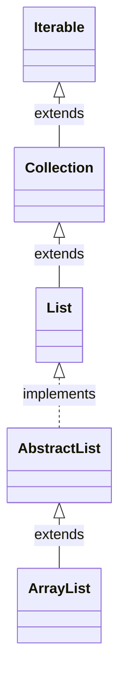
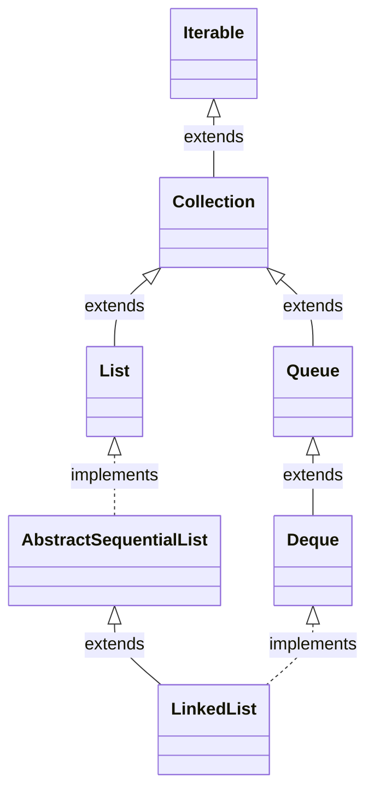

# So sánh ArrayList vs LinkedList

### 01. ArrayList được triển khai như thế nào?

ArrayList triển khai interface List và kế thừa lớp trừu tượng AbstractList.


Nó được triển khai dưới dạng một mảng và hỗ trợ việc mở rộng động (dynamic resizing). Khi cần thêm một phần tử mới và mảng `elementData` đã đầy, ArrayList sẽ tự động mở rộng mảng này lên 1.5 lần dung lượng hiện tại. Hãy xem một số mã nguồn của ArrayList.

```java
public class ArrayList<E> extends AbstractList<E>
        implements List<E>, RandomAccess, Cloneable, java.io.Serializable {
    private static final int DEFAULT_CAPACITY = 10; // Dung lượng mặc định là 10
    transient Object[] elementData; // Mảng lưu trữ các phần tử, kiểu dữ liệu là Object
    private int size; // Kích thước danh sách, tức số lượng phần tử trong danh sách
}
```

ArrayList cũng triển khai interface RandomAccess, đây là một interface đánh dấu:

```java
public interface RandomAccess {
}
```

Nó rỗng và đánh dấu "Các lớp triển khai interface này hỗ trợ truy cập ngẫu nhiên nhanh chóng (thường là thời gian cố định)". Truy cập ngẫu nhiên nhanh chóng có nghĩa là gì? Đó là bạn có thể truy cập vào địa chỉ bộ nhớ trực tiếp thông qua chỉ số (index) mà không cần phải duyệt qua từng phần tử. Trong khi đó, LinkedList không triển khai interface này, điều này cho biết nó không hỗ trợ truy cập ngẫu nhiên hiệu quả và cần phải duyệt qua từng phần tử để truy cập.

```java
/**
 * Trả về phần tử ở vị trí chỉ định trong danh sách.
 *
 * @param index Chỉ số của phần tử cần trả về
 * @return Phần tử ở vị trí chỉ định trong danh sách
 * @throws IndexOutOfBoundsException Nếu chỉ số vượt quá giới hạn (index < 0 || index >= size())
 */
public E get(int index) {
    Objects.checkIndex(index, size); // Kiểm tra xem chỉ số có vượt quá giới hạn không
    return elementData(index); // Gọi phương thức elementData để lấy phần tử
}

/**
 * Trả về phần tử ở vị trí chỉ định trong danh sách.
 * Chú ý: Phương thức này không kiểm tra xem chỉ số có vượt quá giới hạn không, cần kiểm tra trước khi gọi phương thức này.
 *
 * @param index Chỉ số của phần tử cần trả về
 * @return Phần tử ở vị trí chỉ định trong danh sách
 */
E elementData(int index) {
    return (E) elementData[index]; // Ép kiểu từ Object sang E
}
```

ArrayList cũng triển khai interface Cloneable, cho biết nó hỗ trợ sao chép. ArrayList thực sự ghi đè phương thức `clone()` của lớp Object.

```java
/**
 * Trả về một bản sao của danh sách này.
 * (Các phần tử chính nó không được sao chép.)
 *
 * @return Một bản sao của danh sách này
 */
public Object clone() {
    try {
        ArrayList<?> v = (ArrayList<?>) super.clone(); // Gọi phương thức clone() của lớp Object để nhận bản sao nông (shallow copy)
        v.elementData = Arrays.copyOf(elementData, size); // Sao chép mảng elementData và tạo một mảng mới làm bản sao
        v.modCount = 0; // Đặt modCount về 0
        return v; // Trả về bản sao
    } catch (CloneNotSupportedException e) {
        // Không nên xảy ra, vì chúng ta đã implement Cloneable
        throw new InternalError(e);
    }
}
```

ArrayList cũng triển khai interface Serializable, cũng là một interface đánh dấu:

```java
public interface Serializable {
}
```

Nội dung của nó cũng rỗng và đánh dấu "Các lớp triển khai interface này hỗ trợ tuần tự hóa". Tuần tự hóa trong Java có nghĩa là gì? Tuần tự hóa là quá trình chuyển đổi đối tượng thành một chuỗi byte biểu diễn, trong đó chuỗi byte này bao gồm các trường và phương thức của đối tượng. Đối tượng được tuần tự hóa có thể được lưu trữ vào cơ sở dữ liệu, lưu vào tệp hoặc truyền qua mạng.

Các bạn cẩn thận nhận thấy, trường quan trọng elementData trong ArrayList sử dụng từ khóa [transient](/io/transient) để chỉ định, từ khóa này có tác dụng là không tuần tự hóa trường đó.

Điều này không phải là mâu thuẫn sao? Một lớp nếu đã triển khai interface Serializable thì nhất định là muốn được tuần tự hóa, phải không? Vậy tại sao trường elementData chứa dữ liệu quan trọng lại không muốn được tuần tự hóa?

Để giải thích điều này, chúng ta cần bắt đầu từ "ArrayList được triển khai dựa trên mảng". Mọi người đều biết rằng, mảng có độ dài cố định, nghĩa là một khi đã được khai báo, độ dài (dung lượng) sẽ cố định và không thể linh hoạt như một số thứ khác. Điều này rất phiền não, một khi mảng đã đầy, sẽ không thể thêm phần tử mới vào được.

ArrayList không muốn sống như mảng, nó muốn linh hoạt và mở rộng. Vì vậy nó triển khai mở rộng động. Một khi thêm phần tử, nếu độ dài `s == elementData.length` đã đầy, sẽ mở rộng theo 1.5 lần của mảng ban đầu (`oldCapacity >> 1`). Sau khi mở rộng, sẽ sao chép lại mảng cũ sang địa chỉ bộ nhớ mới `Arrays.copyOf(elementData, newCapacity)`.

Phần mã nguồn này chúng ta đã từng nói khi trước đó ở [ArrayList](arraylist)，nó đã được giải thích rất rõ ràng.

**Mở rộng động có nghĩa là gì?**

Nó có nghĩa là kích thước thực tế của mảng có thể không bao giờ bị đầy, luôn luôn có một phần trống.

Ví dụ, mảng mặc định là 10, khi thêm phần tử thứ 11, mảng sẽ mở rộng lên 1.5 lần, tức là 15. Điều này có nghĩa là vẫn còn 4 khoảng trống trong bộ nhớ, phải không?

Khi tuần tự hóa, nếu tuần tự hóa toàn bộ mảng thì có nghĩa là đang tuần tự hóa thêm 4 khoảng trống trong bộ nhớ. Khi lưu trữ một số lượng phần tử rất lớn, các khoảng trống không sử dụng sẽ rất lớn, khiến thời gian tuần tự hóa tăng lên đáng kể.

Do đó, ArrayList đã đưa ra một quyết định thông minh và vui vẻ bằng cách cung cấp hai phương thức riêng tư là writeObject và readObject để triển khai tuần tự hóa và giải tuần tự hóa.

```java
/**
 * Ghi dữ liệu của danh sách này vào ObjectOutputStream chỉ định.
 * (Tức là, lưu trữ danh sách này vào luồng.)
 *
 * @param s Luồng để ghi dữ liệu vào
 * @throws java.io.IOException Nếu xảy ra lỗi khi ghi vào luồng
 */
private void writeObject(java.io.ObjectOutputStream s)
        throws java.io.IOException {
    s.defaultWriteObject(); // Ghi các trường mặc định của đối tượng

    // Ghi ra size để phù hợp với hành vi của phương thức clone()
    s.writeInt(size); // Ghi ra size

    // Ghi ra tất cả các phần tử theo thứ tự đúng đắn
    for (int i=0; i<size; i++) {
        s.writeObject(elementData[i]); // Ghi từng phần tử trong mảng elementData
    }
}
```

Từ mã nguồn của phương thức writeObject, chúng ta có thể thấy rằng nó sử dụng size thực của ArrayList, chứ không phải chiều dài của mảng (elementData.length), như giới hạn của các phần tử được tuần tự hóa.

Có nên có tiếng vỗ tay không nhỉ? Không phải vì tôi, mà vì các tác giả mã nguồn Java, họ thật sự là quá xuất sắc, chỉ có thể dùng hai từ để mô tả họ —— chuyên tâm và tiếp tục hoàn thiện.

Đây là mã nguồn của phương thức readObject:

```java
/**
 * Đọc dữ liệu của danh sách này từ ObjectInputStream chỉ định.
 * (Tức là, khôi phục danh sách này từ luồng.)
 *
 * @param s Luồng từ đó đọc dữ liệu của danh sách này
 * @throws java.io.IOException Nếu xảy ra lỗi khi đọc từ luồng
 * @throws ClassNotFoundException Nếu không tìm thấy lớp khi đọc từ luồng
 */
private void readObject(java.io.ObjectInputStream s)
        throws java.io.IOException, ClassNotFoundException {
    elementData = EMPTY_ELEMENTDATA; // Khởi tạo mảng elementData là mảng rỗng

    // Đọc các trường mặc định
    s.defaultReadObject();

    // Đọc dung lượng, giá trị này được bỏ qua, vì trong ArrayList, dung lượng và chiều dài là hai khái niệm khác nhau
    s.readInt();

    if (size > 0) {
        // Cấp phát một mảng elementData mới, kích thước là size
        ensureCapacityInternal(size);

        Object[] a = elementData;
        // Đọc từng phần tử ở luồng và lưu vào mảng
        for (int i=0; i<size; i++) {
            a[i] = s.readObject(); // Đọc đối tượng và lưu vào mảng elementData
        }
    }
}
```


### 02. LinkedList được triển khai như thế nào?

LinkedList là một danh sách liên kết hai chiều kế thừa từ AbstractSequentialList, do đó nó có thể được sử dụng như một ngăn xếp, hàng đợi hoặc hàng đợi hai đầu.



Hãy xem một phần mã nguồn của LinkedList:

```java
public class LinkedList<E>
    extends AbstractSequentialList<E>
    implements List<E>, Deque<E>, Cloneable, java.io.Serializable
{
    transient int size = 0; // Số lượng nút trong danh sách liên kết
    transient Node<E> first; // Con trỏ đến nút đầu tiên trong danh sách
    transient Node<E> last; // Con trỏ đến nút cuối cùng trong danh sách

    // ...
}
```

Trong LinkedList, có định nghĩa một nút Node bao gồm 3 phần: nội dung phần tử item, tham chiếu prev trỏ tới phần tử trước đó và tham chiếu next trỏ tới phần tử sau. Điều này đã được giải thích trong bài viết về LinkedList, vì vậy ở đây tôi sẽ bỏ qua phần này.

LinkedList cũng triển khai interface Cloneable, cho thấy nó hỗ trợ việc sao chép.

LinkedList cũng triển khai interface Serializable, cho thấy nó hỗ trợ tuần tự hóa. Những bạn sáng suốt nhắm mắt sẽ lại chú ý, các trường quan trọng size, first và last trong LinkedList đều được đánh dấu bằng từ khóa transient. Điều này có mâu thuẫn không? Liệu LinkedList có muốn tuần tự hóa hay không?

Đáp án là LinkedList muốn tuần tự hóa theo cách riêng của nó, hãy xem phương thức `writeObject()` mà nó tự triển khai:

```java
private void writeObject(java.io.ObjectOutputStream s)
        throws java.io.IOException {
    // Ghi các đánh dấu tuần tự mặc định
    s.defaultWriteObject();

    // Ghi số lượng nút trong danh sách liên kết
    s.writeInt(size);

    // Ghi tất cả các phần tử theo thứ tự đúng
    for (LinkedList.Node<E> x = first; x != null; x = x.next)
        s.writeObject(x.item);
}
```

Bạn đã thấy chưa? Khi tuần tự hóa, LinkedList chỉ lưu nội dung của phần tử item, không lưu các tham chiếu phần tử trước và sau. Điều này giúp tiết kiệm không ít không gian bộ nhớ, phải không?

Nhưng có một số bạn có thể đặt câu hỏi, chỉ lưu nội dung phần tử, không lưu các tham chiếu phần tử trước và sau, vậy khi giải tuần tự hóa thì làm sao?

```java
private void readObject(java.io.ObjectInputStream s)
        throws java.io.IOException, ClassNotFoundException {
    // Đọc các đánh dấu tuần tự mặc định
    s.defaultReadObject();

    // Đọc số lượng nút trong danh sách liên kết
    int size = s.readInt();

    // Đọc tất cả các phần tử theo thứ tự đúng
    for (int i = 0; i < size; i++)
        linkLast((E)s.readObject()); // Đọc phần tử và thêm vào cuối danh sách
}

void linkLast(E e) {
    final LinkedList.Node<E> l = last;
    final LinkedList.Node<E> newNode = new LinkedList.Node<>(l, e, null);
    last = newNode; // Đặt nút mới làm nút cuối của danh sách
    if (l == null)
        first = newNode; // Nếu danh sách rỗng, đặt nút mới làm nút đầu tiên của danh sách
    else
        l.next = newNode; // Ngược lại, nối nút mới vào cuối danh sách
    size++; // Tăng số lượng nút
}
```

Lưu ý phương thức `linkLast()` trong vòng lặp for, nó có thể tái thiết lập liên kết của danh sách liên kết, phục hồi thứ tự của danh sách trước khi nó được tuần tự hóa. Thật tuyệt vời, phải không?

So với ArrayList, LinkedList không triển khai interface RandomAccess, vì LinkedList lưu trữ dữ liệu ở các địa chỉ bộ nhớ không liên tục, do đó không hỗ trợ truy cập ngẫu nhiên.

### 03. Thêm mới phần tử: ArrayList vs LinkedList

Chúng ta đã từng từng tìm hiểu về cách ArrayList và LinkedList triển khai và các đặc điểm riêng của chúng. Bây giờ chúng ta sẽ nói về việc thêm mới phần tử vào ArrayList và LinkedList để tìm hiểu xem cái nào nhanh hơn.

#### **1) ArrayList**

ArrayList có hai trường hợp thêm mới phần tử, một là thêm phần tử vào cuối mảng và hai là chèn phần tử vào vị trí chỉ định.

**Thêm vào cuối mảng:**

```java
public boolean add(E e) {
    add(e, elementData, size);
    return true;
}

private void add(E e, Object[] elementData, int s) {
    if (s == elementData.length)
        elementData = grow(); // Mở rộng mảng nếu cần
    elementData[s] = e; // Thêm phần tử vào cuối mảng
    size = s + 1; // Tăng số lượng phần tử
}
```

Rất đơn giản, trước tiên kiểm tra xem có cần phải mở rộng không, sau đó thêm phần tử vào cuối mảng bằng cách sử dụng chỉ số.

**Chèn vào vị trí chỉ định:**

```java
public void add(int index, E element) {
    rangeCheckForAdd(index); // Kiểm tra vị trí chèn có hợp lệ không
    final int s; // Số lượng phần tử hiện tại
    Object[] elementData; // Mảng các phần tử
    if ((s = size) == (elementData = this.elementData).length) // Nếu mảng đã đầy thì mở rộng
        elementData = grow();
    System.arraycopy(elementData, index,
            elementData, index + 1,
            s - index); // Di chuyển các phần tử ở vị trí chèn trở đi sang phải một vị trí
    elementData[index] = element; // Chèn phần tử mới vào vị trí chỉ định
    size = s + 1; // Tăng số lượng phần tử
}
```

Trước tiên kiểm tra xem vị trí chèn có hợp lệ không, sau đó kiểm tra xem có cần phải mở rộng không, di chuyển các phần tử ở vị trí chèn trở đi sang phải một vị trí và cuối cùng chèn phần tử mới vào vị trí chỉ định bằng cách sử dụng chỉ số.

#### **2) LinkedList**

LinkedList cũng có hai trường hợp thêm mới phần tử, một là thêm phần tử vào cuối danh sách và hai là chèn phần tử vào vị trí chỉ định.

**Thêm vào cuối danh sách:**

```java
public boolean add(E e) {
    linkLast(e); // Thêm phần tử vào cuối danh sách liên kết
    return true;
}

void linkLast(E e) {
    final LinkedList.Node<E> l = last; // Lấy đối tượng Node cuối cùng trong danh sách liên kết
    final LinkedList.Node<E> newNode = new LinkedList.Node<>(l, e, null); // Tạo đối tượng Node mới
    last = newNode; // Đặt đối tượng Node mới làm đuôi của danh sách liên kết
    if (l == null)
        first = newNode; // Nếu danh sách rỗng, đặt đối tượng Node mới làm đầu danh sách
    else
        l.next = newNode; // Ngược lại, nối đối tượng Node mới vào cuối danh sách
    size++; // Tăng số lượng Node
}
```

Đầu tiên lấy đối tượng Node cuối cùng lưu vào biến tạm l, sau đó tạo một Node mới và gán cho last. Nếu l là null thì đặt Node mới làm đầu danh sách, ngược lại nối Node mới vào cuối danh sách.

**Chèn vào vị trí chỉ định:**

```java
public void add(int index, E element) {
    checkPositionIndex(index); // Kiểm tra vị trí chèn có hợp lệ không

    if (index == size)
        linkLast(element); // Nếu chèn vào cuối danh sách, triển khai thêm vào cuối danh sách
    else
        linkBefore(element, node(index)); // Ngược lại, triển khai chèn phần tử vào vị trí chỉ định
}

LinkedList.Node<E> node(int index) {
    if (index < (size >> 1)) { // Nếu vị trí chèn ở nửa đầu của danh sách
        LinkedList.Node<E> x = first;
        for (int i = 0; i < index; i++)
            x = x.next;
        return x;
    } else { // Ngược lại, vị trí chèn ở nửa sau của danh sách
        LinkedList.Node<E> x = last;
        for (int i = size - 1; i > index; i--)
            x = x.prev;
        return x;
    }
}

void linkBefore(E e, LinkedList.Node<E> succ) {
    final LinkedList.Node<E> pred = succ.prev; // Lấy đối tượng Node trước vị trí chèn
    final LinkedList.Node<E> newNode = new LinkedList.Node<>(pred, e, succ); // Tạo đối tượng Node mới
    succ.prev = newNode; // Nối đối tượng Node mới vào sau đối tượng Node succ
    if (pred == null)
        first = newNode; // Nếu đối tượng Node trước là null, đặt đối tượng Node mới làm đầu danh sách
    else
        pred.next = newNode; // Ngược lại, nối đối tượng Node mới vào trước đối tượng Node pred
    size++; // Tăng số lượng Node
}
```

Đầu tiên kiểm tra vị trí chèn có hợp lệ không, sau đó kiểm tra xem có chèn vào cuối danh sách không, nếu có thì gọi phương thức `linkLast()` để thêm vào cuối danh sách, ngược lại triển khai phương thức `linkBefore()`.

Trước khi triển khai phương thức `linkBefore()`, sẽ gọi phương thức `node()` để tìm đối tượng Node tại vị trí chỉ định, bước này cần duyệt qua LinkedList. Nếu vị trí chèn ở nửa đầu của danh sách, duyệt từ đầu danh sách. Ngược lại, duyệt ở cuối danh sách.

Sau khi tìm được đối tượng Node tại vị trí chỉ định (tham số succ), tiếp tục triển khai phương thức `linkBefore()`, lấy đối tượng Node trước đó (pred) gán vào biến tạm, sau đó tạo một Node mới và nối vào sau succ. Nếu pred là null thì đặt Node mới làm đầu danh sách, ngược lại nối Node mới vào trước pred.


Sau khi phân tích mã nguồn, có thể bạn đã nghĩ rằng: "Có vẻ như ArrayList không nhất thiết luôn thấp hiệu suất hơn LinkedList khi thêm mới phần tử!"

Khi cả hai có cùng độ dài ban đầu:

- Nếu thêm phần tử ở đầu của tập hợp, thời gian mà ArrayList mất có thể nhiều hơn LinkedList, bởi vì cần sao chép các phần tử phía sau đầu.

Hãy thử nghiệm:

```java
public class ArrayListTest {
    public static void addFromHeaderTest(int num) {
        ArrayList<String> list = new ArrayList<String>(num);
        int i = 0;

        long timeStart = System.currentTimeMillis();

        while (i < num) {
            list.add(0, i + "abcd");
            i++;
        }
        long timeEnd = System.currentTimeMillis();

        System.out.println("Thời gian thêm phần tử ở đầu của ArrayList: " + (timeEnd - timeStart));
    }
}

public class LinkedListTest {
    public static void addFromHeaderTest(int num) {
        LinkedList<String> list = new LinkedList<String>();
        int i = 0;
        long timeStart = System.currentTimeMillis();
        while (i < num) {
            list.addFirst(i + "abcd");
            i++;
        }
        long timeEnd = System.currentTimeMillis();

        System.out.println("Thời gian thêm phần tử ở đầu của LinkedList: " + (timeEnd - timeStart));
    }
}
```

Với num là 10000, kết quả thực tế sau khi thử nghiệm là:

```
Thời gian thêm phần tử ở đầu của ArrayList: 595
Thời gian thêm phần tử ở đầu của LinkedList: 15
```

Lúc này, ArrayList mất nhiều thời gian hơn rất nhiều so với LinkedList.

- Nếu thêm phần tử ở giữa của tập hợp, thời gian mà ArrayList mất có thể ít hơn LinkedList, bởi vì LinkedList cần phải duyệt qua các phần tử.

Hãy xem mã kiểm tra:

```java
public class ArrayListTest {
    public static void addFromMidTest(int num) {
        ArrayList<String> list = new ArrayList<String>(num);
        int i = 0;

        long timeStart = System.currentTimeMillis();
        while (i < num) {
            int temp = list.size();
            list.add(temp / 2, i + "abcd");
            i++;
        }
        long timeEnd = System.currentTimeMillis();

        System.out.println("Thời gian thêm phần tử ở giữa của ArrayList: " + (timeEnd - timeStart));
    }
}

public class LinkedListTest {
    public static void addFromMidTest(int num) {
        LinkedList<String> list = new LinkedList<String>();
        int i = 0;
        long timeStart = System.currentTimeMillis();
        while (i < num) {
            int temp = list.size();
            list.add(temp / 2, i + "abcd");
            i++;
        }
        long timeEnd = System.currentTimeMillis();

        System.out.println("Thời gian thêm phần tử ở giữa của LinkedList: " + (timeEnd - timeStart));
    }
}
```

Với num là 10000, kết quả thực tế sau khi thử nghiệm là:

```
Thời gian thêm phần tử ở giữa của ArrayList: 16
Thời gian thêm phần tử ở giữa của LinkedList: 114
```

ArrayList mất ít thời gian hơn rất nhiều so với LinkedList.

- Nếu thêm phần tử ở cuối của tập hợp, thời gian mà ArrayList mất có thể ít hơn LinkedList, bởi vì mảng là một khoảng không gian bộ nhớ liên tục, không cần phải sao chép mảng; trong khi đó LinkedList cần tạo đối tượng mới và sắp xếp lại các tham chiếu.

Hãy xem mã kiểm tra:

```java
public class ArrayListTest {
    public static void addFromTailTest(int num) {
        ArrayList<String> list = new ArrayList<String>(num);
        int i = 0;

        long timeStart = System.currentTimeMillis();

        while (i < num) {
            list.add(i + "abcd");
            i++;
        }

        long timeEnd = System.currentTimeMillis();

        System.out.println("Thời gian thêm phần tử ở cuối của ArrayList: " + (timeEnd - timeStart));
    }
}

public class LinkedListTest {
    public static void addFromTailTest(int num) {
        LinkedList<String> list = new LinkedList<String>();
        int i = 0;
        long timeStart = System.currentTimeMillis();
        while (i < num) {
            list.add(i + "abcd");
            i++;
        }
        long timeEnd = System.currentTimeMillis();

        System.out.println("Thời gian thêm phần tử ở cuối của LinkedList: " + (timeEnd - timeStart));
    }
}
```

Với num là 10000, kết quả thực tế sau khi thử nghiệm là:

```
Thời gian thêm phần tử ở cuối của ArrayList: 69
Thời gian thêm phần tử ở cuối của LinkedList: 193
```

ArrayList mất ít thời gian hơn một chút so với LinkedList.

Những kết quả này có vẻ không phù hợp với dự đoán của bạn phải không? Trong khi thêm phần tử, ArrayList có hiệu suất tốt hơn LinkedList ở hai trường hợp (thêm phần tử ở giữa, ở cuối), chỉ có trường hợp thêm phần tử ở đầu mà LinkedList tốt hơn, do sự sao chép của mảng.

Tuy nhiên, nếu phải mở rộng mảng, hiệu suất của ArrayList sẽ không được lợi hại như vậy, bởi vì lúc đó cũng cần phải sao chép mảng.

### 04. Xóa phần tử: Ai nhanh hơn?

#### **1）ArrayList**

Khi xóa phần tử trong ArrayList, có hai cách thức chính. Một là xóa trực tiếp phần tử (`remove(Object)`), cần phải duyệt qua mảng để tìm chỉ số của phần tử. Hai là xóa theo chỉ số (`remove(int)`).

Hãy xem mã nguồn (thực ra đã nói ở trước đó, đây là để làm lại):

```java
public boolean remove(Object o) {
    final Object[] es = elementData; // Lấy mảng các phần tử
    final int size = this.size; // Lấy kích thước của mảng
    int i = 0;
    found: {
        if (o == null) {
            for (; i < size; i++)
                if (es[i] == null)
                    break found;
        } else {
            for (; i < size; i++)
                if (o.equals(es[i]))
                    break found;
        }
        return false;
    }
    fastRemove(es, i); // Gọi phương thức fastRemove để xóa phần tử nhanh
    return true;
}

public E remove(int index) {
    Objects.checkIndex(index, size); // Kiểm tra xem chỉ số có vượt quá giới hạn không
    final Object[] es = elementData; // Lấy mảng các phần tử

    oldValue = (E) es[index]; // Lấy phần tử cần xóa
    fastRemove(es, index); // Gọi phương thức fastRemove để xóa phần tử nhanh

    return oldValue; // Trả về phần tử đã xóa
}
```

Về bản chất, hai phương thức này là giống nhau, cuối cùng đều gọi đến phương thức `fastRemove(Object, int)`.

```java
private void fastRemove(Object[] es, int i) {
    final int newSize;
    if ((newSize = size - 1) > i) // Nếu không phải xóa phần tử cuối cùng
        System.arraycopy(es, i + 1, es, i, newSize - i); // Di chuyển các phần tử phía sau phần tử cần xóa lên trước đó
    es[size = newSize] = null; // Đặt phần tử cuối cùng thành null để giúp thu gom rác
}
```

Từ mã nguồn có thể thấy, nếu không phải xóa phần tử cuối cùng, mảng sẽ phải di chuyển lại. Chi phí của việc xóa phần tử sẽ tăng lên nếu phần tử cần xóa ở vị trí đầu tiên.

#### **2）LinkedList**

Khi xóa phần tử trong LinkedList, có bốn cách thức thường dùng:

- `remove(int)`: Xóa phần tử ở vị trí chỉ định

```java
public E remove(int index) {
    checkElementIndex(index);
    return unlink(node(index));
}
```

Đầu tiên kiểm tra chỉ số, sau đó gọi phương thức `node(int)` (như thêm phần tử, cắt ngang đầu cuối) để tìm nút Node, sau đó gọi `unlink(Node)` để hủy liên kết nút, đồng thời cập nhật liên kết sau của nút trước và liên kết trước của nút sau:

```java
E unlink(Node<E> x) {
    final E element = x.item; // Lấy phần tử cần xóa
    final Node<E> next = x.next; // Lấy nút kế tiếp của nút cần xóa
    final Node<E> prev = x.prev; // Lấy nút trước của nút cần xóa

    if (prev == null) { // Nếu nút cần xóa là nút đầu tiên
        first = next; // Cập nhật nút đầu thành nút kế tiếp của nút cần xóa
    } else {
        prev.next = next; // Cập nhật nút kế tiếp của nút trước thành nút kế tiếp của nút cần xóa
        x.prev = null; // Đặt liên kết trước của nút cần xóa thành null để giúp thu gom rác
    }

    if (next == null) { // Nếu nút cần xóa là nút cuối cùng
        last = prev; // Cập nhật nút cuối thành nút trước của nút cần xóa
    } else {
        next.prev = prev; // Cập nhật nút trước của nút kế tiếp của nút cần xóa thành nút trước của nút cần xóa
        x.next = null; // Đặt liên kết kế tiếp của nút cần xóa thành null để giúp thu gom rác
    }

    x.item = null; // Đặt phần tử của nút cần xóa thành null để giúp thu gom rác
    size--; // Giảm kích thước của LinkedList đi một
    return element; // Trả về phần tử đã xóa
}
```

- `remove(Object)`: Xóa phần tử trực tiếp

```java
public boolean remove(Object o) {
    if (o == null) { // Nếu phần tử cần xóa là null
        for (LinkedList.Node<E> x = first; x != null; x = x.next) {
            if (x.item == null) { // Nếu tìm thấy nút cần xóa
                unlink(x); // Gọi unlink để xóa nút chỉ định
                return true; // Trả về xóa thành công
            }
        }
    } else {
        for (LinkedList.Node<E> x = first; x != null; x = x.next) {
            if (o.equals(x.item)) { // Nếu tìm thấy nút cần xóa
                unlink(x); // Gọi unlink để xóa nút chỉ định
                return true; // Trả về xóa thành công
            }
        }
    }
    return false; // Không tìm thấy nút cần xóa, trả về xóa không thành công
}
```

Tương tự như thêm phần tử, trước và sau khi tìm thấy phần tử cần xóa, gọi unlink(Node).

- `removeFirst()`: Xóa nút đầu tiên

```java
public E removeFirst() {
    final LinkedList.Node<E> f = first;
    if (f == null)
        throw new NoSuchElementException();
    return unlinkFirst(f);
}

private E unlinkFirst(LinkedList.Node<E> f) {
    final E element = f.item; // Lấy phần tử cần xóa
    final LinkedList.Node<E> next = f.next; // Lấy nút kế tiếp của nút cần xóa
    f.item = null; // Đặt phần tử của nút cần xóa thành null để giúp thu gom rác
    f.next = null; // Đặt liên kết kế tiếp của nút cần xóa thành null để giúp thu gom rác
    first = next; // Cập nhật nút đầu thành nút kế tiếp của nút cần xóa
    if (next == null) // Nếu LinkedList đã trống
        last = null; // Đặt nút cuối thành null
    else
        next.prev = null; // Đặt liên kết trước của nút kế tiếp của nút cần xóa thành null để giúp thu gom rác
    size--; // Giảm kích thước của LinkedList đi một
    return element; // Trả về phần tử đã xóa
}
```

Xóa nút đầu tiên không cần phải duyệt qua, chỉ cần cập nhật nút thứ hai thành nút đầu tiên là được.

- `removeLast()`: Xóa nút cuối cùng

Xóa nút cuối cùng giống như x

óa nút đầu tiên, chỉ cần cập nhật nút trước nút cuối cùng là nút cuối cùng mới.

Có thể thấy, LinkedList khi xóa phần tử ở vị trí khá trước hoặc khá sau rất hiệu quả, nhưng nếu xóa ở giữa thì hiệu quả sẽ thấp đi.

Không làm thử nghiệm với mã lệnh ở đây nữa, nếu có hứng thú thì có thể tự thử nghiệm, kết quả sẽ giống như thêm phần tử:

- Khi xóa phần tử ở đầu của bộ sưu tập, thời gian mà ArrayList mất sẽ nhiều hơn rất nhiều so với LinkedList;
- Khi xóa phần tử ở giữa của bộ sưu tập, thời gian mà ArrayList mất sẽ ít hơn rất nhiều so với LinkedList;
- Khi xóa phần tử ở cuối của bộ sưu tập, thời gian mà ArrayList mất sẽ ít hơn một chút so với LinkedList.

Kết quả thống kê trên máy tôi như sau, bạn có thể tham khảo:

```
ArrayList xóa phần tử ở đầu tốn 380 ms
LinkedList xóa phần tử ở đầu tốn 4 ms
ArrayList xóa phần tử ở giữa tốn 381 ms
LinkedList xóa phần tử ở giữa tốn 5922 ms
ArrayList xóa phần tử ở cuối tốn 8 ms
LinkedList xóa phần tử ở cuối tốn 12 ms
```

### 05. Ai nhanh hơn khi duyệt các phần tử?

#### **1）ArrayList**

Khi duyệt qua ArrayList để tìm một phần tử cụ thể, thường có hai cách:

- `get(int)`: Lấy phần tử dựa trên chỉ số

```java
public E get(int index) {
    Objects.checkIndex(index, size);
    return elementData(index);
}
```

Vì ArrayList được triển khai bằng mảng, việc lấy phần tử theo chỉ số là rất nhanh chóng và hiệu quả.

- `indexOf(Object)`: Tìm chỉ số của phần tử

```java
public int indexOf(Object o) {
    return indexOfRange(o, 0, size);
}

int indexOfRange(Object o, int start, int end) {
    Object[] es = elementData; // Lấy mảng các phần tử từ ArrayList
    if (o == null) {
        for (int i = start; i < end; i++) {
            if (es[i] == null)
                return i;
        }
    } else {
        for (int i = start; i < end; i++) {
            if (o.equals(es[i]))
                return i;
        }
    }
    return -1;
}
```

Để tìm chỉ số của một phần tử, ArrayList phải duyệt qua toàn bộ mảng từ đầu đến cuối.

#### **2）LinkedList**

Khi duyệt qua LinkedList để tìm một phần tử cụ thể, cũng có hai cách:

- `get(int)`: Lấy phần tử từ một vị trí chỉ định

```java
public E get(int index) {
    checkElementIndex(index);
    return node(index).item;
}
```

Vì LinkedList cần gọi phương thức `node(int)` để lấy phần tử, điều này có nghĩa là phải duyệt qua phần nửa đầu hoặc phần nửa sau của danh sách.

- `indexOf(Object)`: Tìm vị trí của một phần tử

```java
public int indexOf(Object o) {
    int index = 0;
    if (o == null) {
        for (LinkedList.Node<E> x = first; x != null; x = x.next) {
            if (x.item == null)
                return index;
            index++;
        }
    } else {
        for (LinkedList.Node<E> x = first; x != null; x = x.next) {
            if (o.equals(x.item))
                return index;
            index++;
        }
    }
    return -1;
}
```

Để tìm vị trí của một phần tử, LinkedList phải duyệt qua toàn bộ danh sách từ đầu đến cuối, tương tự như ArrayList.

Khi triển khai việc duyệt qua các phần tử của một tập hợp, thường có hai cách tiếp cận: sử dụng vòng lặp `for` hoặc sử dụng [Iterator](iterator-iterable).

Nếu sử dụng vòng lặp `for`, có thể dễ dàng nhận thấy rằng LinkedList sẽ có hiệu suất thấp hơn rất nhiều so với ArrayList khi sử dụng `get()`, vì mỗi vòng lặp `for` sẽ cần gọi phương thức `node(int)` để duyệt qua nửa trước hoặc nửa sau của danh sách.

```java
LinkedList.Node<E> node(int index) {
    if (index < (size >> 1)) {
        LinkedList.Node<E> x = first;
        for (int i = 0; i < index; i++)
            x = x.next;
        return x;
    } else {
        LinkedList.Node<E> x = last;
        for (int i = size - 1; i > index; i--)
            x = x.prev;
        return x;
    }
}
```

Tuy nhiên, nếu sử dụng Iterator thì sao?

```java
LinkedList<String> list = new LinkedList<String>();
for (Iterator<String> it = list.iterator(); it.hasNext();) {
    it.next();
}
```

Khi sử dụng iterator trong việc thực thi `list.iterator()`, quá trình này sẽ bắt đầu bằng việc gọi phương thức `iterator()` của lớp `AbstractSequentialList`, sau đó là phương thức `listIterator()` của lớp `AbstractList`, và tiếp theo là phương thức `listIterator(int)` của lớp `LinkedList`, như được minh họa trong hình ảnh sau:


Kết quả trả về cuối cùng là đối tượng `ListItr`, là một lớp nội tư của lớp `LinkedList`:

```java
public ListIterator<E> listIterator(int index) {
    checkPositionIndex(index); // Kiểm tra chỉ số xem có trong phạm vi hợp lệ không
    return new LinkedList.ListItr(index); // Tạo và trả về một đối tượng ListItr mới
}

private class ListItr implements ListIterator<E> {
    private LinkedList.Node<E> lastReturned; // Node đã được trả về trước đó
    private LinkedList.Node<E> next; // Node tiếp theo
    private int nextIndex; // Chỉ số của node tiếp theo
    private int expectedModCount = modCount; // Số lần sửa đổi trong danh sách

    ListItr(int index) {
        // assert isPositionIndex(index);
        next = (index == size) ? null : node(index); // Nếu index bằng size, next sẽ là null, ngược lại trả về node(index)
        nextIndex = index; // Gán nextIndex bằng index
    }

    public boolean hasNext() {
        return nextIndex < size; // Nếu chỉ số của node tiếp theo nhỏ hơn kích thước của danh sách, trả về true, ngược lại false
    }

    public E next() {
        checkForComodification(); // Kiểm tra xem danh sách đã được sửa đổi chưa
        if (!hasNext()) // Nếu không có node tiếp theo, ném ngoại lệ NoSuchElementException
            throw new NoSuchElementException();

        lastReturned = next; // Gán node tiếp theo là node đã được trả về trước đó
        next = next.next; // Di chuyển next đến node tiếp theo của node hiện tại
        nextIndex++; // Tăng chỉ số của node tiếp theo lên 1
        return lastReturned.item; // Trả về phần tử của node đã được trả về trước đó
    }
}
```

Khi khởi tạo `ListItr` thông qua constructor, phương thức `node(int)` sẽ được gọi một lần để trả về node đầu tiên. Sau đó, iterator sẽ sử dụng phương thức `hasNext()` để kiểm tra xem có node tiếp theo không và sử dụng `next()` để truy xuất node tiếp theo.

Do đó, ta có thể kết luận rằng khi duyệt một `LinkedList`, tốt nhất là không sử dụng vòng lặp `for`, mà nên sử dụng iterator để tối ưu hiệu suất. Điều này có nghĩa là khi duyệt bằng vòng lặp `for`, ArrayList có thời gian thực thi ngắn hơn rất nhiều so với LinkedList; khi sử dụng iterator, hiệu suất của cả hai không chênh lệch nhiều.

### 06. Các trường hợp sử dụng của hai loại cấu trúc dữ liệu

Khi cần truy cập ngẫu nhiên vào các phần tử thường xuyên, ví dụ như đọc và xử lý một lượng lớn dữ liệu hoặc cần triển khai sắp xếp hoặc tìm kiếm dữ liệu, có thể sử dụng ArrayList. Ví dụ, trong hệ thống quản lý sinh viên, khi cần sắp xếp hoặc tìm kiếm danh sách sinh viên, có thể sử dụng ArrayList để lưu trữ thông tin sinh viên để truy cập và xử lý nhanh chóng.

Khi cần thêm và xóa phần tử thường xuyên, ví dụ như triển khai hàng đợi (queue) hoặc ngăn xếp (stack), hoặc cần chèn và xóa phần tử ở giữa, có thể sử dụng LinkedList. Ví dụ, trong hệ thống trò chuyện trực tiếp, khi cần triển khai hàng đợi tin nhắn, có thể sử dụng LinkedList để lưu trữ tin nhắn để chèn và xóa nhanh chóng.

Trong một số trường hợp đặc biệt, có thể cần hỗ trợ cả truy cập ngẫu nhiên và thao tác chèn/xóa. Ví dụ, trong hệ thống trò chơi trực tuyến, khi cần triển khai danh sách người chơi cần hỗ trợ tìm kiếm và duyệt người chơi một cách nhanh chóng, đồng thời cũng cần hỗ trợ việc thêm và xoá người chơi. Trong trường hợp này, có thể sử dụng sự kết hợp của LinkedList và ArrayList, ví dụ như sử dụng LinkedList để lưu trữ người chơi để thêm và xoá nhanh chóng, đồng thời sử dụng ArrayList để lưu trữ danh sách người chơi để tìm kiếm và duyệt nhanh chóng.

Về sự khác biệt giữa LinkedList và ArrayList, chúng ta đã nói đủ đến đây. Bạn cũng không cần phải quá chi tiết, hiểu sự khác biệt chính là được rồi.