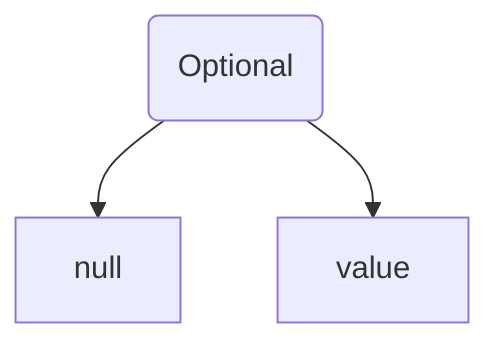

# Guava

### Quá khứ và hiện tại

[Guava](https://github.com/google/guava) được Google công bố mã nguồn mở và hiện đã có 49k người hâm mộ trên GitHub, chứng tỏ sự phổ biến của guava.

Guava chủ yếu bao gồm các mô-đun phổ biến sau: collection [collections], bộ đệm [caching], hỗ trợ kiểu nguyên thủy [primitives support], thư viện đồng bộ [concurrency libraries], annotations thông thường [common annotations], xử lý chuỗi [string processing], I/O, vv. Phiên bản JDK mới đã trực tiếp tích hợp guave, cho thấy sự xuất sắc của guava!

Nếu biết cách sử dụng guava một cách hiệu quả, bạn sẽ viết mã nhanh hơn và đẹp hơn trong lập trình!

### 02. Đưa Guava vào dự án

Nếu bạn đang sử dụng dự án Maven, bạn cần thêm dependency của guava vào file pom.xml.

```xml
<dependency>
    <groupId>com.google.guava</groupId>
    <artifactId>guava</artifactId>
    <version>30.1-jre</version>
</dependency>
```

Yêu cầu JDK phiên bản 8 trở lên.

### 03. Công cụ cơ bản

Doug Lea, tác giả của gói java.util.concurrent, từng nói: null thật sự tồi tệ". Tony Hoare, nhà đoạt giải Turing và tác giả của thuật toán sắp xếp nhanh, cũng là người sáng lập ra null, cũng từng có câu nói tương tự: "Việc sử dụng null khiến guava mất đi một tỷ USD". Vì vậy, guava sử dụng Optional để biểu thị đối tượng có thể là null.



Đoạn mã ví dụ như sau:

```java
Optional<Integer> possible = Optional.of(5);
possible.isPresent(); // trả về true
possible.get(); // trả về 5
```

Optional của guava là abstract, có nghĩa là có thể có các lớp con; Optional của JDK là final, không thể có lớp con.
Optional của guava thực hiện Serializable interface để có thể serialize; Optional của JDK không hỗ trợ điều này.
Một số phương thức của guava và JDK cũng khác nhau.

Việc sử dụng Optional không chỉ cấp cho null một ý nghĩa mà còn tăng tính đọc của mã. Điểm mạnh nhất của Optional là nó là một lớp bảo vệ đơn giản. Optional bắt buộc bạn suy nghĩ một cách tích cực về trường hợp tham chiếu không có mặt, vì bạn phải rõ ràng lấy tham chiếu từ Optional.

Ngoài Optional, guava còn cung cấp:

- Kiểm tra tham số
- Các phương thức thông thường của đối tượng, ví dụ như Objects.equals, Objects.hashCode, lớp Objects được JDK 7 giới thiệu cũng cung cấp các phương thức tương tự, dường như cũng là từ guava mà ra.
- Bộ so sánh mạnh mẽ hơn

### 04. Collection

Đầu tiên, tôi sẽ giải thích tại sao cần có các collection không thay đổi.

- Đảm bảo an toàn luồng. Trong các chương trình đồng thời, việc sử dụng collection không thay đổi không chỉ đảm bảo tính an toàn của luồng mà còn tăng đáng kể hiệu suất khi chạy đồng thời (so với việc sử dụng khóa đồng thời).
- Nếu một đối tượng không cần hỗ trợ các thao tác sửa đổi, các collection không thay đổi sẽ tiết kiệm được không gian và thời gian.
- Có thể coi chúng như các hằng số và các đối tượng trong collection sẽ không bao giờ bị thay đổi sau này.

So với các collection không thay đổi được cung cấp trong JDK, collection Immutable mà guava cung cấp mới là thực sự không thay đổi. Tại sao lại như vậy? Hãy xem ví dụ dưới đây.

Mã dưới đây sử dụng `Collections.unmodifiableList(list)` của JDK để nhận một danh sách không thể sửa đổi từ `list`.

```java
List list = new ArrayList();
list.add("Lê Cân");
list.add("Quyển Châu");

List unmodifiableList = Collections.unmodifiableList(list);
unmodifiableList.add("Mã Vân");
```

Khi chạy mã, sẽ nhận được exception sau:

```
Exception in thread "main" java.lang.UnsupportedOperationException
	at java.base/java.util.Collections$UnmodifiableCollection.add(Collections.java:1060)
	at com.itwanger.guava.NullTest.main(NullTest.java:29)
```

Tốt lắm, việc gọi `unmodifiableList.add()` đã gây ra exception UnsupportedOperationException, cho thấy `Collections.unmodifiableList()` đã trả về một danh sách không thể sửa đổi. Nhưng liệu thực sự là như vậy không?

Bạn có thể thay thế `unmodifiableList.add()` bằng `list.add()`.

```java
List list = new ArrayList();
list.add("Lê Cân");
list.add("Quyển Châu");

List unmodifiableList = Collections.unmodifiableList(list);
list.add("Mã Vân");
```

Khi chạy lại, chương trình không báo lỗi và bạn sẽ thấy rằng `unmodifiableList` thực sự đã thêm một phần tử mới. Điều này có ý nghĩa gì?

Phương thức `Collections.unmodifiableList(...)` thực sự không tạo ra một collection không thay đổi hoàn chỉnh; khi danh sách gốc bị thay đổi, các phần tử trong danh sách không thay đổi cũng sẽ thay đổi theo.

guava sẽ không mắc lỗi này, hãy xem đoạn mã dưới đây.

```java
List<String> stringArrayList = Lists.newArrayList("Lê Cân", "Quyển Châu");
ImmutableList<String> immutableList = ImmutableList.copyOf(stringArrayList);
immutableList.add("Mã Vân");
```

Khi cố gắng gọi `immutableList.add()`, nó sẽ ném ra `UnsupportedOperationException`. guava đã đánh dấu phương thức `add()` trong mã nguồn là lỗi cũ.

```java
/**
  * Đảm bảo ném ra exception và không làm thay đổi collection.
  *
  * @throws UnsupportedOperationException luôn luôn ném ra exception này.
  * @deprecated Thao tác không được hỗ trợ.
  */
@CanIgnoreReturnValue
@Deprecated
@Override
public final boolean add(E e) {
  throw new UnsupportedOperationException();
}
```

Khi cố gắng thay đổi `stringArrayList.add()`, collection không thay đổi `immutableList` sẽ không bị ảnh hưởng bởi điều này.

Ngoài các collection không thay đổi, guava cũng cung cấp các loại collection mới như:

- Multiset, có thể thêm nhiều phần tử giống nhau. Khi xem Multiset như một Collection thông thường, nó hoạt động giống như ArrayList không có thứ tự; khi xem Multiset như `Map<E, Integer>`, nó cung cấp các thao tác truy vấn phù hợp với hiệu suất mong đợi.
- Multimap, dễ dàng ánh xạ một khóa sang nhiều giá trị.
- BiMap, một loại Map đặc biệt, có thể dùng `inverse()` để đảo ngược ánh xạ khóa giá trị trong `BiMap<K, V>`; đảm bảo giá trị là duy nhất, do đó `values()` trả về Set thay vì Collection thông thường.

### 05. Xử lý chuỗi

Chuỗi là một dãy không thể thay đổi các ký tự sau khi đã được tạo ra. Trong công việc hàng ngày của chúng ta, việc sử dụng chuỗi rất phổ biến, và việc thao tác thành thạo trên chúng có thể cực kỳ gia tăng hiệu suất làm việc của chúng ta.

guava cung cấp một công cụ nối chuỗi gọi là Joiner, có thể nối các chuỗi lại với nhau bằng một ký tự phân tách. Đoạn mã dưới đây sẽ trả về "Lê Cân; Quyển Châu", bạn có thể sử dụng phương thức `useForNull(String)` để thay thế null bằng một chuỗi nào đó, thay vì bỏ qua null như phương thức `skipNulls()`.

```java
Joiner joiner = Joiner.on("; ").skipNulls();
return joiner.join("Lê Cân", null, "Quyển Châu");
```

guava cũng cung cấp một công cụ tách chuỗi gọi là Splitter, có thể tách một chuỗi thành các phần với một ký tự phân tách cụ thể.

```java
Splitter.on(',')
        .trimResults()
        .omitEmptyStrings()
        .split("Lê Cân, Quyển Châu,,   Mã Vân");
```

### 06. Bộ nhớ cache

Bộ nhớ cache có ích trong nhiều tình huống khác nhau. Bạn nên biết rằng chi phí để truy xuất một giá trị có thể rất cao, đặc biệt là khi cần truy xuất giá trị nhiều lần, lúc đó nên cân nhắc sử dụng bộ nhớ cache.

Guava cung cấp Cache và nó khá giống với ConcurrentMap, nhưng không hoàn toàn giống. Sự khác biệt cơ bản nhất là ConcurrentMap sẽ giữ tất cả các phần tử đã thêm cho đến khi chúng được loại bỏ một cách rõ ràng. Ngược lại, Cache mà guava cung cấp sẽ tự động loại bỏ các phần tử để giới hạn sử dụng bộ nhớ.

Nếu bạn sẵn lòng tiêu tốn một số không gian bộ nhớ để cải thiện tốc độ, và bạn có thể dự đoán rằng một số key sẽ được truy vấn nhiều hơn một lần, và tổng số dữ liệu trong cache không vượt quá dung lượng bộ nhớ, thì bạn có thể sử dụng Cache.

Hãy xem một ví dụ để cảm nhận.

```java
@Test
public void testCache() throws ExecutionException, InterruptedException {

    CacheLoader cacheLoader = new CacheLoader<String, Animal>() {
        // Nếu không tìm thấy phần tử, phương thức này sẽ được gọi
        @Override
        public Animal load(String s) {
            return null;
        }
    };
    LoadingCache<String, Animal> loadingCache = CacheBuilder.newBuilder()
        .maximumSize(1000) // Dung lượng
        .expireAfterWrite(3, TimeUnit.SECONDS) // Thời gian hết hạn
        .removalListener(new MyRemovalListener()) // Lắng nghe khi loại bỏ
        .build(cacheLoader); //
    loadingCache.put("Chó", new Animal("Vượng Cái", 1));
    loadingCache.put("Mèo", new Animal("Tảo Mễ", 3));
    loadingCache.put("Sói", new Animal("Huy Tai Lô", 4));

    loadingCache.invalidate("Mèo"); // Tự động loại bỏ

    Animal animal = loadingCache.get("Sói");
    System.out.println(animal);
    Thread.sleep(4 * 1000);
    // Sói đã hết hạn, lấy giá trị null sẽ báo lỗi
    System.out.println(loadingCache.get("Sói"));
}

/**
 * Lớp lắng nghe khi loại bỏ cache
 */
class MyRemovalListener implements RemovalListener<String, Animal> {

    @Override
    public void onRemoval(RemovalNotification<String, Animal> notification) {
        String reason = String.format("key=%s,value=%s,reason=%s", notification.getKey(), notification.getValue(), notification.getCause());
        System.out.println(reason);
    }
}

class Animal {
    private String name;
    private Integer age;

    public Animal(String name, Integer age) {
        this.name = name;
        this.age = age;
    }
}
```

CacheLoader đã được viết lại phương thức load, phương thức này sẽ được gọi khi cache không trúng key, ở đây guava chỉ đơn giản trả về null, thực tế sẽ có thông tin ngoại lệ trả về CacheLoader returned null for key.

MyRemovalListener là lớp lắng nghe sự kiện khi các phần tử cache bị loại bỏ, phương thức này là đồng bộ, nếu nó mất nhiều thời gian, nó sẽ chặn đến khi hoàn tất xử lý.

LoadingCache là đối tượng chính để thao tác với cache, phương thức phổ biến là put và get.

### 07. Công cụ cho các tập hợp

Các công cụ tập hợp trong gói `com.google.common.collect`, ví dụ như `Lists`, cũng rất mạnh mẽ.

#### Tạo tập hợp rỗng

Đôi khi, chúng ta muốn tạo một tập hợp rỗng. Bạn có thể sử dụng phương thức `newArrayList` của Lists, ví dụ:

```java
List<Integer> list = Lists.newArrayList();
```

#### Khởi tạo nhanh tập hợp

Đôi khi, chúng ta muốn khởi tạo một tập hợp với một số phần tử. Đây là cách sử dụng phương thức `newArrayList` của Lists:

```java
List<Integer> list = Lists.newArrayList(1, 2, 3);
```
Kết quả thực thi:
```java
[1, 2, 3]
```

#### Tích Descartes

Nếu bạn muốn tính toán `tích Descartes` của hai tập hợp, phương thức `cartesianProduct` của Lists có thể giúp bạn:

```java
List<Integer> list1 = Lists.newArrayList(1, 2, 3);
List<Integer> list2 = Lists.newArrayList(4,5);
List<List<Integer>> productList = Lists.cartesianProduct(list1,list2);
System.out.println(productList);
```
Kết quả thực thi:
```java
[[1, 4], [1, 5], [2, 4], [2, 5], [3, 4], [3, 5]]
```

#### Phân trang

Nếu bạn muốn chia một `tập hợp lớn` thành các `tập hợp con nhỏ`, bạn có thể sử dụng phương thức `partition` của Lists:

```java
List<Integer> list = Lists.newArrayList(1, 2, 3, 4, 5);
List<List<Integer>> partitionList = Lists.partition(list, 2);
System.out.println(partitionList);
```
Kết quả thực thi:

```java
[[1, 2], [3, 4], [5]]
```

Trong ví dụ này, list có 5 phần tử, guava đã chia list thành 3 phần, mỗi phần có kích thước là 2.

Đây là một trong những phương thức tôi thích nhất, thường xuyên sử dụng trong các dự án.

Ví dụ, nếu bạn có yêu cầu: hiện có 5000 id, cần gọi API truy vấn người dùng theo lô để lấy dữ liệu người dùng. Nhưng nếu bạn trực tiếp truy vấn 5000 người dùng, thời gian phản hồi của API một lần có thể rất chậm. Nếu chuyển sang xử lý phân trang, mỗi lần chỉ truy vấn 500 người dùng, gọi API bất đồng bộ 10 lần, sẽ không có vấn đề về thời gian phản hồi của API một lần.

#### Xử lý luồng

Nếu chúng ta muốn chuyển đổi một tập hợp này sang một interface khác, có thể sử dụng phương thức `transform` của Lists. Ví dụ:

```java
List<String> list = Lists.newArrayList("a","b","c");
List<String> transformList = Lists.transform(list, x -> x.toUpperCase());
System.out.println(transformList);
```

Chuyển đổi các ký tự thường thành ký tự in hoa.

#### Đảo ngược thứ tự

Lists có phương thức `reverse` để đảo ngược thứ tự. Ví dụ:

```java
List<Integer> list = Lists.newArrayList(3, 1, 2);
List<Integer> reverseList = Lists.reverse(list);
System.out.println(reverseList);
```
Kết quả thực thi:

```java
[2, 1, 3]
```

Thứ tự ban đầu của list là 312, sau khi sử dụng phương thức `reverse`, nó trở thành 213.

Lists còn có các công cụ hữu ích khác, tôi chỉ đưa ra một số ví dụ, bạn có thể tự nghiên cứu thêm.


### 08. Tổng kết

Trên đây là những tính năng tôi cho là phổ biến nhất, là một thư viện lõi phát triển Java được Google phát hành, tôi nghĩ rằng tính hữu dụng của nó rất cao (nếu không thì thôi?). Sau khi tích hợp vào dự án của bạn, không chỉ có thể nhanh chóng triển khai các tính năng phổ biến trong phát triển mà còn làm cho mã nguồn trở nên thanh thoát và đơn giản hơn.

Tôi nghĩ rằng nó phù hợp với mọi dự án Java, còn những tính năng khác như băm, bus sự kiện, toán học, phản chiếu, thì chờ bạn khám phá nhé.
