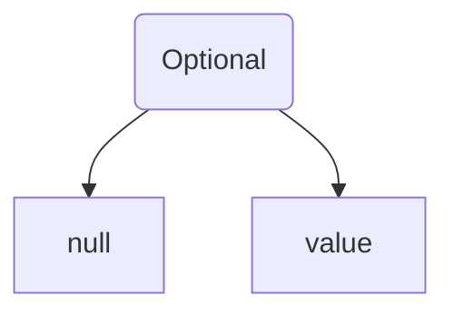

# Tối ưu Optional

Học hỏi không bao giờ là muộn, đặc biệt là đối với những điều tốt trong Java 8, Optional chính là một trong số đó. Lớp này cung cấp một giải pháp cấp lớp cho việc biểu diễn giá trị có thể có hoặc không thay vì tham chiếu null. Là một lập trình viên Java, tôi thực sự đã quá chán ngấy với NullPointerException (NPE). Dù tôi quen thuộc với nó như một người bạn cũ, nhưng việc gặp phải nó thật không may — khi chương trình đang sử dụng một đối tượng nhưng lại thấy giá trị của đối tượng đó là null, Java Virtual Machine sẽ nổi giận và ném nó ra như một tội phạm.

Tất nhiên, chúng ta là những người lập trình có trách nhiệm, không thể ngồi im mà không làm gì cả, vì vậy đã có rất nhiều kiểm tra giá trị null. Mặc dù đôi khi các kiểm tra này hoàn toàn không cần thiết, nhưng chúng ta đã quen với nó như một thói quen. Cuối cùng, Java 8 đã không thể chịu đựng được nữa, nên đã giới thiệu Optional, để mã của chúng ta không còn khắc nghiệt và cứng nhắc như vậy nữa.


### 01. Vấn đề khi không sử dụng Optional

Chúng ta hãy mô phỏng một tình huống thực tế. Ngày đầu tiên làm việc, leader giao cho dev nhiệm vụ là từ cơ sở dữ liệu lấy tên của một thành viên dựa trên ID và in tên đó lên console. Mặc dù là mới, nhưng nhiệm vụ này không làm khó được dev, vì vậy anh ta dành 10 phút viết đoạn mã sau:

```java
public class WithoutOptionalDemo {
    class Member {
        private String name;

        public String getName() {
            return name;
        }

        public void setName(String name) {
            this.name = name;
        }
    }

    public static void main(String[] args) {
        Member mem = getMemberByIdFromDB();
        if (mem != null) {
            System.out.println(mem.getName());
        }
    }

    public static Member getMemberByIdFromDB() {
        // Thành viên có ID hiện tại không tồn tại
        return null;
    }
}
```

Do thành viên có ID hiện tại không tồn tại, phương thức `getMemberByIdFromDB()` trả về null để biểu thị rằng không lấy được thành viên này. Điều này đồng nghĩa rằng khi in tên thành viên lên console, bạn phải kiểm tra mem có null không trước, nếu không sẽ có lỗi NPE, không tin? Hãy xóa `if (mem != null)` và thử lại, console ngay lập tức in ra một đống lỗi để bạn chiêm ngưỡng:

```
Exception in thread "main" java.lang.NullPointerException
	at com.cmower.dzone.optional.WithoutOptionalDemo.main(WithoutOptionalDemo.java:24)
```

### 02. Optional làm thế nào để giải quyết vấn đề này

Sau khi đã nộp mã, anh ta vui vẻ đi tìm leader để nhận nhiệm vụ mới. Với tinh thần học hỏi khiêm tốn, dev yêu cầu leader xem lại mã của mình. leader sau đó cho biết dev nên thử dùng Optional để tránh các kiểm tra giá trị null không cần thiết. Bây giờ, hãy xem dev đã làm thế nào để giải quyết vấn đề trên bằng Optional.

```java
public class OptionalDemo {
    public static void main(String[] args) {
        Optional<Member> optional = getMemberByIdFromDB();
        optional.ifPresent(mem -> {
            System.out.println("Họ và tên thành viên: " + mem.getName());
        });
    }

    public static Optional<Member> getMemberByIdFromDB() {
        boolean hasName = true;
        if (hasName) {
            return Optional.of(new Member("Chim Mồi"));
        }
        return Optional.empty();
    }
}
class Member {
    private String name;

    public Member(String name) {
        this.name = name;
    }

    public String getName() {
        return name;
    }

    // getter / setter
}
```

Phương thức `getMemberByIdFromDB()` trả về `Optional<Member>` như một kết quả, cho biết rằng Member có thể tồn tại hoặc không tồn tại, điều này cho phép sử dụng biểu thức Lambda trong phương thức `ifPresent()` của Optional để in kết quả trực tiếp.

Optional có thể giải quyết vấn đề NPE bởi vì nó rõ ràng cho chúng ta biết không cần phải kiểm tra null. Nó giống như một biển báo ở ngã ba đường, rõ ràng cho bạn biết nên đi hướng nào.

### 03. Tạo đối tượng Optional

1) Có thể sử dụng phương thức tĩnh `empty()` để tạo một đối tượng Optional rỗng

```java
Optional<String> empty = Optional.empty();
System.out.println(empty); // Output: Optional.empty
```

2) Có thể sử dụng phương thức tĩnh `of()` để tạo một đối tượng Optional không rỗng

```java
Optional<String> opt = Optional.of("Chim Mồi");
System.out.println(opt); // Output: Optional[Chim Mồi]
```

Tất nhiên, đối số được chuyển cho phương thức `of()` phải là không rỗng, tức là không được là null, nếu không sẽ vẫn ném ra NullPointerException.

```java
String name = null;
Optional<String> optnull = Optional.of(name);
```

3) Có thể sử dụng phương thức tĩnh `ofNullable()` để tạo một đối tượng Optional có thể rỗng hoặc không rỗng

```java
String name = null;
Optional<String> optOrNull = Optional.ofNullable(name);
System.out.println(optOrNull); // Output: Optional.empty
```

Phương thức `ofNullable()` có một biểu thức ba ngôi bên trong, nếu đối số là null, nó sẽ trả về hằng số EMPTY; nếu không, nó sẽ tạo một đối tượng Optional mới bằng từ khoá new — không bao giờ ném ra NPE nữa.

### 04. Kiểm tra giá trị có tồn tại không

Có thể sử dụng phương thức `isPresent()` để kiểm tra xem một đối tượng Optional có tồn tại không. Nếu tồn tại, phương thức này trả về true, ngược lại trả về false — thay thế cho việc kiểm tra `obj != null`.

```java
Optional<String> opt = Optional.of("Chim Mồi");
System.out.println(opt.isPresent()); // Output: true

Optional<String> optOrNull = Optional.ofNullable(null);
System.out.println(optOrNull.isPresent()); // Output: false
```

Từ Java 11 trở đi, bạn có thể sử dụng phương thức `isEmpty()` để đảo ngược kết quả so với `isPresent()`.

```java
Optional<String> opt = Optional.of("Chim Mồi");
System.out.println(opt.isEmpty()); // Output: false

Optional<String> optOrNull = Optional.ofNullable(null);
System.out.println(optOrNull.isEmpty()); // Output: true
```

### 05. Biểu thức không rỗng

Optional có một phương thức hiện đại rất hữu ích là `ifPresent()`, cho phép chúng ta thực hiện mã nguồn theo cách lập trình hàm, do đó, tôi gọi nó là biểu thức không rỗng. Nếu không có phương thức này, chúng ta thường phải kiểm tra đối tượng Optional trước bằng phương thức `isPresent()` trước khi thực hiện mã nguồn tương ứng:

```java
Optional<String> optOrNull = Optional.ofNullable(null);
if (optOrNull.isPresent()) {
    System.out.println(optOrNull.get().length());
}
```

Khi sử dụng `ifPresent()`, mọi thứ trở nên khác biệt hoàn toàn, bạn có thể truyền biểu thức Lambda trực tiếp vào phương thức này, mã nguồn trở nên ngắn gọn hơn và rõ ràng hơn.

```java
Optional<String> opt = Optional.of("Chim Mồi");
opt.ifPresent(str -> System.out.println(str.length()));
```

Từ Java 9 trở đi, bạn có thể sử dụng phương thức `ifPresentOrElse(action, emptyAction)` để thực hiện hai loại hành động khác nhau: thực hiện `action` khi không rỗng và `emptyAction` khi rỗng.

```java
Optional<String> opt = Optional.of("Chim Mồi");
opt.ifPresentOrElse(str -> System.out.println(str.length()), () -> System.out.println("Đối tượng rỗng"));
```

### 06. Thiết lập (lấy) giá trị mặc định

Đôi khi khi tạo (lấy) đối tượng Optional, chúng ta cần một giá trị mặc định. Đó là lúc phương thức `orElse()` và `orElseGet()` trở nên hữu ích.

Phương thức `orElse()` được sử dụng để trả về giá trị bao bọc trong đối tượng Optional. Nếu giá trị đó không phải là null, nó trả về giá trị đó; nếu không, nó trả về giá trị mặc định. Kiểu dữ liệu của tham số phải trùng với kiểu dữ liệu của giá trị.

```java
String nullName = null;
String name = Optional.ofNullable(nullName).orElse("Chim Mồi");
System.out.println(name); // Output: Chim Mồi
```

Phương thức `orElseGet()` tương tự như `orElse()`, nhưng tham số là một hàm. Nếu giá trị trong đối tượng Optional là null, hàm này sẽ được thực thi để sinh ra giá trị mặc định.

```java
String nullName = null;
String name = Optional.ofNullable(nullName).orElseGet(()->"Chim Mồi");
System.out.println(name); // Output: Chim Mồi
```

So với nhau, các phương thức này rất giống nhau, điều này khiến chúng ta nghi ngờ liệu các nhà thiết kế thư viện Java có cần thiết phải làm như vậy không?

Giả sử có một phương thức nhận giá trị mặc định theo cách truyền thống.

```java
public static String getDefaultValue() {
    System.out.println("getDefaultValue");
    return "Chim Mồi";
}
```

Sau đó, sử dụng `orElse()` và `orElseGet()` để lấy giá trị mặc định từ `getDefaultValue()`.

```java
public static void main(String[] args) {
    String name = null;
    System.out.println("orElse");
    String name2 = Optional.ofNullable(name).orElse(getDefaultValue());

    System.out.println("orElseGet");
    String name3 = Optional.ofNullable(name).orElseGet(OrElseOptionalDemo::getDefaultValue);
}
```

Chú ý: `Tên lớp :: Tên phương thức` là cú pháp được giới thiệu từ Java 8, không có dấu `()` sau tên phương thức để chỉ ra rằng phương thức này không nhất định phải được gọi.

Kết quả xuất ra như sau:

```java
orElse
getDefaultValue

orElseGet
getDefaultValue
```

Kết quả xuất ra khá giống nhau, không có sự khác biệt đáng kể, bạn đã hiểu được tại sao chưa?

### 07. Lấy giá trị

Về mặt ngữ nghĩa, phương thức `get()` là phương pháp chính thức nhất để lấy giá trị của đối tượng Optional, nhưng tiếc là phương thức này có một số hạn chế, vì nếu giá trị của Optional là null, phương thức này sẽ ném ra ngoại lệ NoSuchElementException. Điều này hoàn toàn trái ngược với mục đích sử dụng Optional.

```java
public class GetOptionalDemo {
    public static void main(String[] args) {
        String name = null;
        Optional<String> optOrNull = Optional.ofNullable(name);
        System.out.println(optOrNull.get());
    }
}
```

Đoạn mã này sẽ ném ra ngoại lệ khi thực thi:

```
Exception in thread "main" java.util.NoSuchElementException: No value present
	at java.base/java.util.Optional.get(Optional.java:141)
	at com.cmower.dzone.optional.GetOptionalDemo.main(GetOptionalDemo.java:9)
```

Mặc dù ngoại lệ được ném ra là NoSuchElementException thay vì NullPointerException, nhưng vẫn là một kết quả không mong muốn khi sử dụng Optional. Đề nghị sử dụng phương thức `orElseGet()` để lấy giá trị của đối tượng Optional.

### 08. Lọc giá trị

Sau khi nâng cấp mã của mình bằng lớp Optional, Xiaowang lại hăng hái chạy tới xin nhiệm vụ với Lão Mã. Lão Mã cảm thấy chàng trai này không tồi, đầu óc minh mẫn và làm việc tích cực, xứng đáng để đào tạo thêm, vì vậy lại giao cho Xiaowang một nhiệm vụ mới: kiểm tra độ dài của mật khẩu khi người dùng đăng ký.

Xiaowang khi nhận nhiệm vụ, rất vui vẻ bởi anh ta mới học được phương thức `filter()` của lớp Optional, và giờ đây nó sẽ có ích.

```java
public class FilterOptionalDemo {
    public static void main(String[] args) {
        String password = "12345";
        Optional<String> opt = Optional.ofNullable(password);
        System.out.println(opt.filter(pwd -> pwd.length() > 6).isPresent());
    }
}
```

Tham số của phương thức `filter()` là một Predicate (một giao diện hàm mà Java 8 giới thiệu), có nghĩa là bạn có thể chuyển một biểu thức Lambda vào phương thức này làm điều kiện. Nếu kết quả của biểu thức là false, phương thức sẽ trả về một Optional rỗng (EMPTY); nếu không, nó trả về Optional đã được lọc.

Trong ví dụ trên, vì độ dài của password là 5, kết quả xuất ra là false. Giả sử yêu cầu độ dài mật khẩu từ 6 đến 10 ký tự, bạn có thể thêm một điều kiện nữa. Hãy xem Xiaowang thêm điều kiện phức tạp hơn vào mã của mình.

```java
Predicate<String> len6 = pwd -> pwd.length() > 6;
Predicate<String> len10 = pwd -> pwd.length() < 10;

password = "1234567";
opt = Optional.ofNullable(password);
boolean result = opt.filter(len6.and(len10)).isPresent();
System.out.println(result);
```

Lần này, kết quả xuất ra là true, vì mật khẩu có 7 ký tự, nằm trong khoảng từ 6 đến 10 ký tự. Hãy tưởng tượng nếu Xiaowang dùng if-else để làm nhiệm vụ này, mã sẽ dài ra sao.

### 09. Chuyển đổi giá trị

Sau khi kiểm tra độ dài mật khẩu, Xiaowang vẫn cảm thấy chưa thỏa mãn, anh ta muốn kiểm tra sức mạnh của mật khẩu, ví dụ như mật khẩu không được là "password", vì mật khẩu như vậy quá yếu. Vì vậy, anh ta lại bắt đầu nghiên cứu về phương thức `map()`, phương thức này cho phép chuyển đổi đối tượng Optional gốc thành một đối tượng Optional mới theo một quy tắc nhất định, đồng thời đối tượng Optional gốc không thay đổi.

Hãy xem một ví dụ đơn giản mà Xiaowang viết:

```java
public class OptionalMapDemo {
    public static void main(String[] args) {
        String name = "Chim Mồi";
        Optional<String> nameOptional = Optional.of(name);
        Optional<Integer> intOpt = nameOptional
                .map(String::length);
        
        System.out.println( intOpt.orElse(0));
    }
}
```

Trong ví dụ trên, tham số của `map()` là `String::length`, có nghĩa là chúng ta sẽ tạo một Optional mới từ đối tượng Optional kiểu String ban đầu bằng cách tính độ dài của chuỗi và chuyển đổi nó thành một Optional kiểu Integer.

Sau khi hiểu được cách sử dụng cơ bản của phương thức `map()`, Xiaowang quyết định kết hợp `map()` với `filter()` để sử dụng. Phần đầu dùng để chuyển mật khẩu thành chữ thường, phần sau dùng để kiểm tra độ dài và xem liệu mật khẩu có phải là "password".

```java
public class OptionalMapFilterDemo {
    public static void main(String[] args) {
        String password = "password";
        Optional<String>  opt = Optional.ofNullable(password);

        Predicate<String> len6 = pwd -> pwd.length() > 6;
        Predicate<String> len10 = pwd -> pwd.length() < 10;
        Predicate<String> eq = pwd -> pwd.equals("password");

        boolean result = opt.map(String::toLowerCase).filter(len6.and(len10 ).and(eq)).isPresent();
        System.out.println(result);
    }
}
```

Được rồi, các bạn đọc giả thân mến, đây là toàn bộ nội dung của bài viết này!