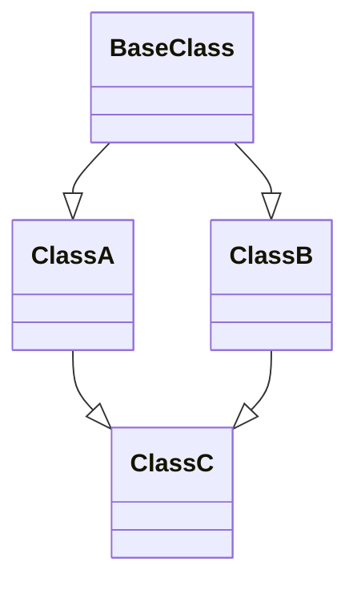

# Interface

### 01. Định nghĩa Interface

Interface được định nghĩa bằng từ khóa `interface`, có thể chứa một số hằng số và phương thức như ví dụ dưới đây.

```java
public interface Electronic {
    // Hằng số
    String LED = "LED";

    // Phương thức trừu tượng
    int getElectricityUse();

    // Phương thức tĩnh
    static boolean isEnergyEfficient(String electronicType) {
        return electronicType.equals(LED);
    }

    // Phương thức mặc định
    default void printDescription() {
        System.out.println("Điện tử");
    }
}
```

Hãy xem xét mã bytecode sau khi dịch ngược của đoạn mã này.

```java
public interface Electronic
{

    public abstract int getElectricityUse();

    public static boolean isEnergyEfficient(String electronicType)
    {
        return electronicType.equals("LED");
    }

    public void printDescription()
    {
        System.out.println("\u0110i\u1EC7n t\u1EED");
    }

    public static final String LED = "LED";
}
```

Tất cả các biến hoặc phương thức được định nghĩa trong interface sẽ tự động thêm từ khóa `public`.

Tiếp theo, tôi sẽ giải thích từng điểm chính trong interface Electronic.

**1) Các biến được định nghĩa trong interface sẽ tự động thêm từ khóa `public static final` khi biên dịch** (hãy chú ý đến bytecode sau khi dịch ngược), nghĩa là biến LED trong ví dụ thực tế là một hằng số.

Tài liệu chính thức của Java có tuyên bố như sau:

>Mỗi lần khai báo trường trong thân của một interface đều mặc định là `public`, `static`, và `final`.

Nói một cách khác, interface có thể sử dụng như một lớp hằng số, có thể bỏ qua `public static final`, nghe có vẻ như một lựa chọn tốt, đúng không?

Tuy nhiên, lựa chọn này không phải là lựa chọn tốt. Bởi vì mục đích chính của interface là trừu tượng hóa các phương thức, trong khi interface hằng số sẽ gây "ô nhiễm" không gian tên của biến trong các lớp con.

**2) Các phương thức không sử dụng từ khóa `private`, `default` hoặc `static` được coi là trừu tượng mặc định**, và sẽ tự động thêm từ khóa `public abstract` khi biên dịch. Ví dụ như phương thức `getElectricityUse()` trong ví dụ của bạn là một phương thức trừu tượng, không có thân phương thức — đó chính là mục đích của việc định nghĩa interface.

**3) Từ Java 8 trở đi, interface cho phép định nghĩa các phương thức tĩnh**, ví dụ như phương thức `isEnergyEfficient()` trong ví dụ của bạn.

Các phương thức tĩnh không thể được gọi từ đối tượng của lớp đã thực thi interface, chúng chỉ có thể được gọi bằng tên interface, ví dụ như `Electronic.isEnergyEfficient("LED")`.

Mục đích của việc định nghĩa các phương thức tĩnh trong interface là cung cấp một cơ chế đơn giản để gọi phương thức mà không cần tạo đối tượng, từ đó nâng cao tính cạnh tranh của interface.

**4) Interface cho phép định nghĩa phương thức `default`** cũng bắt đầu từ Java 8, ví dụ như phương thức `printDescription()` trong ví dụ trên. Phương thức này luôn có một khối mã, cung cấp triển khai mặc định cho các lớp triển khai interface mà không cần ghi đè phương thức này. Vì phải cung cấp một triển khai mặc định, nên không thể kết thúc phương thức `default` bằng dấu ";" - nếu làm vậy, trình biên dịch sẽ báo lỗi.

"Sao lại phải định nghĩa phương thức mặc định trong interface?"

Cho phép định nghĩa phương thức mặc định trong interface có lý do rất đủ, vì một interface có thể có nhiều lớp triển khai và các lớp này phải triển khai các phương thức trừu tượng của interface, nếu không sẽ gặp lỗi biên dịch. Nếu muốn thêm một phương thức cụ thể vào tất cả các lớp triển khai, mà không có phương thức `default`, chúng ta phải chỉnh sửa từng lớp một.

Từ các ví dụ trước đây, chúng ta có thể kết luận những điều sau:

- interface cho phép định nghĩa biến.
- interface cho phép định nghĩa phương thức trừu tượng.
- interface cho phép định nghĩa phương thức tĩnh (từ Java 8 trở đi).
- interface cho phép định nghĩa phương thức `default` (từ Java 8 trở đi).

Ngoài ra, chúng ta cũng nên biết:

**1) Không thể trực tiếp khởi tạo một interface**, nếu làm vậy sẽ gặp lỗi biên dịch.

Phải định nghĩa một lớp để triển khai interface, như trong ví dụ sau:

```java
public class Computer implements Electronic {

    public static void main(String[] args) {
        new Computer();
    }

    @Override
    public int getElectricityUse() {
        return 0;
    }
}
```

Sau đó mới có thể khởi tạo.

```
Electronic e = new Computer();
```

**2) interface có thể là trống**, không cần định nghĩa biến hay phương thức. Một ví dụ điển hình là interface Serializable trong gói `java.io`.

```java
public interface Serializable {
}
```

interface Serializable được sử dụng để đánh dấu cho việc tuần tự hóa, nghĩa là bất cứ lớp nào triển khai interface này đều có thể tuần tự hóa.

**3) Không nên sử dụng từ khóa final khi định nghĩa interface**, nếu làm vậy sẽ gặp lỗi biên dịch, vì interface được thiết kế để các lớp con có thể triển khai.

**4) Phương thức trừu tượng trong interface không thể là private, protected hoặc final**, nếu làm vậy sẽ gặp lỗi biên dịch.

**5) Biến trong interface là `public static final` (hằng số ngầm định)**, do đó giá trị của nó không thể thay đổi.

### 02. Vai trò của interface

**Thứ nhất, cho phép các lớp triển khai có các chức năng mà chúng ta muốn**. Ví dụ, một lớp triển khai interface Cloneable có khả năng sao chép, lớp triển khai Comparable hoặc Comparator có khả năng so sánh.

Cloneable và Serializable đều là các interface đánh dấu, chúng không chứa bất kỳ phương thức nào bên trong. Một lớp triển khai interface Cloneable có thể sử dụng phương thức `Object.clone()`, nếu không sẽ ném ngoại lệ CloneNotSupportedException.

```java
public class CloneableTest implements Cloneable {
    @Override
    protected Object clone() throws CloneNotSupportedException {
        return super.clone();
    }

    public static void main(String[] args) throws CloneNotSupportedException {
        CloneableTest c1 = new CloneableTest();
        CloneableTest c2 = (CloneableTest) c1.clone();
    }
}
```

Chạy mã không có lỗi. Bây giờ hãy loại bỏ `implements Cloneable`.

```java
public class CloneableTest {
    @Override
    protected Object clone() throws CloneNotSupportedException {
        return super.clone();
    }

    public static void main(String[] args) throws CloneNotSupportedException {
        CloneableTest c1 = new CloneableTest();
        CloneableTest c2 = (CloneableTest) c1.clone();

    }
}
```

Chạy mã sẽ ném ra CloneNotSupportedException:

```
Exception in thread "main" java.lang.CloneNotSupportedException: com.cmower.baeldung.interface1.CloneableTest
	at java.base/java.lang.Object.clone(Native Method)
	at com.cmower.baeldung.interface1.CloneableTest.clone(CloneableTest.java:6)
	at com.cmower.baeldung.interface1.CloneableTest.main(CloneableTest.java:11)
```

**Thứ hai, mặc dù Java nguyên tắc chỉ hỗ trợ đơn kế thừa, nhưng thông qua interface, chúng ta có thể đạt được mục đích đa kế thừa.**

Nếu có hai lớp cùng kế thừa một lớp cha (extends), thì các phương thức của lớp cha sẽ bị hai lớp con đó ghi đè. Tuy nhiên, nếu có một lớp mới đồng thời kế thừa hai lớp con này, khi gọi các phương thức đã được ghi đè, trình biên dịch không biết nên gọi phương thức của lớp nào. Đây chính là vấn đề hình kim cương (diamond problem) nổi tiếng, như thể hiện trong hình dưới đây.



Đơn giản để giải thích, lớp C đồng thời kế thừa lớp A và lớp B, khi đối tượng của lớp C gọi các phương thức đã được ghi đè từ lớp A và B, trình biên dịch không biết phải gọi phương thức của lớp A hay của lớp B.

interface không gặp phải vấn đề này. Hãy xem xét việc định nghĩa hai interface, Fly (biết bay) và Run (biết chạy).

```java
public interface Fly {
    void fly();
}
public interface Run {
    void run();
}
```

Sau đó, lớp Pig triển khai cả hai interface này.

```java
public class Pig implements Fly, Run {
    @Override
    public void fly() {
        System.out.println("Con heo biết bay");
    }

    @Override
    public void run() {
        System.out.println("Con heo biết chạy");
    }
}
```

Mặc dù trong thực tế, con heo không biết bay, nhưng trong ví dụ này, nó cho thấy interface có thể đạt được mục đích đa kế thừa: con heo vừa biết bay vừa biết chạy, như trong trường hợp mà không thể thực hiện được bằng lớp trừu tượng.

**Thứ ba, triển khai đa hình (Polymorphism)**

Đa hình là gì? Đơn giản để hiểu, khi một sự kiện xảy ra trên các đối tượng khác nhau thì sẽ có kết quả khác nhau. Ví dụ, khi nhấp chuột trái vào nút X trên cửa sổ có thể đóng cửa sổ, nhấp vào siêu liên kết thì có thể mở trang web mới.

Đa hình có thể được thực hiện thông qua mối quan hệ kế thừa (`extends`), cũng có thể thực hiện thông qua interface.

interface Shape biểu thị một hình dạng.

```java
public interface Shape {
    String name();
}
```

Lớp Circle triển khai interface Shape và ghi đè phương thức `name()`.

```java
public class Circle implements Shape {
    @Override
    public String name() {
        return "Circle";
    }
}
```

Lớp Square cũng triển khai interface Shape và ghi đè phương thức `name()`.

```java
public class Square implements Shape {
    @Override
    public String name() {
        return "Square";
    }
}
```

Tiếp theo, hãy xem lớp kiểm tra.

```java
List<Shape> shapes = new ArrayList<>();
Shape circleShape = new Circle();
Shape squareShape = new Square();

shapes.add(circleShape);
shapes.add(squareShape);

for (Shape shape : shapes) {
    System.out.println(shape.name());
}
```

Điều này thực hiện đa hình, biến circleShape và squareShape đều có kiểu tham chiếu là Shape, nhưng khi gọi phương thức `shape.name()`, Java Virtual Machine biết rằng nó nên gọi phương thức `name()` của lớp Circle hay của lớp Square.

Các điều kiện cần thiết để đa hình tồn tại bao gồm:

1. Có mối quan hệ kế thừa, ví dụ như Circle và Square đều triển khai interface Shape.
2. Các lớp con cần phải ghi đè phương thức của lớp cha, ví dụ như Circle và Square đều ghi đè phương thức `name()`.
3. Tham chiếu của lớp cha chỉ đến đối tượng của lớp con, ví dụ như circleShape và squareShape có kiểu là Shape, nhưng thực chất circleShape chỉ đối tượng của Circle và squareShape chỉ đối tượng của Square.

Tiếp theo, chúng ta hãy xem kết quả thử nghiệm:

```
Circle
Square
```

Điều này cho thấy, mặc dù trong vòng lặp `for`, biến shape có kiểu Shape, nhưng khi gọi phương thức `name()`, nó biết rằng đối tượng Circle nên gọi phương thức `name()` của Circle, và đối tượng Square nên gọi phương thức `name()` của Square.

### 03. Ba mô hình của interface

Trong lĩnh vực lập trình, việc áp dụng các mô hình thiết kế (design pattern) tốt có thể giúp chúng ta viết mã một cách hiệu quả hơn. Trong sử dụng interface, chúng ta thường gặp ba mô hình khác nhau, đó là mô hình chiến lược (Strategy Pattern), mô hình điều chỉnh (Adapter Pattern) và mô hình nhà máy (Factory Pattern).

#### 1) Mô hình chiến lược (Strategy Pattern)

Ý tưởng của mô hình chiến lược là đóng gói mỗi thuật toán vào các lớp thực hiện có cùng interface, người thiết kế interface có thể thay đổi thuật toán mà không ảnh hưởng đến người gọi. Ví dụ minh họa như sau:

```java
// interface: HLV
interface Coach {
    // Phương thức: Phòng thủ
    void defend();
}

// José Mourinho
class Jose implements Coach {

    @Override
    public void defend() {
        System.out.println("Phòng thủ giành chiến thắng");
    }
}

// Pep Guardiola
class Pep implements Coach {

    @Override
    public void defend() {
        System.out.println("Tấn công là phòng thủ tốt nhất");
    }
}

public class Demo {
    // Phương thức nhận tham số là interface
    public static void defend(Coach coach) {
        coach.defend();
    }
    
    public static void main(String[] args) {
        // Truyền các đối tượng khác nhau cho cùng một phương thức
        defend(new Jose());
        defend(new Pep());
    }
}
```

Phương thức `Demo.defend()` có thể chấp nhận các đối tượng Coach khác nhau và sản sinh hành vi khác nhau dựa trên đối tượng được chuyển vào, đây chính là mô hình "chiến lược".

#### 2）Mô hình điều chỉnh (Adapter Pattern)

Mô hình điều chỉnh (Adapter Pattern) nhằm mục đích điều chỉnh interface của một lớp thành interface mà một client mong đợi. Trong đời sống, ví dụ phổ biến nhất là dây cáp HDMI (High Definition Multimedia Interface), có thể truyền cả tín hiệu âm thanh và hình ảnh. Dưới đây là một ví dụ minh họa về mô hình điều chỉnh:

```java
// interface: HLV
interface Coach {
    void defend();
    void attack();
}

// Lớp trừu tượng triển khai interface và đặt mặc định cho các phương thức
abstract class AdapterCoach implements Coach {
    public void defend() {}
    public void attack() {}
}

// Lớp mới thực hiện từ Adapter
class Jose extends AdapterCoach {
    public void defend() {
        System.out.println("Phòng thủ giành chiến thắng");
    }
}

public class Demo {
    public static void main(String[] args) {
        Coach coach = new Jose();
        coach.defend();
    }
}
```

Trong ví dụ trên:
- interface `Coach` định nghĩa hai phương thức `defend()` và `attack()`.
- Lớp `AdapterCoach` là một lớp trừu tượng triển khai interface `Coach` và cung cấp một triển khai mặc định cho các phương thức, chỉ có thân hàm mà không có nội dung gì (empty method body).
- Lớp `Jose` kế thừa từ `AdapterCoach` và chỉ triển khai phương thức `defend()`, không cần triển khai phương thức `attack()`.

Kết quả khi chạy `Demo` là in ra màn hình dòng chữ "Phòng thủ giành chiến thắng", do phương thức `defend()` của lớp `Jose` được gọi.

Mô hình điều chỉnh (Adapter Pattern) cho phép chúng ta sử dụng một lớp trung gian (adapter) để cung cấp một interface thích hợp cho client mà không cần thay đổi các lớp hiện tại của hệ thống. Điều này giúp tái sử dụng mã nguồn và làm giảm sự phụ thuộc giữa các thành phần trong hệ thống.

#### 3）Mô hình nhà máy (Factory Pattern)

Mô hình nhà máy (Factory Pattern) dễ hiểu, nó là mô hình trong đó nhà máy sản xuất ra sản phẩm tương ứng. Ví dụ như nhà máy BMW sản xuất xe hơi BMW, nhà máy Mercedes sản xuất xe hơi Mercedes, trường A tốt nghiệp sẽ có HLV loại A, trường C tốt nghiệp sẽ có HLV loại C. Dưới đây là ví dụ minh họa:

```java
// interface: HLV
interface Coach {
    void command();
}

// interface: Nhà máy sản xuất HLV
interface CoachFactory {
    Coach createCoach();
}

// HLV loại A
class ACoach implements Coach {

    @Override
    public void command() {
        System.out.println("Tôi là HLV có chứng chỉ loại A");
    }
    
}

// Nhà máy sản xuất HLV loại A
class ACoachFactory implements CoachFactory {

    @Override
    public Coach createCoach() {
        return new ACoach();
    }
    
}

// HLV loại C
class CCoach implements Coach {

    @Override
    public void command() {
        System.out.println("Tôi là HLV có chứng chỉ loại C");
    }
    
}

// Nhà máy sản xuất HLV loại C
class CCoachFactory implements CoachFactory {

    @Override
    public Coach createCoach() {
        return new CCoach();
    }
    
}

public class Demo {
    // Phương thức tạo ra HLV từ một nhà máy sản xuất HLV
    public static void create(CoachFactory factory) {
        factory.createCoach().command();
    }
    
    public static void main(String[] args) {
        // Đối với một đội bóng, họ cần HLV của mức độ tương ứng và sẽ tìm trường tương ứng để có HLV phù hợp.
        create(new ACoachFactory());
        create(new CCoachFactory());
    }
}
```

Trong ví dụ này:
- Interface `Coach` định nghĩa phương thức `command()` để chỉ đạo.
- Interface `CoachFactory` định nghĩa phương thức `createCoach()` để tạo ra một đối tượng `Coach`.
- Lớp `ACoach` triển khai `Coach` và cung cấp một triển khai cụ thể cho phương thức `command()`.
- Lớp `ACoachFactory` triển khai `CoachFactory` và trả về một đối tượng `ACoach` khi được yêu cầu.
- Tương tự, lớp `CCoach` và `CCoachFactory` tương ứng làm điều này cho HLV loại C.

Phương thức `create()` trong lớp `Demo` tạo ra một đối tượng HLV từ một nhà máy sản xuất HLV. Khi chạy, nó sẽ in ra các thông điệp tương ứng với loại HLV được tạo ra.

Mô hình nhà máy (Factory Pattern) giúp cho việc tạo ra các đối tượng trở nên linh hoạt và giảm sự phụ thuộc vào các lớp cụ thể, từ đó nâng cao tính tái sử dụng mã nguồn và dễ dàng mở rộng hệ thống.

### 04. Sự khác biệt giữa abstract class và interface


**Tóm tắt đơn giản về sự khác nhau giữa abstract class và interface.**

Trong Java, lớp được định nghĩa bằng từ khóa `abstract` được gọi là lớp trừu tượng. Java là một ngôn ngữ hướng đối tượng, do đó tất cả đối tượng đều được mô tả bằng các lớp; tuy nhiên, không phải tất cả các lớp đều được sử dụng để mô tả đối tượng, và lớp trừu tượng là một trong số đó.

Ví dụ sau đây minh họa một lớp trừu tượng đơn giản:

```java
// Tôi cho rằng một HLV bóng đá phải biết tấn công và phòng ngự
abstract class HLV {
	public abstract void phòngNgự();

	public abstract void tấnCông();
}
```

Chúng ta biết rằng một lớp có phương thức trừu tượng được gọi là lớp trừu tượng, điều này có nghĩa là lớp trừu tượng có thể có những phương thức không phải là trừu tượng. Một lớp như vậy không thể được coi là interface thuần túy, mặc dù nó cũng có thể cung cấp chức năng của interface — lớp trừu tượng có thể coi là một con đường trung lập giữa lớp thông thường và interface.

**interface (Interface), trong Java là một loại trừu tượng, là tập hợp các phương thức trừu tượng**; interface được định nghĩa bằng từ khóa `interface`. Sự khác biệt giữa interface và lớp trừu tượng là:

- 1. Lớp trừu tượng có thể có các phương thức có thân (method body), trong khi interface không có (trước Java 8).
- 2. Các biến thành viên trong interface ngầm định là `static final`, trong khi lớp trừu tượng thì không phải.
- 3. Một lớp có thể triển khai nhiều interface, nhưng chỉ có thể kế thừa một lớp trừu tượng.

Dưới đây là ví dụ đơn giản của một interface:

```java
// Ngầm định là trừu tượng
interface HLV {
	// Ngầm định là public
	void phòngNgự();
	void tấnCông();
}
```

- interface là trừu tượng ngầm định, do đó không cần sử dụng từ khóa `abstract` khi khai báo.
- Mỗi phương thức trong interface đều là trừu tượng ngầm định, vì vậy cũng không cần sử dụng từ khóa `abstract`.
- Các phương thức trong interface đều là `public` ngầm định.

Vậy thì, lớp trừu tượng và interface có gì khác nhau nữa không?

Dưới đây là bản dịch tiếng Việt của đoạn văn bạn cung cấp:

#### 1) Mặt cú pháp

- Lớp trừu tượng có thể cung cấp chi tiết thực thi của các phương thức thành viên, trong khi interface chỉ có thể có các phương thức `public abstract`.
- Biến thành viên trong lớp trừu tượng có thể là bất kỳ loại nào, trong khi biến thành viên trong interface chỉ có thể là `public static final`.
- Interface không thể chứa khối mã tĩnh, trong khi lớp trừu tượng có thể có.
- Một lớp chỉ có thể kế thừa một lớp trừu tượng, trong khi có thể triển khai nhiều interface.
#### 2) Mặt thiết kế

Lớp trừu tượng là sự trừu tượng hóa của một đối tượng, cụ thể là trừu tượng hóa của lớp, mối quan hệ "là một" (is-a) giữa lớp con kế thừa và lớp trừu tượng chính là mối quan hệ này. Trong khi đó, interface là sự trừu tượng hóa của hành vi. Lớp trừu tượng là sự trừu tượng hóa của toàn bộ lớp, bao gồm thuộc tính và hành vi, nhưng interface chỉ là sự trừu tượng hóa của một phần của lớp (hành vi).

Ví dụ đơn giản, máy bay và chim là hai thứ khác nhau, nhưng chúng có điểm chung là đều có khả năng bay. Do đó, trong thiết kế, có thể thiết kế máy bay như là một lớp Airplane, chim như là một lớp Bird, nhưng không thể thiết kế tính năng bay là một lớp, vì nó chỉ là một đặc tính hành vi và không phải là mô tả trừu tượng của một loại đối tượng.

Ở đây, tính năng bay có thể được thiết kế như là một interface Fly, bao gồm phương thức fly(). Sau đó, Airplane và Bird có thể thực hiện interface Fly theo nhu cầu của mỗi loại.

Đối với các loại máy bay khác nhau như máy bay chiến đấu, máy bay dân dụng, chúng có thể kế thừa trực tiếp từ lớp Airplane; đối với các loại chim khác nhau cũng tương tự, chúng có thể kế thừa từ lớp Bird. Từ đây có thể thấy rằng, kế thừa là một mối quan hệ "is a", trong khi thực hiện interface là một mối quan hệ "has a".

Nếu một lớp kế thừa từ một lớp trừu tượng, thì lớp con nhất định là một loại của lớp trừu tượng đó, trong khi đó thực hiện interface là mối quan hệ "có hay không có", có thể hoặc không thực hiện được interface đó. Ví dụ, tất cả các lớp đều có thể thực hiện interface Serializable để có khả năng tuần tự hóa, nhưng không thể nói rằng tất cả các lớp đều là "là một" với Serializable.

Lớp trừu tượng là lớp cha của nhiều lớp con, đây là một loại thiết kế mẫu. Trong khi đó, interface là một chuẩn hành vi, đây là một loại thiết kế bức xạ. Ví dụ đơn giản về thiết kế mẫu, tất cả chúng ta đều đã sử dụng các mẫu trong PowerPoint; nếu bạn thiết kế trang PowerPoint B và C từ mẫu A, phần chung của PowerPoint B và C là mẫu A, nếu cần phải sửa đổi mẫu chung, chỉ cần sửa đổi mẫu A, không cần phải sửa đổi lại PowerPoint B và C. Đối với thiết kế bức xạ, ví dụ điện thoại thang máy được trang bị bộ cảnh báo nhất định, một khi bộ cảnh báo bị cập nhật thì buộc phải được cập nhật lại.