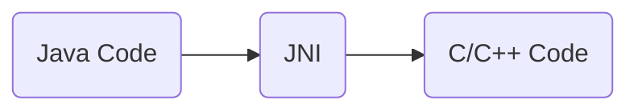

# Java Native Method

Ví dụ như phương thức `private native start0()` trong lớp Thread;

Hoặc các phương thức trong lớp Object như getClass(), hashCode(), clone(), với các chữ ký như sau:

```java 
public final native Class<?> getClass();
public native int hashCode();
protected native Object clone() throws CloneNotSupportedException;
```

Đây là những phương thức được đánh dấu bằng từ khoá `native`, và trong hầu hết các trường hợp, chúng không cần phải được thực hiện bằng ngôn ngữ Java.

### **1. JNI: Java Native Interface**

Trước khi chúng ta đi vào việc giải thích native, hãy cùng tìm hiểu về JNI (Java Native Interface).

Thường thì, chúng ta hoàn toàn có thể viết chương trình bằng ngôn ngữ Java. Tuy nhiên, có những trường hợp mà Java có thể không đáp ứng được yêu cầu, hoặc không thể đáp ứng một cách hiệu quả hơn, ví dụ:

- ① Thư viện lớp chuẩn của Java không hỗ trợ.
- ② Chúng ta đã viết một thư viện lớp bằng ngôn ngữ khác, chẳng hạn như C/C++, và muốn sử dụng nó trong mã Java.
- ③ Một số phương thức được gọi rất nhiều lần, để cải thiện hiệu suất, cần phải viết bằng ngôn ngữ gần với phần cứng (như assembly).

Ba yêu cầu trên đều liên quan đến cách sử dụng mã Java để gọi mã được viết bằng ngôn ngữ khác. Đây chính là lúc JNI ra đời.

Từ phiên bản Java 1.1 trở đi, Java Native Interface (JNI) đã trở thành một phần của nền tảng Java, cho phép mã Java tương tác với mã được viết bằng các ngôn ngữ khác.

Ban đầu, JNI được thiết kế để làm việc với các ngôn ngữ biên dịch sẵn như C và C++, nhưng không ngăn cản bạn sử dụng các ngôn ngữ khác miễn là chúng tuân theo quy ước gọi hàm được hỗ trợ. Việc sử dụng Java để tương tác với mã được biên dịch nội bộ thường dẫn đến việc mất tính di động giữa các nền tảng, tuy nhiên, trong một số trường hợp điều này là chấp nhận được, thậm chí là bắt buộc, chẳng hạn như sử dụng các thư viện cũ, tương tác với phần cứng hoặc hệ điều hành để cải thiện hiệu suất chương trình. JNI ít nhất đảm bảo rằng mã nội bộ có thể hoạt động trên bất kỳ triển khai máy ảo Java nào.



Thông qua JNI, chúng ta có thể gọi các hàm thư viện được thực hiện bởi các công nghệ và hệ thống liên quan đến hệ điều hành thông qua chương trình Java (mã). Đồng thời, các công nghệ và hệ thống khác cũng có thể sử dụng các giao diện nguyên bản cung cấp bởi JNI để gọi các chức năng được triển khai nội bộ trong hệ thống ứng dụng Java.

"Ba muội, chờ đã, Java không phải là một nền tảng đa nền tảng sao? Nếu sử dụng JNI, liệu chương trình có không còn lợi thế đa nền tảng nữa không?" Câu hỏi của ba muội thực sự làm nổi bật điều này.


Nhược điểm của JNI:

- ① Chương trình không còn đa nền tảng nữa. Để có thể đa nền tảng, bạn phải biên dịch lại phần mã ngoại cảnh trên các hệ thống khác nhau.
- ② Chương trình không còn hoàn toàn an toàn nữa, sử dụng mã ngoại cảnh một cách không thích hợp có thể dẫn đến sự cố toàn bộ chương trình. Một nguyên tắc chung là bạn nên giữ các phương pháp ngoại cảnh tập trung trong một số lượng ít các lớp. Điều này giảm thiểu sự ràng buộc giữa Java và C/C++.

Hiện tại, điểm yếu của JNI so với lợi ích vẫn là chấp nhận được, có lẽ sẽ cần có những phát triển về kỹ thuật Java sau này, khi đó chúng ta có thể không còn cần JNI nữa, nhưng cho đến nay, JDK vẫn tiếp tục hỗ trợ chuẩn JNI.

### **2. Viết phương thức native bằng ngôn ngữ C**

"Phần trước chúng ta đã tìm hiểu về JNI, bây giờ hãy cùng viết một ví dụ: làm thế nào để gọi chương trình C từ mã Java." Tôi quay sang ba muội và nói, "Hãy chú ý xem nhé."

> Tài liệu chính thức có tại: [https://docs.oracle.com/javase/8/docs/technotes/guides/jni/spec/jniTOC.html](https://docs.oracle.com/javase/8/docs/technotes/guides/jni/spec/jniTOC.html)

Các bước thực hiện như sau:

① Viết lớp Java có phương thức native, tạo tệp .java;

② Sử dụng lệnh javac để biên dịch lớp Java đã viết, tạo tệp .class;

③ Sử dụng lệnh javah -jni tên_lớp_java để tạo tệp tiêu đề có phần mở rộng là .h;

④ Sử dụng C/C++ (hoặc ngôn ngữ lập trình khác) để triển khai phương thức native, tạo tệp .cpp thực hiện các phương thức trong tệp .h;

⑤ Tạo thư viện liên kết động từ tệp C/C++, tạo tệp .dll.

Bây giờ, chúng ta sẽ thực hiện các bước này thông qua một chương trình HelloWorld.

#### 01) Viết lớp Java có phương thức native HelloJNI.java

Tạo tệp HelloJNI.java trong thư mục `/Users/itwanger/Documents/Github/javabetter/testjni` với nội dung như sau:

```java
public class HelloJNI {
    static {
        System.loadLibrary("hello"); // Tải thư viện liên kết động có tên là libhello.dylib
    }

    // Định nghĩa phương thức native
    private native void helloJNI();

    public static void main(String[] args) {
        new HelloJNI().helloJNI(); // Gọi phương thức native
    }
}
```

**PS: Các lệnh thực thi sau này sẽ được thực hiện trong thư mục testjni**.

Giải thích đoạn mã này:

`private native void helloJNI()`: Phương thức được khai báo bằng từ khóa native, thông báo cho JVM rằng phương thức này sẽ được định nghĩa bên ngoài, ở đây chúng ta sẽ sử dụng ngôn ngữ C để triển khai.

`System.loadLibrary("hello")`: Tải thư viện liên kết động, tham số "hello" là tên của thư viện. Chúng ta có thể hiểu rằng: phương thức helloJNI() trong chương trình không có thực hiện, nhưng chúng ta cần gọi phương thức này, vậy làm sao để gọi được?

Chúng ta cần khởi tạo phương thức này, vì vậy sử dụng khối mã static để khởi tạo, phần này sẽ được giải thích chi tiết sau.

#### 02) Biên dịch HelloJNI.java

Trên dòng lệnh, biên dịch mã nguồn bằng lệnh `javac HelloJNI.java`.


#### 03) Sử dụng `javah -jni HelloJNI` để tạo tệp tiêu đề có phần mở rộng là h


>PS: Từ Java 9 trở đi, javah đã bị loại bỏ, thay vào đó là sử dụng tùy chọn -h để tạo tệp tiêu đề, ví dụ: `javac -h . ClassName.java`.

Sau khi thực hiện, sẽ tạo ra tệp tiêu đề tên là HelloJNI.h trong thư mục chứa HelloJNI.java. Mở tệp HelloJNI.h, bạn sẽ thấy mã như sau:


Không cần hiểu rõ mã này, chỉ cần biết rằng nó được tạo tự động là được.

#### 04) Sử dụng ngôn ngữ C để hiện thực phương thức gốc

Tạo một tệp C, HelloJNI.c, để hiện thực phương thức gốc sayHello.

```c
#include <stdio.h>
#include <jni.h>
#include "HelloJNI.h"

JNIEXPORT void JNICALL Java_HelloJNI_helloJNI(JNIEnv *env, jobject obj) {
    printf("Hello, JNI!\n");
    return;
}
```

Lưu ý, ở đây cần bao gồm tệp tiêu đề JNI và tên phương thức hiện thực cần phải nhất quán với tên đã khai báo trong Java (`HelloJNI_helloJNI`, phương thức helloJNI của lớp HelloJNI).

#### 05) Viết kịch bản biên dịch compile.sh

```sh
#!/bin/bash

# Biên dịch tệp HelloJNI.c
gcc -I"$JAVA_HOME/include" -I"$JAVA_HOME/include/darwin" -shared -o libhello.dylib HelloJNI.c

# Sao chép tệp libhello.dylib được tạo vào thư mục hiện tại
cp libhello.dylib .
```

Lưu ý:

- `$JAVA_HOME` là đường dẫn cài đặt JDK, cần được thay đổi theo thực tế.
- Trên macOS, phần mở rộng của thư viện liên kết động là .dylib, thay vì .so trên Linux.

Tùy chọn -I được sử dụng để thông báo cho trình biên dịch về vị trí của tệp tiêu đề, `$JAVA_HOME` là đường dẫn tới thư mục cài đặt Java.

#### 06) Thực thi kịch bản biên dịch

```
sh compile.sh
```

Sau khi thực thi, một thư viện liên kết động tên là libhello.dylib sẽ được tạo trong thư mục hiện tại.


#### 07) Chạy HelloJNI

Thực thi lệnh `java HelloJNI` để chạy HelloJNI, nếu mọi thứ đều ổn, dòng chữ "Hello, JNI!" sẽ xuất hiện trên terminal.


### **3. Lưu đồ JNI gọi C**


### **4. Từ khóa native**

Từ khóa native được sử dụng để khai báo phương thức, các phương thức được khai báo bằng native nghĩa là phương thức này được hiện thực bên ngoài, có thể sử dụng bất kỳ ngôn ngữ nào để hiện thực nó, ví dụ như C/C++. Nói một cách đơn giản, một phương thức native là một giao diện để Java gọi mã không phải Java.

Cú pháp của native:

- ①, Từ khóa native phải đứng trước kiểu trả về của phương thức, thứ tự với các từ khóa khác không quan trọng.
- ②, Không thể sử dụng từ khóa abstract và không có thân hàm, cũng không có dấu ngoặc nhọn.
- ③, Kiểu trả về có thể là bất kỳ kiểu nào.
