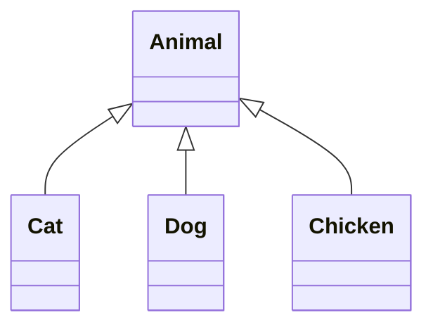

# Tính chất của OOP

Trong lập trình hướng đối tượng (OOP) của Java, ba đặc trưng chính không thể không nhắc đến là: **Đóng gói** (Encapsulation), **Kế thừa** (Inheritance) và **Đa hình** (Polymorphism). Ba đặc trưng này có mối liên hệ mật thiết và cũng có những điểm khác biệt riêng. Sử dụng hợp lý tính kế thừa có thể giúp giảm thiểu đáng kể việc lặp lại mã, từ đó **tăng cường khả năng tái sử dụng mã**.

### 1) Đóng gói

Đóng gói hiểu theo nghĩa đen là bao bọc, chuyên môn hơn là ẩn giấu thông tin, **chính là sử dụng sự trừu tượng để gói gọn dữ liệu và các thao tác dựa trên dữ liệu lại với nhau, khiến chúng trở thành một thực thể độc lập không thể chia cắt**.

Dữ liệu được bảo vệ bên trong lớp, cố gắng ẩn giấu các chi tiết thực hiện bên trong, chỉ giữ lại một số interface bên ngoài để liên kết với bên ngoài.

Các đối tượng khác chỉ có thể tương tác với đối tượng đã được đóng gói thông qua các thao tác đã được ủy quyền. Nói cách khác, người dùng không cần biết chi tiết bên trong của đối tượng (tất nhiên cũng không thể biết), nhưng có thể truy cập đối tượng thông qua các interface mà đối tượng đó cung cấp ra bên ngoài.

Sử dụng đóng gói có 4 lợi ích lớn:

- 1, Đóng gói tốt có thể giảm độ kết dính.
- 2, Cấu trúc bên trong của lớp có thể được tự do sửa đổi.
- 3, Có thể kiểm soát chính xác hơn các thành viên.
- 4, Ẩn giấu thông tin, chi tiết thực hiện.

Trước tiên chúng ta hãy xem hai lớp.

Husband.java

```java
public class Husband {

    /*
     * Đóng gói thuộc tính
     * Tên, giới tính, tuổi, vợ của một người đều là những thuộc tính riêng tư của người đó
     */
    private String name;
    private String sex;
    private int age;
    private Wife wife;

    /*
     * setter() và getter() là các interface mà đối tượng này cung cấp ra bên ngoài
     */
    public String getName() {
        return name;
    }

    public void setName(String name) {
        this.name = name;
    }

    public String getSex() {
        return sex;
    }

    public void setSex(String sex) {
        this.sex = sex;
    }

    public int getAge() {
        return age;
    }

    public void setAge(int age) {
        this.age = age;
    }

    public void setWife(Wife wife) {
        this.wife = wife;
    }
}
```

Wife.java

```java
public class Wife {
    private String name;
    private int age;
    private String sex;
    private Husband husband;

    public String getName() {
        return name;
    }

    public void setName(String name) {
        this.name = name;
    }

    public String getSex() {
        return sex;
    }

    public void setSex(String sex) {
        this.sex = sex;
    }

    public void setAge(int age) {
        this.age = age;
    }

    public void setHusband(Husband husband) {
        this.husband = husband;
    }

    public Husband getHusband() {
        return husband;
    }
}
```

Có thể thấy rằng thuộc tính wife trong lớp Husband không có phương thức `getter()`, và thuộc tính age trong lớp Wife cũng không có phương thức `getter()`. Về lý do tại sao, tôi nghĩ rằng Tam muội hiểu điều này.

Không có người phụ nữ nào muốn người khác biết tuổi của mình.

Vì vậy, đóng gói làm cho các thuộc tính của một đối tượng trở nên riêng tư, đồng thời cung cấp một số phương thức để các thuộc tính này có thể được truy cập từ bên ngoài. Nếu không muốn các thuộc tính bị truy cập từ bên ngoài, chúng ta hoàn toàn không cần cung cấp các phương thức truy cập.

Tuy nhiên, nếu một lớp không cung cấp bất kỳ phương thức nào có thể truy cập từ bên ngoài, thì lớp đó cũng không có ý nghĩa gì.

Ví dụ, chúng ta coi một ngôi nhà là một đối tượng, bên trong có các đồ trang trí đẹp như sofa, tivi, điều hòa, bàn trà, v.v., tất cả đều là những thuộc tính riêng tư của ngôi nhà này. Nhưng nếu không có những bức tường che chắn, liệu người ngoài có thể nhìn thấy toàn bộ bên trong không? Sẽ không có chút riêng tư nào!

Nhờ có những bức tường che chắn, chúng ta vừa có thể có sự riêng tư vừa có thể thay đổi cách bày trí bên trong mà không ảnh hưởng đến người bên ngoài.

Tuy nhiên, nếu không có cửa sổ và cửa ra vào, một chiếc hộp đen được bao bọc kín mít thì có ý nghĩa gì không? Vì vậy, nhờ có cửa sổ và cửa ra vào, người ngoài cũng có thể nhìn thấy cảnh bên trong. Do đó, cửa sổ và cửa ra vào chính là các interface mà ngôi nhà đối tượng cung cấp cho bên ngoài truy cập.

Qua ví dụ này, chúng ta vẫn chưa thể thực sự cảm nhận được lợi ích của đóng gói. Bây giờ, chúng ta sẽ phân tích lợi ích của đóng gói từ góc độ chương trình. Nếu chúng ta không sử dụng đóng gói, đối tượng sẽ không có `setter()` và `getter()`, thì lớp Husband sẽ được viết như sau:

```java
public class Husband {
    public String name;
    public String sex;
    public int age;
    public Wife wife;
}
```

Chúng ta sẽ sử dụng nó như sau:

```java
Husband husband = new Husband();
husband.age = 30;
husband.name = "Trương Tam";
husband.sex = "Nam"; // Có vẻ hơi thừa
```

Nhưng nếu một ngày nào đó chúng ta cần sửa đổi lớp Husband, chẳng hạn như thay đổi thuộc tính age thành kiểu String thì sao? Nếu bạn chỉ sử dụng lớp này ở một chỗ thì không sao, nhưng nếu bạn có hàng chục hoặc thậm chí hàng trăm chỗ sử dụng lớp này, bạn có thể sẽ phải thay đổi đến mức phát điên. Nếu sử dụng đóng gói, chúng ta hoàn toàn không cần phải làm bất kỳ thay đổi nào, chỉ cần thay đổi một chút phương thức `setAge()` trong lớp Husband là đủ.

```java
public class Husband {

    /*
     * Đóng gói thuộc tính
     * Tên, giới tính, tuổi, vợ của một người đều là những thuộc tính riêng tư của người đó
     */
    private String name;
    private String sex;
    private String age;    /* Đổi thành kiểu String */
    private Wife wife;

    public String getAge() {
        return age;
    }

    public void setAge(int age) {
        // Chỉ cần chuyển đổi
        this.age = String.valueOf(age);
    }

    /** Bỏ qua các setter, getter của thuộc tính khác **/

}
```

Các chỗ khác vẫn tham chiếu theo cách cũ (`husband.setAge(22)`) mà không cần thay đổi.

Đến đây, chúng ta thực sự có thể thấy rằng **đóng gói giúp chúng ta dễ dàng thay đổi cách thực hiện bên trong của lớp mà không cần thay đổi mã nguồn sử dụng lớp đó**.

Chúng ta hãy xem lợi ích này: **Đóng gói có thể kiểm soát chính xác hơn các biến thành viên**.

Vẫn là lớp Husband, thông thường khi chúng ta tham chiếu đến đối tượng này thì khó có lỗi, nhưng đôi khi bạn có thể viết nhầm như sau:

```java
Husband husband = new Husband();
husband.age = 300;
```

Có thể bạn đã viết nhầm do bất cẩn, nếu bạn phát hiện ra thì không sao, nhưng nếu không phát hiện ra thì thật là rắc rối, ai đã từng thấy một yêu quái 300 tuổi chứ!

Nhưng nếu sử dụng đóng gói, chúng ta có thể tránh được vấn đề này. Chúng ta có thể kiểm soát việc truy cập thuộc tính age thông qua phương thức setter như sau:

```java
public class Husband {

    /*
     * Đóng gói thuộc tính
     * Tên, giới tính, tuổi, vợ của một người đều là những thuộc tính riêng tư của người đó
     */
    private String name;
    private String sex;
    private int age;
    private Wife wife;

    public int getAge() {
        return age;
    }

    public void setAge(int age) {
        if (age > 120) {
            System.out.println("ERROR: error age input....");    // Hiển thị thông báo lỗi
        } else {
            this.age = age;
        }
    }

    /** Bỏ qua các setter, getter của thuộc tính khác **/

}
```

Trên đây là kiểm soát phương thức setter, thực ra thông qua đóng gói chúng ta cũng có thể kiểm soát tốt các đầu ra của đối tượng. Ví dụ, giới tính thường được lưu trữ dưới dạng 1 và 0 trong cơ sở dữ liệu, nhưng không thể hiển thị 1 và 0 ở interface người dùng. Chúng ta chỉ cần thực hiện một số chuyển đổi trong phương thức `getter()` là được.

```java
public String getSexName() {
    if ("0".equals(sex)) {
        sexName = "Nữ";
    } else if ("1".equals(sex)) {
        sexName = "Nam";
    }
    return sexName;
}
```

Khi sử dụng, chúng ta chỉ cần sử dụng sexName để hiển thị giới tính chính xác. Tương tự, cách này cũng có thể được áp dụng để thực hiện các thao tác khác nhau dựa trên các trạng thái khác nhau.

```java
public String getCzHTML() {
    if ("1".equals(zt)) {
        czHTML = "<a href='javascript:void(0)' onclick='qy(" + id + ")'>Kích hoạt</a>";
    } else {
        czHTML = "<a href='javascript:void(0)' onclick='jy(" + id + ")'>Vô hiệu hóa</a>";
    }
    return czHTML;
}
```

### 2) Kế thừa

#### 01. Kế thừa là gì

**Kế thừa** (tiếng Anh: inheritance) là một khái niệm trong công nghệ phần mềm hướng đối tượng. Nó làm cho việc **tái sử dụng mã đã viết trở nên rất dễ dàng**.

Ngôn ngữ Java là một ngôn ngữ hướng đối tượng rất tiêu biểu, trong ngôn ngữ Java, **kế thừa là việc lớp con kế thừa các thuộc tính và phương thức của lớp cha, khiến cho đối tượng (instance) của lớp con có các thuộc tính và phương thức của lớp cha, hoặc lớp con kế thừa phương thức từ lớp cha, khiến cho lớp con có các phương thức giống như lớp cha**.

Chúng ta hãy lấy một ví dụ: Động vật có nhiều loại, là một khái niệm khá lớn. Trong các loại động vật, chúng ta quen thuộc với mèo (Cat), chó (Dog), v.v. Chúng đều có các đặc điểm chung của động vật (ví dụ như có thể ăn, có thể phát ra âm thanh), nhưng lại có sự khác biệt trong chi tiết (cách ăn khác nhau, tiếng kêu khác nhau).

Trong ngôn ngữ Java, khi triển khai các lớp như Cat và Dog, chúng ta cần kế thừa lớp Animal. Sau khi kế thừa, các lớp động vật cụ thể như Cat, Dog trở thành các lớp con, và lớp Animal trở thành lớp cha.



#### 02. Tại sao cần kế thừa?

Nếu chỉ có hai hoặc ba lớp, mỗi lớp có các thuộc tính và phương thức rất hạn chế thì thực sự không cần thiết phải triển khai kế thừa, nhưng thực tế không phải vậy. Trong thực tế, một hệ thống thường có rất nhiều lớp và có nhiều điểm tương đồng, ví dụ như mèo và chó đều là động vật, hoặc học sinh và giáo viên đều là con người. Các lớp có thể có nhiều thuộc tính và phương thức giống nhau, nếu mỗi lớp đều viết lại thì không chỉ làm mã trở nên lộn xộn mà khối lượng công việc cũng rất lớn.

Lợi ích của kế thừa xuất hiện ở đây: có thể trực tiếp sử dụng các thuộc tính và phương thức của lớp cha, đồng thời lớp con cũng có thể có các thuộc tính và phương thức mới của riêng mình để mở rộng. Nếu có nhu cầu thay đổi phương thức của lớp cha, lớp con cũng có thể ghi đè (override). Như vậy, **việc sử dụng kế thừa không chỉ giảm đáng kể lượng mã cần viết mà còn làm cho cấu trúc mã trở nên rõ ràng hơn**.

Từ góc độ mã nguồn, chúng ta thiết kế lớp Animal hoàn chỉnh như sau:

```java
class Animal {
    public int id;
    public String name;
    public int age;
    public int weight;

    public Animal(int id, String name, int age, int weight) {
        this.id = id;
        this.name = name;
        this.age = age;
        this.weight = weight;
    }
    // Bỏ qua các phương thức getter và setter
    public void sayHello() {
        System.out.println("hello");
    }
    public void eat() {
        System.out.println("I'm eating");
    }
    public void sing() {
        System.out.println("sing");
    }
}
```

Lớp Dog, Cat và Chicken có thể được thiết kế như sau:

```java
class Dog extends Animal { // Kế thừa lớp Animal
    public Dog(int id, String name, int age, int weight) {
        super(id, name, age, weight); // Gọi phương thức khởi tạo của lớp cha
    }
}

class Cat extends Animal {
    public Cat(int id, String name, int age, int weight) {
        super(id, name, age, weight); // Gọi phương thức khởi tạo của lớp cha
    }
}

class Chicken extends Animal {
    public Chicken(int id, String name, int age, int weight) {
        super(id, name, age, weight); // Gọi phương thức khởi tạo của lớp cha
    }
    // Gà đẻ trứng
    public void layEggs() {
        System.out.println("Tôi là gà mái đang đẻ trứng, cục tác cục tác!");
    }
}
```

Các lớp riêng biệt kế thừa lớp Animal có thể trực tiếp sử dụng các thuộc tính và phương thức của lớp Animal mà không cần phải viết lại, và mỗi lớp cũng có thể dễ dàng mở rộng với các phương thức riêng của mình.

#### 03. Các loại kế thừa

Kế thừa được chia thành đơn kế thừa và đa kế thừa. Ngôn ngữ Java chỉ hỗ trợ đơn kế thừa cho các lớp, nhưng có thể đạt được mục đích đa kế thừa thông qua việc triển khai interface. **Chúng ta đã đề cập đến điều này khi nói về interface, ở đây chúng ta sẽ nói lại một chút.**

| Kế thừa                                                                               | Định nghĩa                     | Ưu và nhược điểm                                                                        |
| ------------------------------------------------------------------------------------- | ------------------------------ | --------------------------------------------------------------------------------------- |
| Đơn kế thừa                                                                           | Một lớp con chỉ có một lớp cha | Ưu điểm: Cấu trúc lớp rõ ràng<br>Nhược điểm: Đôi khi không đáp ứng được nhu cầu sử dụng |
| Đa kế thừa (Java không hỗ trợ, nhưng có thể sử dụng các phương thức khác để đạt được) | Một lớp con có nhiều lớp cha   | Ưu điểm: Độ phong phú của lớp con rất cao<br>Nhược điểm: Dễ gây ra sự lộn xộn           |

##### **Đơn kế thừa**

Đơn kế thừa, một lớp con chỉ có một lớp cha, như chúng ta đã đề cập ở trên với lớp Animal và các lớp con của nó. **đơn kế thừa làm cho cấu trúc lớp trở nên rõ ràng, nhưng nhược điểm là đôi khi không đáp ứng được nhu cầu sử dụng do sự thiếu phong phú trong cấu trúc**.

##### **Đa kế thừa**

Đa kế thừa, một lớp con có nhiều lớp cha trực tiếp. Lợi ích của cách này là lớp con sẽ có tất cả các đặc điểm của các lớp cha, **lớp con có độ phong phú rất cao, nhưng nhược điểm là dễ gây ra sự lộn xộn**.

Mặc dù Java không hỗ trợ đa kế thừa, nhưng có ba cách để đạt được hiệu quả của đa kế thừa trong Java, **đó là** lớp bên trong, kế thừa nhiều tầng và triển khai interface.

[Lớp bên trong](/prograaming/java/basic/oo/inner-class.html) có thể kế thừa một lớp không liên quan đến lớp bên ngoài, đảm bảo tính độc lập của lớp bên trong, nhờ đó có thể đạt được hiệu quả của đa kế thừa.

**Kế thừa nhiều tầng:** Lớp con kế thừa lớp cha, và lớp cha nếu kế thừa các lớp khác thì đó được gọi là **kế thừa nhiều tầng**. Theo cách này, lớp con sẽ có tất cả các thuộc tính và phương thức của các lớp được kế thừa.

[Triển khai interface](/programming/java/oo/interface.html) chắc chắn là cách tốt nhất để đáp ứng nhu cầu sử dụng đa kế thừa. Một lớp có thể triển khai nhiều interface để đáp ứng nhu cầu phong phú và môi trường phức tạp.

So với lớp, **lớp là một thực thể, có thuộc tính và phương thức, trong khi interface thiên về một tập hợp các phương thức**.

#### 04. Cách thực hiện kế thừa

##### **Từ khóa `extends`**

Trong Java, kế thừa của lớp là đơn kế thừa, nghĩa là một lớp con chỉ có thể có một lớp cha, vì vậy từ khóa **`extends`** chỉ có thể kế thừa một lớp. Cú pháp sử dụng của nó là:

```java
class Child extends Parent {}
```

Ví dụ lớp Dog kế thừa lớp Animal, nó sẽ như thế này:

```java
class Animal {} // Định nghĩa lớp Animal
class Dog extends Animal {} // Lớp Dog kế thừa lớp Animal
```

Sau khi lớp con kế thừa lớp cha, nó sẽ sở hữu các **thuộc tính và phương thức** không phải là private của lớp cha. Nếu không rõ, hãy xem ví dụ này, tạo một dự án trong IDEA, tạo một lớp test để kiểm tra, lần lượt tạo lớp Animal và lớp Dog, lớp Animal là lớp cha có phương thức sayHello(), sau khi lớp Dog kế thừa lớp Animal, nó có thể gọi phương thức sayHello(). Cụ thể như sau:

```java
class Animal {
    public void sayHello() // Phương thức của lớp cha
    {
        System.out.println("hello, everybody");
    }
}
class Dog extends Animal // Kế thừa Animal
{ }
public class test {
    public static void main(String[] args) {
       Dog dog = new Dog();
       dog.sayHello();
    }
}
```

Khi chạy, lớp Dog có thể trực tiếp sử dụng phương thức của lớp cha Animal.
##### **Từ khóa `implements`**

Sử dụng từ khóa `implements` có thể gián tiếp mang lại đặc tính đa kế thừa cho Java, áp dụng trong trường hợp lớp triển khai interface, một lớp có thể triển khai nhiều interface (các interface cách nhau bằng dấu phẩy).

Hãy xem một ví dụ, tạo một lớp test2 để kiểm tra, lần lượt tạo interface doA và doB, interface doA khai báo phương thức sayHello(), interface doB khai báo phương thức eat(), tạo lớp Cat2 triển khai các interface doA và doB, và trong lớp này cần ghi đè các phương thức sayHello() và eat(). Cụ thể như sau:

```java
interface doA {
     void sayHello();
}
interface doB {
     void eat();
    // Dưới đây sẽ báo lỗi vì phương thức trong interface không thể có định nghĩa cụ thể mà chỉ có thể khai báo
    // public void eat() { System.out.println("eating"); }
}
class Cat2 implements doA, doB {
    @Override // Phải ghi đè các phương thức trong interface
    public void sayHello() {
        System.out.println("hello!");
    }
    @Override
    public void eat() {
        System.out.println("I'm eating");
    }
}
public class test2 {
    public static void main(String[] args) {
        Cat2 cat = new Cat2();
        cat.sayHello();
        cat.eat();
    }
}
```

Khi lớp Cat2 triển khai các interface doA và doB, nó cần triển khai các phương thức đã khai báo, kết quả khi chạy như sau, đây là một ví dụ đơn giản về một lớp triển khai interface.

#### 05. Đặc điểm của kế thừa

Nội dung chính của kế thừa là lớp con kế thừa lớp cha và ghi đè phương thức của lớp cha. Khi sử dụng thuộc tính hoặc phương thức của lớp con, trước tiên cần tạo một đối tượng, và đối tượng này được tạo thông qua [phương thức khởi tạo (constructor)](/programming/java/oo/constructor). Trong phương thức khởi tạo, chúng ta có thể cần gọi một số thuộc tính và phương thức của lớp cha và lớp con, vì vậy cần phải nắm vững [từ khóa this và super](/programming/java/oo/this-super).

Sau khi tạo đối tượng này, chúng ta có thể gọi phương thức của lớp cha đã được ghi đè. Lưu ý sự khác biệt giữa [ghi đè (override) và nạp chồng (overload)](/programming/java/extra/override-overload.html).

##### Từ khóa `this` và `super`

> Sẽ được giải thích chi tiết hơn ở [phần sau](/programming/java/oo/this-super), ở đây chúng ta chỉ đơn giản tìm hiểu.

Từ khóa `this` và `super` là các kiến thức rất quan trọng trong kế thừa, chúng lần lượt đại diện cho tham chiếu đến đối tượng hiện tại và tham chiếu đến đối tượng của lớp cha. Chúng có nhiều điểm tương đồng nhưng cũng có một số khác biệt.

**`this` đại diện cho đối tượng hiện tại, là tham chiếu đến chính nó.**

```java
this.field // Gọi biến thành viên, phân biệt giữa biến thành viên và biến cục bộ
this.method() // Gọi một phương thức của lớp hiện tại
this() // Gọi phương thức khởi tạo của lớp hiện tại
```

**`super` đại diện cho đối tượng lớp cha, là tham chiếu đến đối tượng của lớp cha.**

```java
super.field // Đại diện cho biến thành viên trong lớp cha
super.method() // Gọi phương thức được định nghĩa trong lớp cha
super() // Gọi phương thức khởi tạo của lớp cha
```

##### Phương thức khởi tạo (Constructor)

[Phương thức khởi tạo](/programming/java/oo/construct) là một phương thức đặc biệt, **nó là một phương thức cùng tên với lớp**. Trong kế thừa, phương thức khởi tạo là một phương thức khá đặc biệt (ví dụ như không thể kế thừa), vì vậy cần hiểu và học các quy tắc và yêu cầu của phương thức khởi tạo trong kế thừa.

Có một số điểm cần lưu ý về phương thức khởi tạo trong kế thừa:

**Phương thức khởi tạo của lớp cha không thể được kế thừa:**

Vì cú pháp của phương thức khởi tạo là **cùng tên với lớp**, và kế thừa không thay đổi tên phương thức, nếu lớp con kế thừa phương thức khởi tạo của lớp cha, thì rõ ràng sẽ xung đột với cú pháp của phương thức khởi tạo. Ví dụ, phương thức khởi tạo của lớp Father là Father(), nếu lớp Son kế thừa phương thức khởi tạo Father() của lớp Father, thì sẽ xung đột với định nghĩa của phương thức khởi tạo: **Phương thức khởi tạo cùng tên với lớp**, do đó trong lớp con không thể kế thừa phương thức khởi tạo của lớp cha, nhưng lớp con sẽ gọi phương thức khởi tạo của lớp cha.

**Quá trình khởi tạo của lớp con phải gọi phương thức khởi tạo của lớp cha:**

Máy ảo Java **sẽ tạo đối tượng lớp cha trước khi tạo đối tượng lớp con, sau khi hoàn thành việc tạo đối tượng lớp cha thì mới tạo các thuộc tính đặc biệt của lớp con**, điều này được gọi là **chồng bộ nhớ**. Và việc máy ảo Java tạo đối tượng lớp cha sẽ thực thi phương thức khởi tạo của lớp cha, do đó phương thức khởi tạo của lớp con phải gọi super(), tức là phương thức khởi tạo của lớp cha. Ví dụ, một trường hợp kế thừa đơn giản nên viết như sau:

```java
class A {
    public String name;
    public A() { // Phương thức khởi tạo không tham số
    }
    public A(String name) { // Phương thức khởi tạo có tham số
    }
}
class B extends A {
    public B() { // Phương thức khởi tạo không tham số
        super();
    }
    public B(String name) { // Phương thức khởi tạo có tham số
        // super();
        super(name);
    }
}
```

**Nếu phương thức khởi tạo của lớp con không hiển thị gọi phương thức khởi tạo của lớp cha, hệ thống sẽ mặc định gọi phương thức khởi tạo không tham số của lớp cha.**

Có thể đôi khi bạn viết kế thừa mà lớp con không sử dụng super() để gọi, chương trình vẫn không có vấn đề gì, thực tế là để tiết kiệm mã lệnh, hệ thống sẽ tự động thêm phương thức khởi tạo không tham số của lớp cha khi thực thi.
##### Ghi đè phương thức (Override)

[Ghi đè phương thức](/programming/java/extra/overriding) nghĩa là trong lớp con xuất hiện một phương thức giống hệt với lớp cha (bao gồm kiểu trả về, tên phương thức, danh sách tham số), nó được xây dựng trên nền tảng của kế thừa. Bạn có thể hiểu đơn giản rằng phần **vỏ ngoài của phương thức không thay đổi, nhưng nội dung bên trong thì được viết lại**.

Dưới đây là một ví dụ đơn giản và dễ hiểu về ghi đè phương thức:

```java
class E1 {
    public void doA(int a) {
        System.out.println("Đây là phương thức của lớp cha");
    }
}
class E2 extends E1 {
    @Override
    public void doA(int a) {
        System.out.println("Tôi đã ghi đè phương thức của lớp cha, đây là phương thức của lớp con");
    }
}
```

Trong đó, chú thích `@Override` thể hiện rằng phương thức này là phương thức ghi đè, giúp kiểm tra tính chính xác của cú pháp ghi đè, tất nhiên nếu không thêm cũng không sao, nhưng nên thêm vào.

##### Nạp chồng phương thức (Overload)

Nếu có hai phương thức **cùng tên**, nhưng tham số khác nhau, thì có thể nói một phương thức là nạp chồng của phương thức kia.

Nạp chồng phương thức thường được hiểu là các phương thức hoàn thành cùng một công việc có cùng tên, nhưng danh sách tham số khác nhau và các điều kiện khác cũng có thể khác nhau. Dưới đây là một ví dụ đơn giản về nạp chồng phương thức, phương thức add() trong lớp E3 là một phương thức nạp chồng.

```java
class E3 {
    public int add(int a, int b) {
        return a + b;
    }
    public double add(double a, double b) {
        return a + b;
    }
    public int add(int a, int b, int c) {
        return a + b + c;
    }
}
```

Trong ví dụ này, phương thức `add` được nạp chồng với ba biến thể khác nhau, dựa trên các tham số mà nó nhận.

#### 06. Kế thừa và quyền truy cập

Các từ khóa trong Java có tác dụng sửa đổi hoặc giới hạn các lớp hoặc thành viên của lớp. Mỗi từ khóa có tác dụng riêng và trong kế thừa, có một số từ khóa đặc biệt làm cho thuộc tính hoặc phương thức bị sửa đổi không thể được kế thừa, hoặc kế thừa cần một số điều kiện khác.

Java cung cấp nhiều từ khóa, dùng để định nghĩa lớp, phương thức hoặc biến, thường được đặt ở đầu câu lệnh. Chúng chủ yếu được chia thành hai loại:

- [Từ khóa truy cập](/programming/java/oo/access-control.html), như public, private, protected, v.v.
- Từ khóa không truy cập, như static, final, abstract, v.v.

##### Từ khóa quyền truy cập

Khi lớp con ghi đè phương thức kế thừa, **không được phép giảm quyền truy cập của phương thức**, **phạm vi từ khóa truy cập của lớp con không được nhỏ hơn lớp cha**, tức là phải mở rộng hơn. Ví dụ, nếu lớp cha sử dụng từ khóa protected, thì lớp con chỉ có thể là protected hoặc public, không thể là default (phạm vi truy cập mặc định) hoặc private. Vì vậy, các phương thức cần được ghi đè trong kế thừa không thể sử dụng từ khóa private.

Nếu vẫn chưa rõ, bạn có thể xem một số ví dụ nhỏ để dễ hiểu hơn. Viết một lớp A1 với bốn phương thức được sửa đổi bởi bốn từ khóa khác nhau, và một lớp con A2 kế thừa A1. Khi ghi đè các phương thức của A1, bạn sẽ thấy phương thức riêng tư của lớp cha không thể được ghi đè, và phạm vi từ khóa truy cập của phương thức được ghi đè không thể nhỏ hơn (phải lớn hơn hoặc bằng).

Dưới đây là ví dụ chính xác:

```java
class A1 {
    private void doA() { }
    void doB() {} // default
    protected void doC() { }
    public void doD() { }
}

class A2 extends A1 {
    @Override
    public void doB() { } // Phạm vi truy cập có thể kế thừa

    @Override
    protected void doC() { } // Phạm vi truy cập có thể giữ nguyên

    @Override
    public void doD() { } // Không thể dùng protected hoặc default
}
```

Cũng cần lưu ý rằng, **trong kế thừa, ngoại lệ mà lớp con ném ra phải là ngoại lệ của lớp cha hoặc ngoại lệ con của ngoại lệ mà lớp cha ném ra**. Dưới đây là một ví dụ với bốn phương thức kiểm tra, bạn sẽ thấy ngoại lệ của phương thức lớp con không được lớn hơn phạm vi ngoại lệ của phương thức tương ứng trong lớp cha.

Ví dụ chính xác như sau:

```java
class B1 {
    public void doA() throws Exception { }
    public void doB() throws Exception { }
    public void doC() throws IOException { }
    public void doD() throws IOException { }
}

class B2 extends B1 {
    // Phạm vi ngoại lệ có thể giữ nguyên
    @Override
    public void doA() throws Exception { }
    // Phạm vi ngoại lệ có thể nhỏ hơn
    @Override
    public void doB() throws IOException { }
    // Phạm vi ngoại lệ không thể lớn hơn
    @Override
    public void doC() throws IOException { } // Không thể ném ra ngoại lệ lớn hơn như Exception
    @Override
    public void doD() throws IOException { }
}
```

##### Các Từ Khoá Sửa Đổi Không Phải Truy Cập

Các từ khoá sửa đổi quyền truy cập được sử dụng để kiểm soát quyền truy cập, trong khi các từ khoá sửa đổi không phải quyền truy cập mỗi từ có vai trò riêng biệt. Dưới đây là giới thiệu về các từ khoá sửa đổi static, final, và abstract.

###### [Từ Khoá Static](/programming/java/oo/static.html)

`static` dịch là "tĩnh", có thể được sử dụng cùng với biến, phương thức và lớp, được gọi là biến tĩnh, phương thức tĩnh (cũng được gọi là biến lớp, phương thức lớp). Nếu trong một lớp sử dụng từ khoá sửa đổi `static` để sửa đổi biến hoặc phương thức, chúng **có thể được truy cập trực tiếp thông qua lớp, không cần phải tạo một đối tượng của lớp để truy cập thành viên.**

Khi thiết kế lớp, chúng ta có thể sử dụng phương thức tĩnh, có rất nhiều lớp công cụ như `Math`, `Arrays` có chứa nhiều phương thức tĩnh.

```java
class C1 {
    public int a;
    public C1() {}
    // public static C1(){} // Constructor không được khai báo là static
    public static void doA() {}
    public static void doB() {}
}

class C2 extends C1 {
    public static void doC() {
        // Phương thức tĩnh không tồn tại đối tượng hiện tại, vì vậy không thể sử dụng this và super.
        // System.out.println(super.a);
    }
    public static void doA() {} // Phương thức tĩnh có thể bị ghi đè bởi phương thức tĩnh
    // public void doB() {} // Phương thức tĩnh không thể bị ghi đè bởi phương thức không tĩnh
}
```

###### [Từ Khoá Final](/programming/java/oo/final.html)

`final` có nghĩa là "cuối cùng", có thể được sử dụng để sửa đổi biến, phương thức và lớp.

Biến `final`:

- `final` biểu thị "cuối cùng, không thể thay đổi", **biến một khi được gán giá trị sẽ không thể được gán lại giá trị khác**. Biến thành viên được `final` sửa đổi phải được chỉ định giá trị ban đầu rõ ràng (tức là không thể chỉ khai báo). Từ khoá sửa đổi `final` thường được sử dụng cùng với từ khoá `static` để tạo ra các hằng số của lớp.

Phương thức `final`:

- **Phương thức `final` trong lớp cha có thể được lớp con kế thừa, nhưng không thể bị lớp con ghi đè**. Mục đích chính của việc khai báo phương thức `final` là để ngăn chặn nội dung của phương thức đó bị thay đổi.

Lớp `final`:

- **Lớp `final` không thể bị kế thừa**, không có lớp nào có thể kế thừa bất kỳ đặc tính nào của lớp `final`.

Vì vậy, cho dù là biến, phương thức hay lớp được sửa đổi bởi `final`, chúng đều mang ý nghĩa cuối cùng, không thể thay đổi nội dung.

###### [Từ Khoá Abstract](/programming/java/oo/abstract.html)

`abstract` dịch là "trừu tượng", chủ yếu được sử dụng để sửa đổi lớp và phương thức, được gọi là lớp trừu tượng và phương thức trừu tượng.

**Phương thức trừu tượng**: Có rất nhiều phương thức của các lớp khác nhau tương tự nhau, nhưng nội dung cụ thể lại khác nhau, vì vậy chúng ta chỉ có thể trích xuất khai báo của nó, không có thân phương thức cụ thể, tức là phương thức trừu tượng có thể biểu thị khái niệm nhưng không thể thực hiện cụ thể.

**Lớp trừu tượng**: **Lớp có phương thức trừu tượng phải là lớp trừu tượng**, lớp trừu tượng có thể biểu thị khái niệm nhưng không thể tạo ra thực thể của lớp.

Ví dụ, chúng ta có thể thiết kế một lớp trừu tượng `People` và một phương thức trừu tượng, trong các lớp con sẽ hoàn thiện cụ thể:

```java
abstract class People {
    public abstract void sayHello(); // Phương thức trừu tượng
}

class Vietnamese extends People {
    @Override
    public void sayHello() { // Thực hiện phương thức trừu tượng
        System.out.println("Xin chào");
    }
}

class Chinese extends People {
    @Override
    public void sayHello() { // Thực hiện phương thức trừu tượng
        System.out.println("你好");
    }
}

class Japanese extends People {
    @Override
    public void sayHello() { // Thực hiện phương thức trừu tượng
        System.out.println("こんにちは");
    }
}

class American extends People {
    @Override
    public void sayHello() { // Thực hiện phương thức trừu tượng
        System.out.println("Hello");
    }
}
```

### 07. Lớp Object và Chuyển Kiểu

Khi nhắc đến kế thừa trong Java, không thể không đề cập đến lớp gốc của mọi lớp: lớp `Object` (java.lang.Object). Nếu một lớp không khai báo rõ ràng lớp cha của nó (tức là không viết extends xx), thì mặc định lớp cha của nó chính là lớp `Object`. Mọi lớp đều có thể sử dụng các phương thức của lớp `Object`, và các đối tượng được tạo ra có thể thực hiện chuyển kiểu lên hoặc xuống với `Object`, vì vậy, việc nắm vững và hiểu về lớp `Object` là điều cần thiết khi học về kế thừa.

Chuyển kiểu lên (upcasting) và chuyển kiểu xuống (downcasting) trong Java được sử dụng rất nhiều và dựa trên cơ sở kế thừa, vì vậy việc hiểu về chuyển kiểu trong Java cũng rất quan trọng.

#### Tổng Quan về Lớp Object

1.  `Object` là lớp **gốc** của cấu trúc kế thừa, tất cả các lớp đều mặc định kế thừa từ lớp `Object`.
2.  Trong Java, tất cả các đối tượng đều có các phương thức mặc định từ lớp `Object`.
3.  Lớp `Object` có một [phương thức khởi tạo](/programming/java/oo/construct.html), và đó là **phương thức khởi tạo không tham số**.

Lớp `Object` là lớp cha của tất cả các lớp trong Java, là đỉnh của cấu trúc kế thừa, và cũng là lớp trừu tượng nhất.

Các phương thức như `toString()`, `equals()`, `hashCode()`, `wait()`, `notify()`, `getClass()` đều là phương thức của lớp `Object`. Bạn có thể thường xuyên gặp chúng, đặc biệt là `toString()` và `equals()`, vì chúng thường được ghi đè để phù hợp với nhu cầu sử dụng của chúng ta.

Phương thức `toString()` trả về chuỗi biểu diễn của đối tượng, do mỗi đối tượng có cấu tạo khác nhau nên cần ghi đè phương thức này, nếu không ghi đè thì mặc định sẽ trả về chuỗi theo định dạng `TênLớp@hashCode`.

**Khi ghi đè phương thức `toString()`**, bạn có thể gọi trực tiếp phương thức này để trả về chuỗi mà bạn đã tùy chỉnh, giúp đơn giản hóa quá trình xuất dữ liệu.

Phương thức `equals()` chủ yếu so sánh hai đối tượng xem chúng có bằng nhau hay không, vì sự bằng nhau của đối tượng không nhất thiết phải yêu cầu địa chỉ của hai đối tượng giống nhau, đôi khi chỉ cần nội dung của chúng giống nhau là đủ. Ví dụ, lớp `String` đã ghi đè phương thức `equals()` để so sánh nội dung của chuỗi xem có bằng nhau hay không.
#### Chuyển Kiểu Lên

**Chuyển kiểu lên**: Là quá trình tạo một đối tượng của lớp con (phạm vi hẹp hơn) và gán cho biến tham chiếu của lớp cha (phạm vi rộng hơn). Đây là quá trình chuyển đổi tự động.

Khi biến tham chiếu của lớp cha trỏ đến đối tượng của lớp con, chỉ có thể sử dụng các phương thức đã được khai báo trong lớp cha, nhưng nếu phương thức đã bị ghi đè thì phương thức của lớp con sẽ được thực thi, nếu phương thức không bị ghi đè thì phương thức của lớp cha sẽ được thực thi.

#### Chuyển Kiểu Xuống

**Chuyển kiểu xuống**: Là quá trình chuyển đổi từ đối tượng của lớp cha (phạm vi rộng hơn) sang đối tượng của lớp con (phạm vi hẹp hơn), trong mã nguồn cần thêm dấu ngoặc đơn `()` để ép kiểu về lớp con. Tuy nhiên, biến tham chiếu của lớp cha phải thực sự trỏ đến đối tượng của lớp con mới có thể chuyển kiểu thành công.

Khi biến tham chiếu của lớp con trỏ đến đối tượng mà biến tham chiếu của lớp cha đang trỏ đến, thì quá trình chuyển kiểu xuống hoàn tất, và có thể gọi các phương thức đặc trưng của lớp con mà lớp cha không có.

Dưới đây là một ví dụ về chuyển kiểu lên và chuyển kiểu xuống:

```java
Object object = new Integer(666); // Chuyển kiểu lên

Integer i = (Integer) object; // Chuyển kiểu xuống từ Object -> Integer, thực chất object vẫn trỏ đến Integer

String str = (String) object; // Chuyển kiểu xuống sai, mặc dù trình biên dịch không báo lỗi nhưng khi chạy sẽ báo lỗi
```

### 08. Thứ Tự Khởi Tạo Giữa Lớp Cha và Lớp Con

Trong Java, thứ tự khởi tạo giữa lớp cha và lớp con tuân theo nguyên tắc sau:

1.  Thành viên tĩnh và khối tĩnh trong lớp cha
2.  Thành viên tĩnh và khối tĩnh trong lớp con
3.  Thành viên thông thường và khối mã thông thường trong lớp cha, sau đó đến phương thức khởi tạo của lớp cha
4.  Thành viên thông thường và khối mã thông thường trong lớp con, sau đó đến phương thức khởi tạo của lớp con

Tóm lại, thứ tự khởi tạo là **Tĩnh > Không tĩnh, Lớp cha > Lớp con, Thành viên và khối mã > Phương thức khởi tạo**. Trong cùng một loại (ví dụ: thành viên thông thường và khối mã thông thường), các thành viên và khối mã được thực thi theo thứ tự từ trên xuống dưới.

Nguyên tắc này không khó hiểu:

- Các biến tĩnh cũng được gọi là biến lớp, có thể xem như biến toàn cục. Các thành viên tĩnh và khối mã tĩnh được khởi tạo khi lớp được tải, trong khi các biến và khối mã không tĩnh được khởi tạo khi đối tượng được tạo. Do đó, khởi tạo tĩnh diễn ra trước khởi tạo không tĩnh.
- Khi tạo một đối tượng lớp con, cần tạo đối tượng lớp cha trước, do đó lớp cha được ưu tiên khởi tạo trước lớp con.
- Khi gọi phương thức khởi tạo, đây là quá trình khởi tạo các biến thành viên, vì vậy các biến thành viên và khối mã được thực thi trước phương thức khởi tạo.

Để hiểu sâu hơn về lý do tại sao có thứ tự này, cần hiểu thêm về quy trình thực thi của JVM. Dưới đây là đoạn mã thử nghiệm minh họa cho thứ tự khởi tạo:

```java
class Father {
    static int a1 = 0; // Biến static của lớp cha, khởi tạo đầu tiên
    static {
        System.out.println(++a1 + " Lớp cha static");
    }
    int b1 = a1; // Biến thành viên của lớp cha, khởi tạo thứ ba
    {
        System.out.println(++b1 + " Lớp cha khối mã");
    }
    public Father() {
        System.out.println(++b1 + " Lớp cha phương thức khởi tạo");
    } // Phương thức khởi tạo của lớp cha, khởi tạo thứ tư
}

class Son extends Father {
    static {
        System.out.println(++a1 + " Lớp con static");
    } // Biến static của lớp con, khởi tạo thứ hai
    int b2 = b1; // Biến thành viên của lớp con, khởi tạo thứ năm
    {
        System.out.println(++b2 + " Lớp con khối mã");
    }
    public Son() {
        System.out.println(++b2 + " Lớp con phương thức khởi tạo");
    } // Phương thức khởi tạo của lớp con, khởi tạo thứ sáu
}

public class TestInitialization {
    public static void main(String[] args) {
        Son son = new Son();
    }
}
```

Kết quả thực thi:

```
1 Lớp cha static
2 Lớp con static
3 Lớp cha khối mã
4 Lớp cha phương thức khởi tạo
5 Lớp con khối mã
6 Lớp con phương thức khởi tạo
```

Trong kết quả này, bạn có thể thấy thứ tự khởi tạo được tuân thủ như đã mô tả:

1. Lớp cha khởi tạo biến tĩnh và khối tĩnh.
2. Lớp con khởi tạo biến tĩnh và khối tĩnh.
3. Lớp cha khởi tạo biến thành viên và khối mã.
4. Phương thức khởi tạo của lớp cha được gọi.
5. Lớp con khởi tạo biến thành viên và khối mã.
6. Phương thức khởi tạo của lớp con được gọi.

### 3) Đa hình

Đa hình trong Java đề cập đến việc trong lập trình hướng đối tượng, các đối tượng của cùng một lớp có thể hiển thị các hành vi và trạng thái khác nhau trong các tình huống khác nhau.

- Lớp con có thể kế thừa các trường và phương thức từ lớp cha, và các đối tượng của lớp con có thể trực tiếp sử dụng các phương thức và trường của lớp cha (trừ các phương thức private).
- Lớp con có thể ghi đè (override) các phương thức được thừa hưởng từ lớp cha, điều này cho phép đối tượng của lớp con gọi phương thức này và thể hiện ra các hành vi khác nhau.
- Có thể gán đối tượng của lớp con vào một tham chiếu của kiểu lớp cha, từ đó có thể gọi các phương thức đã được ghi đè của lớp con thông qua tham chiếu của lớp cha, thực hiện đa hình.

Mục đích của đa hình là nâng cao tính linh hoạt và khả năng mở rộng của mã, làm cho việc bảo trì và mở rộng mã dễ dàng hơn.

Ví dụ, bằng cách cho phép lớp con kế thừa và ghi đè các phương thức của lớp cha, mã có thể được tái sử dụng.

Đa hình cũng có thể thực hiện việc ràng buộc động, nghĩa là chương trình sẽ xác định phương thức của đối tượng vào thời điểm chạy mà không phải vào thời điểm biên dịch.

"Chỉ nói lý thuyết rất khô khan, chúng ta sẽ cùng nhau phân tích cụ thể hơn thông qua đoạn mã sau:"

#### 01. Đa hình là gì?

Theo nhớ của tôi, trận chiến đầy kịch tính giữa Tôn Ngộ Không và Nhị Lang Thần trong Tây Du Ký là một ví dụ tốt để giải thích từ "đa hình": một Tôn Ngộ Không có thể biến thành bảy mươi hai dáng; một Nhị Lang Thần cũng có thể biến thành bảy mươi hai dáng; họ đều có thể biến thành những hình dạng khác nhau, chỉ cần thầm nghĩ "biến".

Đa hình trong Java là gì? Thực chất đó là một khả năng - một hành vi có thể hiển thị dưới các dạng khác nhau; nói cách khác, thực hiện một đoạn mã, Java có thể tạo ra kết quả khác nhau tại thời điểm chạy dựa trên loại đối tượng khác nhau. Giống như Tôn Ngộ Không và Nhị Lang Thần chỉ cần nói "biến", và sau đó biến thành những hình dạng khác nhau mỗi lần.

Các điều kiện tiên quyết của đa hình có ba điều:

- Lớp con kế thừa từ lớp cha.
- Lớp con ghi đè phương thức của lớp cha.
- Tham chiếu của lớp cha trỏ đến đối tượng của lớp con.

Một ứng dụng đơn giản của đa hình, hãy xem đoạn mã sau:

```java
// Lớp con kế thừa từ lớp cha
public class Child extends Parent {
    public void write() { // Lớp con ghi đè phương thức của lớp cha
        System.out.println("Child");
    }

    public static void main(String[] args) {
        // Tham chiếu của lớp cha trỏ đến đối tượng của lớp con
        Parent[] parents = { new Parent(), new Child() };

        for (Parent parent : parents) {
            // Khi đối tượng là Parent, xuất ra: Parent
            // Khi đối tượng là Child, xuất ra: Child
            parent.write();
        }
    }
}

class Parent {
    public void write() {
        System.out.println("Parent");
    }
}
```

#### 02. Đa hình và ràng buộc muộn

Bây giờ, chúng ta hãy suy nghĩ về một vấn đề: khi chúng ta gọi `parent.write()` trong chương trình trên, vì chỉ có một tham chiếu Parent, làm sao trình biên dịch biết liệu nên gọi phương thức `write()` của lớp cha Parent hay của lớp con Child?

Đáp án là vào thời điểm chạy chương trình, phương thức được ràng buộc muộn dựa trên loại đối tượng. Trình biên dịch không biết loại đối tượng là gì vào thời điểm biên dịch, nhưng cơ chế gọi phương thức của Java sẽ tìm ra phương thức thích hợp và thực thi để đạt được kết quả chính xác.

Một trong những lợi ích quan trọng mà đa hình cung cấp là mở rộng mã một cách dễ dàng. Hãy xem chương trình sau:

```java
// Lớp con kế thừa từ lớp cha
public class Child extends Parent {
    public void write() { // Lớp con ghi đè phương thức của lớp cha
        System.out.println("Child");
    }

    public void eat() {
        System.out.println("Eat");
    }

    public static void main(String[] args) {
        // Tham chiếu của lớp cha trỏ đến đối tượng của lớp con
        Parent[] parents = { new Parent(), new Child() };

        for (Parent parent : parents) {
            // Khi đối tượng là Parent, xuất ra: Parent
            // Khi đối tượng là Child, xuất ra: Child
            parent.write();
        }
    }
}

class Parent {
    public void write() {
        System.out.println("Parent");
    }

    public void read() {
        System.out.println("Read");
    }
}
```

Trong chương trình trên, chúng ta đã thêm phương thức `read()` vào lớp Parent và phương thức `eat()` vào lớp Child, nhưng điều này không làm ảnh hưởng đến việc gọi `write()`.

Phương thức `write()` vẫn hoạt động như trước mà không cần thay đổi mã xung quanh.

Đặc tính tuyệt vời của đa hình là nó cho phép chúng ta "tách biệt những thay đổi và những thứ không thay đổi" khi chỉnh sửa mã.

#### 03. Đa hình và phương thức khởi tạo

Trong phương thức khởi tạo khi gọi phương thức đa hình, sẽ có một kết quả kỳ diệu xuất hiện, chúng ta hãy xem chương trình sau:

```java
public class A extends B {
    private int age = 3;
    public Wangxiaosan(int age) {
        this.age = age;
        System.out.println("Tuổi của A là：" + this.age);
    }

    public void write() { // Lớp con ghi đè phương thức của lớp cha
        System.out.println("Tuổi của tôi khi vào mẫu giáo là：" + this.age);
    }

    public static void main(String[] args) {
        new A(4);
//      Trước khi vào mẫu giáo
//      Tuổi của tôi khi vào mẫu giáo là：0
//      Sau khi vào mẫu giáo
//      Tuổi của A là：4
    }
}

class B {
    B () {
        System.out.println("Trước khi vào mẫu giáo");
        write();
        System.out.println("Sau khi vào mẫu giáo");
    }
    public void write() {
        System.out.println("Lúc tôi vào mẫu giáo là 3 tuổi rưỡi");
    }
}
```

Từ kết quả xuất ra, liệu có phần nào khiến bạn ngạc nhiên không? Trong lúc tạo đối tượng A, mặc dù đã truyền vào tuổi là 4, nhưng kết quả xuất ra không phải là "Lúc tôi vào mẫu giáo là 3 tuổi rưỡi" và cũng không phải là "Tuổi của tôi khi vào mẫu giáo là：4".

Tại sao lại như vậy?

Bởi vì khi tạo đối tượng lớp con, đầu tiên Java sẽ gọi phương thức khởi tạo của lớp cha. Trong phương thức khởi tạo của lớp cha, lại gọi đến phương thức đa hình được ghi đè bởi lớp con. Vì lớp cha không biết được giá trị của các thuộc tính trong đối tượng lớp con, nên thuộc tính age kiểu int được khởi tạo mặc định là 0. Sau đó, mới đến lượt gọi phương thức khởi tạo của lớp con (phương thức này biết rằng tuổi của A là 4).

Đây là lý do tại sao kết quả lại như vậy.

#### 04. Đa hình và ép kiểu xuống (Downcasting)

Ép kiểu xuống (downcasting) là quá trình chuyển đổi tham chiếu từ lớp cha sang lớp con; điều này không an toàn vì có những trường hợp tham chiếu của lớp cha có thể trỏ đến đối tượng của lớp cha, khiến việc ép kiểu xuống sẽ ném ra ngoại lệ ClassCastException, chỉ ra rằng chuyển đổi kiểu thất bại; nhưng nếu tham chiếu của lớp cha đang trỏ đến đối tượng của lớp con, thì ép kiểu xuống sẽ thành công.

Hãy xem chương trình:

```java
public class Child extends Parent {
    public void write() { // Lớp con ghi đè phương thức của lớp cha
        System.out.println("Child");
    }

    public void eat() {
        System.out.println("Eat");
    }


    public static void main(String[] args) {
        Parent[] parents = { new Parent(), new Child() };

        // wangsis[1] có thể ép kiểu xuống
        ((Child) parents[1]).write();
        // wangsis[0] không thể ép kiểu xuống
        ((Child) parents[0]).write();
    }
}

class Parent {
    public void write() {
        System.out.println("Parent");
    }

    public void read() {
        System.out.println("Read");
    }
}
```

### 4) Tổng kết

Chúng ta đã giới thiệu đến đây rồi, ba tính chất của hướng đối tượng trong Java: đóng gói, kế thừa và đa hình.

- **Đóng gói**: là sự đóng gói của lớp, bao gồm thuộc tính và phương thức của lớp, chỉ tiết lộ phương thức ra ngoài mà không tiết lộ chi tiết sử dụng cụ thể, vì vậy chúng ta thường thiết kế các biến thành viên của lớp là riêng tư và sử dụng các phương thức get, set để đọc và ghi.
- **Kế thừa**: Lớp con kế thừa từ lớp cha, tức là "con nối cha tiếp nghiệp", lớp con có tất cả các thuộc tính và phương thức của lớp cha ngoại trừ các thuộc tính và phương thức riêng tư, và có thể mở rộng bằng cách thêm các thuộc tính và phương thức mới. Mục đích chính là **tái sử dụng mã**.
- **Đa hình**: Đa hình là khả năng của cùng một hành vi có nhiều hình thái hoặc dạng thể hiện khác nhau. Điều đó có nghĩa là một lớp cha có thể có nhiều lớp con, mỗi lớp con thực hiện phương thức của lớp cha một cách đa dạng, khi gọi phương thức của lớp cha, tham chiếu của lớp cha chỉ đến các thực thể khác nhau của lớp con và thực thi các phương thức khác nhau, đó là lý do vì sao phương thức của lớp cha được gọi là đa dạng.
