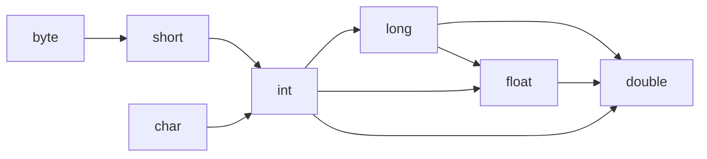

# Override and Overload

### 01. Overload

Trong Java, có hai cách để đạt được mục tiêu nạp chồng phương thức.

Đầu tiên, thay đổi số lượng tham số. Vui lòng xem đoạn mã sau.

```java
public class OverloadingByParamNum {
    public static void main(String[] args) {
        System.out.println(Adder.add(10, 19));
        System.out.println(Adder.add(10, 19, 20));
    }
}

class Adder {
    static int add(int a, int b) {
        return a + b;
    }

    static int add(int a, int b, int c) {
        return a + b + c;
    }
}  
```

Lớp Adder có hai phương thức, phương thức `add()` đầu tiên có hai tham số và có thể chuyển hai tham số khi gọi; phương thức `add()` thứ hai có ba tham số và có thể chuyển ba tham số khi gọi.

Cái này có vẻ lặp đi lặp lại, nếu có bốn tham số thì phương pháp này sẽ được bổ sung thêm.

Thực tế là vậy, ví dụ này chỉ để chỉ ra một loại nạp chồng phương thức. Nếu các loại tham số giống nhau, Java cung cấp một cách thức có thể thay đổi tham số, giống như dưới đây: 

```java
static int add(int ... args) {
    int sum = 0;
    for ( int a: args) {
        sum += a;
    }
    return sum;
}
```

Thứ hai, thay đổi loại tham số, cũng có thể đạt được nạp chồng phương thức. Hãy xem đoạn mã dưới đây.

```java
public class OverloadingByParamType {
    public static void main(String[] args) {
        System.out.println(Adder.add(10, 19));
        System.out.println(Adder.add(10.1, 19.2));
    }
}

class Adder {
    static int add(int a, int b) {
        return a + b;
    }

    static double add(double a, double b) {
        return a + b;
    }
}
```

Lớp Adder có hai phương thức. Kiểu tham số của phương thức `add()`thứ nhất là int và kiểu tham số của `add()`phương thức thứ hai là double.

Phương thức `main()` này có thể nạp chồng không?

Đây là một câu hỏi hay! Câu trả lời là có, dù sao thì `main()`cũng là một phương thức, nhưng máy ảo Java sẽ chỉ gọi phương thức có mảng String khi nó đang chạy `main()`.

```java
public class OverloadingMain {
    public static void main(String[] args) {
        System.out.println(String[] args);
    }

    public static void main(String args) {
        System.out.println(String args);
    }

    public static void main() {
        System.out.println(No params);
    }
}
```

Phương thức `main()` đầu tiên có định dạng tham số là `String[] args`, là cách viết chuẩn nhất; phương thức `main()` thứ hai có định dạng tham số là `String args`, thiếu dấu ngoặc vuông; phương thức `main()` thứ ba không có tham số.

Hãy xem kết quả xuất ra của chương trình.

```java
String[] args
```

Từ kết quả này, chúng ta có thể thấy rằng, mặc dù phương thức `main()` có thể được nạp chồng, nhưng chương trình chỉ nhận dạng cách viết chuẩn.

Vì có thể thay đổi loại tham số để thực hiện nạp chồng phương thức, khi không tìm thấy phương thức phù hợp với tham số truyền vào, sẽ xảy ra chuyển đổi kiểu ngầm định.


Như hình ảnh trên, byte có thể chuyển đổi lên thành short, int, long, float và double; short có thể chuyển đổi lên thành int, long, float và double; char có thể chuyển đổi lên thành int, long, float và double, và tiếp tục như vậy.

Hãy xem ví dụ dưới đây.

```java
public class OverloadingTypePromotion {
    void sum(int a, long b) {
        System.out.println(a + b);
    }

    void sum(int a, int b, int c) {
        System.out.println(a + b + c);
    }

    public static void main(String args[]) {
        OverloadingTypePromotion obj = new OverloadingTypePromotion();
        obj.sum(20, 20);
        obj.sum(20, 20, 20);
    }
}
```

Khi chạy `obj.sum(20, 20)`, không tìm thấy phương thức `sum(int a, int b)`, do đó số 20 thứ hai được chuyển đổi lên kiểu long, vì vậy phương thức `sum(int a, long b)` được gọi.

Hãy xem một ví dụ khác.

```java
public class OverloadingTypePromotion1 {
    void sum(int a, int b) {
        System.out.println(int);
    }

    void sum(long a, long b) {
        System.out.println(long);
    }

    public static void main(String args[]) {
        OverloadingTypePromotion1 obj = new OverloadingTypePromotion1();
        obj.sum(20, 20);
    }
}
```

Khi thực thi `obj.sum(20, 20)`, phương thức `sum(int a, int b)` đã được tìm thấy, do đó không cần chuyển đổi lên kiểu long.

Hãy xem kết quả của chương trình.

```java
int
```

Tiếp tục với ví dụ khác.

```java
public class OverloadingTypePromotion2 {
    void sum(long a, int b) {
        System.out.println(long int);
    }

    void sum(int a, long b) {
        System.out.println(int long);
    }

    public static void main(String args[]) {
        OverloadingTypePromotion2 obj = new OverloadingTypePromotion2();
        obj.sum(20, 20);
    }
}
```

Khi gọi `obj.sum(20, 20)` để gọi phương thức sum, trình biên dịch sẽ báo lỗi.

Không rõ ràng, trình biên dịch sẽ gặp khó khăn, liệu có chuyển đổi số 20 đầu tiên từ int sang long, hay chuyển đổi số 20 thứ hai từ int sang long, mắc cỡ! Vì vậy, không nên viết mã làm cho trình biên dịch khó xử như thế.

### 02. Override

Trong Java, việc ghi đè phương thức cần phải đáp ứng ba quy tắc sau:

- Phương thức được ghi đè phải có cùng tên với phương thức trong lớp cha;
- Phương thức được ghi đè phải có cùng tham số với phương thức trong lớp cha;
- Nó phải là một mối quan hệ is-a (mối quan hệ kế thừa).

Xin vui lòng xem đoạn mã sau.

```java
public class Bike extends Vehicle {
    public static void main(String[] args) {
        Bike bike = new Bike();
        bike.run();
    }
}

class Vehicle {
    void run() {
        System.out.println(Vehical running);
    }
}

```

Chúng ta hãy xem kết quả của chương trình:

```text
Vehical running
```

Bike is-a Vehicle, tức là xe đạp là một loại phương tiện, đúng như vậy. Lớp Vehicle có một phương thức `run()`, có nghĩa là phương tiện có thể chạy. Bike kế thừa từ Vehicle, vì vậy nó cũng có thể chạy. Tuy nhiên, nếu Bike không có phương thức `run()` ghi đè, thì xe đạp sẽ chỉ in ra Vehical running, chứ không phải là Bike running, phải không?

Nếu có phương thức ghi đè, mọi thứ sẽ dễ dàng hơn:

```java
public class Bike extends Vehicle {
    @Override
    void run() {
        System.out.println(Bike running);
    }

    public static void main(String[] args) {
        Bike bike = new Bike();
        bike.run();
    }
}

class Vehicle {
    void run() {
        System.out.println(Vehical running);
    }
}
```

Khi bạn ghi đè phương thức, IDEA sẽ đề xuất sử dụng annotation `@Override`, chỉ rõ rằng đây là một phương thức đã được ghi đè, mặc dù có thể bỏ qua.

```
Bike running
```

Bike đã ghi đè phương thức `run()`, điều đó có nghĩa là Bike có thể chạy theo cách của riêng nó.

Okay, bây giờ hãy nói về 12 quy tắc cần tuân theo khi ghi đè, hãy nhớ chúng nha.

#### **Quy tắc một: Chỉ có thể ghi đè các phương thức được kế thừa**

Bởi vì việc ghi đè xảy ra khi lớp con triển khai lại các phương thức được kế thừa từ lớp cha, vì vậy chỉ có thể ghi đè các phương thức đã được kế thừa. Điều này dễ hiểu. Điều này có nghĩa là chỉ có thể ghi đè các phương thức có từ khóa public, protected hoặc default; các phương thức có từ khóa private không thể được ghi đè.

Lớp Animal có ba phương thức `move()`, `eat()` và `sleep()`:

```java
public class Animal {
    public void move() { }

    protected void eat() { }
    
    void sleep(){ }
}
```

Lớp Dog sẽ ghi đè ba phương thức này:

```java
public class Dog extends Animal {
    public void move() { }

    protected void eat() { }

    void sleep(){ }
}
```

OK, hoàn toàn không có vấn đề. Tuy nhiên, nếu phương thức trong lớp cha là private, thì không thể làm được:

```java
public class Animal {
    private void move() { }
}
```

Trong trường hợp này, phương thức `move()` trong lớp Dog không phải là một phương thức ghi đè nữa, vì phương thức `move()` trong lớp cha là private và không có sẵn cho lớp con.

```java
public class Dog extends Animal {
    public void move() { }
}
```

#### **Quy tắc hai: Không thể ghi đè các phương thức final và static**

Một phương thức được đánh dấu là final có nghĩa là nó không thể được các lớp con kế thừa, do đó không thể ghi đè.

```java
public class Animal {
    final void move() { }
}
```

Vì phương thức `move()` trong lớp Animal là final, nên lớp con sẽ gặp lỗi biên dịch khi cố gắng ghi đè phương thức này!


Tương tự, nếu một phương thức là static, thì nó cũng không thể được ghi đè. Vì phương thức static có thể được gọi từ cả lớp cha và các đối tượng của lớp con mà không cần tạo ra các đối tượng riêng biệt.

```java
public class Animal {
    static void move() { }
}
```

Không thể ghi đè phương thức static vì nó không liên quan đến đối tượng và không thể thực hiện đa hình dựa trên loại đối tượng.

#### **Quy tắc ba: Phương thức ghi đè phải có cùng danh sách tham số**

```java
public class Animal {
    void eat(String food) { }
}
```

Phương thức `eat()` trong lớp Animal có một tham số là food kiểu String.

```java
public class Dog extends Animal {
    public void eat(String food) { }
}
```

Phương thức `eat()` trong lớp Dog giữ nguyên cùng một danh sách tham số như phương thức `eat()` trong lớp cha Animal.

Tuy nhiên, nếu lớp con không tuân thủ quy tắc này, ví dụ như thêm một tham số:

```java
public class Dog extends Animal {
    public void eat(String food, int amount) { }
}
```

Thì điều này không phải là ghi đè nữa, và cũng không phải là nạp chồng (overload) trong cùng một lớp.

#### **Quy tắc bốn: Phương thức ghi đè phải có cùng kiểu trả về**

Nếu phương thức trong lớp cha không có kiểu trả về (void), ví dụ:

```java
public class Animal {
    void eat(String food) { }
}
```

Lớp con cố gắng trả về một String:

```java
public class Dog extends Animal {
    public String eat(String food) {
        return null;
    }
}
```

Khi đó, sẽ xảy ra lỗi biên dịch (return type incompatible).

#### **Quy tắc năm: Phương thức ghi đè không thể sử dụng các quyền truy cập nghiêm ngặt hơn**

Quy tắc này giải thích rằng khi một phương thức được ghi đè từ lớp cha sang lớp con, nó không thể sử dụng các quyền truy cập (access modifier) nghiêm ngặt hơn so với phương thức gốc.

- Nếu phương thức gốc có quyền truy cập default, thì phương thức ghi đè có thể là default, protected hoặc public.
- Nếu phương thức gốc có quyền truy cập protected, thì phương thức ghi đè chỉ có thể là protected hoặc public.
- Nếu phương thức gốc có quyền truy cập public, thì phương thức ghi đè chỉ có thể là public.

Ví dụ, nếu phương thức trong lớp cha có quyền truy cập là protected:

```java
public class Animal {
    protected void eat() { }
}
```

Phương thức trong lớp con có thể là public mà không vi phạm quy tắc:

```java
public class Dog extends Animal {
    public void eat() { }
}
```

Tuy nhiên, nếu phương thức trong lớp con cố gắng sử dụng một quyền truy cập nghiêm ngặt hơn như private, thì sẽ xảy ra lỗi biên dịch.

Quy tắc này giúp bảo đảm tính nhất quán trong việc truy cập và kế thừa trong các lớp con, đồng thời giữ cho cấu trúc mã nguồn rõ ràng và dễ bảo trì.

#### **Quy tắc sáu: Phương thức ghi đè không thể ném ra ngoại lệ có cấp độ cao hơn so với lớp cha**

Trong Java, khi một phương thức được ghi đè (overridden) từ lớp cha sang lớp con, nó không được phép ném ra các loại ngoại lệ (exception) có cấp độ cao hơn so với các ngoại lệ mà phương thức trong lớp cha có thể ném ra. Quy tắc này chỉ áp dụng cho các ngoại lệ có thể kiểm tra được (checked exception).

Ví dụ, nếu phương thức trong lớp cha ném ra IOException, thì phương thức được ghi đè trong lớp con không thể ném ra Exception, nhưng có thể ném ra các lớp con của IOException hoặc không ném ra bất kỳ ngoại lệ nào.

Lớp cha ném ra IOException:

```java
public class Animal {
    protected void eat() throws IOException { }
}
```

Lớp con có thể ném ra FileNotFoundException vẫn tuân thủ quy tắc ghi đè:

```java
import java.io.FileNotFoundException;
import java.io.IOException;

public class Dog extends Animal {
   public void eat() throws FileNotFoundException { }
}
```

Nếu lớp con cố gắng ném ra một ngoại lệ checked mới, và nó không phải là lớp con của IOException:

```java
import java.io.FileNotFoundException;
import java.io.IOException;

public class Dog extends Animal {
   public void eat() throws FileNotFoundException, InterruptedException { }
}
```

Compiler sẽ báo lỗi:

```
Error:(9, 16) java: eat() in Dog cannot override eat() in Animal
  overridden method does not throw java.lang.InterruptedException
```

Tuy nhiên, nếu lớp con ném ra một ngoại lệ không kiểm tra (unchecked exception), không có vấn đề gì:

```java
import java.io.FileNotFoundException;
import java.io.IOException;

public class Dog extends Animal {
   public void eat() throws FileNotFoundException, IllegalArgumentException { }
}
```

Nếu lớp con cố gắng ném ra một ngoại lệ có cấp độ cao hơn (ví dụ Exception là lớp cha của IOException):

```java
import java.io.IOException;

public class Dog extends Animal {
   public void eat() throws Exception { }
}
```

Compiler sẽ cũng báo lỗi vì Exception là một lớp cha của IOException:

```
Error:(9, 16) java: eat() in Dog cannot override eat() in Animal
  overridden method does not throw java.lang.Exception
```

Quy tắc này giúp đảm bảo tính nhất quán trong việc xử lý ngoại lệ khi sử dụng phương thức ghi đè trong Java.

#### **Quy tắc bảy: Có thể sử dụng từ khoá super để gọi phương thức của lớp cha đã được ghi đè trong lớp con**

Trường hợp phổ biến khi lớp con kế thừa một phương thức từ lớp cha và muốn mở rộng thêm chức năng mà không cần triển khai lại toàn bộ phương thức đó, ta có thể sử dụng từ khoá `super` để gọi phương thức của lớp cha đã bị ghi đè.

Ví dụ, lớp cha có phương thức `eat()`:

```java
public class Animal {
    protected void eat() { }
}
```

Lớp con ghi đè phương thức `eat()` và trong phương thức ghi đè này, ta có thể sử dụng `super.eat()` để gọi phương thức của lớp cha trước khi thêm chức năng của lớp con:

```java
public class Dog extends Animal {
   public void eat() {
       super.eat(); // Gọi phương thức eat() của lớp cha
       // Thêm các chức năng của phương thức eat() trong lớp con Dog
   }
}
```

Việc sử dụng `super.eat()` cho phép lớp con mở rộng và bổ sung chức năng của phương thức được kế thừa mà không phải định nghĩa lại hoàn toàn phương thức này. Điều này giúp tăng tính tái sử dụng mã nguồn và duy trì tính nhất quán trong hệ thống Java.

#### **Quy tắc tám: Phương thức khởi tạo không thể được ghi đè**.

Phương thức khởi tạo trong Java có tính đặc biệt vì nó được sử dụng để khởi tạo đối tượng và thiết lập trạng thái ban đầu của nó. Phương thức khởi tạo của lớp con không thể trùng tên với phương thức khởi tạo của lớp cha (vì tên phương thức khởi tạo phải giống tên của lớp), do đó không có mối quan hệ nào giữa phương thức khởi tạo và việc ghi đè. Mỗi lớp đều có phương thức khởi tạo riêng của nó, chúng là duy nhất và không thể được kế thừa.

#### **Quy tắc chín: Nếu một lớp kế thừa từ một lớp trừu tượng, các phương thức trừu tượng trong lớp trừu tượng đó phải được ghi đè trong lớp con**.

Hãy xem xét một interface như sau:

```java
public interface Animal {
    void move();
}
```

Các phương thức trong interface mặc định đều là các phương thức trừu tượng, có thể nhìn thấy được khi giải mã ngược:

```java
public interface Animal
{
    public abstract void move();
}
```

Nếu một lớp trừu tượng triển khai interface Animal, phương thức `move()` không bắt buộc phải được ghi đè:

```java
public abstract class AbstractDog implements Animal {
    protected abstract void bark();
}
```

Tuy nhiên, nếu một lớp kế thừa từ lớp trừu tượng AbstractDog, thì phương thức `move()` từ interface Animal và phương thức trừu tượng `bark()` từ lớp AbstractDog đều phải được ghi đè:

```java
public class BullDog extends AbstractDog {
 
    public void move() {}
 
    protected void bark() {}
}
```

#### **Quy tắc mười: Từ khóa synchronized không ảnh hưởng đến quy tắc ghi đè**.

Từ khóa synchronized được sử dụng để đồng bộ hóa các phương thức trong môi trường đa luồng, do đó nó không ảnh hưởng đến quy tắc ghi đè. Điều này có nghĩa là một phương thức synchronized có thể ghi đè lên một phương thức không đồng bộ.

#### **Quy tắc mười một: Từ khóa strictfp không ảnh hưởng đến quy tắc ghi đè**.

Nếu bạn muốn các phép tính dấu chấm động trở nên chính xác hơn và không bị ảnh hưởng bởi sự khác biệt về nền tảng phần cứng, bạn có thể sử dụng từ khóa strictfp trên phương thức. Tuy nhiên, từ khóa strictfp không liên quan đến quy tắc ghi đè.