# Cơ chế của bộ hẹn giờ

```mermaid
gantt
    title Timer Example
    dateFormat X
    axisFormat %s

    section Main
    Mainline JavaScript: 0, 18
    setTimeout(10) begin: milestone, 0, 0
    setInterval(10) begin: milestone, 0, 0
    Mouse Click: milestone, 6, 6
    Timer expired: milestone, 10, 10
    Interval triggered: milestone, 10, 10
    Mouse Click Handler: 18, 28
	Interval triggered: milestone, 20, 20
    Timer Handler: 28, 36
    Interval triggered: milestone, 30, 30
    Interval Handler: 36, 42
    Interval triggered: milestone, 40, 40
	Interval triggered: milestone, 50, 50
    Interval Handler: 50, 56
```



Hãy xem xét những gì đã xảy ra ở đây:

1. Đầu tiên, vào thời điểm `0` mili giây, có một khối mã JavaScript kéo dài `18` mili giây cần được thực thi.
2. Sau đó, vào thời điểm `0` mili giây, hai bộ hẹn giờ với độ trễ `10` mili giây được đặt, `setTimeout` và `setInterval`, với `setTimeout` được đặt trước.
3. Vào thời điểm `6` mili giây, có một sự kiện nhấp chuột xảy ra.

## Xếp hàng sự kiện

Có nhiều sự kiện xảy ra cùng một lúc, do tính đơn luồng của JavaScript, **khi luồng chính đang thực thi và có sự kiện bất đồng bộ xảy ra, nó sẽ thoát khỏi luồng chính và chuyển sang luồng môi trường chủ để xử lý bộ hẹn giờ, và chỉ khi luồng chính rảnh rỗi mới đẩy sự kiện vào hàng đợi để thực thi**.

Các sự kiện bất đồng bộ ở đây bao gồm: sự kiện nhấp chuột, bộ hẹn giờ kích hoạt, yêu cầu Ajax, Promise và các sự kiện khác.

Trong ví dụ này, trước tiên có một khối mã kéo dài `18` mili giây cần được thực thi, trong `18` mili giây này chỉ có thể thực thi khối mã này, **các sự kiện khác được thêm vào hàng đợi chờ thực thi**.

Trong khi khối mã đang chạy, tại thời điểm 6ms, sự kiện nhấp chuột xảy ra, và hai xử lý sự kiện `setTimeout` và `setInterval` vào thời điểm 10 mili giây, ba sự kiện này không thể được thực thi ngay lập tức, mà là **được thêm vào hàng đợi sự kiện đang chờ thực thi**.

## Nguyên tắc First-In-First-Out (FIFO)

Vào thời điểm `18` mili giây, khối mã kết thúc và có ba nhiệm vụ đang chờ thực thi, theo nguyên tắc **First-In-First-Out (FIFO), sự kiện nhấp chuột sẽ được thực thi trước**, `setTimeout` và `setInterval` tiếp tục chờ đợi để thực thi. Nguyên tắc FIFO có thể hiểu là những gì vào hàng đợi trước sẽ được thực thi trước.

## Bỏ qua việc gọi bộ hẹn giờ kích hoạt liên tục

Khi sự kiện nhấp chuột được thực thi, tại thời điểm 20 mili giây, `setInterval` thứ hai cũng đã hết hạn vì lúc này luồng đã bị chiếm bởi sự kiện `click`, do đó `setInterval` vẫn không thể được thực thi và vì trong hàng đợi đã có một `setInterval` đang chờ để thực thi nên cuộc gọi của lần này sẽ bị loại bỏ.

⚠️ **Lưu ý**: Trình duyệt không cho phép các trình xử lý của cùng một `setInterval` được thêm vào hàng đợi chờ nhiều lần.

## Bộ hẹn giờ không thể đảm bảo thực thi chính xác thời gian gọi lại

Sự kiện nhấp chuột kết thúc tại thời điểm `28` mili giây, có hai nhiệm vụ (`setTimeout` và `setInterval`) đang chờ thực thi, tuân theo nguyên tắc FIFO, `setTimeout` được đặt trước `setInterval`, vì vậy `setTimeout` sẽ được thực thi trước.

Do đó, chúng ta mong đợi rằng bộ xử lý `setTimeout` được đặt để thực thi tại thời điểm `10` mili giây sẽ bắt đầu thực thi tại thời điểm `28` mili giây, đây chính là lý do tại sao `setTimeout`/`setInterval` không thể đảm bảo thực thi chính xác thời gian gọi lại.

Tại 30 mili giây, `setInterval` lại kích hoạt vì đã có một `setInterval` khác trong hàng chờ nên lần kích hoạt này sẽ bị huỷ đi.

## Bộ hẹn giờ kích hoạt liên tục

Sau khi `setTimeout` kết thúc, tại thời điểm `36` mili giây, bộ hẹn giờ `setInterval` trong hàng đợi bắt đầu thực thi, `setInterval` cần thực thi trong `6` mili giây.

Tại thời điểm 40ms, `setInterval` được kích hoạt lần nữa vì **`setInterval` trước đó đang trong quá trình thực thi, không có `setInterval` nào khác trong hàng đợi và lần kích hoạt này sẽ được cho vào hàng đợi**.

Do đó, thời gian xử lý của `setInterval` không được dài hơn khoảng thời gian đã thiết lập, nếu không sẽ làm cho việc thực hiện lại của `setInterval` diễn ra liên tiếp mà không có khoảng cách.

Tại thời điểm 42ms, **lần gọi `setInterval` đầu tiên kết thúc và ngay sau đó chương trình xử lý các `setInterval` trong hàng đợi bắt ngay từ điểm này**, và kết thúc thực thi tại thời điểm 48ms. Sau đó, tại thời điểm 50ms, `setInterval` lại được kích hoạt, vì lúc này không có nhiệm vụ nào đang chờ thực thi, nên nó sẽ được thực thi ngay lập tức.

## Gọi lại bộ hẹn giờ theo chu kỳ cố định bằng cách sử dụng bộ hẹn giờ chờ

Trong phần trước, chúng ta đã nói rằng thời gian xử lý của `setInterval` không thể dài hơn khoảng thời gian được đặt, nếu không `setInterval` sẽ được thực thi liên tục mà không có khoảng thời gian nghỉ.

Tuy nhiên, trong nhiều trường hợp, chúng ta không thể kiểm soát rõ thời gian xử lý của chương trình, vì vậy để chúng ta có thể kích hoạt bộ hẹn giờ theo chu kỳ với một khoảng thời gian nhất định.

```js
// Trên thực tế, tôi đã không chỉ thấy điều này trong Ninja Code, mà còn thấy nó trong nhiều nơi khác.
setTimeout(function repeatMe() {
  // làm một cái gì đó
  setTimeout(repeatMe, 10);
  // Sau khi hoàn thành nội dung của chương trình xử lý, hãy gọi chương trình này lại sau 10ms, điều này đảm bảo rằng chương trình sẽ được gọi theo chu kỳ 10ms
}, 10);
```

- Bộ hẹn giờ không thể điều khiển thời gian thực thi một cách rất chi tiết, sách đề xuất sử dụng từ 15ms trở lên.
- Bạn có thể sử dụng bộ hẹn giờ để phân tách các nhiệm vụ chạy lâu thành các phần nhỏ hơn, bạn có thể tự tìm hiểu thêm trên Google.

Hàm `setTimeout` nhận hai tham số: thông điệp được thêm vào hàng đợi và một khoảng thời gian trễ (tùy chọn, mặc định là 0). Khoảng thời gian trễ này đại diện cho thời gian tối thiểu mà thông điệp được thêm vào hàng đợi. Nếu không có thông điệp nào khác trong hàng đợi, sau khoảng thời gian trễ này, thông điệp sẽ được xử lý ngay lập tức. Tuy nhiên, nếu có thông điệp khác, thông điệp `setTimeout` phải đợi cho đến khi các thông điệp khác được xử lý xong. Do đó, tham số thứ hai chỉ đại diện cho thời gian trễ tối thiểu, không phải thời gian chính xác để chờ đợi.
