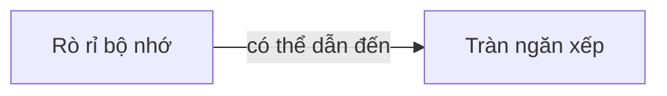

# Thu gom rác

> Vì chuỗi, đối tượng và mảng không có kích thước cố định, nên chỉ khi kích thước của chúng được biết, chúng mới có thể được cấp phát bộ nhớ động. Mỗi lần tạo ra một chuỗi, một mảng hoặc một đối tượng trong JavaScript, trình thông dịch phải cấp phát bộ nhớ để lưu trữ thực thể đó. Khi bộ nhớ được cấp phát động như vậy, nó phải được giải phóng để có thể được sử dụng lại. Nếu không, trình thông dịch JavaScript sẽ tiêu thụ hết bộ nhớ có sẵn trong hệ thống và gây ra sự cố hệ thống. - "JavaScript: The Definitive Guide"

Trong các ngôn ngữ như C và C++, việc quản lý bộ nhớ phải được thực hiện thủ công, đây cũng là nguồn gốc của nhiều vấn đề không cần thiết. May mắn thay, khi viết JavaScript, việc cấp phát và thu hồi bộ nhớ đã được tự động quản lý hoàn toàn.

JavaScript sử dụng **cơ chế thu gom rác tự động** để quản lý bộ nhớ. Cơ chế thu gom rác hoạt động bằng cách sử dụng một bộ thu gom rác để định kỳ tìm ra các biến không còn cần sử dụng và thực hiện việc giải phóng bộ nhớ đã chiếm dụng.

> Điều gì được coi là giá trị không còn cần thiết?

Giá trị không còn cần thiết là biến đã kết thúc vòng đời của nó.

- **Biến cục bộ**: Trong phạm vi cục bộ, khi một hàm thực thi xong, biến cục bộ không còn cần tồn tại (trừ khi có closure), do đó trình thu gom rác dễ dàng đánh dấu và thu hồi bộ nhớ.
- **Biến toàn cục**: Tuy nhiên, vòng đời của biến toàn cục chỉ kết thúc khi trình duyệt gỡ bỏ trang, tức là **biến toàn cục không được coi là biến rác và không được thu hồi**. Vì vậy, khi khai báo một biến toàn cục, chúng ta cần cân nhắc kỹ xem sau khi sử dụng đối tượng này, chúng ta còn cần nó hay không. Nếu không cần thiết nữa, chúng ta nên gán biến này thành `null`, để khi thu gom rác chạy lần sau, nó có thể giải phóng giá trị trước đó mà biến này đang trỏ tới.

## Nguyên lý

JavaScript có hai chiến lược để thực hiện thu gom rác:

- [Phương pháp đếm tham chiếu](#phương-pháp-đếm-tham-chiếu)
- [Phương pháp đánh dấu và thu hồi](#phương-pháp-đánh-dấu-và-thu-hồi)

### Phương pháp đếm tham chiếu

**Phương pháp đếm tham chiếu**: Theo dõi và ghi nhận số lần tham chiếu của mỗi giá trị, khi một biến được khai báo và gán một giá trị kiểu tham chiếu, số lần tham chiếu của giá trị đó là 1, nếu giá trị đó được gán cho một biến khác, số lần tham chiếu tăng lên 1. Ngược lại, nếu biến chứa giá trị đó lại được gán một giá trị khác, số lần tham chiếu giảm đi 1. Khi số lần tham chiếu của một giá trị trở thành 0, có nghĩa là không còn cách nào để truy cập đến giá trị đó nữa, do đó, bộ nhớ mà giá trị đó chiếm giữ có thể được thu hồi. Khi thu gom rác chạy, nó sẽ giải phóng những giá trị có số lần tham chiếu là 0.

Phương pháp này không thể giải quyết vấn đề vòng lặp tham chiếu, tức là đối tượng `a` chứa một con trỏ đến `b`, và đối tượng `b` cũng chứa một con trỏ đến `a`. Điều này có thể dẫn đến việc không giải phóng được nhiều bộ nhớ, cũng gọi là rò rỉ bộ nhớ (memory leak), vì số lần tham chiếu của chúng không bao giờ là 0.

🌰 **Ví dụ**:

```js
function problem() {
  var a = new Object();
  var b = new Object();
  a.ref = b;
  b.ref = a;
}
```

> - Kích thước nông (shallow size): Kích thước của đối tượng bao gồm giá trị nguyên thuỷ và dữ liệu cần thiết khác.
> - Kích thước lưu trữ (retained size): Tổng kích thước của đối tượng bao gồm kích thước nông của nó và tất cả các đối tượng mà nó chi phối.

Phương pháp đếm tham chiếu không thể giải quyết vấn đề vòng lặp tham chiếu:

```js
function fn() {
  var x = {};
  var y = {};
  x.a = y;
  y.a = x;
}
```

### Phương pháp đánh dấu và xóa

**Phương pháp đánh dấu và xóa**: Khi chương trình thực thi vào một hàm nào đó, một ngữ cảnh thực thi của hàm đó sẽ được tạo ra, và các biến trong ngữ cảnh thực thi này sẽ được đánh dấu là **đang sử dụng**. Lý thuyết là, các biến **đang sử dụng** không thể được giải phóng bộ nhớ. Bởi vì chỉ cần luồng thực thi vào ngữ cảnh thực thi tương ứng, các biến này có thể được sử dụng.

Quy trình của phương pháp đánh dấu và xóa như sau:

- Trình thu gom rác sẽ đánh dấu tất cả các biến trong bộ nhớ.
- Loại bỏ đánh dấu của các biến trong ngữ cảnh thực thi và các biến được tham chiếu bởi môi trường.
- Các biến vẫn còn đánh dấu sẽ được coi là **sẵn sàng để xóa**.
- Cuối cùng, trình thu gom rác hoàn thành công việc làm sạch bộ nhớ bằng cách hủy các giá trị được đánh dấu và thu hồi không gian bộ nhớ mà chúng chiếm.

Giải phóng bộ nhớ thủ công:

```js
let a = 1;

a = null;
```

`a = null` thực ra chỉ là một hoạt động giải phóng tham chiếu, làm cho giá trị mà biến `a` trước đây tham chiếu mất đi, thoát khỏi ngữ cảnh thực thi. Giá trị này sẽ được tìm thấy và giải phóng trong lần chạy tiếp theo của trình thu gom rác. Việc giải phóng tham chiếu đúng thời điểm là một cách quan trọng để đạt được hiệu suất tốt hơn cho trang web.

Cơ chế thu gom rác trong trình thông dịch JavaScript là phương pháp đánh dấu và xóa, và tiêu chí để xác định xem một vùng nhớ có thể thu hồi hay không là khả năng truy cập. Điều này là một cải tiến so với phương pháp đếm tham chiếu, vì vấn đề vòng lặp tham chiếu giữa các đối tượng không gây ra vấn đề thu hồi, bởi vì tiêu chí để xác định xem một vùng nhớ có thể thu hồi hay không là khả năng truy cập. Thuật toán này có một nút gốc, nút này không bao giờ bị thu hồi và được gọi là **GC Root**. Ví dụ, đối tượng toàn cầu của JavaScript Runtime được gọi là `window`, và nút gốc của cây DOM cũng là một **GC Root**. Các đối tượng trong chương trình tạo thành một đồ thị, và bất kỳ đối tượng nào có thể được truy cập từ nút gốc theo các liên kết tham chiếu sẽ được đánh dấu là đối tượng hoạt động, trong khi các đối tượng cô lập với nút gốc sẽ bị thu hồi. Có thể thấy rằng các đối tượng có số lượng tham chiếu bằng 0 trong mã không thể truy cập từ nút gốc, có nghĩa là một đối tượng có số lượng tham chiếu bằng 0 theo phương pháp đếm tham chiếu cũng sẽ bị thu hồi bởi phương pháp đánh dấu và xóa. Vì vậy, phương pháp đánh dấu và xóa có thể thay thế phương pháp đếm tham chiếu.

## Tràn ngăn xếp

**Tràn ngăn xếp** là khi không còn đủ không gian bộ nhớ stack để cấp phát, và không còn đủ bộ nhớ để sử dụng.

## Rò rỉ bộ nhớ

**Rò rỉ bộ nhớ** là khi không giải phóng hoặc hủy bỏ bộ nhớ sau khi sử dụng, làm chiếm dụng bộ nhớ trống. Nếu có quá nhiều rò rỉ bộ nhớ, quá trình sau đó sẽ không thể yêu cầu được bộ nhớ. Do đó, rò rỉ bộ nhớ có thể dẫn đến tràn bộ nhớ nội bộ.



Trong phần mềm lập trình truyền thống, ví dụ như trong ngôn ngữ C, cần sử dụng `malloc` để cấp phát bộ nhớ và sử dụng `free` để giải phóng nó, cần phải xóa bằng tay. Trong JavaScript, có cơ chế thu gom rác riêng, phương pháp thu gom rác phổ biến là phương pháp đánh dấu và xóa.

- Ngay cả 1 byte bộ nhớ cũng được gọi là rò rỉ bộ nhớ, không nhất thiết phải gây ra sự sụp đổ hoặc đơ máy mới gọi là rò rỉ bộ nhớ.
- Thông thường, rò rỉ bộ nhớ xảy ra trong vùng nhớ heap, không xảy ra trong vùng nhớ ngăn xếp. Giá trị của các kiểu dữ liệu cơ bản được lưu trữ trong ngăn xếp, trong khi các kiểu dữ liệu tham chiếu được lưu trữ trong heap. Do đó, chỉ các đối tượng, mảng và các kiểu dữ liệu tham chiếu khác mới có thể gây ra rò rỉ bộ nhớ.

**Nguyên nhân phổ biến của rò rỉ bộ nhớ**:

- Biến toàn cục gây ra rò rỉ bộ nhớ
- Hẹn giờ không được xóa
- Closure (Đóng gói)

**Cách giải quyết**:

- Giảm số biến toàn cục không cần thiết
- Giảm việc sử dụng closure (vì closure có thể gây rò rỉ bộ nhớ)
- Tránh xảy ra vòng lặp vô hạn

### Biến toàn cục

Biến toàn cục không được coi là rác và không được thu gom. Trong quá trình viết mã, chúng ta nên tránh khai báo biến toàn cục.

```html
<body>
  <button onclick="grow()">Global Var</button>
  <script type="text/javascript">
    function LargeObj() {
      this.largeArr = new Array(1000_0000);
    }

    var x = [];

    function grow() {
      var o = new LargeObj();

      x.push(0);
    }
  </script>
</body>
```

Khi chúng ta sử dụng [[JS This#Ràng buộc mặc định (Default Binding)|ràng buộc mặc định]], `this` sẽ trỏ đến đối tượng toàn cục.

🔧 **Cách giải quyết**: Sử dụng chế độ nghiêm ngặt trong hàm hoặc giải phóng bộ nhớ của biến toàn cục thủ công.

**Cách gỡ lỗi**: `More Tools -> Developer Tools -> Performance/Memory`, thường hiện tại, bảng điều khiển Performance ghi lại biểu đồ thay đổi bộ nhớ trang theo thời gian, giúp đánh giá rò rỉ bộ nhớ một cách trực quan, sau đó, trong bảng điều khiển Memory, xác định vị trí xảy ra vấn đề.

### Tham chiếu DOM bị tách rời

Bộ nhớ của nút DOM được thu hồi khi đáp ứng hai điều kiện: nút DOM bị xóa khỏi cây DOM và không có tham chiếu đến nó trong mã. Rò rỉ bộ nhớ xảy ra khi nút bị xóa khỏi DOM, nhưng vẫn còn tham chiếu đến nó trong mã JavaScript, chúng ta gọi điều này là tham chiếu DOM bị tách rời.

Ví dụ về rò rỉ bộ nhớ do tham chiếu DOM bị tách rời:

```html
<body>
  <button>Remove List</button>
  <ul id="list">
    <li>Item 1</li>
  </ul>
  <script type="text/javascript">
    var button = document.querySelector('button');
    var list = document.getElementById('list');

    button.addEventListener('click', function () {
      list.remove();
    });
  </script>
</body>
```

Chúng ta có thể sử dụng Heap Snapshot để gỡ lỗi rò rỉ bộ nhớ, bằng cách điều hướng đến `Memory -> Heap Snapshot -> Take Snapshot`, Heap Snapshot có thể cho chúng ta biết liệu có tồn tại tham chiếu DOM bị tách rời hay không, chỉ cần nhập `detached` vào ô lọc trên cùng, nếu có kết quả, có nghĩa là tồn tại tham chiếu DOM bị tách rời.

Đối với ví dụ trên, chúng ta có thể đặt nút `list` trong hàm xử lý sự kiện của nút nhấp chuột, điều này có nghĩa là sau khi hàm xử lý sự kiện trả về, biến cục bộ sẽ bị hủy.

### Closure (Đóng gói)

Closure cũng có thể gây ra rò rỉ bộ nhớ vì các con trỏ ẩn trên các phiên bản hàm sẽ giữ lại đối tượng phạm vi được tạo trong môi trường tạo phiên bản.

```html
<body>
  <button onclick="closure()">Closure</button>
  <script type="text/javascript">
    var funcs = [];

    function outer() {
      var someText = new Array(1000_0000);

      return function inner() {
        return someText;
      };
    }

    function closure() {
      funcs.push(outer());
    }
  </script>
</body>
```

Lưu ý: Mã này không nhất thiết phải có vấn đề gì, chỉ là để chỉ ra rằng closure có thể chiếm dụng bộ nhớ, chỉ khi có sự chiếm dụng bộ nhớ không hợp lý mới được xem là rò rỉ bộ nhớ.

Cách gỡ lỗi: `More Tools -> Developer Tools -> Memory -> Allocation instrumentation on timeline`.

### Hẹn giờ

Khi không cần sử dụng `setInterval` hoặc `setTimeout` nữa, nếu không xóa bỏ hẹn giờ, hàm gọi lại của hẹn giờ và các biến phụ thuộc bên trong nó sẽ không thể được giải phóng, gây ra rò rỉ bộ nhớ.

```js
const someResource = getData();

// node và someResource lưu trữ một lượng lớn dữ liệu không thể giải phóng
const timerId = setInterval(function () {
  const node = document.getElementById('Node');

  if (node) {
    // Hẹn giờ cũng không được xóa bỏ
    node.innerHTML = JSON.stringify(someResource);
  }
}, 1000);

clearInterval(timerId);
```

🔧 **Cách giải quyết**: Xóa bỏ hẹn giờ khi công việc của nó hoàn thành.

### In ra console

Việc sử dụng câu lệnh `console.log` để in thông tin gỡ lỗi, vì console luôn giữ tham chiếu của chúng để có thể xem bất kỳ lúc nào, nên bộ nhớ của chúng cũng không thể được giải phóng. Do đó, khuyến nghị loại bỏ việc in ra console trong môi trường product.
