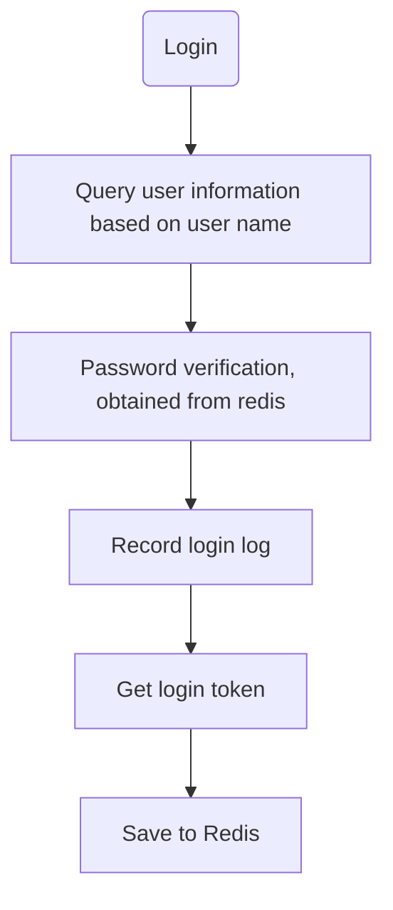
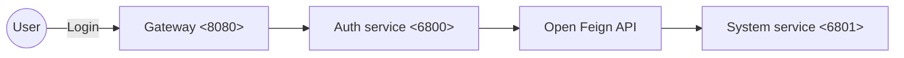

# PmHub - Authentication & Authorization with AOP

Bài viết này chủ yếu nói về cách PmHub thực hiện xác thực và phân quyền tùy chỉnh, liên quan đến nhiều điểm kỹ thuật thường xuyên được sử dụng. Việc nắm vững nội dung bài viết này sẽ giúp bạn rất nhiều.

::: info
+ **Annotation tùy chỉnh** cộng với **AOP** để thực hiện xác thực dịch vụ và xác thực nội bộ.
:::

## Annotation

### Annotation là gì?

Trong Java, annotation (chú thích) là một cú pháp đặc biệt, bắt đầu bằng ký hiệu @, được giới thiệu từ Java5, có thể coi là một loại chú thích đặc biệt, chủ yếu được sử dụng để sửa đổi lớp, phương thức hoặc biến, cung cấp thông tin cho chương trình sử dụng trong quá trình biên dịch hoặc thực thi.

Lấy annotation quen thuộc như `@Override` làm ví dụ:

```java
package java.lang;

import java.lang.annotation.*;

@Target(ElementType.METHOD)
@Retention(RetentionPolicy.SOURCE)
public @interface Override {
}
```

JDK cung cấp nhiều annotation tích hợp sẵn (ví dụ: @Override, @Deprecated), các framework như Spring cũng cung cấp nhiều annotation, và chúng ta cũng có thể tự định nghĩa annotation.

### Tác dụng của annotation

Tác dụng chính của annotation là cung cấp siêu dữ liệu (metadata), cụ thể có thể được sử dụng cho các mục đích sau:

+ **Kiểm tra khi biên dịch**: Ví dụ, `@Override` giúp trình biên dịch kiểm tra phương thức có thực sự ghi đè phương thức của lớp cha hay không.
+ **Tạo mã**: Ví dụ, `@Entity` có thể yêu cầu framework tạo bảng cơ sở dữ liệu tương ứng.
+ **Xử lý tại thời điểm thực thi**: Ví dụ, `@Deprecated` có thể cảnh báo cho nhà phát triển rằng một phương thức hoặc lớp đã không còn được khuyến nghị sử dụng.

### Các phương pháp phân tích annotation

Annotation chỉ có tác dụng sau khi được phân tích. Các phương pháp phân tích phổ biến là:

+ **Quét trực tiếp khi biên dịch**: Trình biên dịch quét các annotation trong mã Java khi biên dịch và xử lý chúng, chẳng hạn như `@Override`, trình biên dịch kiểm tra phương thức có thực sự ghi đè phương thức của lớp cha không.
+ **Xử lý qua phản chiếu (reflect) tại thời điểm thực thi**: Các annotation tích hợp sẵn trong framework (ví dụ: `@Value`, `@Component` của Spring) thường được xử lý qua phản chiếu. Đây cũng là cách phổ biến để xử lý annotation tùy chỉnh.

### Cách tự định nghĩa annotation?

Các bước tự định nghĩa annotation bao gồm:

1. **Định nghĩa annotation**: Sử dụng từ khóa `@interface` để định nghĩa annotation.
2. **Các phần tử của annotation**: Định nghĩa các phần tử trong annotation, giống như định nghĩa các phương thức trong giao diện.
3. **Meta-annotations**: Sử dụng meta-annotations (như `@Retention`, `@Target`, v.v.) để mô tả hành vi của annotation.

**1. Định nghĩa annotation**

Bạn có thể sử dụng từ khóa `@interface` để định nghĩa một annotation. Dưới đây là một ví dụ đơn giản:

```java
public @interface MyAnnotation {
    String value();
    int number() default 0;
}
```

Trong ví dụ trên, annotation `MyAnnotation` có hai phần tử: `value` và `number`. Trong đó, `number` có giá trị mặc định là `0`.

**2. Meta-annotations**

Meta-annotations là annotation của annotation, dùng để mô tả hành vi của annotation. Các meta-annotations phổ biến gồm:

+ **@Retention**: Xác định chính sách giữ lại annotation.
+ **@Target**: Xác định nơi sử dụng annotation.

#### @Retention
`@Retention` xác định vòng đời của annotation, có ba giá trị:

+ **RetentionPolicy.SOURCE**: Annotation chỉ tồn tại trong mã nguồn, sẽ không tồn tại sau khi biên dịch.
+ **RetentionPolicy.CLASS**: Annotation tồn tại trong tệp .class sau khi biên dịch, nhưng không tồn tại khi thực thi.
+ **RetentionPolicy.RUNTIME**: Annotation vẫn tồn tại khi thực thi và có thể được đọc qua phản chiếu.

#### @Target
`@Target` xác định nơi có thể sử dụng annotation, như lớp, phương thức, trường, v.v. Các giá trị phổ biến là:

+ **ElementType.TYPE**: Dành cho lớp, giao diện, enum, loại annotation.
+ **ElementType.FIELD**: Dành cho trường hoặc thuộc tính.
+ **ElementType.METHOD**: Dành cho phương thức.
+ **ElementType.PARAMETER**: Dành cho tham số.
+ **ElementType.CONSTRUCTOR**: Dành cho hàm tạo.
+ **ElementType.LOCAL_VARIABLE**: Dành cho biến cục bộ.

**3. Ví dụ về annotation tự định nghĩa**

Dưới đây là một ví dụ hoàn chỉnh về annotation tự định nghĩa với `@Retention` và `@Target`:

```java
import java.lang.annotation.Retention;
import java.lang.annotation.RetentionPolicy;
import java.lang.annotation.Target;
import java.lang.annotation.ElementType;

// Định nghĩa annotation
@Retention(RetentionPolicy.RUNTIME)
@Target(ElementType.METHOD)
public @interface MyAnnotation {
    String value();
    int number() default 0;
}
```

**4. Sử dụng annotation tự định nghĩa**

Sau khi định nghĩa annotation, bạn có thể sử dụng nó trong mã của mình:

```java
public class Test {
    @MyAnnotation(value = "Test method", number = 42)
    public void testMethod() {
        // Cài đặt cụ thể của phương thức
    }
}
```

### 5. Đọc annotation qua phản chiếu
Bạn có thể sử dụng cơ chế phản chiếu để đọc và xử lý annotation (nguyên lý của AOP trong dự án này là như vậy):

```java
import java.lang.reflect.Method;

public class Main {
    public static void main(String[] args) throws Exception {
        Method method = Test.class.getMethod("testMethod");

        if (method.isAnnotationPresent(MyAnnotation.class)) {
            MyAnnotation annotation = method.getAnnotation(MyAnnotation.class);
            System.out.println("Value: " + annotation.value());
            System.out.println("Number: " + annotation.number());
        }
    }
}
```

Bây giờ, bạn có thể tự định nghĩa một annotation và thử sử dụng nó!

## Các tính năng của Spring

Có lẽ hai đặc điểm chính của Spring đã trở nên quen thuộc với bạn?

+ IoC (Inversion of Control - Đảo ngược phụ thuộc)
+ AOP (Aspect-Oriented Programming - Lập trình theo khía cạnh)
## Lập trình theo khía cạnh (AOP)

Chúng ta sẽ tập trung vào AOP ở đây vì nó được sử dụng rất nhiều.

Lập trình theo khía cạnh là một kiểu lập trình cho phép tách biệt các mối quan tâm xuyên suốt (như ghi log, quản lý giao dịch, kiểm tra bảo mật, v.v.) mà không cần thay đổi mã nguồn logic nghiệp vụ. AOP thực hiện điều này thông qua việc định nghĩa các khía cạnh (Aspect) và các điểm cắt (Pointcut).

Spring AOP cung cấp nhiều cách để định nghĩa và sử dụng các khía cạnh, bao gồm:

+ **Chú thích (Annotations)**: Sử dụng `@Aspect` và các chú thích liên quan (như `@Before`, `@After`, `@Around`, v.v.) để định nghĩa các khía cạnh và điểm cắt.
+ **Cấu hình XML**: Định nghĩa các khía cạnh và điểm cắt trong tập tin cấu hình Spring (ít được sử dụng hơn, ngày nay thường sử dụng chú thích hơn).

## Kiến trúc Microservices

Microservices là những dịch vụ độc lập, có thể **phát triển**, **triển khai** và **bảo trì** riêng biệt. Trong khi đó, kiến trúc microservices là một hệ thống bao gồm nhiều microservices, kết hợp các giải pháp cho các vấn đề như giao tiếp giữa các dịch vụ, giám sát dịch vụ, cắt giảm và phân phối dịch vụ, đăng ký dịch vụ, cấu hình phân tán, giao dịch phân tán, v.v.

Kiến trúc microservices có các ưu điểm sau:

+ **Tăng hiệu suất phát triển**: Các nhóm có thể phát triển các microservices khác nhau đồng thời, giảm thời gian phát triển và phát hành.
+ **Tăng cường khả năng bảo trì**: Các kho mã nhỏ và tập trung dễ hiểu và bảo trì hơn, giảm nợ kỹ thuật.
+ **Linh hoạt trong lựa chọn công nghệ**: Các microservices khác nhau có thể sử dụng các công nghệ phù hợp nhất theo nhu cầu, không cần phải đồng nhất toàn bộ hệ thống.
+ **Triển khai và phát hành liên tục**: Kiến trúc microservices hỗ trợ tích hợp liên tục và phát hành liên tục (CI/CD), cho phép các tính năng mới và sửa lỗi được triển khai nhanh chóng.
+ **Cách ly lỗi tốt hơn**: Lỗi của một microservice không ảnh hưởng đến các microservice khác, làm tăng độ tin cậy của hệ thống.
+ **Mở rộng theo nhu cầu**: Có thể mở rộng các microservices cần xử lý tải cao một cách độc lập, tối ưu hóa việc sử dụng tài nguyên và chi phí.

## Cơ bản về Xác thực (Authentication)

Xác thực, như tên gọi của nó, là việc thực hiện **xác thực quyền hạn và kiểm soát quyền truy cập**. Bạn không muốn hệ thống của mình bị bất kỳ ai truy cập, phải không? Và bạn cũng không muốn bất kỳ ai cũng có thể truy cập vào những API quan trọng của bạn, phải không? Vì vậy, cần phải có xác thực và phân quyền.

Các giải pháp chuyên nghiệp cho vấn đề này có thể kể đến Spring Security và Shiro, cũng như một số framework khác, nhưng về cơ bản chúng đều thực hiện hai việc chính:

+ **Xác thực**
+ **Phân quyền**

Xác thực, đơn giản là quá trình đăng nhập. Đăng nhập web truyền thống sử dụng tên người dùng và mật khẩu cùng với Cookie+Session, dựa vào bộ nhớ cục bộ của máy chủ, không phù hợp với môi trường microservices.

Các phương pháp xác thực phổ biến bao gồm:

### Tên người dùng và mật khẩu (Credentials)

Đây là phương pháp xác thực truyền thống và phổ biến nhất, người dùng đăng nhập bằng cách nhập tên người dùng và mật khẩu đã được cài đặt trước. Cần chú ý đến bảo mật lưu trữ và truyền tải mật khẩu, chẳng hạn như sử dụng hash với salt và truyền qua HTTPS.

### Xác thực đa yếu tố (Multi-factor Authentication - MFA)

Đây là một phương pháp tăng cường bảo mật bằng cách yêu cầu nhiều loại yếu tố xác thực khác nhau để xác nhận danh tính người dùng. Các yếu tố phổ biến bao gồm: yếu tố kiến thức (mật khẩu), yếu tố sở hữu (mã xác thực trên điện thoại), yếu tố sinh trắc (vân tay, nhận diện khuôn mặt).

### OAuth (**Open standard for Authorization**)

Đây là một giao thức ủy quyền cho phép các ứng dụng bên thứ ba truy cập tài nguyên của người dùng với quyền hạn hạn chế mà không cần tiết lộ thông tin xác thực của người dùng. Thường được sử dụng trong đăng nhập qua mạng xã hội và kiểm soát truy cập API.

### JWT (JSON Web Token)

JWT là một tiêu chuẩn mở dựa trên JSON (RFC 7519), được sử dụng để truyền tải các tuyên bố giữa các bên. JWT chứa thông tin người dùng và chữ ký, có thể được sử dụng cho xác thực và phân quyền. Chúng tôi cũng sử dụng phương pháp này cho xác thực trong lần này.

Dưới đây là bản dịch tiếng Việt cho phần mô tả về cách thực hiện xác thực và ủy quyền trong dự án PmHub:

## Dự án thực tế - Cách thực hiện xác thực và ủy quyền trong PmHub

### Kiến trúc trong PmHub

Trong kiến trúc microservice, thường có nhiều dịch vụ độc lập cấu thành, các dịch vụ này có thể được triển khai trên các máy chủ hoặc trung tâm dữ liệu khác nhau. Cơ chế xác thực cần hoạt động hiệu quả trong môi trường phân tán, đảm bảo các dịch vụ có thể giao tiếp an toàn và cần có một trung tâm xác thực thống nhất. Trước tiên, hãy xem một sơ đồ kiến trúc của PmHub:


Trong PmHub, có một dịch vụ vi mô riêng biệt để thực hiện xác thực, đó là dịch vụ xác thực pmhub-auth. Đối với PmHub, các yêu cầu thường được chia thành 2 loại:

+ Yêu cầu thông qua API Gateway
+ Yêu cầu nội bộ giữa các microservice

Cả hai loại yêu cầu này đều cần thực hiện xác thực, nhưng phương pháp sẽ khác nhau.

### Cách thực hiện xác thực trong PmHub

Trong microservice, phương pháp xác thực phổ biến nhất là sử dụng token JWT. Tuy nhiên, JWT thực sự là không trạng thái, tức là không thể xác định thời điểm người dùng đã đăng nhập hết hạn, vì vậy trong hầu hết các trường hợp, cần kết hợp với Redis để **thiết lập trạng thái**.

JWT được sinh ra sẽ được lưu trữ trên Redis và thiết lập **thời gian hết hạn**. Khi kiểm tra xem người dùng đã đăng nhập hay chưa, cần kiểm tra trên Redis xem JWT có tồn tại hay không. Nếu tồn tại, tiếp tục phân tích JWT. Nếu phân tích thành công, thì không có vấn đề gì. Nếu không thể phân tích thành công, có nghĩa là token không hợp lệ.

PmHub cũng áp dụng logic này, dưới đây là một sơ đồ quy trình đơn giản:




Trong dịch vụ xác thực, kiểm tra tính chính xác của tên người dùng và mật khẩu. Nếu chính xác, sẽ sinh ra chuỗi JWT và lưu dữ liệu vào Redis, sau đó trả về thông tin token. Yêu cầu đăng nhập sẽ đi qua Gateway trước, sau đó Gateway sẽ chuyển tiếp đến dịch vụ xác thực. Dưới đây là một quy trình cụ thể:



Xét về mặt hệ thống, quy trình này khá phức tạp. Để dễ hiểu hơn, bạn có thể xem sơ đồ dưới đây:

@startuml

autonumber

actor "User" as User
participant "Browser" as Browser #red
participant "Nginx Server" as Nginx #orange
participant "Gateway" as Gateway #green
participant "Header Interceptor" as HeaderInterceptor
participant "Auth Center" as Auth
participant "User Service" as UserService
participant "Project Service" as ProjectService

group User Login
activate User

User -> Browser: Enter URL to log in to PmHub
activate Browser

Browser -> Nginx: Request to server
note right of Nginx: Load balancing
activate Nginx

Nginx -> Gateway: Forward request to Gateway
note right of Gateway: Gateway forwards service request
activate Gateway

Gateway -> Auth: User login request
activate Auth

Auth -> UserService: Query user information
activate UserService

UserService -> Auth: Return user information
deactivate UserService

Auth -> Browser: Return login status and token
deactivate Auth

Browser --> User: Redirect to homepage after successful login
deactivate Browser

end group

group Access After Login

User -> Browser: Access PmHub
activate Browser

Browser -> Nginx: Request to server
note right of Nginx: Load balancing

Nginx -> Gateway: Forward request to Gateway
Gateway -> Gateway: AuthFilter for gateway authentication
Gateway -> Gateway: AuthFilter for interface time statistics
Gateway -> Gateway: AuthFilter sets user information to request header
note right of Gateway: Gateway forwards service request

Gateway -> HeaderInterceptor: Enter custom request header interceptor
activate HeaderInterceptor
HeaderInterceptor -> HeaderInterceptor: Store user information from request header\n<font color="red">in TTL</font>

HeaderInterceptor -> ProjectService: Request to project service
activate ProjectService
ProjectService -> ProjectService: Project service accesses\nuser information directly from <font color="red">context TTL</font>
ProjectService -> ProjectService: Project service queries\ncurrent user's project information
HeaderInterceptor -> HeaderInterceptor: Clean up user information in <font color="red">TTL</font>
ProjectService -> Browser: Return user's project information
deactivate HeaderInterceptor
deactivate ProjectService

Browser --> User: Display user's project information page
deactivate User
deactivate Browser
deactivate Nginx
deactivate Gateway

end group

@enduml

Có thể thấy rằng logic đăng nhập của người dùng thực sự liên quan đến việc tương tác giữa nhiều dịch vụ. Bạn có thể đối chiếu với mã nguồn để hiểu rõ quy trình hơn!

Dưới đây là bản dịch tiếng Việt cho phần mô tả về cách thực hiện xác thực và ủy quyền trong PmHub:

### Cách thực hiện xác thực và ủy quyền trong PmHub

Xác thực (hoặc nói cách khác là ủy quyền) là quá trình cần thực hiện khi yêu cầu đến mỗi vi dịch vụ, để xác định quyền truy cập của yêu cầu đó. Thông thường, việc này không được thực hiện ở gateway mà là do từng vi dịch vụ tự xử lý.

Như đã đề cập, trong PmHub, các yêu cầu chủ yếu được chia thành 2 loại: yêu cầu từ bên ngoài và yêu cầu nội bộ. Dưới đây là các phương pháp ủy quyền khác nhau:

+ **Yêu cầu từ bên ngoài**

PmHub thực hiện như sau: Khi yêu cầu đến gateway, thông qua **bộ lọc tiêu đề yêu cầu tùy chỉnh** của vi dịch vụ (có thể đặt trong gói chung để các dịch vụ khác có thể tham chiếu), kết hợp với chú thích tùy chỉnh và AOP, sẽ lọc tiêu đề yêu cầu, lấy thông tin người dùng và quyền truy cập, sau đó thực hiện so sánh. Nếu có quyền, yêu cầu sẽ được phép; nếu không có quyền, sẽ ném ra ngoại lệ.


+ **Yêu cầu nội bộ**

Đối với các yêu cầu nội bộ, bình thường không cần phải xác thực. Yêu cầu nội bộ có thể được xử lý trực tiếp. Tuy nhiên, nếu sử dụng OpenFeign, dữ liệu được tiết lộ qua các API, nếu không xác thực, sẽ lo ngại về việc yêu cầu từ bên ngoài gọi đến các API này. Để giải quyết vấn đề này, chúng tôi cũng có thể sử dụng chú thích tùy chỉnh + AOP, và thêm một trường tiêu đề để phân biệt trong các yêu cầu nội bộ.

Tôi đã sử dụng annotation yêu cầu nội bộ tùy chỉnh và kiểm soát thông qua AOP.

```java
/**
 * Annotation Inner Authentication
 */
@Target(ElementType.METHOD)
@Retention(RetentionPolicy.RUNTIME)
@Documented
public @interface InnerAuth
{
    /**
     * Có kiểm tra thông tin người dùng hay không
     */
    boolean isUser() default false;
}
```

AOP điều khiển việc yêu cầu có mang theo dấu hiệu của yêu cầu nội bộ hay không:

```java
/**
 * Xử lý xác thực dịch vụ nội bộ
 */
@Aspect
@Component
public class InnerAuthAspect implements Ordered {
    @Around("@annotation(innerAuth)")
    public Object innerAround(ProceedingJoinPoint point, InnerAuth innerAuth) throws Throwable {
        String source = ServletUtils.getRequest().getHeader(SecurityConstants.FROM_SOURCE);
        // Internal request verification
        if (!StringUtils.equals(SecurityConstants.INNER, source)) {
            throw new InnerAuthException("No internal access permission, access denied");
        }

        String userid = ServletUtils.getRequest().getHeader(SecurityConstants.DETAILS_USER_ID);
        String username = ServletUtils.getRequest().getHeader(SecurityConstants.DETAILS_USERNAME);
        // User information verification
        if (innerAuth.isUser() && (StringUtils.isEmpty(userid) || StringUtils.isEmpty(username))) {
            throw new InnerAuthException("User information not set, access denied");
        }
        return point.proceed();
    }
}

```

Vì sử dụng OpenFeign, yêu cầu qua OpenFeign cũng cần xác thực, vì vậy tôi đã triển khai interface `feign.RequestInterceptor` để định nghĩa một bộ lọc yêu cầu OpenFeign. Trong bộ lọc, đồng nhất thiết lập thông tin tiêu đề yêu cầu cho OpenFeign.

```java
/**
 * Bộ lọc feign request
 */
@Component
public class FeignRequestInterceptor implements RequestInterceptor {
    @Override
    public void apply(RequestTemplate requestTemplate) {
        HttpServletRequest httpServletRequest = ServletUtils.getRequest();
        if (StringUtils.isNotNull(httpServletRequest)) {
            Map<String, String> headers = ServletUtils.getHeaders(httpServletRequest);
            // Truyền thông tin người dùng trong tiêu đề yêu cầu để tránh mất mát
            String userId = headers.get(SecurityConstants.DETAILS_USER_ID);
            if (StringUtils.isNotEmpty(userId)) {
                requestTemplate.header(SecurityConstants.DETAILS_USER_ID, userId);
            }
            String userKey = headers.get(SecurityConstants.USER_KEY);
            if (StringUtils.isNotEmpty(userKey)) {
                requestTemplate.header(SecurityConstants.USER_KEY, userKey);
            }
            String userName = headers.get(SecurityConstants.DETAILS_USERNAME);
            if (StringUtils.isNotEmpty(userName)) {
                requestTemplate.header(SecurityConstants.DETAILS_USERNAME, userName);
            }
            String authentication = headers.get(SecurityConstants.AUTHORIZATION_HEADER);
            if (StringUtils.isNotEmpty(authentication)) {
                requestTemplate.header(SecurityConstants.AUTHORIZATION_HEADER, authentication);
            }

            // Cấu hình IP của khách hàng
            requestTemplate.header("X-Forwarded-For", IpUtils.getIpAddr());
        }
    }
}
```

Trên đây là logic xác thực và ủy quyền trong PmHub, liên quan đến nhiều điểm kỹ thuật.

Here is the Vietnamese translation:

## Câu hỏi phỏng vấn

Q: Bạn có thể giới thiệu ngắn gọn về bối cảnh và nhu cầu khi bạn triển khai xác thực quyền truy cập dịch vụ và chứng thực nội bộ trong dự án của mình không?

A: Vì dự án của chúng tôi cần đảm bảo rằng chỉ những người dùng đã được ủy quyền mới có thể truy cập các dịch vụ cụ thể, đồng thời cần thực hiện chứng thực giữa các dịch vụ nội bộ để ngăn chặn các yêu cầu không được ủy quyền.

Q: Khi định nghĩa chú thích tùy chỉnh, bạn đã sử dụng các meta-annotation nào? Vai trò của chúng là gì?

A: Vì chúng tôi muốn chú thích có thể được sử dụng trong thời gian chạy, nên đã sử dụng @Retention(RetentionPolicy.RUNTIME). Đồng thời, để giới hạn chú thích chỉ được áp dụng cho các phương thức, tôi đã sử dụng @Target(ElementType.METHOD).

Q: Bạn có thể giải thích khái niệm cơ bản về AOP không? Các thành phần chính của AOP là gì?

A: AOP cho phép chúng ta thêm các mối quan tâm chung như ghi nhật ký và kiểm tra bảo mật mà không cần thay đổi mã logic nghiệp vụ. Các thành phần chính của AOP bao gồm Aspect (khía cạnh), Pointcut (điểm cắt), Advice (thông báo) và JoinPoint (điểm nối).

Q: Nếu cần thêm một phương thức xác thực mới, bạn sẽ mở rộng như thế nào?

A: Vì hệ thống của chúng tôi được thiết kế theo kiểu module hóa, nên tôi có thể thêm một lớp mới thực hiện giao diện xác thực và thêm logic tương ứng vào khía cạnh (Aspect) để triển khai phương thức xác thực mới.
